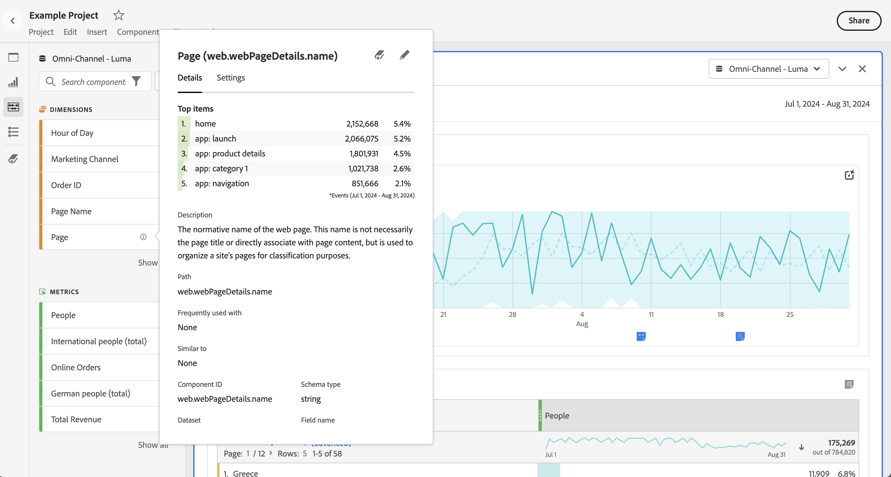

# Preview dimensions in Analysis Workspace

You can use the [component info](/help/components/use-components-in-workspace.md#component-info) for a component to show the top items for a dimension.

<!--
Now, by default, we show dynamic values instead of static ones, with the option to turn them into static values. Other things to note:

* As your data updates, the dynamic dimension columns will update to show the current 5/15 dimension items.
* A dynamic dimension column that is copied or moved will become static.
* When hovering a static dimension column you will see a lock icon, indicating that the dimension is static.

-->

## Show dimension items

When you select  for a dimension in the components panel, a list of its dimension items appears. The list of dimension items usually shows the top items for the last 30 days. When more items are available, outside of the selected date range for the panel, select the link to show more items. For example, **[!UICONTROL Show items from last month]**.

