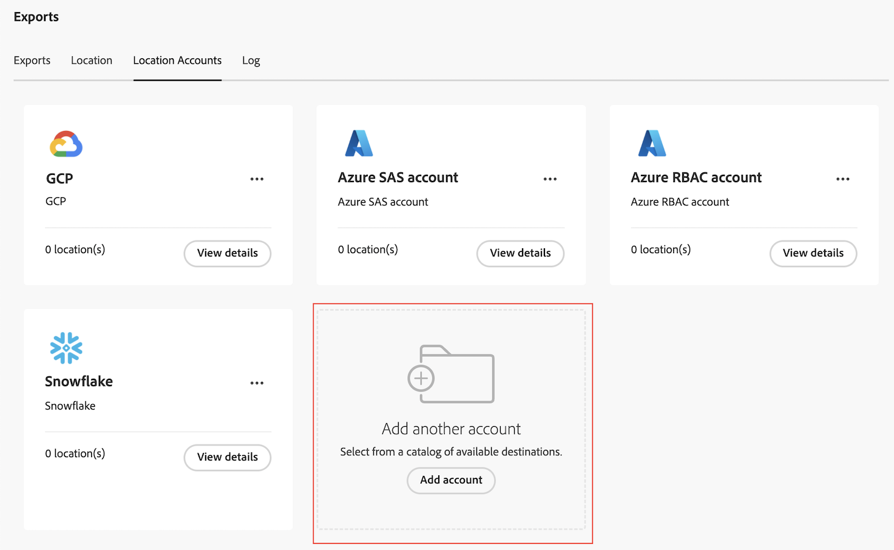

# Configure cloud export accounts

{{select-package}}

Before you can export Customer Journey Analytics data to a cloud destination as described in [Export Customer Journey Analytics data to the cloud](/help/analysis-workspace/export/export-cloud.md), you need to add and configure the location where you want the data to be sent. 

This process consists of adding and configuring the account (such as Amazon S3, Google Cloud Platform, and so forth) as described in this article, and then adding and configuring the location within that account (such as a folder within the account) as described in [Configure cloud export locations](/help/components/exports/cloud-export-locations.md).

You need to configure Customer Journey Analytics with the necessary information to access your cloud destination account.

To configure a cloud export account:

1. In Customer Journey Analytics, select [!UICONTROL **Components**] > [!UICONTROL **Exports**].
1. On the [!UICONTROL Exports] page, select the [!UICONTROL **Location accounts**] tab.
1. Select [!UICONTROL **Add account**]. 

   
   
   The Add account dialog displays.
1. Specify the following information:
   |Field | Function | 
   |---------|----------|
   | [!UICONTROL **Location account name**] | The name of the location account. This name appears when creating a location | 
   | [!UICONTROL **Location account description**] | Provide a short description of the account to help differentiate it from other accounts of the same account type. |
   | [!UICONTROL **Account type**] | Select the type of cloud account you are exporting to. Available account types are Amazon S3 Role ARN, Google Cloud Platform, Azure SAS, Azure RBAC, Snowflake, and Adobe Experience Platform. | 
1. In the [!UICONTROL **Account properties**] section, specify information specific to the account type that you selected.  

   For configuration instructions, expand the section below that corresponds to the [!UICONTROL **Account type**] that you selected. 

   +++Amazon S3 Role ARN

      Specify the following information to configure an Amazon S3 Role ARN account:

      |Field | Function | 
      |---------|----------|
      | [!UICONTROL **Role ARN**] | You must provide a Role ARN (Amazon Resource Name) that Adobe can use to gain access to the Amazon S3 account. To do this, you create an IAM permission policy for the source account, attach the policy to a user, and then create a role for the destination account. For specific information, see [this AWS documentation](https://aws.amazon.com/premiumsupport/knowledge-center/cross-account-access-iam/). | 
      | [!UICONTROL **User ARN**] | The User ARN (Amazon Resource Name) is provided by Adobe. You must attach this user to the policy you created. | 

      {style="table-layout:auto"}

   +++

   +++Google Cloud Platform

      Specify the following information to configure a Google Cloud Platform account:

      |Field | Function | 
      |---------|----------|
      | [!UICONTROL **Project ID**] | Your Google Cloud project ID. See the [Google Cloud documentation about getting a project ID](https://cloud.google.com/resource-manager/docs/creating-managing-projects#identifying_projects). |  

      {style="table-layout:auto"}
   
   +++

   +++Azure SAS

      Specify the following information to configure an Azure SAS account:

      |Field | Function | 
      |---------|----------|
      | [!UICONTROL **Application ID**] | Copy this ID from the Azure application that you created. In Microsoft Azure, this information is located on the **Overview** tab within your application. For more information, see the [Microsoft Azure documentation about how to register an application with the Microsoft identity platform](https://learn.microsoft.com/en-us/azure/active-directory/develop/quickstart-register-app). | 
      | [!UICONTROL **Tenant ID**] | Copy this ID from the Azure application that you created. In Microsoft Azure, this information is located on the **Overview** tab within your application. For more information, see the [Microsoft Azure documentation about how to register an application with the Microsoft identity platform](https://learn.microsoft.com/en-us/azure/active-directory/develop/quickstart-register-app). |
      | [!UICONTROL **Key vault URI**] | 
The path to the SAS token in Azure Key Vault.  To configure Azure SAS, you need to store an SAS token as a secret using Azure Key Vault. For information, see the [Microsoft Azure documentation about how to set and retrieve a secret from Azure Key Vault](https://learn.microsoft.com/en-us/azure/key-vault/secrets/quick-create-portal?source=recommendations).

After the key vault URI is created, add an access policy on the Key Vault in order to grant permission to the Azure application that you created. For information, see the [Microsoft Azure documentation about how to assign a Key Vault access policy](https://learn.microsoft.com/en-us/azure/key-vault/general/assign-access-policy?tabs=azure-portal).
 | 
      | [!UICONTROL **Key vault secret name**] | The secret name you created when adding the secret to Azure Key Vault. In Microsoft Azure, this information is located in the Key Vault you created, on the **Key Vault** settings pages. For information, see the [Microsoft Azure documentation about how to set and retrieve a secret from Azure Key Vault](https://learn.microsoft.com/en-us/azure/key-vault/secrets/quick-create-portal?source=recommendations). |
      | [!UICONTROL **Location Account Secret**] | Copy the secret from the Azure application that you created. In Microsoft Azure, this information is located on the **Certificates & secrets** tab within your application. For more information, see the [Microsoft Azure documentation about how to register an application with the Microsoft identity platform](https://learn.microsoft.com/en-us/azure/active-directory/develop/quickstart-register-app). |

      {style="table-layout:auto"}

   +++   

   +++Azure RBAC

      Specify the following information to configure an Azure RBAC account:

      |Field | Function | 
      |---------|----------|
      | [!UICONTROL **Application ID**] | Copy this ID from the Azure application that you created. In Microsoft Azure, this information is located on the **Overview** tab within your application. For more information, see the [Microsoft Azure documentation about how to register an application with the Microsoft identity platform](https://learn.microsoft.com/en-us/azure/active-directory/develop/quickstart-register-app). | 
      | [!UICONTROL **Tenant ID**] | Copy this ID from the Azure application that you created. In Microsoft Azure, this information is located on the **Overview** tab within your application. For more information, see the [Microsoft Azure documentation about how to register an application with the Microsoft identity platform](https://learn.microsoft.com/en-us/azure/active-directory/develop/quickstart-register-app). | 
      | [!UICONTROL **Location account secret**] | Copy the secret from the Azure application that you created. In Microsoft Azure, this information is located on the **Certificates & secrets** tab within your application. For more information, see the [Microsoft Azure documentation about how to register an application with the Microsoft identity platform](https://learn.microsoft.com/en-us/azure/active-directory/develop/quickstart-register-app). | 

      {style="table-layout:auto"}

   +++

   +++Snowflake

      Specify the following information to configure a Snowflake account:

      |Field | Function | 
      |---------|----------|
      | [!UICONTROL **Account identifier**] | <!--add info --> | 
      | [!UICONTROL **User name**] | <!--add info --> | 
      | [!UICONTROL **Role**] | |
      | [!UICONTROL **Location Account Secret**] | Copy the secret from the Snowflake application that you created. In Snowflake, this information is located in <!--add link to Snowflake docs -->. | 

   +++

   +++Adobe Experience Platform

      Specify the following information to configure an Adobe Experience Platform account:

      |Field | Function | 
      |---------|----------|
      | [!UICONTROL **Location Account Secret**] | Copy the secret from the Adobe Experience Platform application that you created. In Adobe Exprience Platform, this information is located in <!--add link to AEP docs -->. | 

   +++

1. Select [!UICONTROL **Save**].

1. Continue with [Configure cloud export locations](/help/components/exports/cloud-export-locations.md).

