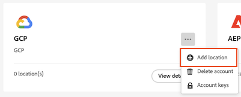

# Configure cloud export locations

Before you can export Customer Journey Analytics reports to a cloud destination as described in [Export Customer Journey Analytics reports to the cloud](/help/analysis-workspace/export/export-cloud.md), you need to add and configure the location where you want the data to be sent. 

This process consists of adding and configuring the account (such as Amazon S3, Google Cloud Platform, and so forth) as described in [Configure cloud export accounts](/help/components/exports/cloud-export-accounts.md), and then adding and configuring the location within that account (such as a folder within the account) as described in this article.

For information about how to manage existing locations, including viewing, editing, and deleting locations, see [Manage cloud export locations and accounts](/help/components/exports/manage-export-locations.md).

## Begin creating a cloud export location

1. You need to add an account before you can add a location. If you haven't already, add an account as described in [Configure cloud export accounts](/help/components/exports/cloud-export-accounts.md).

1. In Customer Journey Analytics, select [!UICONTROL **Components**] > [!UICONTROL **Exports**].

1. Select the [!UICONTROL **Locations**] tab, then select [!UICONTROL **Add location**]. 
   
   

   Or

   Select the [!UICONTROL **Location accounts**] tab, select the 3-dot icon on an existing account where you want to add a location, then select [!UICONTROL **Add location**].

   

   The Location dialog displays.

1. Specify the following information:
   |Field | Function | 
   |---------|----------|
   | [!UICONTROL **Name**] | The name of the location.  | 
   | [!UICONTROL **Description**] | Provide a short description of the account to help differentiate it from other accounts of the same account type. |
   | [!UICONTROL **Location account**] | Select the account where you want to create the location. For information about how to create an account, see [Configure cloud export accounts](/help/components/exports/cloud-export-accounts.md). | 

1. In the [!UICONTROL **Location properties**] section, specify information specific to the account type of your location account.  

   Continue with the section below that corresponds to the account type that you selected in the [!UICONTROL **Location account**] field.

### AEP Data Landing Zone

>[!IMPORTANT]
>
>When exporting Customer Journey Analytics reports to Adobe Experience Platform Data Landing Zone, make sure that you download the data within 7 days, then delete it from AEP Data Landing Zone. After 7 days, the data is automatically deleted from AEP Data Landing Zone.

1. [Begin creating a cloud export location](#begin-creating-a-cloud-export-location), as described above.

1. In the [!UICONTROL **Location properties**] section of the [!UICONTROL **Add location**] dialog box, specify the following information to configure an Adobe Experience Platform Data Landing Zone location:

   <!-- still need to update; can't create AEP account -->

   |Field | Function | 
   |---------|----------|
   | [!UICONTROL **IMS Org ID**] | The IMS Org ID is provided by Adobe. Click the Copy icon next to the [!UICONTROL **IMS Org ID**] field to copy the contents of the field, then use the ID in your Adobe Exprerience Platform account. | 
   | [!UICONTROL **Prefix**] | The folder within the container where you want to put the data. Specify a folder name, then add a slash after the name to create the folder. For example, `folder_name/` |

   {style="table-layout:auto"}

1. Select [!UICONTROL **Save**].

1. You can now export data from Analysis Workspace to the account and location that you configured. For information about how to export data to the cloud, see [Export project data to the cloud](/help/analysis-workspace/export/export-cloud.md).

### Amazon S3 Role ARN

1. [Begin creating a cloud export location](#begin-creating-a-cloud-export-location), as described above.

1. In the [!UICONTROL **Location properties**] section of the [!UICONTROL **Add location**] dialog box, specify the following information to configure an Amazon S3 Role ARN location:

    <!-- still need to update; can't create S3 role ARN account -->

   |Field | Function | 
   |---------|----------|
   | [!UICONTROL **Bucket**] | The bucket within your Amazon S3 account where you want Adobe Analytics data to be sent. Ensure that the User ARN that was provided by Adobe has access to upload files to this bucket. | 
   | [!UICONTROL **Prefix**] | The folder within the bucket where you want to put the data. Specify a folder name, then add a slash after the name to create the folder. For example, folder_name/ | 

   {style="table-layout:auto"}

1. Select [!UICONTROL **Save**].

1. You can now export data from Analysis Workspace to the account and location that you configured. For information about how to export data to the cloud, see [Export project data to the cloud](/help/analysis-workspace/export/export-cloud.md).

### Google Cloud Platform

1. [Begin creating a cloud export location](#begin-creating-a-cloud-export-location), as described above.

1. In the [!UICONTROL **Location properties**] section of the [!UICONTROL **Add location**] dialog box, specify the following information to configure a Google Cloud Platform location:

    <!-- still need to update; can't create GCP account -->

   |Field | Function | 
   |---------|----------|
   | [!UICONTROL **Bucket**] | The bucket within your GCP account where you want Customer Journey Analytics data to be sent. Ensure that you have granted permission to the Principal provided by Adobe to upload files to this bucket. (The Principal is provided when [configuring the Google Cloud Platform account](/help/components/exports/cloud-export-accounts.md).) For information about granting permissions, see [Add a principal to a bucket-level policy](https://cloud.google.com/storage/docs/access-control/using-iam-permissions#bucket-add) in the Google Cloud documentation.|  
   | [!UICONTROL **Prefix**] | The folder within the bucket where you want to put the data. Specify a folder name, then add a slash after the name to create the folder. For example, folder_name/ | 

   {style="table-layout:auto"}

1. Select [!UICONTROL **Save**].

1. You can now export data from Analysis Workspace to the account and location that you configured. For information about how to export data to the cloud, see [Export project data to the cloud](/help/analysis-workspace/export/export-cloud.md).

### Azure SAS

1. [Begin creating a cloud export location](#begin-creating-a-cloud-export-location), as described above.

1. In the [!UICONTROL **Location properties**] section of the [!UICONTROL **Add location**] dialog box, specify the following information to configure an Azure SAS location:

   |Field | Function | 
   |---------|----------|
   | [!UICONTROL **Container name**] | The container within the account you specified where you want Customer Journey Analytics data to be sent. | 
   | [!UICONTROL **Prefix**] | The folder within the container where you want to put the data. Specify a folder name, then add a slash after the name to create the folder. For example, `folder_name/` | 

   {style="table-layout:auto"}

1. Select [!UICONTROL **Save**].

1. You can now export data from Analysis Workspace to the account and location that you configured. For information about how to export data to the cloud, see [Export project data to the cloud](/help/analysis-workspace/export/export-cloud.md).

### Azure RBAC

1. [Begin creating a cloud export location](#begin-creating-a-cloud-export-location), as described above.

1. In the [!UICONTROL **Location properties**] section of the [!UICONTROL **Add location**] dialog box, specify the following information to configure an Azure RBAC location:

   |Field | Function | 
   |---------|----------|
   | [!UICONTROL **Container**] | The container within the account you specified where you want Adobe Analytics data to be sent. Ensure that you grant permissions to upload files to the Azure application that you created earlier. | 
   | [!UICONTROL **Prefix**] | The folder within the container where you want to put the data. Specify a folder name, then add a slash after the name to create the folder. For example, `folder_name/` |
   | [!UICONTROL **Account**] | The Azure storage account. | 

   {style="table-layout:auto"}

1. Select [!UICONTROL **Save**].

1. You can now export data from Analysis Workspace to the account and location that you configured. For information about how to export data to the cloud, see [Export project data to the cloud](/help/analysis-workspace/export/export-cloud.md).

### Snowflake

1. [Begin creating a cloud export location](#begin-creating-a-cloud-export-location), as described above.

1. In the [!UICONTROL **Location properties**] section of the [!UICONTROL **Add location**] dialog box, specify the following information to configure a Snowflake location:

   |Field | Function | 
   |---------|----------|
   | [!UICONTROL **DB**] | The specified database should be an existing database. The role you created needs to have privileges to access this database.
This is the database associated with the stage name.

You can grant this role privileges to the database in Snowflake using the following command: `GRANT USAGE ON DATABASE <your_database> TO ROLE <your_role>;`
 
For more information, see the [Database, Schema, and Share Commands page in the Snowflake documentation](https://docs.snowflake.com/en/sql-reference/commands-database).
 | 
   | [!UICONTROL **Schema**] | The specified schema should be an existing schema. The role you created needs to have privileges to access this schema.
This is the schema associated with the stage name.
You can grant the role that you created privileges to the schema in Snowflake using the following command: `GRANT USAGE ON SCHEMA <your_database>.<your_schema> TO ROLE <your_role>;`

For more information, see the [Database, Schema, and Share Commands page in the Snowflake documentation](https://docs.snowflake.com/en/sql-reference/commands-database).
 | 
   | [!UICONTROL **Stage name**] | The name of the internal stage where data files are stored in Snowflake.
Make sure that the role you specified on the account has Read and Write access to this stage name. (Because you are granting Read and Write access, we recommend using a stage that is used only by Adobe.)
You can grant Read and Write access to the stage name in Snowflake using the following command: `GRANT READ, WRITE ON STAGE <your_database>.<your_schema>.<your_stage_name> TO ROLE <your_role>;`
 
For information about granting privileges to a role, see [Grant privileges in the Snowflake documentation](https://docs.snowflake.com/en/sql-reference/sql/grant-privilege). 
For more information about the stage name, see the [Choosing an Internal Stage for Local Files page in the Snowflake documentation](https://docs.snowflake.com/en/user-guide/data-load-local-file-system-create-stage).
 | 
   | [!UICONTROL **Stage path**] | The path to the location where data files are stored in Snowflake. 
For more information, see the [Choosing an Internal Stage for Local Files page in the Snowflake documentation](https://docs.snowflake.com/en/user-guide/data-load-local-file-system-create-stage).
 | 

   {style="table-layout:auto"}

1. Select [!UICONTROL **Save**].

1. You can now export data from Analysis Workspace to the account and location that you configured. For information about how to export data to the cloud, see [Export project data to the cloud](/help/analysis-workspace/export/export-cloud.md).
