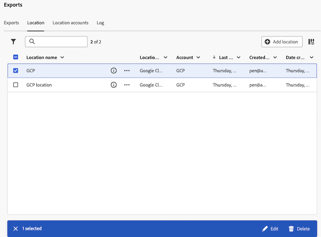

# Manage cloud export locations and accounts

You can view, edit, and delete cloud export locations.

For information about how to create a new location, see [Configure cloud export locations](/help/components/exports/cloud-export-locations.md).

## Filter and search locations

To find information you need, you can either filter the list of locations or search for a location.

### Filter the list of locations

1. In Customer Journey Analytics, select [!UICONTROL **Components**] > [!UICONTROL **Exports**].

1. Select the [!UICONTROL **Locations**] tab.

1. Select the **Filter** icon.

   <!-- add screenshot -->

   You can filter by the following criteria:

   |Filter | Description |
   |---------|----------|
   | [!UICONTROL **Location type**]<!--should this be changed to Account type?--> | The account type that the location is associated with. The following account types can be available: <ul><li>[!UICONTROL **AEP Data Landing Zone**]</li><li>[!UICONTROL **Amazon S3 Role ARN**]</li><li>[!UICONTROL **Azure SAS**]</li><li>[!UICONTROL **Azure RBAC**]</li><li>[!UICONTROL **Google Cloud Platform**]</li><li>[!UICONTROL **Snowflake**]</li></ul> | 
   | [!UICONTROL **Account**] | The name of account that the location is associated with. |
   | [!UICONTROL **Created by**] | The email address of the user who created the location. |

   {style="table-layout:auto"}

### Search for locations

1. In Customer Journey Analytics, select [!UICONTROL **Components**] > [!UICONTROL **Exports**].

1. Select the [!UICONTROL **Locations**] tab.

1. In the search field, begin typing any information associated with the location you're searching for. You can search for data from any column available in the table.

## Edit locations

1. In Customer Journey Analytics, select [!UICONTROL **Components**] > [!UICONTROL **Exports**].

1. Select the [!UICONTROL **Locations**] tab, then select the location you want to edit.

   

1. Select [!UICONTROL **Edit**].

1. Make any desired changes, then select [!UICONTROL **Save**].

## Delete locations

If you delete a location, any exports that use the location are also deleted. 

Prior to deleting a location, first check to see if it is being used by any exports by selecting the information icon next to the location name.

To delete a location:

1. In Customer Journey Analytics, select [!UICONTROL **Components**] > [!UICONTROL **Exports**].

1. Select the [!UICONTROL **Locations**] tab, then select one or more locations that you want to delete.

   

1. Select [!UICONTROL **Delete**], then select [!UICONTROL **Delete**] again on the confirmation dialog.

## Edit accounts

1. In Customer Journey Analytics, select [!UICONTROL **Components**] > [!UICONTROL **Exports**].

1. Select the [!UICONTROL **Location accounts**] tab.

   

1. Select [!UICONTROL **View details**] on the account that you want to edit.

1. Make any desired changes, then select [!UICONTROL **Save**].

## View account keys

After you create an account, you can view any associated account keys for that account. You might need to view this information if you didn't finish configuring the account with your cloud provider [when you originally configured the account](/help/components/exports/cloud-export-accounts.md). 

To view keys associated with an export account:

1. In Customer Journey Analytics, select [!UICONTROL **Components**] > [!UICONTROL **Exports**].

1. Select the [!UICONTROL **Location accounts**] tab.

   

1. Select the 3-dot icon on the account that you want to edit, then select [!UICONTROL **Account keys**]. 

## Delete accounts

1. In Customer Journey Analytics, select [!UICONTROL **Components**] > [!UICONTROL **Exports**].

1. Select the [!UICONTROL **Location accounts**] tab.

   

1. Select the 3-dot icon on the account that you want to edit, then select [!UICONTROL **Delete account**]. 

1. Select [!UICONTROL **Delete**] again on the confirmation dialog.
