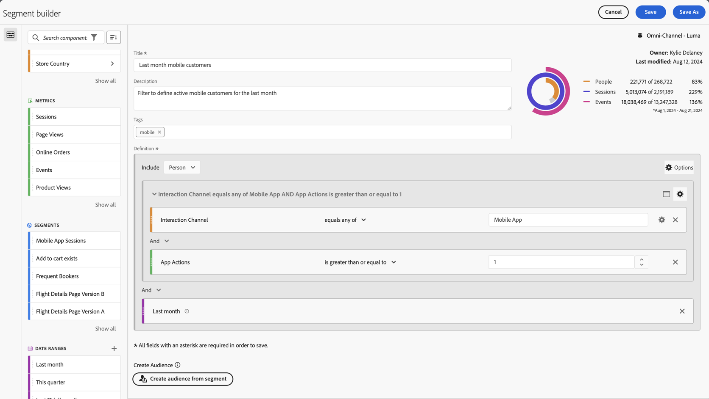
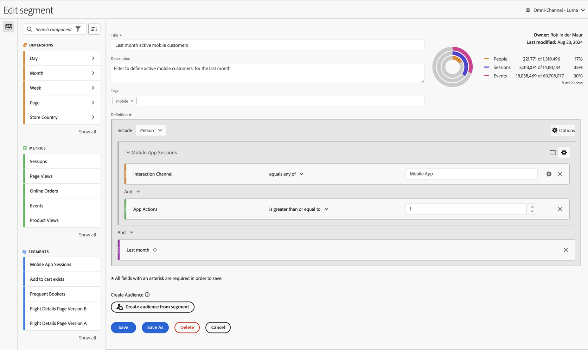
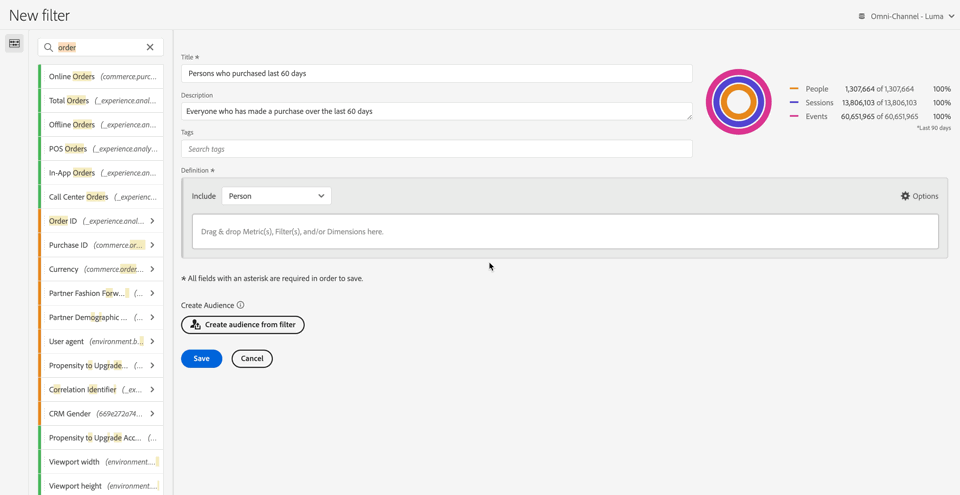

# Build filters {#build-filters}

<!-- markdownlint-disable MD034 -->

>[!CONTEXTUALHELP]
>id="components_filters_createaudience"
>title="Create Audience"
>abstract="Audiences can be created from a filter and shared with the Adobe Experience Platform for activation."

<!-- markdownlint-enable MD034 -->

<!-- markdownlint-disable MD034 -->

>[!CONTEXTUALHELP]
>id="components_filters_datapreview"
>title="Data preview"
>abstract="Compares the data of this filter with data of the data view. The preview percentage is based on the total number in the data view from the **last 90 days**.  If the preview is not loading, your connection could still be backfilling."

<!-- markdownlint-enable MD034 -->

The **[!UICONTROL Filter builder]** dialog is used to create new or edit existing filters. The dialog is titled **[!UICONTROL New filter]** or **[!UICONTROL Edit filter]** for filters that you create or manage from the [[!UICONTROL Filters] manager](/help/components/filters/manage-filters.md).

>[!BEGINTABS]

>[!TAB Filter builder] 

>[!TAB Create or Edit filter] 

>[!ENDTABS]

1. Specify the following details ( is required):

   | Element | Description |
   | --- | --- |
   | **[!UICONTROL Data view]** | You can select the data view for the filter.  The filter you define is available as a filter in the [Settings](/help/data-views/create-dataview.md#settings-filters) tab of a data view. | 
   | **[!UICONTROL Project-only filter]** | An info box to explain that the filter is only visible in the project where it is created and that the filter will not be added to your component list. Enable **[!UICONTROL Make this filter available to all your projects and add it to your component list]** to change that setting. This info box is only visible when you create a [quick filter](quick-filters.md) and turn the quick filter info a regular filter using **[!UICONTROL Open builder]** from the [!UICONTROL Quick filter] interface. |
   | **[!UICONTROL Title]**  | Name the filter, for example, `Last month mobile customers`. |
   | **[!UICONTROL Description]** | Provide a description for the filter, for example, `Filter to define the mobile customers for the last month`. |
   | **[!UICONTROL Tags]**| Organize the filter by creating or applying one or more tag. Start typing to find existing tags you can select. Or press **[!UICONTROL ENTER]** to add a new tag. Select  to remove a tag. |
   | **[!UICONTROL Definition]** | Define your filter using the [Definition builder](#definition-builder). |
   
   {style="table-layout:auto"}
   
1. To verify whether your filter definition is correct, use the constantly updated preview of the results of the filter at the top right.
1. To create an audience from the filter and share the audience with Experience Platform, select **[!UICONTROL Create audience from filter]**. See [Create and publish audiences](/help/components/audiences/publish.md) for more information.
1. Select:
   * **[!UICONTROL Save]** to save the filter.
   * **[!UICONTROL Save As]** to save a copy of the filter. 
   * **[!UICONTROL Delete]** to delete the filter.
   * **[!UICONTROL Cancel]** to cancel any changes you made to the filter or cancel the creation of a new filter.

## Definition builder

You use the Definition builder to construct your filter definition. In that construction, you use components, containers, operators and logic.

You can configure the type and scope of your definition: 

1. To specify the type of your definition, specify whether you want the build an include or exclude definition. Select  **[!UICONTROL Options]** and from the dropdown toggle **[!UICONTROL Include]** or **[!UICONTROL Exclude]**.
1. To specify the scope of your definition, select from the **[!UICONTROL Include]** or **[!UICONTROL Exclude]** dropdown whether you want the scope of the definition to be **[!UICONTROL Event]**, **[!UICONTROL Session]**, **[!UICONTROL Person]**, **[!UICONTROL Global Account]** [!BADGE B2B Edition]{type=Informative url=“<https://experienceleague.adobe.com/en/docs/analytics-platform/using/cja-overview/cja-b2b/cja-b2b-edition>" newtab=true tooltip="Customer Journey Analytics B2B Edition"}, **[!UICONTROL Account]** [!BADGE B2B Edition]{type=Informative url=“<https://experienceleague.adobe.com/en/docs/analytics-platform/using/cja-overview/cja-b2b/cja-b2b-edition>" newtab=true tooltip="Customer Journey Analytics B2B Edition"}, **[!UICONTROL Opportunity]** [!BADGE B2B Edition]{type=Informative url=“<https://experienceleague.adobe.com/en/docs/analytics-platform/using/cja-overview/cja-b2b/cja-b2b-edition>" newtab=true tooltip="Customer Journey Analytics B2B Edition"}, or  **[!UICONTROL Buying Group]** [!BADGE B2B Edition]{type=Informative url=“<https://experienceleague.adobe.com/en/docs/analytics-platform/using/cja-overview/cja-b2b/cja-b2b-edition>" newtab=true tooltip="Customer Journey Analytics B2B Edition"}

You can always change these settings later.

### Components

A vital part of the construction of your filter definition is using dimensions, metrics, existing filters and date ranges. All these components are available from the component panel in the Filter builder.

{width=100%}

To add a component:

1. Drag and drop a component from the components panel onto **[!UICONTROL Drag and drop Metric(s), Filter(s), and/or Dimensions here]**. You can use the  in the components bar to search for specific components.
1. Specify details for the component. For example, select a value from **[!UICONTROL Select value]**. Or enter a value. What and how you can specify one or more values depends on the component and the operator.
1. Optionally modify the default operator. For example, from **[!UICONTROL equals]** to **[!UICONTROL equals any of]**. See [Operators](operators.md) for a detailed overview of the available operators.

To edit a component:

* Select a new operator for the component from the operator dropdown menu.
* Select or specify a different value for the operator if appropriate. 
* If the component type is a dimension, you can define the attribution model. See [Attribution model](#attribution-models) for more information.

To delete a component:

* Select  in a component.

### Containers

You can group multiple components in one or more containers and define logic within and between containers. Containers allow you to build complex definitions for your filter.

{Width=100%}

* To add a container, select **[!UICONTROL Add container]** from  **[!UICONTROL Options]**.
* To add an existing component to the container, drag and drop the component into the container.
* To add another component to the container, drag and drop a component from the component panel into the container. Use the blue insertion line as a guide.
* To add another component outside of the container, drag and drop a component from the component panel outside of the container, but inside the main definition container. User the blue insertion line as a guide.
* To modify the logic between components in a container, between containers or between a container and a component, select the appropriate **[!UICONTROL And]**, **[!UICONTROL Or]**, **[!UICONTROL Then]**. When you select Then, you turn the filter into a sequential filter. See [Create sequential filter](seg-sequential-build.md) for more information.
* To switch the container level, select  **[!UICONTROL Global Account]** [!BADGE B2B Edition]{type=Informative url=“<https://experienceleague.adobe.com/en/docs/analytics-platform/using/cja-overview/cja-b2b/cja-b2b-edition>" newtab=true tooltip="Customer Journey Analytics B2B Edition"},  **[!UICONTROL Account]** [!BADGE B2B Edition]{type=Informative url=“<https://experienceleague.adobe.com/en/docs/analytics-platform/using/cja-overview/cja-b2b/cja-b2b-edition>" newtab=true tooltip="Customer Journey Analytics B2B Edition"},  **[!UICONTROL Opportunity]** [!BADGE B2B Edition]{type=Informative url=“<https://experienceleague.adobe.com/en/docs/analytics-platform/using/cja-overview/cja-b2b/cja-b2b-edition>" newtab=true tooltip="Customer Journey Analytics B2B Edition"},  **[!UICONTROL Buying Group]** [!BADGE B2B Edition]{type=Informative url=“<https://experienceleague.adobe.com/en/docs/analytics-platform/using/cja-overview/cja-b2b/cja-b2b-edition>" newtab=true tooltip="Customer Journey Analytics B2B Edition"},  **[!UICONTROL Event]**,  **[!UICONTROL Session]** or  **[!UICONTROL Person]**.

You can use  in a container for the following actions:

| Container action | Description |
|---|---|
| **[!UICONTROL Add container]** | Add a nested container to the container. |
| **[!UICONTROL Exclude]** | Exclude the result from the container in the filter definition. A thin red left bar identifies an exclude container.  |
| **[!UICONTROL Include]** | Include the result from the container in the filter definition. Include is the default. A thin gray left bar identifies an include container. |
| **[!UICONTROL Name container]** | Rename the container from its default description. Type a name in the text field. If you provide no input, the default description is used. |
| **[!UICONTROL Delete container]** | Delete the container from the definition. | 

## Date ranges

You can build filters that contain rolling date ranges. So, you are able to answer questions about ongoing campaigns or events. For example, you can build a filter that includes *everyone who has made an online purchase over the last 60 days*.

>[!BEGINSHADEBOX]

See  [Rolling date ranges in segments](https://video.tv.adobe.com/v/25403/?quality=12&learn=on){target="_blank"} for a demo video.

>[!ENDSHADEBOX]

## Stack filters {#stack}

You can build a filter using filters. When you use filters in a filter, you can optimize your filter and reduce the complexity.

Imagine you want to filter on the combination of device type (2) and US states (50). You could either build 100 filters, each for the unique combination of device type (mobile phone versus tablet) and US state. To get the Californian tablet users, you would use one of the 100 filters:

Or, you could define 52 filters: 50 filters for the US states, one for mobile phone and one for tablet. And then stack the filters to obtain the same results. To get the Californian tablet users, you would stack two filters:

## Attribution {#attribution}

<!-- markdownlint-disable MD034 -->

>[!CONTEXTUALHELP]
>id="components_filters_attribution_repeating"
>title="Repeating"
>abstract="Includes instances and persisted values for the dimension."

<!-- markdownlint-enable MD034 -->

<!-- markdownlint-disable MD034 -->

>[!CONTEXTUALHELP]
>id="components_filters_attribution_instance"
>title="Instance"
>abstract="Includes instances and persisted values for the dimension."

<!-- markdownlint-enable MD034 -->

<!-- markdownlint-disable MD034 -->

>[!CONTEXTUALHELP]
>id="components_filters_attribution_nonrepeatinginstance"
>title="Non-repeating instance"
>abstract="Includes unique (non-repeating) instances for the dimension."

<!-- markdownlint-enable MD034 -->

When you use a dimension in the Filter builder, you have the options to specify the attribution model for that dimension. The attribution model you select determines whether data qualifies for the condition you have specified for the dimension component.

Select  within the dimension component and select one of the Attribution models from the popup: 

| Models | Description |
|---|---|
| **[!UICONTROL Repeating model (default)]** | Include instance and persisted values for the dimension to determine qualification. |
| **[!UICONTROL Instance]** | Include only instance values for the dimension to determine qualification. |
|  **[!UICONTROL Non-repeating instance]** | Include unique instance (non-repeating) values for the dimension to determine qualification. |

### Example

As part of a filter definition you have specified the following condition: Page Name equals Women. Similar as to the example above. You repeat this filter definition using the two other attribution models. So you have three filters each with their own attribution model:

* Women Page - Attribution - Repeating (default)
* Women Page - Attribution - Instance
* Women Page - Attribution - Non-repeating instance

The table below explains, for each attribution model, which incoming events are qualified  for that condition.

|  Women Page - Attribution -  *attribution model*  | Event 1: Page Name equals Women  | Event 2: Page Name equals Men | Event 3: Page Name equals Women |  Event 4: Page Name equals Women (persisted) | Event 5: Page Name equals Checkout  |  Event 6: Page Name equals Women  | Event 7: Page Name equals Home  |
|---|:---:|:---:|:---:|:---:|:---:|:---:|:--:|
|  Repeating (default) |   |  |   |   |   |   |   |
|  Instance  |   |  |  |  |  |  |  |
|  Non-repeating instance  |  | |  |  |   |   |   |

An example report on events using the three filters looks like:

