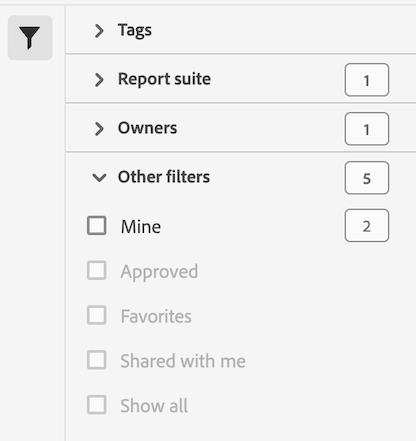

# Filter the list of filters

Filter the list of filters in the Filter Manager by tags, owners, and other filters (Show All, Mine, Shared with me, Favorites, and Approved.)

Filtering makes it easier to search for filters.

1. In the Filter manager, click the **[!UICONTROL Filters]** icon:  

   

2. The following filters are available:

   |  Filter Name  | Description  |
   |---|---|
   |  Tags  |Lets you filter the list of filters with specific [tags](/help/components/filters/filters-tag.md). The Tags column is shown by default.  |
   |  Owners  | Lets you filter the list of filters by owner.  |
   | Data view | Lets you filter by data view. |
   |  Other Filters > Show All  | **(Admin only)** Shows all filters, their owner, and the last date they were modified.  |
   |  Other Filters > Mine  | Shows all filters that you own.  |
   |  Other Filters > Shared with Me  |Shows all filters that others [shared](/help/components/filters/filters-share.md) with you.  |
   |  Other Filters > Favorites  |Shows all filters you marked as [Favorites](/help/components/filters/filters-favorite.md).  |
   |  Other Filters > Approved  |Shows all officially [approved](/help/components/filters/filters-approve.md) segments.  |
   |  Search Segments  | Lets you search for segments by name.  |