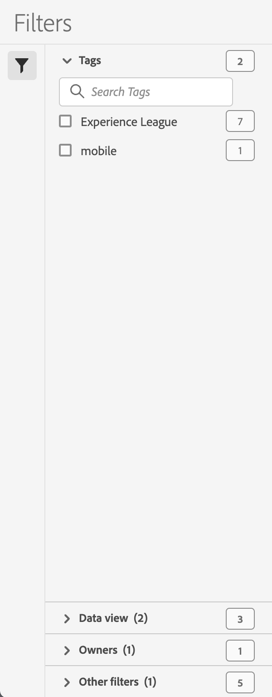
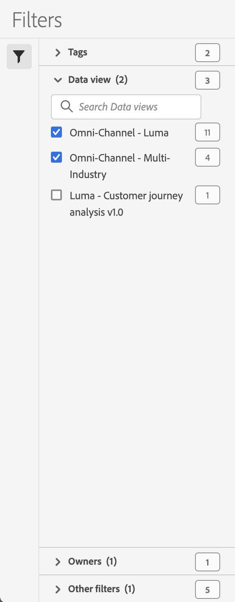
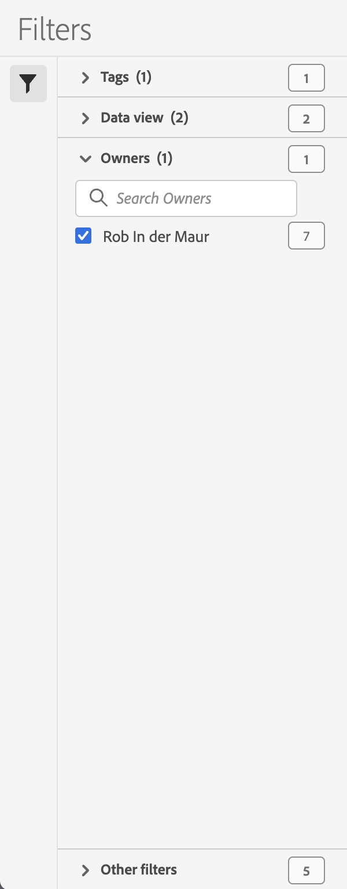
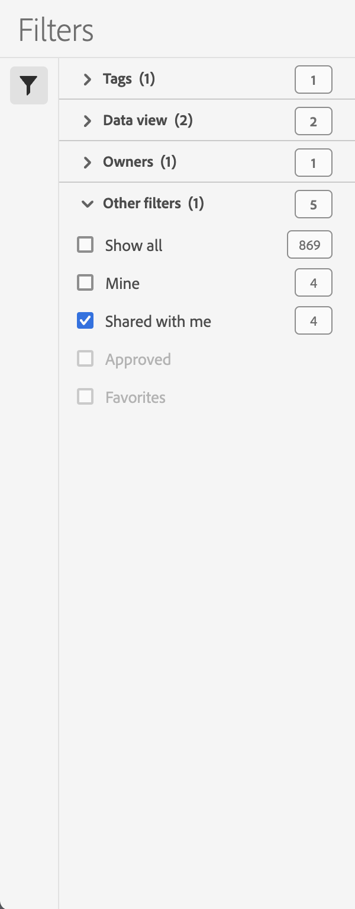

# Filter the list of filters

This article discusses how to filter the list of filters. Filter the list of filters makes it easier to find filters that are available to you and you might consider to use. 

To clarify, the list of filters does refer to the [filter list](manage-filters.md#filters-list) as part of the [Filter manager](manage-filters.md). You can filter that list using the  [Filter panel](manage-filters.md#filter-panel), part of that same [Filter manager](manage-filters.md).

To filter the list of filters:

1. Select  to open the Filters panel. You can select  once more to close the panel if you need more space for the Filters list.
1. Select filters from any of the available filter sections:

   | Tags | Data view | Owners | Other filters |
   |---|---|---|---|
   |  |  |  |  |
   | You can  *Search Tags* to limit the list of tags.   You can select more than one tag. The list of tags is automatically limited to show other possible remaining tags, based on the tags you selected.   **(1)**: If available, indicates the number of selected tags.  **[!UICONTROL 2︎⃣]**: The number of tags available for the current filter list. 7︎⃣: The number of filters associated with the tag. | You can  *Search Data views* to limit the list of data views.   You can select more than one data view to filter the filter list.   **(2)**: If available, indicates the number of selected data views.  **[!UICONTROL 3︎⃣]**: The number of data views available for the current filter list. 4︎⃣: The number of filters associated with the data view. | You can  *Search Owners* to limit the list of owners.   You can select more than one owner to filter the filter list.   **(1)**: If available, indicates the number of selected owners.  **[!UICONTROL 1︎⃣]**: The number of owners available for the current filter list. 7︎⃣: The number of filters associated with the owner. |  You can select one or more of the following options: **[!UICONTROL Show all]**, **[!UICONTROL Shared with me]**, **[!UICONTROL Mine]**, **[!UICONTROL Approved]**, and **[!UICONTROL Favorites]**. What you can select depends on your role and permissions.  **(1)**: If available, indicates the number of selected other filters.  **[!UICONTROL 5︎⃣]**: The number of other filter options available for the current filter list. 4︎⃣: The number of filters associated with the owner. |

   {style="table-layout:fixed"}

1. The [Filter list](manage-filters.md#filters-list) is automatically updated based on your filter configuration. You can see the configured filters in the [Active filter bar](manage-filters.md#active-filter-bar).
