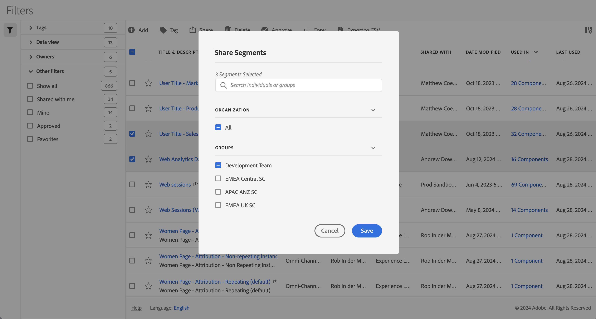

# Share filters

In the [Filter manager](manage-filters.md), you can share filters. Depending on your permissions, you can share filters with your whole organization, groups, or individual users: 

* **Administrators**: Administrators can share filters with the whole organization, with groups within an organization, and with individual users. See the [Admin Console documentation](https://helpx.adobe.com/enterprise/using/manage-products.html) for more information. 
* **Non-administrators**: Non-administrators can only share the filters they have created and only with individual users. |

To share one or more filters:

1. In the [Filter manager](manage-filters.md), select one or more of the filters you want to share.
1. From the action bar, select  **[!UICONTROL Share]**.
1. In the **[!UICONTROL Share Filters]** dialog:
   
   

   1. (optionally) use  to *Search individuals or groups* for and limit the list of groups or individuals you want to share the filter with.
   
   1. Select one or more options from the **[!UICONTROL Organization]** or **[!UICONTROL Groups]** section or search for and select one or more individuals. What options are available depends on your role.

   1. Select **[!UICONTROL Save]** to share the filters. Select **[!UICONTROL Cancel]** to cancel.

## Best practices

Below are some best practices when you should share filters and with whom you should share filters.

* As an administrator, only share a filter with All if you are convinced anyone in your organization is comfortable using the filters. You can also consider favoring these filters. See [Mark a filter as favorite](filters-favorite.md) for more information.

* As an administrator, share a filter with a specific gorpu if that filter provides business value for the users part of that group

* As an administrator or an individual user, share a filter with one or more individuals to validate a filter. If the filters do not prove to be useful, you can delete the filter.  
