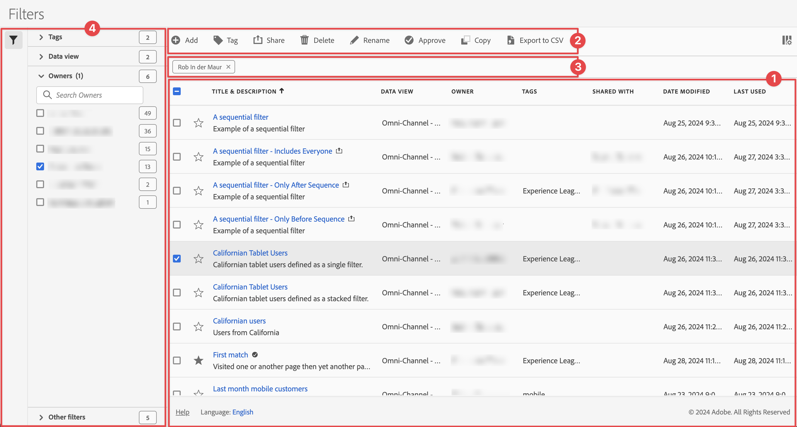

# Manage filters

You can share, filter, tag, approve, rename, copy, delete, export filters and mark filters as favorite from a central [!UICONTROL Filters] management interface. To manage filters:

* Select **[!UICONTROL Components]** in the main interface, then select **[!UICONTROL Filters]**.

>[!NOTE]
>
>The quick filters that you create within a specific Workspace project do not appear in the [!UICONTROL Filters] manager, unless you have made the filter available to all your projects. 
>

## Filters manager

The Filters manager has the following interface elements:

### Filters list

The filters list ➊ displays all the filters that you own, the filters that have been scoped to all your projects, and the filters that have been shared with you. The list has the following columns:

| Column | Description |
| --- | --- | 
|   | Select to favor  or un-favor  a filter. See [Mark filter as favorite](/help/components/filters/filters-favorite.md) |
| **[!UICONTROL Title and description]** | Provided in the [Filter builder](filter-builder.md). To edit the title and description, select the title link. This opens the [Filters builder](filter-builder.md). A shared filter is indicated with . |
| **[!UICONTROL Data view]** | The data views that this filter applies to.  | 
| **[!UICONTROL Owner]** | Indicates who owns the annotation. As a user, you only see the annotations that you own or the annotations that are shared with you. |
| **[!UICONTROL Tags]** | Lists the tags for this annotation. |
| **[!UICONTROL Shared with]** | Lists how many individuals or groups that you shared the annotation with. Select to open the **[!UICONTROL Share Component]** dialog and modify the tags for the annotation. |
| **[!UICONTROL Date modified]** | Displays the date and time that the annotation was last modified. |
| **[!UICONTROL Used in]** | Displays the components the filter is used in. When you select **[!UICONTROL x Components]**, a new browser tab opens that shows the [Project manager](/help/analysis-workspace/build-workspace-project/freeform-overview.md) filtered to only show projects for the components used.  |
| **[!UICONTROL Last Used]** | Displays when the filter was last used. |

{style="table-layout:auto"}

Use  to specify which columns you want to display.

### Action bar

You can action on filters using the action bar ➋. The action bar contains the following actions:

| Action | Description |
|---|---|
|  **[!UICONTROL Add]** | Add another filters, using the [Filter builder](filter-builder.md). |
|  [!UICONTROL *Search by title*] | When no filter is selected in the list, search for filters using this search field. |
|  **[!UICONTROL Tag]** | Tag the selected filters. In the **[!UICONTROL Tag Filter]** dialog, select or de-select the tags for the selected filters. Select **[!UICONTROL Save]** to save the tags for the selected filters. See [Tag filters](/help/components/filters/filters-tag.md) for more information.|
|  **[!UICONTROL Share]** | Share the selected filters. In the **[!UICONTROL Share Filter]** dialog, you can  *Search individuals or groups* or you can select **[!UICONTROL Organization]** or **[!UICONTROL Groups]**. Select **[!UICONTROL Save]** to save share details for the selected filters. See [Share filters](filters-share.md) for more details. |
|  **[!UICONTROL Delete]** | Delete the selected filters. You are prompted for a confirmation. |
|  **[!UICONTROL Rename]** | Rename a single selected filter. When selected, you can rename the filter inline. |
|  **[!UICONTROL Approve]** | Approve the selected filters. | 
|   **[!UICONTROL Copy]** | Copy the selected filter. New filters are created with the same name and suffix (Copy) | 
|  **[!UICONTROL Export to CSV]** | Export the filters to an `Filters List.csv` file. |

### Active filter bar

The filter bar ➌ shows the active filters applied from the filter panel to the list of filters (if any). You can quickly remove a filter using . If more than one filter is specified, you can remove all filters using **[!UICONTROL Remove all]**.

### Filter panel

You can filter the list of filters using the  **[!UICONTROL Filter]** left panel ➍. The filter panel displays the type of filter and the number of filters that honor the specific filter. Select  to toggle the display of the filter panel. 

See [Filter the list of filters](filters-filter.md) for more information.
