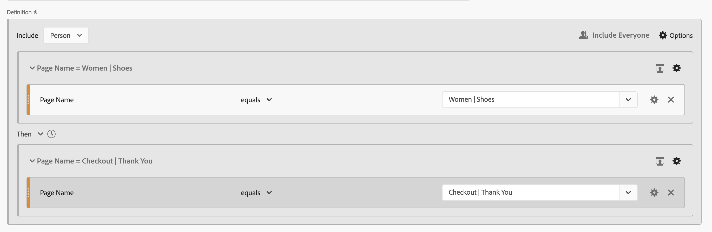
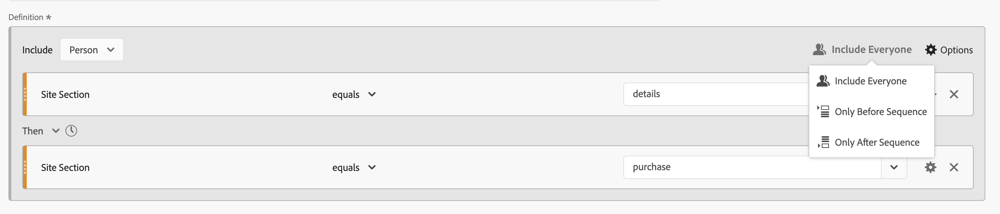
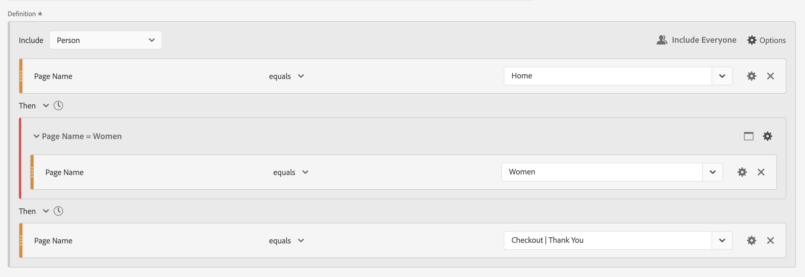
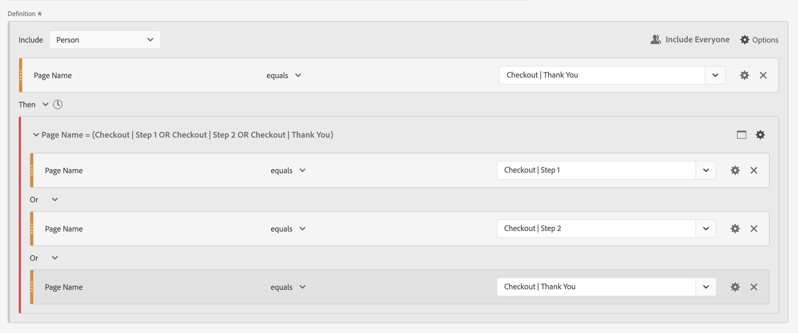

# Sequential filters

You create sequential filters using the Then logical operator, instead of And or Or logical operator between component, containers and components, or containers. The Then logical operator implies that one filter condition occurs, followed by another. 

+++ Here is a video demonstrating sequential segmentation.

>[!VIDEO](https://video.tv.adobe.com/v/25405/?quality=12)

{{videoaa}}

+++

A sequential filter has some [basic functionality](#basics) and additional options you can configure to add more complexity to the sequential filter:

* [After and within](#after-and-within) constraints for the Then logic in the sequence filter definition:

* What data to [include](#include) as part of the overall sequence for the filter definition. Or for a sequence defined as part of a container. By default all matching data is considered, identified by  [!UICONTROL Include Everyone]. 
  
  * Select  **[!UICONTROL Only Before Sequence]** to only consider data before the sequence.
  * Select  **[!UICONTROL Only After Sequence]** to only consider data after the sequence.

* What data to [exclude](#exclude) as part of the sequential filter definition.

* How to [logically group](#logic-group) conditions in your sequential filter definition.

## Basics

The basics of building a sequential filter are no different than building a regular filter using the [Filter builder](filter-builder.md). You use the [Definition builder](filter-builder.md#definition-builder) to construct your filter definition. In that construction, you use components, containers, operators and logic. A regular filter becomes a sequential filter automatically as soon as you select the **[!UICONTROL Then]** operator in the main definition or in any of the containers you use within the [Definition builder](filter-builder.md#definition-builder).

### Examples

The examples below illustrate how you use sequential filters in various use cases.

#### Simple sequence

Identify persons who viewed a page and then viewed another page. The event-level data will filter this sequence irrespective of previous, past, or interim person sessions or the time or number of page views occurring between the sessions.

buu#### Sequence across sessions

Identify persons who viewed a page in one session, then viewed another page in another session. To differentiate between sessions, use containers to build the sequence and define  **[!UICONTROL Session]** level for each container.

#### Mixed-level sequence

Identify persons who view two pages across an undetermined number of sessions, and then view a third page in a separate session. Again, use containers to build the sequence and define  **[!UICONTROL Session]** level on the container that defines the separate session.

#### Aggregate sequence

Identify persons who at their first session visited a specific page and then later visited some other pages. To differentiate between the sequence of events, use containers to separate the logic on a  **[!UICONTROL Session]** container level.

#### Nest a sequence

Identify all sessions where a person visits one page before another page and then have follow up sessions that involves two other pages. For example, identify all sessions where a person first visits the home page then category 1 page and then has other sessions where in each session the category 2 and category 3 page are visited.

## After and within

You can use  **[!UICONTROL After]** and  **[!UICONTROL Within]** the **[!UICONTROL Then]** operator to define additional [time constraints](#time-constraints) or [constraints for Events, Sessions or Dimensions](#event-session-and-dimension-constraints).

### Time constraints

To apply time constraints to the **[!UICONTROL Then]** operator:

  1. Select .
  1. Select **[!UICONTROL Within]** or **[!UICONTROL After]** from the context menu.
  1. Specify a time period (**[!UICONTROL Minute]**, **[!UICONTROL Hour]**, up until **[!UICONTROL Years]**). 
  1. Select the  **[!UICONTROL *number*]** to open a popup that allows you to type in or specify a number using **[!UICONTROL -]** or **[!UICONTROL +]**.

To remove a time constaint, use .

The table below explains in more detail the time constraint operators.

|  Operators | Description |
|--- |--- |
| **[!UICONTROL After]** |The [!UICONTROL After] operator is used to specify a minimum limit on the amount of time between two checkpoints. When setting the After values, the time limit will begin when the filter is applied. For example, if the  After operator is set on a container to identify persons who visit page A but don't return to visit page B until after one day, then that day will start when the visitor leaves page A.  For the visitor to be included in the filter, a minimum of 1440 minutes (one day) must transpire after leaving page A to view page B. |
| **[!UICONTROL Within]** | The  [!UICONTROL Within] operator is used to specify a maximum limit on the amount of time between two checkpoints. For example, if the [!UICONTROL Within] operator is set on a container to identify persons who visit page A and then return to visit page B within one day, then that day will begin when the person leaves page A. To be included in the filter, the person will have a maximum time of one day before opening page B. For the person to be included in the filter, opening page B must occur within a maximum of 1440 minutes (one day) after leaving page A to view page B.|
| **[!UICONTROL After but Within]** | When using both the [!UICONTROL After] and [!UICONTROL Within] operators, both operators start and end in parallel, not sequentially.  For example, you build a filter with the container set to: `After = 1 Week(s) and Within = 2 Week(s)`. The conditions to identify visitors in this filter are met only between one and two weeks. Both conditions are enforced from the time of the first page view. |

#### Examples

Some examples of using the time constraints.

##### After operator 

Identify persons that visited one page and then another page only after two weeks. For example, persons that visited the Home page, but the Women | Shoes page only after two weeks.

If a page view for the Home happens on June 1 2024, at 00:01, then a page view to page Women | Shoes will match as long as that page view occurs after June 15 2024 00:01.

##### Within operator

Identify persons that visited one page and then another page within five minutes. For example, persons that visited the Home page and then the Women | Shoes page within 5 minutes.

If a page view for the Home happens on June 1 2024, at 12:01, then a page view to page Women | Shoes will match as long as that page view occurs before June 15 2024 12:16.

##### After but Within operator

Identify persons that visited one page then visited another page after two weeks but within one month. For example, persons that visited the Home page and then after two weeks and within one month the Women | Shoes page.

Any persons hitting the Home page on June 1, 2024 and who are returning to visit the Women | Shoes page after June 15, 2019 00:01, but before July 1, 2019 qualify for the segment.

### Event, Session and Dimension constraints

The  **[!UICONTROL After]** and  **[!UICONTROL Within]** constraints allow you not only to specify a time constraint but also an event, session or dimension constraint. Select **[!UICONTROL Event(s)]**, **[!UICONTROL Session(s)]** or **[!UICONTROL Other dimensions]**  **[!UICONTROL *Dimension name*]**. You can use the [!UICONTROL *Search*] field to search for a dimension.

#### Example

Below is an example of a sequential filter looking for persons that visited one product category page (Woman | Shoes), followed by a checkout page (Checkout | Thank You) within one page.

The following example sequences match or do not match:

| Sequence |  |
|--- | :---: |
| Page `Women \| Shoes` followed by page `Checkout \| Thank You` |  |
| Page `Women \| Shoes` followed by page `Women \| Tops` followed by page `Checkout \| Thank You` |  |

## Include

You can specify what data to include in your sequential filter or in a sequential container that is part of your sequential filter. 

### Everyone {#include_everyone}

To create a sequential filter that includes everyone, select the option  **[!UICONTROL Include Everyone]**.

The sequential filter identifies data that match the given pattern as a whole.  Below is an example of a basic sequence filter looking for persons that visited one product category page (Woman | Shoes), followed by a checkout page (Checkout | Thank You). The filter is set to  **[!UICONTROL Include Everyone]**.

The following example sequences match or do not match:

| Sequence |  |
|--- | --- |
| A then B in the same session |  |
| A then C then D then B (across different sessions) |   |
| B then A |  |

### Only Before Sequence and Only After Sequence

The options  **[!UICONTROL Only Before Sequence]** and  **[!UICONTROL Only After Sequence]** filter the data to a subset before or after the specified sequence.

*  **Only Before Sequence**: Includes all data before a sequence and the first data of the sequence itself (see example 1, 3). If a sequence appears multiple times as part of the data, [!UICONTROL Only Before Sequence] includes the first hit of the last occurrence of the sequence and all prior hits (see example 2).
*  **Only After Sequence**: Includes all hits after a sequence and the last data of the sequence itself (see example 1, 3). If a sequence appears multiple times as part of the data, Only After includes last hit of the first occurrence of the sequence and all subsequent hits (see example 2).

Consider a definition specifying a sequence of a component with criteria identified by B, followed (Then) by a component with criteria identified by D. The three options would identify data as follows:

|  B Then D | A  | B  | C  | D  | E  | F  |
|---|:---:|:---:|:---:|:---:|:---:|:---:|
|  Include Everyone  |   |   |   |   |   |   |
|  Only Before Sequence  |   |   |  |  |  |  |
|  Only After Sequence  |  |  |  |   |   |   |

|  B Then D (occurs multiple times)  | A  | B  | C  | D  | B  | C  | D  | E  |
|---|:---:|:---:|:---:|:---:|:---:|:---:|:---:|:---:|
|  Include Everyone  |   |   |   |   |   |   |   |   |
|  Only Before Sequence  |   |   |   |   |   |  |  |  |
|  Only After Sequence  |  |  |  |   |   |   |   |   |

#### Example

You have defined three version of a sequential filter for site sections. One with the option  **[!UICONTROL Include Everyone]**, one with the option  **[!UICONTROL Only Before Sequence]**, and one with the option  **[!UICONTROL Only After Sequence]**. You named the three filters accordingly.

When reporting on site sections using these three filters, this will be the example output in a freeform table.

## Exclude

Filter definitions include all data unless you specifically exclude  [!UICONTROL Person],  [!UICONTROL Session], or  [!UICONTROL Event] data using **[!UICONTROL Exclude]**. 

[!UICONTROL Exclude] allows you to dismiss common data and create filters with more focus. Exclude also allows you to  create filters excluding specific groups of persons. For example, to define a filter that specifies persons that placed orders and then excluding that group of persons to identify *non-purchasers*. A best practice is to create rules that use a broad definition rather than trying to use [!UICONTROL Exclude] to target specific persona that match specific include values.

Example of exclude definitions are:

* **Exclude pages**. Use a filter definition to strip out a specific page (such as *Home Page) from a report, create an Event rule where the page equals "Home Page," and then exclude it. This definition automatically includes all pages except the Home Page.
* **Exclude referring domains**. Use a definition that includes only referring domains from Google.com and excludes all others.
* **Identify non-purchasers**. Identify when orders are greater than zero and then exclude the [!UICONTROL Visitor].

[!UICONTROL Exclude] can be used to identify a sequence where specific sessions or events are not performed by the person. [!UICONTROL Exclude] can also be included within a Logic group (see below).

You can exclude containers, not components. 

### Examples

See below for examples of using [!UICONTROL Exclude].

#### Exclude within

Identify persons who visited one page, did not visited another page, then visited yet another page. You exclude the container using  Exclude. An excluded container is identified by a red thin bar on the left.

#### Exclude at start

Identify persons who visited one page without ever going to another page. For example, people that checked out a purchase without ever visited the home page.

#### Exclude at end

Identify persons who visited one page but never visited other pages. For example, persons that visited your home page but never any of your check out pages.

## Logic Group

>[!NOTE]
>
>A [!UICONTROL Logic Group] can only be defined in a sequential filter, meaning that the [!UICONTROL Then] operator is used within the container.

Logic Group enables you to group conditions into a single sequential filter checkpoint. As part of the sequence, the logic defined in the container identified as Logic Group is evaluated after any prior sequential checkpoint and before any following sequential checkpoint. 

The conditions within the Logic Group itself may be met in any order. By contrast, non-sequential containers (event, session, person) do not require their conditions to be met within the overall sequence, producing possibile unintuitive results if used with a Then operator.

[!UICONTROL Logic Group] was designed to treat *several conditions as a group, without any ordering* among the grouped conditions. Otherwise stated, the order of the conditions within a Logic Group is irrelevant. 

Some best practices to use Logic Group are:

* To group sequential checkpoints. 
* To simplify the construction of sequential filters.

### Examples

Here are examples on how to use the Logic Group container.

#### Any order

Idenfify persons that vistied one page, then viewed each page out of another set of pages in any order. For example, persons that visited the Home page, then visited each of the Men page, the Women page, and Kids, irrespective of the order.

You can build this filter without a [!UICONTROL Logic Group], but the construction is going to be complex and laborious. You must specify every sequence of pages that the visitor could view. For clarity, only the first container is opened  and the other containers are closed  . You can derive the contents of the other containers by the titles.

You use [!UICONTROL Logic Group] to simplify building this filter, as shown below. Ensure you select  **[!UICONTROL Logic Group]** for the container.

#### First match

Identify persons that visisted one page or another page, then visited yet another page. For example, persons that visited the Women page or the Men page, then visited the Checkout | Thank You page.

#### Exclude And

Identify persons that visited one page then explicity did not visit a set of other pages, but did visit yet another page. For example, persons that visited the Home Page, did not visit the Men or the Women page, but did visit the Kids page.

#### Exclude Or

Identify persons that visited one page then explicity did not visit any page of a set of pages, but did visit yet another page. For example, persons that visited the Home Page, did not visit the Men and the Women page, but did visit the Kids page.

<!--
An example of a complex sequential filter if you want to find the persons that 

| Session One | Session Two | Session Three |
| --- | --- | --- |
| The person went to the main landing page A, excluded the campaign page B, and then viewed the Product page C.| The person again went to the main landing page A, excluded the campaign page B, and went again to the Product page C, and then to a new page D. | The person entered and followed that same path as in the first and second visits, then excluded page F to go directly to a targeted product on page G. |
-->

## A final example

As a final example, you want to identify persons that learned about a specific product page without  that are never touched by your Empower Your Move campaign and in their first visit to your online store viewed the Home page but did not look further at any fitness (gear) products from the Men category. Howver in ther next session directly went to a product page and placed an online order without going through the Home page first.

