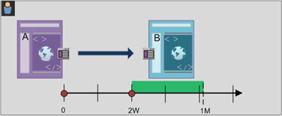
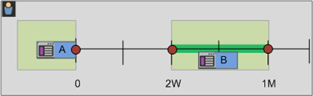

# Create sequential filters

You create sequential filters using the Then logical operator, instead of And or Or logical operator between component, containers and components, or containers. The Then logical operator implies that one filter condition occurs, followed by another. 

+++ Here is a video demonstrating sequential segmentation.

>[!VIDEO](https://video.tv.adobe.com/v/25405/?quality=12)

{{videoaa}}

+++


A sequential filter has some [basic functionality](#basics) and additional options you can configure to add more complexity to the sequential filter:


* [After and within](#after-and-within) constraints for the Then logic in the sequence filter definition:

  1. Select .
  1. Select **[!UICONTROL Within]** or **[!UICONTROL After]** from the context menu.
  1. Specify a time period (Minute, Hour, up until Years), Event, Session, or Other dimension. When you select Other dimension you can specify a dimension from the submenu.
  1. Select the number to open a popup that allows you to type in or specify the number using - or +.

  You can specify only **[!UICONTROL Within]** or **[!UICONTROL After]**, or specify both.
  You can remove a time constaint using .

* What data to [include](#include) as part of the overall sequence for the filter definition. Or for a sequence defined as part of a container. By default all matching data is considered, identified by  [!UICONTROL Include Everyone]. 
  
  * Select  **[!UICONTROL Only Before Sequence]** to only consider data before the sequence.
  * Select  **[!UICONTROL Only After Sequence]** to only consider data after the sequence.

* What data to [exclude](#exclude) as part of the sequential filter definition.

* How to [logically group](#logic-group) conditions in your sequential filter definition.

## Basics


The basics of building a sequential filter are no different than building a regular filter using the [Filter builder](filter-builder.md). You use the [Definition builder](filter-builder.md#definition-builder) to construct your filter definition. In that construction, you use components, containers, operators and logic. A regular filter becomes a sequential filter automatically as soon as you select the [!UICONTROL Then] operator in the main definition or in any of the containers you use within the filter definition.

### Examples

The examples below illustrate how you use sequential filters in various use cases.

#### Simple sequence

Identify persons who viewed a page and then viewed another page. The event-level data will filter this sequence irrespective of previous, past, or interim person sessions or the time or number of page views occurring between the sessions.


#### Sequence across sessions

Identify persons who viewed a page in one session, then viewed another page in another session. To differentiate between sessions, use containers to build the sequence and define  **[!UICONTROL Session]** level for each container.


#### Mixed-level sequence

Identify persons who view two pages across an undetermined number of sessions, and then view a third page in a separate session. Again, use containers to build the sequence and define  **[!UICONTROL Session]** level on the container that defines the separate session.


#### Aggregate sequence

Identify persons who at their first session visited a specific page and then later visited some other pages. To differentiate between the sequence of events, use containers to separate the logic on a  **[!UICONTROL Session]** container level.


#### Nest a sequence

Identify all sessions where a person visits one page before another page and then have follow up sessions that involves two other pages. For example, identify all sessions where a person first visits the home page then category 1 page and then has other sessions where in each session the category 2 and category 3 page are visited.


## After and within

### Time constraints


### Event, Session and Dimension constraints {#constraints}

The  **[!UICONTROL After]** and  **[!UICONTROL Within]** constraints allow you not only to specify a time constraint but also an event, session or dimension constraint. Select **[!UICONTROL Event(s)]**, **[!UICONTROL Session(s)]** or **[!UICONTROL Other dimensions]**  **[!UICONTROL *Dimension name*]**. You can use the [!UICONTROL *Search*] field to search for a dimension.

Below is an example of a sequential filter looking for persons that visited one product category page (Woman | Shoes), followed by a checkout page (Checkout | Thank You) within one page.


The following example sequences match or do not match:

| Sequence |  |
|--- | --- |
| Page `Women \| Shoes` followed by page `Checkout \| Thank You` |  |
| Page `Women \| Shoes` followed by page `Women \| Tops` followed by page `Checkout \| Thank You` |  |

## Include

You can specify what data to include in your sequential filter or in a sequential container that is part of your sequential filter. 

### Everyone {#include_everyone}

To create a sequential filter that includes everyone, select the option  **[!UICONTROL Include Everyone]**.

The sequential filter identifies data that match the given pattern as a whole.  Below is an example of a basic sequence filter looking for persons that visited one product category page (Woman | Shoes), followed by a checkout page (Checkout | Thank You). The filter is set to  **[!UICONTROL Include Everyone]**.


The following example sequences match or do not match:

| Sequence |  |
|--- | --- |
| A then B in the same session |  |
| A then C then D then B (across different sessions) |   |
| B then A |  |

### Only Before Sequence and Only After Sequence

The options  **[!UICONTROL Only Before Sequence]** and  **[!UICONTROL Only After Sequence]** filter the data to a subset before or after the specified sequence.

*  **Only Before Sequence**: Includes all data before a sequence and the first data of the sequence itself (see example 1, 3). If a sequence appears multiple times as part of the data, [!UICONTROL Only Before Sequence] includes the first hit of the last occurrence of the sequence and all prior hits (see example 2).
*  **Only After Sequence**: Includes all hits after a sequence and the last data of the sequence itself (see example 1, 3). If a sequence appears multiple times as part of the data, Only After includes last hit of the first occurrence of the sequence and all subsequent hits (see example 2).

Consider a definition specifying a sequence of a component with criteria identified by B, followed (Then) by a component with criteria identified by D. The three options would identify data as follows:


|  B Then D | A  | B  | C  | D  | E  | F  |
|---|---|---|---|---|---|---|
|  Include Everyone  | A  | B  | C  | D  | E  | F  |
|  Only Before Sequence  | A  | B  |  |  |  |  |
|  Only After Sequence  |  |  |  | D  | E  | F  |


|  B Then D (occurs multiple times)  | A  | B  | C  | D  | B  | C  | D  | E  |
|---|---|---|---|---|---|---|---|---|
|  Include Everyone  | A  | B  | C  | D  | B  | C  | D  | E  |
|  Only Before Sequence  | A  | B  | C  | D  | B  |  |  |  |
|  Only After Sequence  |  |  |  | D  | B  | C  | D  | E  |

#### Example

You have defined three version of a sequential filter for site sections. One with the option  **[!UICONTROL Include Everyone]**, one with the option  **[!UICONTROL Only Before Sequence]**, and one with the option  **[!UICONTROL Only After Sequence]**. You named the three filters accordingly.


When reporting on site sections using these three filters, this will be the example output in a freeform table.


## Exclude

Filter definitions include all data unless you specifically exclude  [!UICONTROL Person],  [!UICONTROL Session], or  [!UICONTROL Event] data using [!UICONTROL Exclude]. 

[!UICONTROL Exclude] allows you to dismiss common data and create filters with more focus. Exclude also allows you to  create filters excluding specific groups of persons. For example, to define a filter that specifies persons that placed orders and then excluding that group of persons to identify *non-purchasers*. A best practice is to create rules that use a broad definition rather than trying to use [!UICONTROL Exclude] to target specific persona that match specific include values.

Example of exclude definitions are:

* **Exclude pages**. Use a filter definition to strip out a specific page (such as *Home Page) from a report, create an Event rule where the page equals "Home Page," and then exclude it. This definition automatically includes all pages except the Home Page.
* **Exclude referring domains**. Use a definition that includes only referring domains from Google.com and excludes all others.
* **Identify non-purchasers**. Identify when orders are greater than zero and then exclude the [!UICONTROL Visitor].

[!UICONTROL Exclude] can be used to identify a sequence where specific sessions or events are not performed by the person. [!UICONTROL Exclude] can also be included within a Logic group (see below).

You can exclude containers, not components. 

### Examples

See below for examples of using [!UICONTROL Exclude].

#### Exclude within

Identify persons who visited one page, did not visited another page, then visited yet another page. You exclude the container using  Exclude. An excluded container is identified by a red thin bar on the left.


#### Exclude at start

Identify persons who visited one page without ever going to another page. For example, people that checked out a purchase without ever visited the home page.


#### Exclude at end

Identify persons who visited one page but never visited other pages. For example, persons that visited your home page but never any of your check out pages.


## Logic Group

>[!NOTE]
>
>A [!UICONTROL Logic Group] can only be defined in a sequential filter, meaning that the [!UICONTROL Then] operator is used within the container.

Logic Group enables you to group conditions into a single sequential filter checkpoint. As part of the sequence, the logic defined in the container identified as Logic Group is evaluated after any prior sequential checkpoint and before any following sequential checkpoint. 

The conditions within the Logic Group itself may be met in any order. By contrast, non-sequential containers (event, session, person) do not require their conditions to be met within the overall sequence, producing possibile unintuitive results if used with a THEN operator.

[!UICONTROL Logic Group] was designed to treat *several conditions as a group*, *without any ordering* among the grouped conditions. Otherwise stated, the order of the conditions within a Logic Group are irrelevant. 

For example, you can't nest a [!UICONTROL Person] container within a [!UICONTROL Person] sequential container. But instead, you can nest a [!UICONTROL Logic Group] container within a [!UICONTROL Person] container that contains specific [!UICONTROL Session]-level and [!UICONTROL Event]-level conditions.

See 
|Container Hierarchy|Illustration|Definition|
|---|---|---|
|  Standard Container Hierarchy|  |Within the [!UICONTROL Visitor] container, the [!UICONTROL Visit] and [!UICONTROL Hit] containers are nested in sequence to extract filters based on hits, the number of visits, and the visitor.  |
|  Logic Container Hierarchy  |  |The standard container hierarchy is also required outside of the [!UICONTROL Logic Group] container. But inside the [!UICONTROL Logic Group] container, the checkpoints do not require an established order or hierarchy—these checkpoints simply need to be met by the visitor in any order.  |

Logic groups may seem daunting - here are some best practices on how to use them:

**Logic Group or Hit/Visit container?** 
If you want to group sequential checkpoints, then your "container" is Logic Group. However, if those sequential checkpoints must occur within a single hit or visit scope, then a 'hit' or a 'visit' containers are required. (Of course, 'hit' does not make sense for a group of sequential checkpoints, when one hit may credit no more than one checkpoint).

**Do Logic Groups simplify building sequential filters?** 
Yes, they can. Let's assume you are trying to identify this filter of visitors: **Visitors that viewed page A, then viewed each of the pages of B, C, and D**

You can build this filter without a Logic Group container, but it's complex and laborious. You must specify every sequence of pages that the visitor could view:

```
Visitor Container [Page A THEN Page B THEN Page C THEN Page D] or
Visitor Container [Page A THEN Page B THEN Page D THEN Page C] or
Visitor Container [Page A THEN Page C THEN Page B THEN Page D] or
Visitor Container [Page A THEN Page C THEN Page D THEN Page B] or
Visitor Container [Page A THEN Page D THEN Page B THEN Page C] or
Visitor Container [Page A THEN Page D THEN Page C THEN Page B]

```

A Logic Group container greatly simplifies building this filter, as shown here:


### Build a Logic Group filter {#logic_group_filter}

Like other containers, [!UICONTROL Logic Group] containers can be built in multiple ways within the [!UICONTROL Segment Builder]. Here is a preferred way to nest [!UICONTROL Logic Group] containers:

1. Drag dimensions, events, or filters from the left panes.
1. Change the top container to a [!UICONTROL Visitor] container.
1. Change the [!UICONTROL AND] or [!UICONTROL OR] operator inserted by default to the THEN operator.
1. Select the [!UICONTROL Hit] containers (the Dimension, Event, or Item) and click **[!UICONTROL Options]** > **[!UICONTROL Add container from selection]**.
1. Click the container icon and select **[!UICONTROL Logic Group]**.  
1. You can now set the [!UICONTROL Hit] within the [!UICONTROL Logic Group] container without regard to hierarchy.

### Logic Group checkpoints in any order {#any_order}

Using the [!UICONTROL Logic Group] lets you meet conditions within that group that reside outside of the sequence. This allows you to build filters where a [!UICONTROL Visit] or [!UICONTROL Hit] container happens irrespective of the normal hierarchy.

**Example**: Visitors who visited page A, then visited page B and page C in any order.

**Create this filter** 

Page B and C are nested in a [!UICONTROL Logic Group] container within the outer [!UICONTROL Visitor] container. The [!UICONTROL Hit] container for A is then followed by the [!UICONTROL Logic Group] container with B and C identified using the [!UICONTROL AND] operator. Because it is in the [!UICONTROL Logic Group], the sequence is not defined and hitting both page B and C in any order makes the argument true.


**Another example**: Visitors who visited page B or page C, then visited page A:


The filter must match at lease one of the logic group's checkpoints (B or C). Also, logic group conditions may be met in the same hit or across multiple hits.​

### Logic Group first match {#first_match}

Using the [!UICONTROL Logic Group] lets you meet conditions within that group that reside outside of the sequence. In this unordered first match filter, the [!UICONTROL Logic Group] rules are identified first to be either a page view of page B or page C, then the required view of page A.

**Example**: Visitors that visited either page B or page C, then visited page A.

**Create this filter** 

Page B and page C dimensions are grouped within a [!UICONTROL Logic Group] container with the [!UICONTROL OR] operator selected, then the [!UICONTROL Hit]container identifying a page view of page A as the value.


### Logic Group exclude AND {#lg_exclude_and}

Build filters using the [!UICONTROL Logic Group] where multiple page views are aggregated to define what pages were necessary to be hit while other pages were specifically missed. ****

**Example**: Visitor visited Page A, then explicitly did not visit page B or C, but hit page D.

**Create this filter** 

Build this filter by dragging Dimensions, Events, and pre-built filters from the left panes. See the section on Building a Logic Group filter.

After nesting the values within the [!UICONTROL Logic Group], click the **[!UICONTROL Exclude]** button within the [!UICONTROL Logic Group] container.


### Logic Group exclude OR {#lg_exclude_or}

Build filters using the [!UICONTROL Logic Group] where multiple page views are aggregated to define what pages were necessary to be hit while other pages were specifically missed.

**Example**: Visitors that visited page A, but did not visit either Page B or Page C before Page A.

**Create this filter** 

The initial B and C pages are identified in a [!UICONTROL Logic Group] container that is excluded, and then followed by a hit to page A by the visitor.

Build this filter by dragging Dimensions, Events, and pre-built Segments from the left panes.

After nesting the values within the [!UICONTROL Logic Group], click the **[!UICONTROL Exclude]** button within the [!UICONTROL Logic Group] container.


## Build time-within and time-after filters {#time_within_after}

Use the [!UICONTROL Within] and [!UICONTROL After] operators built in to the header of each container to define the time, events, and count.


You can limit matching to a specified duration of time by using the [!UICONTROL Within] and [!UICONTROL After] containers and specifying a granularity and count. The [!UICONTROL Within] operator is used to specify a max limit on the amount of time between two checkpoints. The [!UICONTROL After] operator is used to specify a minimum limit on the amount of time between two checkpoints.

>[!NOTE]
>
>There are differences in evaluation between similarly named elements like **Day(s)** or **Day**. For time-based definitions of Within and After, utilize the options listed first in the popup window:
>
>
>
>For dimension-based definitions of Within and After, utilize the options under the sub-menu *Other Dimensions*:
>
>

### After and Within Operators {#after_within}

The duration is specified by a single uppercase letter representing the granularity followed by a number representing the repetition count of the granularity.

**[!UICONTROL Within]** includes the endpoint (less than or equal to).

**[!UICONTROL After]** does not include the endpoint (greater than).

| Operators | Description |
|--- |--- |
|AFTER|The  After operator is used to specify a minimum limit on the amount of time between two checkpoints.. When setting the After values, the time limit will begin when the filter is applied. For example, if the  After operator is set on a container to identify visitors who visit page A but don't return to visit page B until after one day, then that day will begin when the visitor leaves page A.  For the visitor to be included in the filter, a minimum of 1440 minutes (one day) must transpire after leaving page A to viewing page B.|
|WITHIN|The  Within operator is used to specify a maximum limit on the amount of time between two checkpoints. For example, if the  Within operator is set on a container to identify visitors who visit page A and then returned to visit page B within one day, then that day will begin when the visitor leaves page A. To be included in the filter, the visitor will have a maximum time of one day before opening page B.   For the visitor to be included in the filter, the visit to page B must occur within a maximum of 1440 minutes (one day) after leaving page A to viewing page B.|
|AFTER/WITHIN|When using both the  After and  Within operators, it's important to understand that both operators will begin and end in parallel, not sequentially.   For example, if you build a filter with the container set to:<br>`After = 1 Week(s) and Within = 2 Week(s)`<br>Then the conditions to identify visitors in the filter are met only between 1 and 2 weeks. Both conditions are enforced from the time of the first page hit.|

### Use the After operator {#after}

* Time After lets you track by year, month, day, hour, and minute to match visits.
* Time After can only be applied to a [!UICONTROL Hit] container because it is the only level for which such fine granularity is defined.

**Example**: Visitors that visited page A then visited page B only after 2 weeks.****


**Create the Segment**: This filter is created by adding a [!UICONTROL Visitor] container with two [!UICONTROL Hit] containers. You can then set the [!UICONTROL THEN] operator, and open the [!UICONTROL AFTER] operator drop down and set the number of weeks.


**Matches**

When given "After 2 weeks", if a hit to page A happens on June 1 2019, at 00:01, then a following hit to page B will match as long as it comes before June 15 2019 00:01 (14 days later).

| Hit A | Hit B | Matching |
|--- |--- |--- |
|**A** hit: June 1, 2019 00:01|**B** hit: Jun 15, 2019 00:01|**Matches:** This time constraint matches because it is After June 1, 2019 (two weeks).|
|**A** hit: June 1, 2019 00:01|**B** hit: June 8, 2019 00:01 B hit: June 15, 2019 00:01|**Does not match:** The first hit on page B does not match because it conflicts with the constraint requiring it after two weeks.|

### Use the Within operator {#within}

* [!UICONTROL Within] lets you track by year, month, day, hour, and minute to match visits.
* [!UICONTROL Within] can only be applied to a [!UICONTROL Hit] container because it is the only level for which such fine granularity is defined.

>[!TIP]
>
>In a "within" clause, in between THEN statements, you can add, for example, "within 1 search keyword instance", "within 1 eVar 47 instance". This constrains the filter to within one instance of a dimension.

**Example**: Visitors who visited page A then visited page B within 5 minutes.


**Create the filter**: This filter is created by adding a [!UICONTROL Visitor] container, then dragging with two [!UICONTROL Hit] containers. You can then set the [!UICONTROL THEN] operator, and open the [!UICONTROL AFTER] operator drop down and set the interval: hits, page views, visits, minutes, hours, days, weeks, months, quarters, or years.


**Matches**

Matches must occur within the time limit. For the expression , if a visitor hits page A happens at 00:01, then a following hit to page B will match as long as it comes on or before 00:06 (five minutes later, including the same minute). Hits within the same minute will also match.

### The Within and After operators {#within_after}

Use [!UICONTROL Within] and [!UICONTROL After] to provide a maximum and minimum endpoint at both ends of a filter.

**Example**: Visitors that visited page A then visited page B after 2 weeks but within 1 month.



**Create the Segment**: Create the filter by sequencing two [!UICONTROL Hit] containers within a [!UICONTROL Visitor] container. Then set the [!UICONTROL After] and [!UICONTROL Within] operators.


**Matches**

Any visitors hitting page A on June 1, 2019 are returning after June 15, 2019 00:01, but *before* July 1, 2019 are included in the filter. Compare with the section on Time Between Exclusions.

The [!UICONTROL After] and [!UICONTROL Within] operators can be used together to define a sequential filter.



This example depicts a second visit to hit page B after two weeks but within a month.
