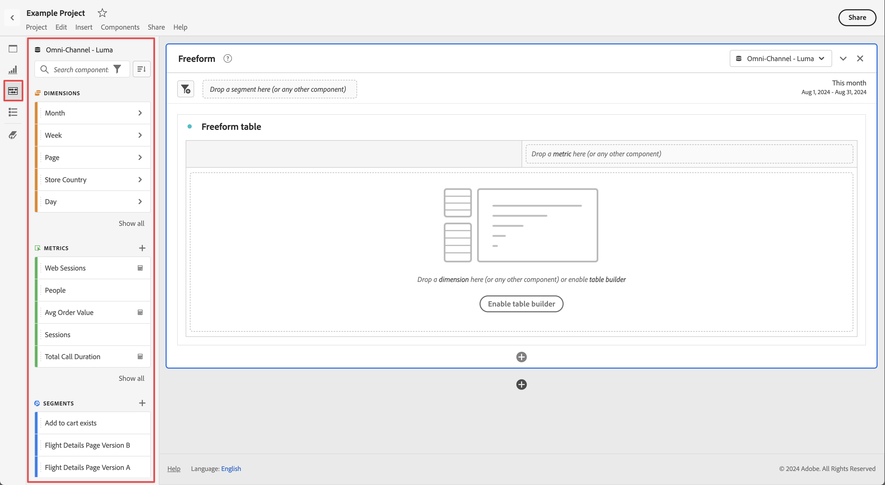

# Components overview

Components are features in Customer Journey Analytics that can be used in visualizations (like Freeform table), or to complement reporting features.

To manage components from the main Customer Journey Analytics interface: 
  
   1. Select **[!UICONTROL Components]** from the top bar.
   1. Select **[!UICONTROL Components]** to see an overview of the components you can manage, or directly select the component you want to manage from the menu.

You can manage the following components:  

* [Segments](segments/seg-overview.md): Build, manage, share, and apply powerful, focused audience segments to your reports. Segments let you identify subsets of persons based on characteristics or interactions.
* [Calculated metrics](calc-metrics/calc-metr-overview.md): Use metrics and formulas as new components for use in reporting
* [Date ranges](date-ranges/create.md): Customize and refine the date ranges Analysis Workspace offers.
* [Annotations](/help/components/annotations/overview.md): Communicate contextual data nuances and insights to your organization.
* [Intelligent alerts](/help/components/c-intelligent-alerts/intelligent-alerts.md): Allow you to be notified based on changed percentages or specific data points. 
* [Scheduled projects](/help/analysis-workspace/export/t-schedule-report.md#scheduled-projects-manager): Manage your scheduled projects.
* [Preferences](/help/analysis-workspace/user-preferences.md): Manage the preferences for Analysis Workspace.
* [Audiences](/help/components/audiences/audiences-overview.md): Create and publish audiences from Customer Journey Analytics to [Real-Time Customer Data Platform](https://experienceleague.adobe.com/en/docs/experience-platform/profile/home) in Experience Platform for targeting and personalization.
* [Exports](/help/components/exports/manage-export-locations.md): Manage your export account and locations.

## Analysis Workspace components

Components in Analysis Workspace consist of metrics, dimensions, segments, and date ranges that you can drag-and-drop onto panels and visualizations in your Workspace project. Custom components that you create are added to these panels, such as a calculated metric, or a custom date range.

To access the Components panel, select  **[!UICONTROL Components]** in the button panel. 

See [Create a project](/help/analysis-workspace/home.md) for information on how to use components in a project.

## Manage components {#actions}

You can quickly create a new component using the **[!UICONTROL Components]** menu in Analysis Workspace. See the [Analysis Workspace menu](/help/analysis-workspace/home.md#menu) for more details.

You can manage components (individually or by selecting more than one). 

1. Select one or more components.

1. From the context menu, or from the  Component actions button (at the top of Components), select one of the following actions.
   

   >[!TIP]
   >
   >You can select multiple components by holding **[!UICONTROL Shift]**, or by holding **[!UICONTROL Command]** (on macOS) or **[!UICONTROL Ctrl]** (on Windows).

   {width=100%}

   | Component action | Description |
   |--- |--- |
   |  [!UICONTROL **Tag**] | Organize or manage components by applying tags to them. You can then search by tag in the left panel by selecting the  filter or typing `#`. Tags also act as filters in the component managers. |
   |  [!UICONTROL **Favorite**] | Add the component to your list of favorites. Like tags, you can search by Favorites in the left panel and filter by them in the component managers. |
   |  **[!UICONTROL Un-favorite]** | Remove the component from your list of favorites. |
   |  [!UICONTROL **Approve**] | Mark components as Approved to signal to your users that the component is organization-approved. Like tags, you can search and filter by Approved in the left panel. A  identifies approved components. |
   |  [!UICONTROL **Share**] | Share components to users in your organization. This option is available for custom components only, such as segments or calculated metrics. |
   |  [!UICONTROL **Delete**] | Delete components that you no longer need. This option is available for custom components only, such as segments or calculated metrics. |

Custom components can also be managed through their respective Component managers. For example, see [Manage segments](/help/components/segments/seg-manage.md).

## Manage the component list

You can search, filter, and sort the component list in the left panel of Analysis Workspace to locate a particular component. 

### Search

1. Select **Components**  in the left panel.

2. In the search field, begin typing the name of the component you want to use in your project.

   A color and icon identify the type of component. **Dimensions**  are orange, **Segments**  are blue, **Date ranges**  are purple, and **Metrics**  are green. The Adobe icon  indicates either a calculated metric template or a segment template. The calculator icon  indicates a calculated metric that an administrator in your organization has created. 

3. Select the component from the drop-down menu.

### Filter

1. Select the **Components** icon  in the left panel.

2. Select **Filter** , or enter `#` in the search field.

3. Select any of the following filter options to filter the list of components:

   | Icon | Filter option | Description |
   |---------|---|----------|
   |  | **[!UICONTROL Approved]** | Show only components that are marked as Approved by an administrator. |
   |  | **[!UICONTROL Favorites]**| Show only components that are in your list of Favorites.  For information about adding components to your list of favorites, see [Manage components](#manage-components). |
   |  | **[!UICONTROL Dimensions]** | Show only components that are Dimensions. |
   |  | **[!UICONTROL Metrics]** | Show only components that are Metrics. |
   | | **[!UICONTROL Segments]** | Show only components that are segments. |
   |  | **[!UICONTROL Date ranges]** | Show only components that are Date ranges. |
   |  | **[!UICONTROL *Tag name*]** | Show only components with the specific selected tags. A dedicated tag is available for Adobe Template which are the [default calculated metrics](/help/components/calc-metrics/default-calcmetrics.md) from Adobe. |

   Select  in a filter to remove the filter.

4. You can optionally sort the component list, as described in [Sort the component list](#sort-the-component-list).

### Sort

<!-- {{release-limited-testing-section}}-->

1. (Optional) Apply any filters to the component list, as described in [Filter the component list](#filter-the-component-list).

2. Select **Components**  in the left panel.

3. Select **Sort** , then select any of the following filter options to sort the list of components.

The following sort options are available:

{{components-sort-options}}

## Access permissions

In Analysis Workspace, administrators can [curate](/help/analysis-workspace/curate-share/curate.md) which components are exposed to users in reporting.
