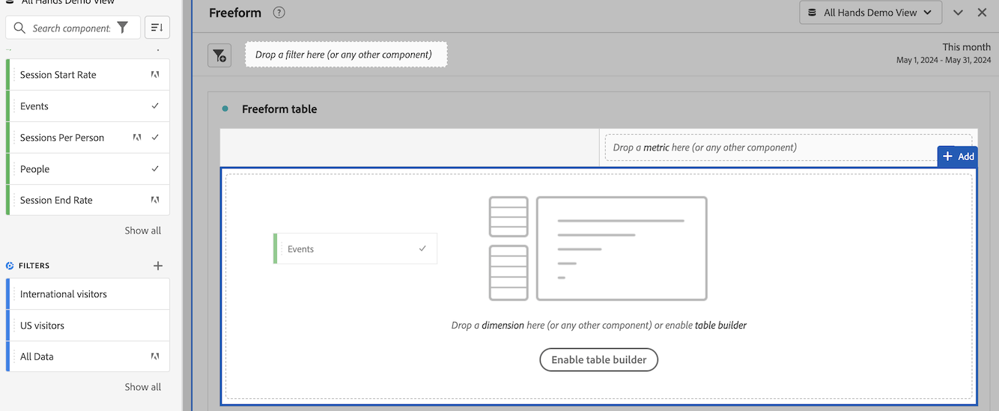
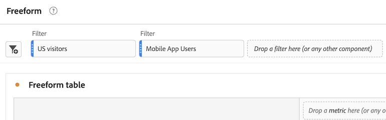
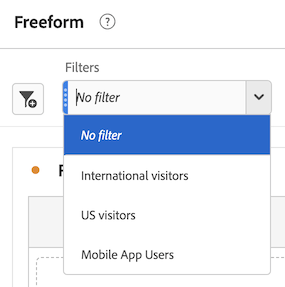

# Use components in Analysis Workspace

Components make up the actual data of any project in Analysis Workspace. Components consist of dimensions, metrics, filters, and date ranges. You can add components to a project by dragging them into visualizations or panels.

For overview information about the types of components you can add, see [Components overview](/help/components/overview.md).

>[!TIP]
>
>For information about each component, select the Info icon next to a component's name in the left rail of Analysis Workspace.

## Begin adding components to a project

1. [Create a project in Analysis Workspace](/help/analysis-workspace/build-workspace-project/create-projects.md) if you haven't already.

1. [Add a panel](/help/analysis-workspace/c-panels/panels.md) or [add a visualization](/help/analysis-workspace/visualizations/freeform-analysis-visualizations.md#add-visualizations-to-a-panel) to the project in Analysis Workspace. 

   If you add a component to a blank project, a freeform table visualization is automatically created.

1. Select the **[!UICONTROL Components]** icon in the left rail.

   

1. Scroll to or search for the component you want to add, then drag it to a panel or visualization within your project. 

   For example, you can drag a filter to the filter drop zone in a panel header.

   

1. For more detailed information, continue with one of the following sections, depending on the component type you are adding:

   * [Add dimensions to a project](#add-dimensions-to-a-project)

   * [Add metrics to a project](#add-metrics-to-a-project)

   * [Add filter to a project](#add-filters-to-a-project)

   * [Add date ranges to a project](#add-date-ranges-to-a-project)

## Add dimensions to a project

[Dimensions](/help/components/dimensions/overview.md) are variables in Adobe Analytics that typically contain string values. In contrast, [metrics](/help/components/calc-metrics/calc-metr-overview.md) contain numeric values that tie to a dimension. A basic report shows rows of string values (dimension), against a column of numeric values (metric).

1. Start adding a dimension to your project in Analysis Workspace, as described in [Begin adding components to a project](#begin-adding-components-to-a-project).

1. Choose one of the following methods to add dimensions and determine the type of data you want to analyze:

   * Drag a dimension to a visualization (such as a freeform table) in Analysis Workspace.

     
   
   * Drag one or more dimensions from the left rail onto the filter drop zone to create an ad hoc filter, as described in [Add filters to a project](#add-filters-to-a-project).

For more information about how to use dimensions in Analysis Workspace, see [Preview dimensions](/help/components/dimensions/view-dimensions.md), [Break down dimensions](/help/components/dimensions/t-breakdown-fa.md), and [Time-parting dimensions](/help/components/dimensions/time-parting-dimensions.md).

## Add metrics to a project

Metrics allow you to quantify data points in Analysis Workspace. They are most commonly used as columns in a visualization and tied to dimensions.

To add a metric to a project in Analysis Workspace:

1. Start adding a metric to your project in Analysis Workspace, as described in [Begin adding components to a project](#begin-adding-components-to-a-project).

1. Choose one of the following methods to add a metric in Analysis Workspace:

   * Drag a metric to the metric drop zone in an empty Freeform table to see that metric trended over the project's date period. 

     

   * Drag a metric when a dimension is present to see that metric compared to each dimension item. 

   * Drag a metric on top of an existing metric header to replace it.

   * Drag a metric next to a header to see both metrics side-by-side.

For more information about metrics, see [Calculated metrics overview](/help/components/calc-metrics/calc-metr-overview.md).

## Add filters to a project

[Filters](/help/components/filters/filters-overview.md) allow you to identify subsets of visitors based on characteristics or specific interactions.

To add a filter to a project in Analysis Workspace:

1. Start adding a filter to your project in Analysis Workspace, as described in [Begin adding components to a project](#begin-adding-components-to-a-project).

1. Choose one of the following methods to begin filtering your panel:

   * **Apply one or more filters to the panel simultaneously:**
   
     1. Drag an individual filter from the left rail onto the filter drop zone, located at the top of a panel. 

        

     1. Repeat this process to add additional filters to the panel. 
   
        Each filter is applied to the panel. Filters appear side by side at the top of the panel. 

             

   * **Create a drop-down menu of filters that can be applied to the panel:** 
   
     1. Hold the Shift or Ctrl key to select multiple filters in the left rail, then hold the Shift key as you drop them onto the filter drop zone.

        

        This creates a drop-down menu, which allows users of the panel to choose the filter they want to apply. 

        

     1. Users can use the drop-down menu in any of the following ways in order to filter the panel:
     
        * Apply a single filter to the panel by selecting the filter from the drop-down menu.

        * Apply multiple filters to the panel by selecting more than one filter from the drop-down menu. The panel is filtered to include any of the selected filters. 
     
        * Select the [!UICONTROL **No filter**] option to leave the panel unfiltered. 
     
          To require a filter on the panel, hover over the [!UICONTROL **No filter**] option, then select the (x) to remove it from the drop-down menu. 

   * **Create ad hoc filters with non-filter components:**
   
     1. Drag non-filter components onto the drop zone. This can save you the time and effort of going to the Filter Builder. 
     
        Filters created in this way are automatically defined as hit-level filters. This definition can be modified by clicking the information icon (i) next to the filter, then the pencil-shaped edit icon and editing it in the Filter Builder.

        Ad hoc filters are a type of quick filter, and are local to the project. They do not show up in the left rail unless you make them public.

        For more information, see [Quick filters](/help/components/filters/quick-filters.md).

For more information about how you can use the filter drop zone on a panel to filter your panel, see [Drop zone](/help/analysis-workspace/c-panels/panels.md#drop-zone) in [Panels overview](/help/analysis-workspace/c-panels/panels.md).

## Add date ranges to a project

[Date ranges](/help/components/date-ranges/custom-date-ranges.md) determine the reporting time frame in Analysis Workspace, and can be applied to one or more panels within a project.

Each panel includes a date range by default. There are multiple ways to update a date range for a panel. One way to update a date range for a panel in Analysis Workspace is to drag a date range component from the left rail:

1. Start adding a date range to your project in Analysis Workspace, as described in [Begin adding components to a project](#begin-adding-components-to-a-project).

1. Drag a date range from the left rail onto the current date range in the upper-right portion of the panel.

     

For more information about how to use calendars and date ranges in Analysis Workspace, see [Calendar and date ranges overview](/help/components/date-ranges/custom-date-ranges.md).
