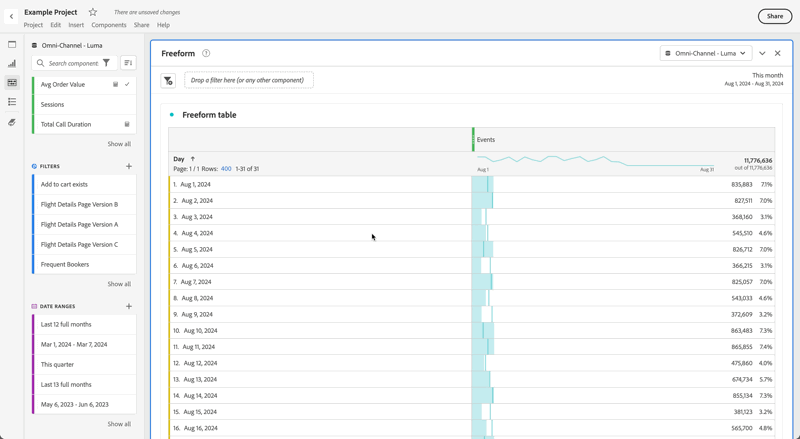

# Use components in a project

Components make up the actual data of any project in Analysis Workspace. Components consist of dimensions, metrics, segments, and date ranges. You can add components to a project by dragging them into visualizations or panels.

See the [Components overview](/help/components/overview.md) for more information on the types of components that you can add.

>[!TIP]
>
>For information about each component, use . See [Component info](#component-info) for more information

## Add components to a project

1. [Create a project in Analysis Workspace](/help/analysis-workspace/build-workspace-project/create-projects.md).

1. [Add a panel](/help/analysis-workspace/c-panels/panels.md#create-a-panel) or [add a visualization](/help/analysis-workspace/visualizations/freeform-analysis-visualizations.md#add-visualizations-to-a-panel) to the project in Analysis Workspace. If you add a component to a blank project, a freeform table visualization is already created for you.

1. Select  **[!UICONTROL Components]** from the button panel. You see all available components in the left panel. See [Interface](/help/analysis-workspace/home.md#interface) for more details.

1. Scroll to or search for the component that you want to add, then drag it to a panel or visualization within your project. 

1. You can optionally drag a component to the segment drop zone in a panel header. This drag and drop defines the component as a segment and applies the segment to all the content within the panel.
   For information about how you can use the segment drop zone on a panel to segment your panel, see [Drop zone](/help/analysis-workspace/c-panels/panels.md#drop-zone) in [Panels overview](/help/analysis-workspace/c-panels/panels.md).

1. For more detailed information, see the following sections:

   * [Add dimensions to a project](#add-dimensions-to-a-project)

   * [Add metrics to a project](#add-metrics-to-a-project)

   * [Add segments to a project](#add-segments-to-a-project)

   * [Add date ranges to a project](#add-date-ranges-to-a-project)

### Add dimensions to a project

[Dimensions](/help/components/dimensions/overview.md) are variables in Customer Journey Analytics that typically contain string values. In contrast, [metrics](/help/components/calc-metrics/calc-metr-overview.md) contain numeric values that tie to a dimension. A basic report shows rows of string values (dimension), against a column of numeric values (metric).

1. Start adding a dimension to your project in Analysis Workspace, as described in [Add components to a project](#add-components-to-a-project).

1. Choose one of the following methods to add dimensions and determine the type of data you want to analyze:

   

   * Drag a dimension to a visualization (such as a freeform table) in Analysis Workspace.
   
   * Drag one or more dimensions from the left panel onto the segment drop zone to create a quick segment, as described in [Add segments to a project](#add-filters-to-a-project).

1. You can optionally break down dimensions and dimension items in Analysis Workspace with other components. For more information, see [Break down dimensions in Workspace](/help/components/dimensions/t-breakdown-fa.md).

For more information about how to use dimensions in Analysis Workspace, see [Preview dimensions](/help/components/dimensions/view-dimensions.md), [Break down dimensions](/help/components/dimensions/t-breakdown-fa.md), and [Time-parting dimensions](/help/components/dimensions/time-parting-dimensions.md).

### Add metrics to a project

Metrics allow you to quantify data points in Analysis Workspace. They are most commonly used as columns in a visualization and tied to dimensions.

To add a metric to a project in Analysis Workspace:

1. Start adding a metric to your project in Analysis Workspace,as described in [Add components to a project](#add-components-to-a-project).

1. Choose one of the following methods to add a metric in Analysis Workspace:

   

   * Drag a metric to the metric drop zone in an empty Freeform table to see that metric trended over the project's date period. 

   * Drag a metric when a dimension is present to see that metric for each dimension item. 

   * Drag a metric on top of an existing metric header to replace it.

   * Drag a metric next to the left of right side of an existing metric header to add the new metric.

   * Drag a metric above or below an existing metric header to create a metric overlap.

     
For more information about metrics, see [Metrics](/help/components/apply-create-metrics.md).

### Add segments to a project

[Segments](/help/components/segments/seg-overview.md) allow you to identify subsets of persons, sessions or events based on characteristics or specific interactions.

You can use segments in Analysis Workspace in any of the following ways:

* Add segments to a panel
  When you add segments to a panel, the segments apply to all content within the panel.
  For information about how you can use the segment drop zone on a panel to segment your panel, see [Drop zone](/help/analysis-workspace/c-panels/panels.md#drop-zone) in [Panels overview](/help/analysis-workspace/c-panels/panels.md).

* Add segments to a visualization
  When you add segments to a column in a freeform table, the segments apply to all content within the table column. You can also add segments as part of a fallout visualization.

* Use segments in components
  Whe you define components like [calculated metrics](/help/components/calc-metrics/cm-workflow/metrics-with-segments.md), [annotations](/help/components/annotations/create-annotations.md#annotation-builder), or even [segments](/help/components/segments/seg-builder.md) you can use segments as part of the definition.

### Add date ranges to a project

[Date ranges](/help/components/date-ranges/overview.md) determine the reporting time frame in Analysis Workspace, and can be applied to one or more panels within a project and also to some visualizations (like the Freeform table).

Each panel includes a date range by default. There are multiple ways to update a date range for a panel. One way to update a date range for a panel in Analysis Workspace is to drag a date range component from the left panel:

1. Optionally, add a date range to your project in Analysis Workspace, as described in [Add components to a project](#add-components-to-a-project).

1. Drag and drop a date range from the left panel onto:

   * The current date range, to modify the date range for the panel.

      

   * A metric or dimension in a Freeform table visualization. See [Use date ranges](/help/components/date-ranges/overview.md#use-date-ranges) for more information.

For more information about how to use and manage date ranges in Analysis Workspace, see [Date ranges overview](/help/components/date-ranges/overview.md).

## Component info

You can hover over any component to display . When selected, a popup is displayed with additional information on the component. 

Based on your access control, you can:

* Access the  [!UICONTROL Data dictionary] definition for the component.
* Access the  component builder or data view where the component is defined.
