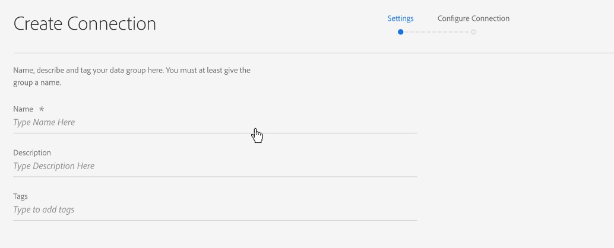

# Create a connection

A connection lets you integrate datasets from [!DNL Adobe Experience Platform] into [!UICONTROL Workspace]. In order to report on [!DNL Experience Platform] datasets, you first have to establish a connection between datasets in [!DNL Experience Platform] and [!UICONTROL Workspace].

Click [here](https://experienceleague.adobe.com/docs/platform-learn/tutorials/cja/connecting-customer-journey-analytics-to-data-sources-in-platform.html) for a video overview.

To create a CJA Connection, you need the following permissions:

Adobe Experience Platform:
* Data Modeling: View Schemas, Manage Schemas
* Data Management: View Datasets, Manage Datasets
* Data Ingestion: Manage Sources

Customer Journey Analytics
* Product Admin Access

>[!IMPORTANT]
>
>You can combine multiple [!DNL Experience Platform] datasets into a single connection.

## Select sandbox and datasets

1. Go to [https://analytics.adobe.com](https://analytics.adobe.com).

1. Click the **[!UICONTROL Connections]** tab.

1. Click **[!UICONTROL Create new connection]** on the top right.

    

1. Choose a sandbox in Experience Platform that contains the dataset/s to which you want to create a connection. 

    Adobe Experience Platform provides [sandboxes](https://experienceleague.adobe.com/docs/experience-platform/sandbox/home.html) which partition a single Platform instance into separate virtual environments to help develop and evolve digital experience applications. You can think of sandboxes as "data silos" that contain data sets. Sandboxes are used to control access to data sets.  Once you have selected the sandbox, the left rail shows all the datasets in that sandbox that you can pull from. 

    >[!IMPORTANT]
    >
    >You cannot access data across sandboxes, i.e., you can only combine datasets that are located within the same sandbox. 

1. Select one or more dataset(s) you want to pull into [!UICONTROL Customer Journey Analytics] and click **[!UICONTROL Add]**.

    (If you have a lot of datasets to choose from, you can search for the right one(s) using the **[!UICONTROL Search datasets]** search bar above the list of datasets.)

## Configure dataset

On the right-hand side, you can now configure the dataset/s you have added.

   

1. **[!UICONTROL Dataset type]**: For each dataset that you added to this connection, [!UICONTROL Customer Journey Analytics] automatically sets the dataset type based on the data coming in. 

    There are 3 different dataset types: [!UICONTROL Event] data, [!UICONTROL Profile] data, and [!UICONTROL Lookup] data.

    |Dataset Type|Description|Timestamp|Schema|Person ID|
    |---|---|---|---|---|
    | [!UICONTROL Event] | Data that represents events in time (e.g., web visits, interactions, transactions, POS data, survey data, ad impression data, etc.). For example, this could be typical clickstream data, with a customer ID or a cookie ID, and a timestamp. With Event data, you have flexibility as to which ID is used as the Person ID. |Is automatically set to the default timestamp field from event-based schemas in [!UICONTROL Experience Platform]. | Any built-in or custom schema that is based on an XDM class with the "Time Series" behavior. Examples include "XDM Experience Event" or "XDM Decision Event." | You can pick which Person ID you want to include. Each dataset schema defined in the Experience Platform can have its own set of one or more identities defined and associated with an Identity Namespace. Any of these can be used as the Person ID. Examples include Cookie ID, Stitched ID, User ID, Tracking Code, etc. |
    | [!UICONTROL Lookup] | This data is used to look up values or keys found in your Event or Profile data. For example, you might upload lookup data that maps numeric IDs in your event data to product names. See [this use case](/help/use-cases/b2b.md) for an example. | N/A | Any built-in or custom schema that is based on an XDM class with the "Record" behavior, except for the "XDM Individual Profile" class.|N/A|
    | [!UICONTROL Profile] | Data that is applied to your visitors, users, or customers in the [!UICONTROL Event] data. For example, allows you to upload CRM data about your customers. | N/A | Any built-in or custom schema that is based on the "XDM Individual Profile" class.|You can pick which Person ID you want to include. Each dataset defined in the [!DNL Experience Platform] has its own set of one or more Person IDs defined, such as Cookie ID, Stitched ID, User ID, Tracking Code, etc. **Note**: If you create a connection that includes datasets with different IDs, the reporting will reflect that. To really merge datasets, you need use the same Person ID. |

1. **[!UICONTROL Dataset ID]**: This ID is automatically generated.

1. **[!UICONTROL Time stamp]**: For event datasets only, this setting is automatically set to the default timestamp field from event-based schemas in [!UICONTROL Experience Platform].

1. **[!UICONTROL Schema]**: This is the [schema](https://experienceleague.adobe.com/docs/experience-platform/xdm/schema/composition.html) based on which the dataset was created in Adobe Experience Platform.

1. **[!UICONTROL Person ID]**: Select a person ID from the dropdown list of available identities. These identities were defined in the dataset schema in the Experience Platform. See below for information on how to use Identity Map as a Person ID. 

    >[!IMPORTANT]
    >
    >If there are no person IDs to choose from, that means one or more person IDs have not been defined in the schema. View [this video](https://youtu.be/G_ttmGl_LRU) on how to define an identity in Experience Platform.

1. Click **[!UICONTROL Next]** to go to the [!UICONTROL Enable Connection] dialog.

### Use Identity Map as a Person ID

Customer Journey Analytics now supports the ability to use the Identity Map for its Person ID. Identity Map is a map data structure that allows someone to upload key -> value pairs. The keys are identity namespaces and the value is a structure that holds the identity value. The Identity Map exists on each row/event uploaded and is populated for each row accordingly.

The Identity Map is available for any dataset that uses a schema based on the [ExperienceEvent XDM](https://experienceleague.adobe.com/docs/experience-platform/xdm/home.html) class. When you select such a dataset to be included in a CJA Connection, you have the option of selecting either a field as the primary ID or the Identity Map:

If you select Identity Map, you get two additional configuration options:

|Option|Description|
|---|---|
| [!UICONTROL Use Primary ID Namespace] | This instructs CJA, per row, to find the identity in the Identity Map that is marked with a primary=true attribute and use that as the Person ID for that row. This means that this is the primary key that will be used in Experience Platform for partitioning. It is also the prime candidate for usage as CJA's visitor ID (depending on how the dataset is configured in a CJA Connection).|
| [!UICONTROL Namespace] | (This option is only available if you do not use the Primary ID Namespace.) Identity namespaces are a component of [Adobe Experience Platform Identity Service](https://experienceleague.adobe.com/docs/experience-platform/identity/namespaces.html) that serve as indicators of the context to which an identity relates. If you specify a namespace, CJA will search each row's Identity Map for this namespace key and use the identity under that namespace as the person ID for that row. Note that since CJA cannot do a full dataset scan of all rows to determine which namespaces are actually present, all possible namespaces are listed in the dropdown. You need to know which namespaces are specified in the data; this cannot be auto-detected.|

### Identity Map edge cases

This table shows the two configuration options when edge cases are present and how they are handled:

|Option|No IDs are present in Identity Map|No IDs are marked as primary|Multiple IDs are marked as primary|Single ID is marked as primary|Invalid namespace with an ID marked as primary|
|---|---|---|---|---|---|
| **"Use Primary ID Namespace" checked** |The row is dropped by CJA.|The row is dropped by CJA, as no primary ID is specified.|All IDs marked as primary, under all namespaces, are extracted into a list. They are then alphabetically sorted; with this new sorting, the first namespace with its first ID is used as the Person ID.|The single ID marked as primary is used as the Person ID.|Even though the namespace may be invalid (not present in AEP), CJA will use the primary ID under that namespace as the Person ID.|
|**Specific Identity Map namespace selected**|The row is dropped by CJA.|All IDs under the selected namespace are extracted into a list and the first is used as the Person ID.|All IDs under the selected namespace are extracted into a list and the first is used as the Person ID.|All IDs under the selected namespace are extracted into a list and the first is used as the Person ID.|All IDs under the selected namespace are extracted into a list and the first is used as the Person ID. (Only a valid namespace can be selected at Connection creation time, so it is not possible for an invalid namespace/ID to be used as Person ID)|

## Enable connection

1. To enable a connection, define these settings for the entire connection, i.e. all the datasets in the connection:

    | Option | Description |
    | --- | --- |
    | [!UICONTROL Name Connection] | Give the connection a descriptive name. The connection cannot be saved without a name. |
    | [!UICONTROL Description] | Add more detail to distinguish this connection from others. |
    | [!UICONTROL Datasets] | The datasets that are included in this connection. |
    | [!UICONTROL Automatically import all new datasets in this connection, beginning today.] |  Select this option if you want to establish an ongoing connection, so that any new data batches that get added to the datasets in this connection automatically flow into [!UICONTROL Workspace]. |
    | [!UICONTROL Import all existing data] | When you select this option and save the connection, all of the existing (historical) data from [!DNL Experience Platform] for all datasets in this connection will be imported or backfilled. In the future, all existing historical data for any new dataset(s) added to this saved connection will also be automatically imported. See also [Backfill historical data](https://experienceleague.adobe.com/docs/analytics-platform/using/cja-connections/create-connection.html#backfill-historical-data) below. **Note that, once this connection is saved, this setting cannot be changed.** |
    | [!UICONTROL Average number of daily events] | You are required to specify the average number of daily events to be imported (new data **and** backfill data) for all the datasets in the connection. Select one option from the drop-down menu. This is so that Adobe can allocate sufficient space for this data. If you do not know the average number of daily events your company is going to import, you can do a simple SQL query in [Adobe Experience Platform Query Services](https://experienceleague.adobe.com/docs/experience-platform/query/home.html) to find out. See "Calculate the average number of daily events" below. |

1. Click **[!UICONTROL Save and create data view]**. For documentation, see [create a data view](/help/data-views/create-dataview.md).

### Backfill historical data

**[!UICONTROL Import all existing data]** lets you backfill historical data. Keep this in mind:

* We have removed the backfill (historical data import) limitation. Previously, you could backfill a maximum of 2.5 billion rows on your own and otherwise required engineering involvement. Now, you can backfill data on your own, without any limitations.
* We prioritize new data added to a dataset in the connection, so this new data has the lowest latency.
* Any backfill (historical) data is imported at a slower rate. The latency is influenced by how much historical data you have, combined with the **[!UICONTROL Average number of daily events]** setting you selected. For example, if you have more than one billion rows of data per day, plus 3 years of historical data, that could take multiple weeks to import. On the other hand, if you have less than a million rows per day and one week of historical data, that would take less than an hour.
* Backfilling applies to the whole connection, not to each dataset individually.
* The [Adobe Analytics Source Connector](https://experienceleague.adobe.com/docs/platform-learn/tutorials/data-ingestion/ingest-data-from-adobe-analytics.html) imports up to 13 months of data, irrespective of size.

### Calculate the average number of daily events

This calculation has to be done for every dataset in the connection.

1. Go to [Adobe Experience Platform Query Services](https://experienceleague.adobe.com/docs/experience-platform/query/home.html) and create a new query.

1. The query would look like this: `Select AVG(A.total_events) from (Select DISTINCT COUNT (*) as total_events, date(TIMESTAMP) from analytics_demo_data GROUP BY 2 Having total_events>0) A;` 

* In this example, "analytics_demo_data" is the name of the dataset.
* Perform the `Show Tables` query to show all the datasets that exist in AEP.
