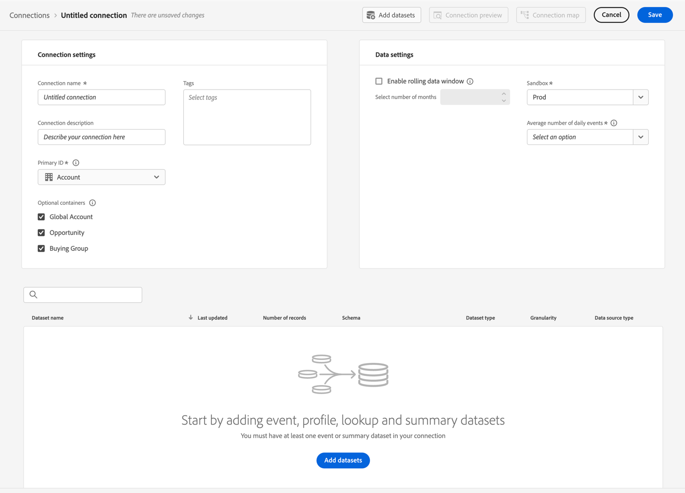

# Create or edit a connection {#create-or-edit-a-connection}

>[!CONTEXTUALHELP]
>id="cja_connections_recordsadded"
>title="Records added"
>abstract="The number of records (rows) added to a Connection during the selected time interval for the selected datasets."

>[!CONTEXTUALHELP]
>id="cja_connections_recordsskipped"
>title="Records skipped"
>abstract="The number of records (rows) skipped during data transfer for a Connection during the selected time interval for the selected datasets."

>[!CONTEXTUALHELP]
>id="cja_connections_recordsdeleted"
>title="Records deleted"
>abstract="The number of records (rows) removed from a Connection during the selected time interval for the selected datasets."

>[!CONTEXTUALHELP]
>id="cja_connection_lastadded"
>title="Last added"
>abstract="The timestamp of the latest batch from any dataset transferred to a Connection."

>[!CONTEXTUALHELP]
>id="cja_connection_enablerollingdatawindow"
>title="Enable rolling data window"
>abstract="Define data retention as a rolling window in months at a connection level."

>[!CONTEXTUALHELP]
>id="cja_connection_averagenumberofdailyuses"
>title="Average number of daily uses"
>abstract="Select a range for the number of expected daily events for the entire connection."

>[!CONTEXTUALHELP]
>id="connections_recordsadded"
>title="Records added"
>abstract="The number of records (rows) added to a Connection during the selected time interval for the selected datasets."

>[!CONTEXTUALHELP]
>id="connections_recordsskipped"
>title="Records skipped"
>abstract="The number of records (rows) skipped during data transfer for a Connection during the selected time interval for the selected datasets."

>[!CONTEXTUALHELP]
>id="connections_recordsdeleted"
>title="Records deleted"
>abstract="The number of records (rows) removed from a Connection during the selected time interval for the selected datasets"

>[!CONTEXTUALHELP]
>id="connection_lastadded"
>title="Last added"
>abstract="The timestamp of the latest batch from any dataset transferred to a Connection."

>[!CONTEXTUALHELP]
>id="connection_enablerollingdatawindow"
>title="Enable rolling data window"
>abstract="Define data retention as a rolling window in months at a connection level."

>[!CONTEXTUALHELP]
>id="connection_averagenumberofdailyuses"
>title="Average number of daily uses"
>abstract="Select a range for the number of expected daily events for the entire connection."

>[!CONTEXTUALHELP]
>id="connection_change_personid"
>title="Change identity settings "
>abstract="A change of identity setting deletes connection data for this dataset, once you save the modifications in the Connections interface. You will have to re-ingest data from the dataset based on the new settings.<br/><br/>A delay in reporting is possible until the deletion process is completed."

>[!CONTEXTUALHELP]
>id="connection_change_accountid"
>title="Change Account ID"
>abstract="A change of the Account ID deletes all existing data in the connection and re-ingests all data from the dataset based on the new Account ID. This action can have cost implications. <br/><br/>When you select **[!UICONTROL Continue]**, a delay in reporting is possible until the process completes."

>[!CONTEXTUALHELP]
>id="connection_change_globalaccountid"
>title="Change Global Account ID"
>abstract="A change of the Global Account ID deletes all existing data in the connection and re-ingests all data from the dataset based on the new Global Account ID. This action can have cost implications. <br/><br/>When you select **[!UICONTROL Continue]**, a delay in reporting is possible until the process completes."

>[!CONTEXTUALHELP]
>id="connection_change_opportunityid"
>title="Change Opportunity ID"
>abstract="A change of the Opportunity ID deletes all existing data in the connection and re-ingests all data from the dataset based on the new Opportunity ID. This action can have cost implications. <br/><br/>When you select **[!UICONTROL Continue]**, a delay in reporting is possible until the process completes."

>[!CONTEXTUALHELP]
>id="connection_change_buyinggroupid"
>title="Change Buying Group ID"
>abstract="A change of the Buying Group ID deletes all existing data in the connection and re-ingests all data from the dataset based on the new Buying Group ID. This action can have cost implications. <br/><br/>When you select **[!UICONTROL Continue]**, a delay in reporting is possible until the process completes."

>[!CONTEXTUALHELP]
>id="connection_change_persistentid"
>title="Change Persistent ID"
>abstract="A change of the Persistent ID deletes all existing data in the connection and re-ingests all data from the dataset based on the new Persistent ID. This action can have cost implications. <br/><br/>When you select **[!UICONTROL Continue]**, a delay in reporting is possible until the process completes."


<!-- Start of contextual help entries for CJA connection dialogs -->

>[!CONTEXTUALHELP]
>id="connections_useincja_exl_ajo"
>title="Use this connection in Customer Journey Analytics"
>abstract="This option allows you to leverage the advanced reporting capabilities of Customer Journey Analytics with your Journey Optimizer connection. These capabilities allow you to:<ul><li>Perform in-depth analysis of Journey Optimizer data within Customer Journey Analytics.</li><li>Edit the Journey Optimizer connection and associated data views.</li><li>Analyze journey events, conversation paths, and campaign performance.</li></ul>**When this option is enabled, each row of data within the connection counts towards your license rows of data each month for Customer Journey Analytics and appears within the Connections Usage UI.**<br><br/>Explore this option only if you are comfortable with the additional usage of rows of data in Customer Journey Analytics. [Learn more](https://experienceleague.adobe.com/en/docs/analytics-platform/using/integrations/ajo){target="_blank"}."

>[!CONTEXTUALHELP]
>id="connections_disableuseincja_exl_ajo"
>title="Remove this connection from Customer Journey Analytics"
>abstract="This Journey Optimizer connection is currently used in Customer Journey Analyics. The connections allows you to:<ul><li>Perform in-depth analysis of Journey Optimizer data within Customer Journey Analytics.</li><li>Edit the Journey Optimizer connection and associated data views.</li><li>Analyze journey events, conversation paths, and campaign performance.</li></ul>**If you remove the connection, in-depth analysis in Customer Journey Analytics is no longer possible. The connection and any associated data views are reset to their default state and can no longer be edited.**<br/><br/>**Billing for this connection in Customer Journey Analytics includes the full month during which the connection is removed.**<br/><br/>The connection remains enabled in Journey Optimizer. [Learn more](https://experienceleague.adobe.com/en/docs/analytics-platform/using/integrations/ajo){target="_blank"}." 

>[!CONTEXTUALHELP]
>id="connections_useincja_exl_brand_concierge"
>title="Use this connection in Customer Journey Analytics"
>abstract="This option allows you to leverage the advanced reporting capabilities of Customer Journey Analytics with your Brand Concierge connection. These capabilities allow you to:<ul><li>Perform in-depth analysis of Brand Concierge data within Customer Journey Analytics.</li><li>Edit the Brand Concierge connection and associated data views.</li><li>Analyze conversational engagement, sentiment, and conversion metrics.</li></ul>**When this option is enabled, each row of data within the connection counts towards your license rows of data each month for Customer Journey Analytics and appears within the Connections Usage UI.**<br><br/>Explore this option only if you are comfortable with the additional usage of rows of data in Customer Journey Analytics. [Learn more](https://experienceleague.adobe.com/en/docs/analytics-platform/using/cja-workspace/templates/use-templates#brand-concierge-templates){target="_blank"}."

>[!CONTEXTUALHELP]
>id="connections_disableuseincja_exl_brand_concierge"
>title="Remove this connection from Customer Journey Analytics"
>abstract="This Brand Concierge connection is currently used in Customer Journey Analyics. The connections allows you to:<ul><li>Perform in-depth analysis of Brand Concierge data within Customer Journey Analytics.</li><li>Edit the Brand Concierge connection and associated data views.</li><li>Analyze conversational engagement, sentiment, and conversion metrics.</li></ul>**If you remove the connection, in-depth analysis in Customer Journey Analytics is no longer possible. The connection and any associated data views are reset to their default state and can no longer be edited.**<br/><br/>**Billing for this connection in Customer Journey Analytics includes the full month during which the connection is removed.**<br/><br/>The connection remains enabled in Brand Concierge. [Learn more](https://experienceleague.adobe.com/en/docs/analytics-platform/using/cja-workspace/templates/use-templates#brand-concierge-templates){target="_blank"}." 

>[!CONTEXTUALHELP]
>id="connections_useincja_exl_product_usage"
>title="Use this connection in Customer Journey Analytics"
>abstract="This option allows you to leverage the advanced reporting capabilities of Customer Journey Analytics with your product usage connection. These capabilities allow you to:<ul><li>Perform in-depth analysis of product usage data within Customer Journey Analytics.</li><li>Edit the product usage connection and associated data views.</li></ul>**When this option is enabled, each row of data within the connection counts towards your license rows of data each month for Customer Journey Analytics and appears within the Connections Usage UI.**<br><br/>Explore this option only if you are comfortable with the additional usage of rows of data in Customer Journey Analytics. [Learn more](https://experienceleague.adobe.com/en/docs/analytics-platform/using/tools/product-usage/usage-overview){target="_blank"}."

>[!CONTEXTUALHELP]
>id="connections_disableuseincja_exl_product_usage"
>title="Remove this connection from Customer Journey Analytics"
>abstract="This product usage connection is currently used in Customer Journey Analyics. The connections allows you to:<ul><li>Perform in-depth analysis of product usage data within Customer Journey Analytics.</li><li>Edit the product usage connection and associated data views.</li></ul>**If you remove the connection, in-depth analysis in Customer Journey Analytics is no longer possible. The connection and any associated data views are reset to their default state and can no longer be edited.**<br/><br/>**Billing for this connection in Customer Journey Analytics includes the full month during which the connection is removed.**<br/><br/>The connection remains enabled for product usage. [Learn more](https://experienceleague.adobe.com/en/docs/analytics-platform/using/tools/product-usage/usage-overview){target="_blank"}." 

>[!CONTEXTUALHELP]
>id="connections_useincja_legal_section_section"
>title="Legal implications"
>abstract="Customer Journey Analytics usage may result in additional charges based on integration data volumes. See [details on Customer Journey Analytics billing and usage](https://experienceleague.adobe.com/en/docs/analytics-platform/using/cja-connections/manage-connections#connections-usage)"


>[!CONTEXTUALHELP]
>id="connections_useincja_exl_ajo_learn_more"
>title="Learn more"
>abstract="[Learn more](https://experienceleague.adobe.com/en/docs/analytics-platform/using/cja-connections/manage-connections#connections-usage)."

>[!CONTEXTUALHELP]
>id="connections_useincja_exl_brand_concierge_learn_more"
>title="Learn more"
>abstract="[Learn more](https://experienceleague.adobe.com/en/docs/analytics-platform/using/cja-workspace/templates/use-templates#brand-concierge-templates)."

>[!CONTEXTUALHELP]
>id="connections_useincja_exl_product_usage_learn_more"
>title="Learn more"
>abstract="[Learn more](https://experienceleague.adobe.com/en/docs/analytics-platform/using/tools/product-usage/usage-overview)."

<!-- End of contextual help entries for CJA connection dialogs -->


The connection creation and edit workflow experience brings all the dataset and connection configuration settings to the center of the screen with an assistive workflow. It provides detailed dataset selection, configuration, and review experience. And allows you to specify critical information like [dataset type](#dataset-types), size, schema, dataset id, batch status, backfill status, identities, and much more, to reduce the risk of wrong connection configuration. Here is an overview of the capabilities:

* You can enable a rolling data retention window when you create the connection.
* You can add to and remove datasets from a connection. (Removing a dataset removes it from the connection and impacts any associated data views and underlying Analysis Workspace projects.)
* You can enable and request backfill data per dataset.
* You can edit datasets, for example to request another backfill.
* You can import existing data per dataset.


>[!BEGINSHADEBOX]

See  [Connect to data sources](https://experienceleague.adobe.com/en/docs/customer-journey-analytics-learn/tutorials/connections/connecting-customer-journey-analytics-to-data-sources-in-platform){target="_blank"} for a demo video.

>[!ENDSHADEBOX]


## Prerequisites

The maximum number of datasets you can add to a connection is capped at 100. The mix depends on which Customer Journey Analytics package your company has purchased. 

Contact your administrator if you're unsure which Customer Journey Analytics package you have.

| **Select** package | **Foundation** package |
| --- | --- |
| Any combination of event, profile, lookup, or summary datasets, adding up to 100  | One event dataset per connection |
|  | Up to 99 profile, lookup, or summary datasets per connection  |

{style="table-layout:auto"}

## Create a connection {#create-connection}

To create a connection: 

1. In Customer Journey Analytics, select **[!UICONTROL Connections]**, optionally from **[!UICONTROL Data management]**, in the top menu.
1. Select **[!UICONTROL Create new connection]**. 

You can now [edit the details for your connection](#edit-a-connection).

## Edit a connection {#edit-connection}

How you edit the connection depends on the Customer Journey Analytics package you have licensed:

* [Customer Journey Analytics](#customer-journey-analytics)
* [Customer Journey Analytics B2B Edition](#customer-journey-analytics-b2b-edition)

### Customer Journey Analytics

In the **[!UICONTROL Connections]** > **[!UICONTROL *Name of the connection*]** screen:


1. Configure the connection settings.

    | Setting | Description |
    | --- | --- |
    | **[!UICONTROL Connection name]** | Enter a unique name for the connection. |
    | **[!UICONTROL Connection description]** | Describe the purpose of this connection. |
    | **[!UICONTROL Tags]** | Specify tags to add tags to your connection so you can use these tags to search for the connection at a later stage. |
    | **[!UICONTROL Enable rolling data window]** | This checkbox, if checked, lets you define Customer Journey Analytics data retention as a rolling window in months (1 month, 3 months, 6 months, and so on), at the connection level.<p>Data retention is based on event dataset timestamps and applies to event datasets only. No rolling data window setting exists for profile or lookup datasets, since there are no applicable timestamps. However, if your connection includes any profile or lookup datasets (besides one or more event datasets), that data is retained for the same time period.<p> The main benefit is that you store or report only on data that is applicable and useful and delete older data that is no longer useful. It helps you stay under your contract limits and reduces the risk of overage cost.<p><ul><li>If you leave the default (unchecked), the Adobe Experience Platform data retention setting supersedes the retention period. If you have 25 months' worth of data in Experience Platform, Customer Journey Analytics gets 25 months of data through backfill. If you deleted 10 of those months in Experience Platform, Customer Journey Analytics would retain the remaining 15 months.</li><li>If you enable a rolling data window, specify in **[!UICONTROL Select number of months]** the number of months for which you enable the rolling data window. |
    | **[!UICONTROL Sandbox]** | Choose a sandbox in Experience Platform that contains the datasets for which you want to create a connection.<p>Adobe Experience Platform provides [sandboxes](https://experienceleague.adobe.com/en/docs/experience-platform/sandbox/home) which partition a single Platform instance into separate virtual environments to help develop and evolve digital experience applications. You can think of sandboxes as "data silos" that contain datasets. Sandboxes are used to control access to datasets.<p>Once you have selected the sandbox, the left rail shows all the datasets in that sandbox that you can pull from.  |
    | **[!UICONTROL Add datasets]** | Select  **[!UICONTROL Add datasets]** to add datasets. If the connection has no datasets yet, you can also select **[!UICONTROL Add datasets]** in the datasets table. |


    For the datasets you have configured, the table of datasets shows the following columns:

    | Column | Description |
    |---|---|
    | **[!UICONTROL Dataset name]** | Select one or more datasets that you want to pull into Customer Journey Analytics and select **[!UICONTROL Add]**.<p>(If you have many datasets to choose from, you can search for the right one(s) using the Search datasets search bar above the list of datasets.) |
    |  | Select  to open a context menu for the selected dataset. Based on the (type of) dataset, you can select:<ul><li>&nbsp; **[!UICONTROL Delete dataset]** to [delete a dataset](#delete-a-dataset).</li><li> **[!UICONTROL Edit dataset]** to [edit a dataset](#edit-a-dataset).</li><li> **[!UICONTROL Past backfills]** to display [past backfills for the dataset](#past-backfills). |
    | **[!UICONTROL Last updated]** | For event datasets only, this setting is automatically set to the default timestamp field from event-based schemas in Experience Platform. "N/A" means that this dataset contains no data. |
    | **[!UICONTROL Number of records]** | The total records in the previous month for the dataset in Experience Platform. |
    | **[!UICONTROL Schema]** | The [schema](https://experienceleague.adobe.com/en/docs/experience-platform/xdm/schema/composition) based on which the dataset was created in Adobe Experience Platform. |
    | **[!UICONTROL Dataset type]** | For each dataset that you added to this connection, Customer Journey Analytics automatically sets the [dataset type](#dataset-types) based on the data coming in. There are 3 different dataset types: Event data, Profile data, and Lookup data. See the table below for an explanation of dataset types. |
    | **[!UICONTROL Stitched]** | If a dataset is [enabled for stitching in the Connection UI](/help/stitching/use-stitching-ui.md), the value is **[!UICONTROL true]**. Otherwise the value is **[!UICONTROL false]**. Stitched datasets that are the result of the [request to stitch procedure](/help/stitching//use-stitching.md) are not identified as stitched in this table, and by default have a value of **[!UICONTROL false]**. |
    | **[!UICONTROL Granularity]** | The granularity of the data in the dataset; only applicable for summary datasets. |
    | **[!UICONTROL Data source type]** | The data source type of the dataset. Not applicable for summary datasets. |
    | **[!UICONTROL Person ID]** | The Person ID that is used to support person-based reporting for the dataset. |
    | **[!UICONTROL Key]** | The key that is used for a lookup dataset.|
    | **[!UICONTROL Matching Key]** | The matching key that is used for a lookup dataset. |
    | **[!UICONTROL Import new data]** | The status of importing new data for the dataset: <p>&nbsp;&nbsp;&nbsp;**[!UICONTROL _x_ On]** if the dataset is configured to import new data, and<p>&nbsp;&nbsp;&nbsp;**[!UICONTROL _x Off_]** if the dataset is configured not to import new data. |
    | **[!UICONTROL Backfill data]** | The status of backfill data for the dataset.<p>&nbsp;&nbsp;&nbsp;**[!UICONTROL _x_ backfills failed]** for number of failed backfills,<p>&nbsp;&nbsp;&nbsp;**[!UICONTROL _x_ backfills processing]** for number of processing backfills,<p>&nbsp;&nbsp;&nbsp;**[!UICONTROL _x_ backfills completed]** for number of backfills completed, and<p>&nbsp;&nbsp;&nbsp;**[!UICONTROL _Off_]** in case no backfills are configured. |

    You can search for a specific dataset using the  field.

### Customer Journey Analytics B2B Edition

[!BADGE B2B Edition]{type=Informative url="https://experienceleague.adobe.com/en/docs/analytics-platform/using/cja-overview/cja-b2b/cja-b2b-edition" newtab=true tooltip="Customer Journey Analytics B2B Edition"}

In the **[!UICONTROL Connections]** > **[!UICONTROL *Name of the connection*]** screen:



1. Configure the connection settings.

    | Setting | Description |
    | --- | --- |
    | **[!UICONTROL Connection name]** | Enter a unique name for the connection. |
    | **[!UICONTROL Connection description]** | Describe the purpose of this connection. |
    | **[!UICONTROL Tags]** | Specify tags to add tags to your connection so you can use these tags to search for the connection at a later stage. |
    | **[!UICONTROL Primary ID]** | Select the proper primary ID for your connection: <ul><li> **[!UICONTROL Person]** for a person-based connection you typically use in a B2C scenario.</li><li>  **[!UICONTROL Account]** for an account-based connection you typically use in a B2B scenario.</li></ul>As soon as you add one or more datasets to your connection, you are no longer able to change the primary ID. <br/>The selection of the primary ID defines whether the connection is person-based or account-based. The connection base determines the available [settings](#dataset-settings) for certain types of datasets. |
    | **[!UICONTROL Optional containers]** | If you have selected  **[!UICONTROL Account]** as the **[!UICONTROL Primary ID]**, select additional containers.<ul><li>**[!UICONTROL Global account]**: enables configuration of global accounts in a connection.</li><li>**[!UICONTROL Opportunity]**: enables configuration of opportunities in a connection.</li><li>**[!UICONTROL Buying group]**: enables configuration of buying groups in a connection.</li><ul> |
    | **[!UICONTROL Sandbox]** | Choose a sandbox in Experience Platform that contains the datasets to which you want to create a connection.<p>Adobe Experience Platform provides [sandboxes](https://experienceleague.adobe.com/en/docs/experience-platform/sandbox/home) which partition a single Platform instance into separate virtual environments to help develop and evolve digital experience applications. You can think of sandboxes as "data silos" that contain datasets. Sandboxes are used to control access to datasets.<p>Once you have selected the sandbox, the left rail shows all the datasets in that sandbox that you can pull from.  |
    | **[!UICONTROL Enable rolling data window]** | This checkbox, if checked, lets you define Customer Journey Analytics data retention as a rolling window in months (1 month, 3 months, 6 months, and so on), at the connection level.<p>Data retention is based on event dataset timestamps and applies to event datasets only. No rolling data window setting exists for profile or lookup datasets, since there are no applicable timestamps. However, if your connection includes any profile or lookup datasets (besides one or more event datasets), that data is retained for the same time period.<p> The main benefit is that you store or report only on data that is applicable and useful and delete older data that is no longer useful. It helps you stay under your contract limits and reduces the risk of overage cost.<p><ul><li>If you leave the default (unchecked), the Adobe Experience Platform data retention setting supersedes the retention period. If you have 25 months' worth of data in Experience Platform, Customer Journey Analytics gets 25 months of data through backfill. If you deleted 10 of those months in Platform, Customer Journey Analytics would retain the remaining 15 months.</li><li>If you enable a rolling data window, specify in **[!UICONTROL Select number of months]** the number of months for which you enable the rolling data window. |
    | **[!UICONTROL Add datasets]**  | Select  **[!UICONTROL Add datasets]** to [add datasets](#add-datasets). If the connection has no datasets yet, you can also select **[!UICONTROL Add datasets]** in the datasets table. |


    For the datasets you have configured, the table of datasets shows the following columns:

    | Column | Description |
    |---|---|
    | **[!UICONTROL Dataset name]** | Select one or more datasets that you want to pull into Customer Journey Analytics and select **[!UICONTROL Add]**.<p>(If you have many datasets to choose from, you can search for the right one(s) using the Search datasets search bar above the list of datasets.) |
    |  | Select  to open a context menu for the selected dataset. Based on the (type of) dataset, you can select:<ul><li>&nbsp; **[!UICONTROL Delete dataset]** to [delete a dataset](#delete-a-dataset).</li><li> **[!UICONTROL Edit dataset]** to [edit a dataset](#edit-a-dataset).</li><li> **[!UICONTROL Past backfills]** to display [past backfills for the dataset](#past-backfills). |
    | **[!UICONTROL Last updated]** | For event datasets only, this setting is automatically set to the default timestamp field from event-based schemas in Experience Platform. "N/A" means that this dataset contains no data. |
    | **[!UICONTROL Number of records]** | The total records in the previous month for the dataset in Experience Platform. |
    | **[!UICONTROL Schema]** | The [schema](https://experienceleague.adobe.com/en/docs/experience-platform/xdm/schema/composition) based on which the dataset was created in Adobe Experience Platform. |
    | **[!UICONTROL Dataset type]** | For each dataset that you added to this connection, Customer Journey Analytics automatically sets the [dataset type](#dataset-types) based on the data coming in. |
    | **[!UICONTROL Granularity]** | The granularity of the data in the dataset; only applicable for summary datasets. |
    | **[!UICONTROL Data source type]** | The data source type of the dataset. Not applicable for summary datasets. |
    | **[!UICONTROL Account ID]** | (only displayed for account-based connections) The Account ID that is used to support account-based reporting for the dataset. |
    | **[!UICONTROL Global Account ID]** | (only displayed for account-based connections) The Global Account ID that is used to support account-based reporting for the dataset. |
    | **[!UICONTROL Buying Group ID]** | (only displayed for account-based connections) The Buying Group ID that is used to lookup buying group data. |
    | **[!UICONTROL Opportunity ID]** | (only displayed for account-based connections) The Opportunity ID that is used to lookup opportunity data. |
    | **[!UICONTROL Person ID]** | The Person ID that is used to support person-based reporting for the dataset. |
    | **[!UICONTROL Key]** | The key that is used for a lookup dataset.|
    | **[!UICONTROL Matching Key]** | The matching key that is used for a lookup dataset. |
    | **[!UICONTROL Import new data]** | The status of importing new data for the dataset: <p>&nbsp;&nbsp;&nbsp;**[!UICONTROL _x_ On]** if the dataset is configured to import new data, and<p>&nbsp;&nbsp;&nbsp;**[!UICONTROL _x Off_]** if the dataset is configured not to import new data. |
    | **[!UICONTROL Backfill data]** | The status of backfill data for the dataset.<p>&nbsp;&nbsp;&nbsp;**[!UICONTROL _x_ backfills failed]** for number of failed backfills,<p>&nbsp;&nbsp;&nbsp;**[!UICONTROL _x_ backfills processing]** for number of processing backfills,<p>&nbsp;&nbsp;&nbsp;**[!UICONTROL _x_ backfills completed]** for number of backfills completed, and<p>&nbsp;&nbsp;&nbsp;**[!UICONTROL _Off_]** in case no backfills are configured. |

    You can search for a specific dataset using the  field.

## Datasets {#datasets}

You [add one or more datasets](#add-datasets) or [edit existing datasets](#edit-a-dataset) as part of connection workflow.

>[!NOTE]
>
>Values earlier than the year 1900 for Date and Date-time fields in a row in any type of dataset are replaced with the value `null` before the row is ingested.<br/>Rows in an event or summary dataset with a timestamp value before the year 1900 are dropped from ingestion.


{{relational-model-based}}


>[!CONTEXTUALHELP]
>id="cja_connection_primaryid"
>title="Primary ID"
>abstract="Select the proper primary ID for your connection: Person for a B2C scenario. Account for a B2B scenario."

>[!CONTEXTUALHELP]
>id="cja_connection_optionalcontainers"
>title="Optional containers"
>abstract="Select additional containers.<br/><br/>**[!UICONTROL Global account]**: enables configuration of global accounts in a connection.<br/>**[!UICONTROL Opportunity]**: enables configuration of opportunities in a connection.<br/>**[!UICONTROL Buying group]**: enables configuration of buying groups in a connection."

>[!CONTEXTUALHELP]
>id="cja_connection_accountid"
>title="Account ID"
>abstract="Select an account ID (the unique identifier for an account) from the available identities defined in the dataset schema in the Experience Platform."

>[!CONTEXTUALHELP]
>id="cja_connection_accountfield"
>title="Account field"
>abstract="Select a field that represents the account ID (the unique identifier for an account)."

>[!CONTEXTUALHELP]
>id="cja_connection_globalaccountid"
>title="Global account ID"
>abstract="Select a Global Account ID (the unique identifier for a global account) from the available identities that you have defined in the dataset schema in the Experience Platform."

>[!CONTEXTUALHELP]
>id="cja_connection_opportunityid"
>title="Opportunity ID"
>abstract="Select an Opportunity ID (the unique identifier for an opportunity) from the available identities that you have defined in the dataset schema in the Experience Platform."

>[!CONTEXTUALHELP]
>id="cja_connection_buyinggroupid"
>title="Buying group ID"
>abstract="Select a Buying Group ID (the unique identifier for a buying group) from the available identities that you have defined in the dataset schema in the Experience Platform."

>[!CONTEXTUALHELP]
>id="cja_connection_personid"
>title="Person ID"
>abstract="Select a Person ID (the unique identifier for a person) from the available identities that you have defined in the dataset schema in the Experience Platform."

>[!CONTEXTUALHELP]
>id="cja_connection_matchingkey"
>title="Matching key"
>abstract="Select a field to join on with one of the event datasets. If this list is empty, you probably haven't added or configured an event dataset."

>[!CONTEXTUALHELP]
>id="cja_connection_importnewdata"
>title="Import new data"
>abstract="Any new batches that get added in the Experience Platform dataset are automatically added in this connection and made available for analysis."

>[!CONTEXTUALHELP]
>id="cja_connection_datasetbackfill"
>title="Dataset backfill"
>abstract="This option backfills the existing (historical) data from Experience Platform for this dataset in the connection."

>[!CONTEXTUALHELP]
>id="cja_connection_transformdataset"
>title="Transform dataset"
>abstract="This option transforms the dataset so it can be used for person-based lookups in B2B scenarios. Once turned on, the transformation of the dataset is irreversible."

>[!CONTEXTUALHELP]
>id="cja_connection_connectionmap"
>title="Connection map"
>abstract="The Connection map visualizes the relationships between event, person, account and relevant lookup datasets (like opportunities, campaign members, and more)."

>[!CONTEXTUALHELP]
>id="connection_primaryid"
>title="Primary ID"
>abstract="Select the proper primary ID for your connection: Person for a B2C scenario. Account for a B2B scenario."

>[!CONTEXTUALHELP]
>id="connection_optionalcontainers"
>title="Optional containers"
>abstract="Select additional containers.<br/><br/>**[!UICONTROL Global account]**: enables configuration of global accounts in a connection.<br/>**[!UICONTROL Opportunity]**: enables configuration of opportunities in a connection.<br/>**[!UICONTROL Buying group]**: enables configuration of buying groups in a connection."

>[!CONTEXTUALHELP]
>id="connection_personid"
>title="Person ID"
>abstract="Select a person ID from the available identities defined in the dataset schema in the Experience Platform."

>[!CONTEXTUALHELP]
>id="connection_accountid"
>title="Account ID"
>abstract="Select an account ID (the unique identifier for an account) from the available identities defined in the dataset schema in the Experience Platform."

>[!CONTEXTUALHELP]
>id="connection_accountfield"
>title="Account field"
>abstract="Select a field that represents the account ID (the unique identifier for an account)."

>[!CONTEXTUALHELP]
>id="connection_globalaccountid"
>title="Global account ID"
>abstract="Select a Global Account ID (the unique identifier for a global account) from the available identities that you have defined in the dataset schema in the Experience Platform."

>[!CONTEXTUALHELP]
>id="connection_opportunityid"
>title="Opportunity ID"
>abstract="Select an Opportunity ID (the unique identifier for an opportunity) from the available identities that you have defined in the dataset schema in the Experience Platform."

>[!CONTEXTUALHELP]
>id="connection_buyinggroupid"
>title="Buying group ID"
>abstract="Select a Buying Group ID (the unique identifier for a buying group) from the available identities that you have defined in the dataset schema in the Experience Platform."

>[!CONTEXTUALHELP]
>id="connection_matchingkey"
>title="Matching key"
>abstract="Select a field to join on with one of the event datasets. If this list is empty, you probably haven't added or configured an event dataset."

>[!CONTEXTUALHELP]
>id="connection_matchingkeytype"
>title="Matching key type"
>abstract="Select how to join: based on a match by field or match by container.<br/><br/>**[!UICONTROL Match by field]**: Select a field to join on with one of the event datasets. If this list is empty, you probably haven't added or configured an event dataset.<br/>**[!UICONTROL Match by container]**: Select a container to use to join with one of the event datasets."

>[!CONTEXTUALHELP]
>id="connection_importnewdata"
>title="Import new data"
>abstract="Any new batches that get added in the Experience Platform dataset are added automatically in this connection and made available for analysis."

>[!CONTEXTUALHELP]
>id="connection_datasetbackfill"
>title="Dataset backfill"
>abstract="This option backfills the existing (historical) data from Experience Platform for this dataset in the connection."

>[!CONTEXTUALHELP]
>id="connection_transformdataset"
>title="Transform dataset"
>abstract="This option transforms the dataset so it can be used for person-based lookups in B2B scenarios. Once turned on, the transformation of the dataset is irreversible."

>[!CONTEXTUALHELP]
>id="connection_connectionmap"
>title="Connection map"
>abstract="The Connection map visualizes the relationships between event, person, account and relevant lookup datasets (like opportunities, campaign members, and more)."

>[!CONTEXTUALHELP]
>id="connection_stitching_enable"
>title="Enable identity stitching"
>abstract="Enable identity stitching to elevate this event dataset for cross-channel analysis."
>additional-url="https://experienceleague.adobe.com/en/docs/analytics-platform/using/stitching/overview" text="Stitching overview"

>[!CONTEXTUALHELP]
>id="connection_stitching_dialog"
>title="Enable identity stitching"
>abstract="Enable identity stitching derives user identity information from a dataset or from the identity graph. This process may include the merge of user data from authenticated and unauthenticated sessions.<br/><br/>You are responsible to comply with applicable laws and regulations. This compliance includes that you obtain the necessary end user permissions before you activate stitching on a dataset."
>additional-url="https://experienceleague.adobe.com/en/docs/analytics-platform/using/stitching/overview" text="Stitching overview"

>[!CONTEXTUALHELP]
>id="connection_persistentid"
>title="Persistent ID"
>abstract="Select a persistent ID from the available identities. A persistent ID is an identifier that is available on all events in the event dataset."
>additional-url="https://experienceleague.adobe.com/en/docs/analytics-platform/using/stitching/overview" text="Stitching overview"

>[!CONTEXTUALHELP]
>id="connection_lookbackwindow"
>title="Replay window"
>abstract="Select the appropriate time period for the replay window to use in stitching."
>additional-url="https://experienceleague.adobe.com/en/docs/analytics-platform/using/stitching/overview" text="Stitching overview"

>[!CONTEXTUALHELP]
>id="connection_namespace_map"
>title="Namespace identity map"
>abstract="Select the namespace to use to pick the identifier from the identity map."
>additional-url="https://experienceleague.adobe.com/en/docs/analytics-platform/using/stitching/overview" text="Stitching overview"

>[!CONTEXTUALHELP]
>id="connection_namespace_graph"
>title="Namespace identity graph"
>abstract="Select the namespace to use to pick the identifier from the identity map."
>additional-url="https://experienceleague.adobe.com/en/docs/analytics-platform/using/stitching/overview" text="Stitching overview"


### Dataset types {#dataset-types}

For each dataset that you add to this connection, [!UICONTROL Customer Journey Analytics] automatically sets the dataset type based on the data coming in. 

>[!IMPORTANT]
>
>Add at least one event or summary dataset (standard or of type ad hoc or relational) to your connection.

There are different dataset types: [!UICONTROL Event] data, [!UICONTROL Profile] data, [!UICONTROL Lookup] data and [!UICONTROL Summary] data, each based on their corresponding XDM-based schema.

|Dataset type|Description|Timestamp|Schema|Person ID <br/> Account ID [!BADGE B2B Edition]{type=Informative url="https://experienceleague.adobe.com/en/docs/analytics-platform/using/cja-overview/cja-b2b/cja-b2b-edition" newtab=true tooltip="Customer Journey Analytics B2B Edition"}  |
|---|---|---|---|---|
| **[!UICONTROL Event]** | Data that represents events in time. For example, web visits, interactions, transactions, POS data, survey data, ad impression data, and so on. This data could be typical clickstream data, with a customer ID or a Cookie ID, and a timestamp. With event data, you have flexibility as to which ID is used as the Person ID. |  Set to the default timestamp field from event-based schemas in [!UICONTROL Experience Platform]. | Any built-in or custom schema that is based on an XDM class with the *Time Series* behavior. Examples include *XDM Experience Event* or *XDM Decision Event*. | You can pick which Person ID or Account ID [!BADGE B2B Edition]{type=Informative url="https://experienceleague.adobe.com/en/docs/analytics-platform/using/cja-overview/cja-b2b/cja-b2b-edition" newtab=true tooltip="Customer Journey Analytics B2B Edition"} you want to include. Each dataset schema defined in the Experience Platform can have its own set of one or more identities defined and associated with an Identity Namespace. Any of these identities can be used as the Person ID or Account ID [!BADGE B2B Edition]{type=Informative url="https://experienceleague.adobe.com/en/docs/analytics-platform/using/cja-overview/cja-b2b/cja-b2b-edition" newtab=true tooltip="Customer Journey Analytics B2B Edition"}. Examples include Cookie ID, Stitched ID, User ID, Tracking Code, Account ID [!BADGE B2B Edition]{type=Informative url="https://experienceleague.adobe.com/en/docs/analytics-platform/using/cja-overview/cja-b2b/cja-b2b-edition" newtab=true tooltip="Customer Journey Analytics B2B Edition"}, and so on. |
| **[!UICONTROL Lookup]** | You can add datasets as lookups of fields within all dataset types: Profile, Lookup, and Event datasets (the latter was always supported). This additional capability expands the capability of Customer Journey Analytics to support complex data models, including B2B. This data is used to look up values or keys found in your Event, Profile, or Lookup data. You can add up to three levels of lookups. (Note that [Derived Fields](/help/data-views/derived-fields/derived-fields.md) cannot be used as matching keys for lookups within Connections.) For example, you might upload lookup data that maps numeric IDs in your event data to product names. See the [B2B example](/help/use-cases/b2b/example.md) for an example. | N/A | Any built-in or custom schema that is based on an XDM class with the *Record* behavior, except for the *XDM Individual Profile* class. | N/A |
| **[!UICONTROL Profile]** | Data that is applied to your account, persons, users, or customers in the [!UICONTROL Event] data. For example, allows you to upload CRM data about your customers. | N/A | Any built-in or custom schema that is based on the *XDM Individual Profile* class. | You can pick which Person ID / Account ID [!BADGE B2B Edition]{type=Informative url="https://experienceleague.adobe.com/en/docs/analytics-platform/using/cja-overview/cja-b2b/cja-b2b-edition" newtab=true tooltip="Customer Journey Analytics B2B Edition"} you want to include. Each dataset (except summary datasets), defined in [!DNL Experience Platform], has its own set of one or more Person IDs or Account IDs [!BADGE B2B Edition]{type=Informative url="https://experienceleague.adobe.com/en/docs/analytics-platform/using/cja-overview/cja-b2b/cja-b2b-edition" newtab=true tooltip="Customer Journey Analytics B2B Edition"} defined. For example, Cookie ID, Stitched ID, User ID, Tracking Code, Account ID, and so on.<br>**Note**: If you create a connection that includes datasets with different IDs, the reporting reflects that. To merge datasets, you need to use the same Person ID or Account ID [!BADGE B2B Edition]{type=Informative url="https://experienceleague.adobe.com/en/docs/analytics-platform/using/cja-overview/cja-b2b/cja-b2b-edition" newtab=true tooltip="Customer Journey Analytics B2B Edition"}. |
| **Summary** | Time-series data that is not associated with an individual Person ID. Summary data represents aggregated data at a different level of aggregation, for example campaigns. You can use this data in Customer Journey Analytics to support various use cases. See [Summary data](/help/data-views/summary-data.md) for more information. | Automatically set to the default timestamp field from event-based Summary Metrics schemas in Experience Platform. Only hourly or daily granularity is supported. | Any built-in or custom schema that is based on the *XDM Summary Metrics* class. | N/A |

Alternatively, the dataset types listed above, can be based on an ad hoc or relational schema instead of a generic XDM-based schema. 

| Dataset type | Description | Timestamp | Schema | Person ID |
|---|---|---|---|---|
| **[!UICONTROL Adhoc]** | Ad hoc data based on an [ad hoc schema](https://experienceleague.adobe.com/en/docs/experience-platform/xdm/api/ad-hoc) with fields that are namespaced for usage only by a single dataset. | Dependent on the dataset type you select for the ad hoc dataset.  |  Any ad hoc schema that is based on a class based on the *ad hoc* behavior | Dependent on the dataset type you select for the ad hoc dataset. |
| **[!UICONTROL Model]** | Relational data based on a relational schema. | Dependent on the dataset type you select for the relational dataset. | Any relational schema. | Dependent on the dataset type you select for the relational dataset. |


### Add datasets

You can add one or more Experience Platform datasets when you create or edit a connection. 


1. In **[!UICONTROL Connection]** > **[!UICONTROL _Name of the connection_]** interface, select  **[!UICONTROL Add datasets]**.

1. In the ➊ **[!UICONTROL Select datasets]** step, you see a list of the Experience Platform datasets. 

   

   For each dataset, the list shows:
   
   | Column | Description |
   |---|---|
   | **[!UICONTROL Dataset]** | Name of the dataset. Select the name to direct you to the dataset in Experience Platform. Select  to display a popup with more details for the dataset. You can select **[!UICONTROL Edit in Platform]** to edit the dataset directly in Experience Platform. |
   | **[!UICONTROL Dataset type]** | The type of dataset: [Event](#event-dataset), [Profile](#profile-dataset), [Lookup](#lookup-dataset), [Summary](#summary-dataset), [Adhoc](#ad-hoc-dataset), or [Relational](#relational-dataset). |
   | **[!UICONTROL Number of records]** | The total records in the previous month for the dataset in Experience Platform. |
   | **[!UICONTROL Schema]** | The schema for the dataset. Select the name to direct you to the schema in Experience Platform. |
   | **[!UICONTROL Last batch]** | The state of the last batch ingested in Experience Platform. See [Batch states](https://experienceleague.adobe.com/en/docs/experience-platform/ingestion/batch/troubleshooting#batch-states) more information. |
   | **[!UICONTROL Dataset ID]** | The id of the dataset. |
   | **[!UICONTROL Last updated]** | The last updated timestamp of the dataset. |

   * To change the columns displayed for the list of datasets, select  and select the columns to be displayed in the [!UICONTROL Customize table] dialog.
   * To search for a specific dataset, use the  search field.
   * To toggle between showing or hiding the selected datasets, select  **[!UICONTROL Hide selected]** or **[!UICONTROL Show selected]**.
   * To remove a dataset from the list of selected datasets, use . To remove all selected datasets, select **[!UICONTROL Clear all]**.
   * To display details of a dataset, select .

   
1. Select one or more datasets and select **[!UICONTROL Next]**. At least one event or summary dataset must be part of the connection.

1. Configure the [settings for each of the selected datasets](#dataset-settings), one by one, in the ➋ **[!UICONTROL Datasets settings]** step of the **[!UICONTROL Add datasets]** dialog.

    

1. Select **[!UICONTROL Add datasets]** to add the configured datasets to the connection. You are notified when you have not provided all required settings for each of the datasets you want to add. 
   
   Alternatively, you can select **[!UICONTROL Cancel]** to cancel the addition of datasets to the connection. Or select **[!UICONTROL Back]** to step back to the ➊ **[!UICONTROL Select datasets]** step.


### Edit a dataset

To edit a dataset that is already configured for a connection, in the **[!UICONTROL Connections]** > **[!UICONTROL _Name of the connection_]** interface:

1. Select  for the dataset listed in the dataset table that you want to edit 
1. Select  **[!UICONTROL Edit dataset]**.

1. Configure the [dataset settings](#dataset-settings) in the **[!UICONTROL Edit dataset: _Dataset name_]** dialog.

   

   >[!NOTE]
   >
   >You cannot edit the **[!UICONTROL Dataset type]**, **[!UICONTROL Person ID]**, **[!UICONTROL Identity namespace]** and **[!UICONTROL Timestamp]** for an [ad hoc](#ad-hoc-dataset) or a [relational](#relational-dataset) dataset that is part of a saved connection. To change any of these settings:
   >
   >1. Delete the existing ad hoc or relational dataset from the connection.
   >1. Add the same dataset with updated settings to the connection.
   >

1. Select **[!UICONTROL Apply]** to apply the dataset settings. Select **[!UICONTROL Cancel]** to cancel.


### Dataset settings

When you add datasets or edit an existing dataset, you configure the dataset settings for each dataset. The settings available depend on the [type of dataset](#dataset-types) and, for some dataset types, on the type of connection (person-based or [!BADGE B2B Edition]{type=Informative url="https://experienceleague.adobe.com/en/docs/analytics-platform/using/cja-overview/cja-b2b/cja-b2b-edition" newtab=true tooltip="Customer Journey Analytics B2B Edition"} account-based.).

All datasets and dataset types have [general settings and details](#general-dataset-settings-and-details), such as whether or not to import new data and request backfills.

#### Event dataset

The specific settings for an event dataset are dependent on the type of connection.

##### Person-based connection


For an event dataset in a person-based connection, you can specify:

| Setting | Description |
| --- | --- |
| **[!UICONTROL Person ID]** | Select a Person ID from the drop-down menu of available identities. These identities were defined in the dataset schema in Experience Platform. See [Use Identity Map as a Person ID](#use-identity-map-as-a-person-id) for information on how to use Identity Map as a Person ID.<p>If there are no Person IDs to choose from, that means no Person IDs are defined in the schema. See [Define identity fields in the UI](https://experienceleague.adobe.com/en/docs/experience-platform/xdm/ui/fields/identity) for more information. <p>The value for the selected Person ID is considered to be case sensitive. For example, `abc123` and `ABC123` are two different values.<p>If a record doesn't contain a value for the identity you have selected as the Person ID for the event dataset, the record is skipped. |
| **[!UICONTROL Enable identity stitching]** | Select to [enable identity stitching](/help/stitching/overview.md) for this event dataset. |
| **[!UICONTROL Timestamp]** | This setting is automatically set to the default timestamp field from event-based schemas in Experience Platform. |
| **[!UICONTROL Data source type]** | Select a type of data source. Types of data sources include: <ul><li>[!UICONTROL Web data]</li><li>[!UICONTROL Mobile App data]</li><li>[!UICONTROL POS data]</li><li>[!UICONTROL CRM data]</li><li>[!UICONTROL Survey data]</li><li>[!UICONTROL Call Center data]</li><li>[!UICONTROL Product data]</li><li> [!UICONTROL Accounts data]</li><li> [!UICONTROL Transaction data]</li><li>[!UICONTROL Customer Feedback data]</li><li> [!UICONTROL Other]</li></ul>This field is used to survey the types of data sources in use. |
| **[!UICONTROL Data source description]** | A description of the data source when you have selected Other as the data source type. |


##### Account-based connection

[!BADGE B2B Edition]{type=Informative url="https://experienceleague.adobe.com/en/docs/analytics-platform/using/cja-overview/cja-b2b/cja-b2b-edition" newtab=true tooltip="Customer Journey Analytics B2B Edition"}

For an event dataset in an account-based connection, you can specify:


| Setting | Description |
| --- | --- |
| **[!UICONTROL Global Account ID]** | Select a Global Account ID (the unique identifier for an account) from the available identities defined in the dataset schema in the Experience Platform. Applicable when you have added Global Account as a container to your connection. <p>If a record doesn't contain a value for the identity you have selected as the Account ID for the event dataset, the record is skipped. |
| **[!UICONTROL Account ID]** | Select an Account ID (the unique identifier for an account) from the available identities defined in the dataset schema in the Experience Platform. Applicable when you have not added Global Account as a container to your connection.|
| **[!UICONTROL Opportunity ID]** | Select an Opportunity ID (the unique identifier for an opportunity) from the available identities defined in the dataset schema in the Experience Platform. |
| **[!UICONTROL Buying Group ID]** | Select a Buying Group ID (the unique identifier for a buying group) from the available identities defined in the dataset schema in the Experience Platform. |
| **[!UICONTROL Person ID]** | Select a Person ID from the drop-down menu of available identities. These identities were defined in the dataset schema in the Experience Platform. See [Use Identity Map as a Person ID](#id-map) for information on how to use Identity Map as a Person ID.<p>If there are no Person IDs to choose from, that means one or more Person IDs have not been defined in the schema. See [Define identity fields in the UI](https://experienceleague.adobe.com/en/docs/experience-platform/xdm/ui/fields/identity) for more information. <p>The value for the selected Person ID is considered to be case sensitive. For example, `abc123` and `ABC123` are two different values. |
| **[!UICONTROL Timestamp]** | This setting is automatically set to the default timestamp field from event-based schemas in Experience Platform. |
| **[!UICONTROL Data source type]** | Select a type of data source. Types of data sources include: <ul><li>[!UICONTROL Web data]</li><li>[!UICONTROL Mobile App data]</li><li>[!UICONTROL POS data]</li><li>[!UICONTROL CRM data]</li><li>[!UICONTROL Survey data]</li><li>[!UICONTROL Call Center data]</li><li>[!UICONTROL Product data]</li><li> [!UICONTROL Accounts data]</li><li> [!UICONTROL Transaction data]</li><li>[!UICONTROL Customer Feedback data]</li><li> [!UICONTROL Other]</li></ul>This field is used to survey the types of data sources in use. |
| **[!UICONTROL Data source description]** | A description of the data source when you have selected Other as the data source type. |

#### Profile dataset

The specific settings for a profile dataset are dependent on the type of connection.

##### Person-based connection


For a profile dataset in a person-based connection, you specify: 

| Setting | Description |
| --- | --- |
| **[!UICONTROL Person ID]** | Select a Person ID from the drop-down menu of available identities. These identities were defined in the dataset schema in Experience Platform. See [Use Identity Map as a Person ID](#id-map) for information on how to use Identity Map as a Person ID.<p>If there are no Person IDs to choose from, no Person IDs are defined in the schema. See [Define identity fields in the UI](https://experienceleague.adobe.com/en/docs/experience-platform/xdm/ui/fields/identity) for more information. <p>The value for the selected Person ID is considered to be case sensitive. For example, `abc123` and `ABC123` are two different values. <p>If a record doesn't contain a value for the identity you have selected as the Person ID for the profile dataset, the record is skipped. |
| **[!UICONTROL Data source type]** | Select a type of data source. Types of data sources include: <ul><li>[!UICONTROL Web data]</li><li>[!UICONTROL Mobile App data]</li><li>[!UICONTROL POS data]</li><li>[!UICONTROL CRM data]</li><li>[!UICONTROL Survey data]</li><li>[!UICONTROL Call Center data]</li><li>[!UICONTROL Product data]</li><li> [!UICONTROL Accounts data]</li><li> [!UICONTROL Transaction data]</li><li>[!UICONTROL Customer Feedback data]</li><li> [!UICONTROL Other]</li></ul>This field is used to survey the types of data sources in use. |
| **[!UICONTROL Data source description]** | A description of the data source when you have selected Other as the data source type. |

#### Account-based connection


For a profile dataset in an account-based connection, you specify: 

| Setting | Description |
| --- | --- |
| **[!UICONTROL Person ID]** | Select a Person ID from the drop-down menu of available identities. These identities were defined in the dataset schema in Experience Platform. See [Use Identity Map as a Person ID](#id-map) for information on how to use Identity Map as a Person ID.<p>If there are no Person IDs to choose from, no Person IDs are defined in the schema. See [Define identity fields in the UI](https://experienceleague.adobe.com/en/docs/experience-platform/xdm/ui/fields/identity) for more information. <p>The value for the selected Person ID is considered to be case sensitive. For example, `abc123` and `ABC123` are two different values. <p>If a record doesn't contain a value for the identity you have selected as the Person ID for the profile dataset, the record is skipped.|
| **[!UICONTROL Global Account field]** | Select a global account field to support account-based reporting for the dataset from the drop-down menu of available identities. Applicable when you have added Global Account as a container to your connection.  |
| **[!UICONTROL Account field]** | Select an account field to support account-based reporting for the dataset from the drop-down menu of available identities. Applicable when you have not added Global Account as a container to your connection.  |
| **[!UICONTROL Data source type]** | Select a type of data source. Types of data sources include: <ul><li>[!UICONTROL Web data]</li><li>[!UICONTROL Mobile App data]</li><li>[!UICONTROL POS data]</li><li>[!UICONTROL CRM data]</li><li>[!UICONTROL Survey data]</li><li>[!UICONTROL Call Center data]</li><li>[!UICONTROL Product data]</li><li> [!UICONTROL Accounts data]</li><li> [!UICONTROL Transaction data]</li><li>[!UICONTROL Customer Feedback data]</li><li> [!UICONTROL Other]</li></ul>This field is used to survey the types of data sources in use. |
| **[!UICONTROL Data source description]** | A description of the data source when you have selected Other as the data source type. |

#### Lookup dataset 

The specific settings for a lookup dataset are dependent on the type of connection.

##### Person-based connection


For a lookup dataset in a person-based connection, you specify:

| Settings | Description |
|---|---|
| **[!UICONTROL Key]** | The key to use for a Lookup dataset. <p>If a record doesn't contain a value for the key you have selected for the lookup dataset, the record is skipped. |
| **[!UICONTROL Matching key]** | The matching key to join on in one of the event datasets. If this list is empty, you probably haven't added or configured an event dataset.  |
| **[!UICONTROL Data source type]** | Select a type of data source. Types of data sources include: <ul><li>[!UICONTROL Web data]</li><li>[!UICONTROL Mobile App data]</li><li>[!UICONTROL POS data]</li><li>[!UICONTROL CRM data]</li><li>[!UICONTROL Survey data]</li><li>[!UICONTROL Call Center data]</li><li>[!UICONTROL Product data]</li><li> [!UICONTROL Accounts data]</li><li> [!UICONTROL Transaction data]</li><li>[!UICONTROL Customer Feedback data]</li><li> [!UICONTROL Other]</li></ul>This field is used to survey the types of data sources in use. |
| **[!UICONTROL Data source description]** | A description of the data source when you have selected Other as the data source type. |
| **[!UICONTROL Transform dataset]** | For specific B2B lookup datasets, you can enable the transformation of a dataset for proper B2B person-based reporting scenarios. See [Transform datasets for B2B lookups](transform-datasets-b2b-lookups.md) for more information. |


##### Account-based connection

[!BADGE B2B Edition]{type=Informative url="https://experienceleague.adobe.com/en/docs/analytics-platform/using/cja-overview/cja-b2b/cja-b2b-edition" newtab=true tooltip="Customer Journey Analytics B2B Edition"}


For a lookup dataset in an account-based connection, you can specify:

| Settings | Description |
|---|---|
| **[!UICONTROL Key]** | The key to use for a Lookup dataset. <p>If a record doesn't contain a value for the key you have selected for the lookup dataset, the record is skipped. |
|  **[!UICONTROL Matching key type]** | Select how to join the datasets: based on a **[!UICONTROL Match by field]** or **[!UICONTROL Match by container]**. See [Match by container of field](/help/getting-started/cja-b2b-concepts-features.md#match-by-container-or-field) for more information.|
| **[!UICONTROL Matching key]** | The matching key to join on in one of the event datasets. If this list is empty, you probably haven't added or configured an event dataset. <br/><br/>Based on your selected **[!UICONTROL Matching key type]**, select the appropriate value:<ul><li>**[!UICONTROL Match by field]**: <br/>Select a field from the **[!UICONTROL Matching key]** drop-down menu to join with one of the event datasets. If this list is empty, you probably haven't added or configured an event dataset.</li><li>**[!UICONTROL Match by container]**: <br/>Select a container from the **[!UICONTROL Matching key]** drop-down menu to use to join with one of the event datasets. The containers you included as part of setting up the connection determine the available containers to select.</li></ul>  |
| **[!UICONTROL Global Account field]** | The Global Account ID to use for account-based reporting. |


#### Summary dataset

The specific settings for a summary dataset are:

| Setting | Description |
|---|---|
| **[!UICONTROL Timestamp]** | This setting is automatically set to the default timestamp field from event-based schemas in Experience Platform. |
| **[!UICONTROL Timezone]** | Select the appropriate timezone for the time-series summary data. |
| **[!UICONTROL Granularity]** | Represents the time frame used to aggregate summary data by, currently either hour or day. Derived from the data in the dataset. |


#### Ad hoc dataset

>[!NOTE]
>
>Although possible to configure and select, for performance reasons you should avoid to using an ad hoc dataset for time-series (event, summary) data. Relational or generic XDM based datasets are much better suited for time-series data than ad hoc datasets.

The specific settings for an ad hoc dataset are:

| Setting | Selected dataset type | Description |
|---|---|---|
| **[!UICONTROL Dataset type]** | N/A | The type of data in the ad hoc dataset. Possible values are: **[!UICONTROL Event]**, **[!UICONTROL Profile]**, **[!UICONTROL Lookup]**, and **[!UICONTROL Summary]**. |
| **[!UICONTROL Person ID]** | Event, Profile | Select a field from the ad hoc or relational schema that represent the Person ID. This field can be any field in the dataset. Select from **[!UICONTROL Identity namespace fields]** or from **[!UICONTROL Non-identity fields]**. <br/>You can only select an identifier from **[!UICONTROL Identity namespace]** if one or more of the fields in the ad hoc schema are labeled as an identity and have an identity namespace.|
| **[!UICONTROL Identity namespace]** | Event | Select an identity namespace in case you have selected a Person ID from **[!UICONTROL Non-identity]** fields.  |
| **[!UICONTROL Timestamp]** | Event, Summary | Select a field from the ad hoc schema that represents the timestamp field. This field can be any of the available fields of type `DateTime`. |
| **[!UICONTROL Key]** | Lookup | The key to use for a Lookup dataset.<br/>If a record doesn't contain a value for the key you have selected for the lookup dataset, the record is skipped. |
| **[!UICONTROL Matching key]** | Lookup | The matching key to join on in one of the event or lookup datasets. If this list is empty, you probably haven't added or configured an event or lookup dataset. |


#### Relational dataset

>[!NOTE]
>
>Relational datasets are predominantly used to support the upcoming Experience Platform Data Mirror for Customer Journey Analytics capability.
>

The specific settings for a relational dataset are:

| Setting | Selected dataset type | Description |
|---|---|---|
| **[!UICONTROL Dataset type]** | N/A | The type of data in the relational dataset.<br/>If the dataset contains time-series data, the possible values are: **[!UICONTROL Event]** and **[!UICONTROL Summary]**. <br/>If the dataset contains record data, the possible values are: **[!UICONTROL Profile]** and **[!UICONTROL Lookup]**. |
| **[!UICONTROL Person ID]** | Event, Profile | Select a field from the relational schema that represents the Person ID. The selection is limited to the list of fields in the relational schema that are marked as Identity and do have an identity namespace. |
| **[!UICONTROL Timestamp]** | Event, Summary | The field that is defined as the timestamp descriptor in the schema. This field is populated automatically. |
| **[!UICONTROL Key]** | Lookup | The key to use for a Lookup dataset.<br/>If a record doesn't contain a value for the key you have selected for the lookup dataset, the record is skipped. |
| **[!UICONTROL Matching key]** | Lookup | The matching key to join on in one of the event datasets. If this list is empty, you probably haven't added or configured an event or lookup dataset. |


#### General dataset settings and details

Each (type of dataset) has the following common settings:

{{common-dataset-settings}}


### Re-ingest data

You sometimes require to re-ingest data from one or more datasets into a connection. For ad hoc or relational dataset you need to [delete and then add the dataset once again](#edit-a-dataset). For other datasets, you can update settings. To do so:

1. For the dataset you want to re-ingest data for:

   1. Change any of the following:

      * An identifier (Person ID, Account ID, or other ID) for an already ingested event dataset. 
      * A key, matching key, or matching key type (field or container) for an already ingested profile or lookup dataset.

      Alternatively, you can toggle **[!UICONTROL Backfill all existing data backfill]** on the dataset.

   1. **[!UICONTROL Apply]** the changes for the dataset.

   

1. **[!UICONTROL Save]** the connection. Data is re-ingested for the specific datasets.


### Delete a dataset

When you delete a dataset, you are notified about the implications of the deletion. Deletion of a dataset can impact all associated connections, data views and projects. Also, if you do delete the one and only event or summary dataset in your connection, you are prompted to add another event or summary dataset. You can only save a connection that contains at least one event or summary dataset.


### Past backfills

When you select  **[!UICONTROL Past backfills]** in the interface, a **[!UICONTROL Past backfills: _Name of dataset_]** dialog shows the most recent backfills from the dataset. 


## Connection preview {#preview}

To preview the connection that you have created, select  **[!UICONTROL Connection preview]** in the Connection settings dialog.


This preview contains some columns listing the connection configuration. What column types are shown depends on your individual datasets.


## Connection map

To see a map of the relationships between the datasets that are part of your connection, select  **[!UICONTROL Connection map]** in the Connection settings dialog.


This map helps you to get a better understanding of how you have defined your connection and set up the relationship between your event, profile, lookup, and summary datasets, using containers and identifiers.


## Use numeric fields as lookup keys and lookup values {#numeric}

This lookup functionality is useful if you want to add a numeric field such as a cost or margin to a string-based key field. It allows numeric values to be part of lookups, either as keys or as values. In your lookup schema, you might have numeric values tied to, for example, your product names, COGS, campaign marketing cost, or margins. Here is an example lookup schema in Adobe Experience Platform:


You now support bringing in these values as metrics or dimensions into Customer Journey Analytics reporting. When you set up your connection and pull in lookup datasets, you can edit the datasets to select the [!UICONTROL Key] and [!UICONTROL Matching Key]:


When you set up a data view based on this connection, you add the numeric values as components to the data view. Any project based on this data view can then report on these numeric values.

## Use Identity Map as a Person ID {#id-map}

Customer Journey Analytics supports the ability to use the Identity Map for its Person ID. Identity Map is a map data structure that allows you to upload key value pairs. The keys are identity namespaces and the value is a structure that holds the identity value. The Identity Map exists on each row/event uploaded and is populated for each row accordingly.

The Identity Map is available for any dataset that uses a schema based on the [ExperienceEvent XDM](https://experienceleague.adobe.com/en/docs/experience-platform/xdm/home) class. When you select such a dataset to be included in a Customer Journey Analytics Connection, you have the option of selecting either a field as the primary ID or the Identity Map:


If you select Identity Map, you get two additional configuration options:

|Option|Description|
|---|---|
| **[!UICONTROL Use primary identity namespace]** | This option instructs Customer Journey Analytics to find the identity in the Identity Map that is marked with a `primary=true` attribute and use that identity as the Person ID for that row. This identity is the primary key that is used in Experience Platform for partitioning. And this identity is also the prime candidate for usage as Customer Journey Analytics Person ID (depending on how the dataset is configured in a Customer Journey Analytics connection).|
| **[!UICONTROL Namespace]**| (This option is only available if you do not use the Primary ID Namespace.) Identity namespaces are a component of the [Experience Platform Identity Service](https://experienceleague.adobe.com/en/docs/experience-platform/identity/features/namespaces). Namespaces serve as indicators of the context to which an identity relates. If you specify a namespace, Customer Journey Analytics searches each row's Identity Map for this namespace key and use the identity under that namespace as the Person ID for that row. Since Customer Journey Analytics cannot do a full dataset scan of all rows to determine which namespaces are present, all possible namespaces are displayed in the drop-down menu. Know which namespaces are specified in the data; these namespaces are not auto-detected. |

{style="table-layout:auto"}

### Identity Map edge cases {#id-map-edge}

This table shows the two configuration options when edge cases are present and how they are handled:

| Option | No IDs are present in the Identity Map | Multiple IDs, none marked as primary | Multiple IDs are marked as primary | Single ID, marked as primary or not | Invalid namespace with an ID marked as primary |
|---|---|---|---|---|---|
| **[!UICONTROL Use primary identity namespace] checked**<br/> | Customer Journey Analytics drops the row. | Customer Journey Analytics drops the row, as no primary ID is specified. | All IDs marked as primary, under all namespaces, are extracted into a list. They are then alphabetically sorted; with the new sorting, the first namespace with its first ID is used as the Person ID. | The single ID is used as the Person ID. | Even though the namespace may be invalid (not present in Adobe Experience Platform), Customer Journey Analytics uses the primary ID under that namespace as the Person ID. |
| **[!UICONTROL Specific Identity Map namespace] selected**<br/>| Customer Journey Analytics drops the row. | All IDs under the selected namespace are extracted into a list and the first is used as the Person ID. | All IDs under the selected namespace are extracted into a list and the first is used as the Person ID. | All IDs under the selected namespace are extracted into a list and the first is used as the Person ID. | All IDs under the selected namespace are extracted into a list and the first is used as the Person ID. (Only a valid namespace can be selected at Connection creation time, so it is not possible for an invalid namespace/ID to be used as Person ID) |

{style="table-layout:auto"}

## Calculate the average number of daily events {#average-number}

This calculation is done for every dataset in the connection.

1. Go to [Adobe Experience Platform Query Services](https://experienceleague.adobe.com/en/docs/experience-platform/query/home) and create a query.

    The query would look like this:
    
    ```
    Select AVG(A.total_events) from (Select DISTINCT COUNT (*) as total_events, date(TIMESTAMP) from analytics_demo_data GROUP BY 2 Having total_events>0) A;
    ```

    In this example, "analytics_demo_data" is the name of the dataset.

2. To show all the datasets that exist in Adobe Experience Platform, perform the `Show Tables` query.


>[!MORELIKETHIS]
>
>* [Data ingestion overview](/help/data-ingestion/data-ingestion.md)
>* Blog: [How to Leverage Event, Lookup, and Profile Datasets in Adobe Customer Journey Analytics](https://experienceleaguecommunities.adobe.com/t5/adobe-analytics-blogs/how-to-leverage-event-lookup-and-profile-datasets-in-adobe/ba-p/681478)

