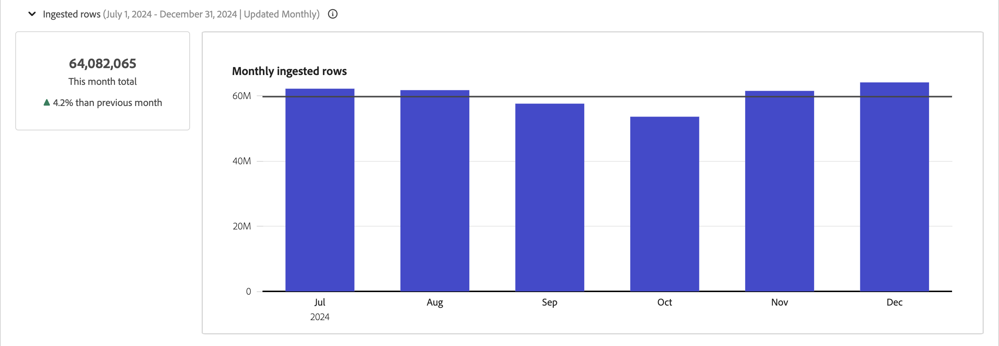

# Manage connections {#manage-connections}

>[!CONTEXTUALHELP]
>id="connections_use_ajo"
>title="Use Journey Optimizer connection"
>abstract="Leverages the advanced Customer Journey Analytics reporting capabilities with Journey Optimizer."

>[!CONTEXTUALHELP]
>id="connections_cancel_ajo"
>title="Cancel Journey Optimizer connection"
>abstract="Cancels the advanced Customer Journey Analytics reporting capabilities with Journey Optimizer."

Once you have [created or edited one or more connections](/help/connections/create-connection.md), you can manage them in **[!UICONTROL Connections]**. The [!UICONTROL Connections] interface let you:

* View all your connections at a glance, including the owner, the sandbox, and when the connections were created and modified.
* Edit a connection.
* Delete a connection.
* Create a data view from a connection.
* View all datasets in a connection.
* Check the status of your connection's datasets and the status of the ingestion process. For example, when is your data available so that you can start with reporting and analysis in Analysis Workspace.
* Identify any data discrepancies due to misconfiguration. Are you missing any rows? If so, what rows are missing and why? Did you misconfigure connections and cause missing data in Customer Journey Analytics?
* Get insights on the usage of ingested and reportable rows across all your connections.

[!UICONTROL Connections] has two interfaces: [[!UICONTROL List]](#list) and [[!UICONTROL Usage]](#usage).

## List

The **[!UICONTROL List]** interface is the default interface for Connections. If not selected, select the **[!UICONTROL List]** tab to access the interface.

The **[!UICONTROL List]** interface shows a table of all connections available. 

The following columns or icons are available in the table.

| Column or Icon | Description |
| --- | --- |
| **[!UICONTROL _Name_]** | The connection's friendly name. Select the hyperlinked name to see the [details of the connection](#connection-details). |
|  | To view information about [!UICONTROL Datasets included], [!UICONTROL Sandbox], [!UICONTROL Owner], and more, select  next to the connection name.
A popup window displays details about the dataset. 
 |
|  | To [create a data view](#create-a-data-view) for the connection, select . This icon only shows when no data view is already associated with the connection. |
|  | Select  to open a context menu. You can select: 
 **[!UICONTROL Edit]** to [edit](#edit-a-connection) a connection.
 **[!UICONTROL Delete]** to [delete](#delete-a-connection) a connection.
 **[!UICONTROL Create new data view]** to [create a new data view](#create-a-data-view) for the connection.
 **[!UICONTROL Connection map]** to view a [connection map](#map-a-connection) for the connection. |
| [!BADGE B2B Edition]{type=Informative url="https://experienceleague.adobe.com/en/docs/analytics-platform/using/cja-overview/cja-b2b/cja-b2b-edition" newtab=true tooltip="Customer Journey Analytics B2B Edition"} **[!UICONTROL Connection type]** | The type of connection: **[!UICONTROL Person]**-based or **[!UICONTROL Account]**-based connection. |
| **[!UICONTROL Datasets]** | One or more links to the datasets that are part of the connection. You can select the dataset hyperlink to view the dataset in the connection. If more datasets are part of the selected connection, select **[!UICONTROL +*x* more]** to show a **[!UICONTROL Datasets included]** panel. This panel shows links to all datasets and an option to  search for specific datasets that is part of the connection.

Select a dataset name to open the dataset in the Experience Platform interface in a new tab. |
| **[!UICONTROL Sandbox]** | The [Experience Platform sandbox](https://experienceleague.adobe.com/en/docs/experience-platform/sandbox/home) from which this connection draws its datasets. You select this sandbox when you created the connection. You cannot change the sandbox once a connection is saved.|
| **[!UICONTROL Owner]** | The person who created the connection. |
| **[!UICONTROL Import new data]** | The status of importing new data for datasets: 
&nbsp;&nbsp;&nbsp;**[!UICONTROL _x_ On]** for datasets configured to import new data, and
&nbsp;&nbsp;&nbsp;**[!UICONTROL _x Off_]** for datasets not configured to import new data. |
| **[!UICONTROL Date created]** | The timestamp when the connection was created. |
| **[!UICONTROL Last modified]** | The timestamp when the connection is last updated. |
| **[!UICONTROL Backfill data]** | The status for backfill data across datasets.
&nbsp;&nbsp;&nbsp;**[!UICONTROL _x_ backfills failed]** for number of failed backfills across datasets,
&nbsp;&nbsp;&nbsp;**[!UICONTROL _x_ backfills processing]** for number of processing backfills across datasets,
&nbsp;&nbsp;&nbsp;**[!UICONTROL _x_ backfills completed]** for number of completed backfills for datasets, and
&nbsp;&nbsp;&nbsp;**[!UICONTROL _Off_]** in case no backfills are defined for the datasets in the connection. |
| **[!UICONTROL Integrations]** | Shows any Experience Platform applications that are enabled with the connection.  |
| **[!UICONTROL Use in CJA]** | Shows whether the connection has been enabled for use with Customer Journey Analytics. |

To configure which columns to display in the table, select . In the **[!UICONTROL Customize table]** dialog, select the columns to show. Then select **[!UICONTROL Apply]**.

### Search connections

You can quickly search connections using the  box.

### Filter connections

To apply a filter to the list of connections, select . Then select from the following filter options:

| Filter option | Description |
|---------|----------|
| **[!UICONTROL Datasets]** | Only connections that are associated with the datasets you select are displayed. |
| **[!UICONTROL Owner]** | Only connections owned by the people you select are displayed. |
| **[!UICONTROL Sandbox]** | Only connections available in the sandboxes you select are displayed. |
| **[!UICONTROL Connection Type]** | Filter on **[!UICONTROL person]**-based or **[!UICONTROL account]**-based [!BADGE B2B Edition]{type=Informative url="https://experienceleague.adobe.com/en/docs/analytics-platform/using/cja-overview/cja-b2b/cja-b2b-edition" newtab=true tooltip="Customer Journey Analytics B2B Edition"} connections. |
| **[!UICONTROL Use in CJA]** | Select **[!UICONTROL On]** to show only connections that are enabled for use with Customer Journey Analytics. Select **[!UICONTROL Off]** to show only connections that are not yet enabled for use with Customer Journey Analytics. |
| **[!UICONTROL Integrations]** | Only connections with selected integrations are displayed. |

Select  **[!UICONTROL Hide filters]** to hide the filter pane.

### Edit a connection

To edit a connection: 

1. Select  next to the connection name
1. Select  **[!UICONTROL Edit]** from the context menu.

Alternatively, you can:

1. Select the connection row.

1. Select  **[!UICONTROL Edit]** from the blue action bar.

See [Create or edit a connection](create-connection.md) for more information.

### Delete a connection {#connections-delete}

To delete a connection:

1. Select  next to the connection name.
1. Select  **[!UICONTROL Delete]**.

Alternatively, you can:

1. Select the connection row.

1. Select  **[!UICONTROL Delete]** from the blue action bar.

When you delete a connection, a **[!UICONTROL Delete connection]** panel indicates which data views are deleted and which workspace projects are affected.

* In ➊ **[!UICONTROL Info]**, the implications of the deletion of the connection are shown.

  

  Select **[!UICONTROL Continue]** to confirm the deletion.

* In ➋ **[!UICONTROL Confirmation]**, enter the name of the connection in **[!UICONTROL Type connection name]**, and select **[!UICONTROL Delete]** to delete the connection. Select **[!UICONTROL Cancel]** to cancel.

See [Deletion implications](/help/technotes/deletion.md) for more information about deleting a connection.

### Create a data view for a connection

To create a data view for a connection:

1. Select  next to the connection name.
1. Select  **[!UICONTROL Create new data view]**.

Alternatively, you can:

1. Select the connection row.

1. Select  **[!UICONTROL Create data view]** from the blue action bar.

See [Create or edit a data view](/help/data-views/create-dataview.md) for more information.

### Journey Optimizer connections

You can use a Journey Optimizer connection in Customer Journey Analytics to bring the following additional value to your connection:

* Perform in-depth analysis of Journey Optimizer data within Customer Journey Analytics (by using the **[!UICONTROL Analyze in CJA]** button within Journey Optimizer).

  For more information, see [Analyze in Customer Journey Analytics](https://experienceleague.adobe.com/en/docs/journey-optimizer/using/reporting/channel-report/report-cja-manage#cja-template) in the Journey Optimizer documentation. 

* Edit the Journey Optimizer connection and associated data views.

  For more information about editing options, see [Edit a connection](#edit-a-connection).

>[!IMPORTANT]
>
>When you enable a Journey Optimizer connection for use with Customer Journey Analytics as described in this section, each Row of Data within the connection counts toward your licensed Rows of Data each month for Customer Journey Analytics and appears within the Connections Usage UI. Select the **[!UICONTROL Use in CJA]** option on the connection only if you are comfortable with the additional usage of Rows of Data in Customer Journey Analytics. 
>
>**If you were entitled to both Customer Journey Analytics and Journey Optimizer between October 2024 and October 2025, see the following document about [AJO-Enabled Connections](https://view.adobe.com/viewer/1ed94fc35c7860b260766c620889e7a0#1)**. 

To enable this functionality, your organization needs access to Customer Journey Analytics. If you don't have access, contact your Adobe sales representative. 

#### Use a Journey Optimizer connection {#use-connection-in-cja}

To use a Journey Optimizer connection in Customer Journey Analytics:

1. Locate the Journey Optimizer connection that you want to use with Customer Journey Analytics. 

   1. Select  **[!UICONTROL Filter]** in the **[!UICONTROL Connections]** tab.

   1. In the **[!UICONTROL Use in CJA]** section, select **[!UICONTROL Off]**.

      This displays all Journey Optimizer connections that are not currently configured for use in Customer Journey Analytics.

      

1. Select the name of the Journey Optimizer connection.

1. Select  **[!UICONTROL Use in CJA]**.

   

   The **[!UICONTROL Use this connection in Customer Journey Analytics]** dialog displays.

1. Enable the toggle, **[!UICONTROL Use connection in CJA]**.

1. Select **[!UICONTROL Use connection]**. <!-- double-check these dialog button names -->

#### Remove a Journey Optimizer connection {#remove-connection-in-cja}

You can remove a Journey Optimizer connection from Customer Journey Analytics at any time. However, removing the connection from Customer Journey Analytics after it is being used results in the following:

* The Journey Optimizer connection and any associated data views are reset to their default state and can no longer be edited 

* Any custom derived fields associated with the connection are deleted.

* You can no longer perform in-depth analysis of Journey Optimizer data within Customer Journey Analytics.

  This means that the **[!UICONTROL Analyze in CJA]** button in Journey Optimizer is disabled.

>[!IMPORTANT]
>
>Billing for the connection in Customer Journey Analytics includes the full month during which the connection is removed. 

To remove the connection from Customer Journey Analytics:

1. Locate the Journey Optimizer connection that you want to remove from Customer Journey Analytics. 

   1. Select  **[!UICONTROL Filter]** in the **[!UICONTROL Connections]** tab.

   1. In the **[!UICONTROL Use in CJA]** section, select **[!UICONTROL On]**.

      This displays all Journey Optimizer connections that are currently configured for use in Customer Journey Analytics.

      

1. To view the connection, select the name of the Journey Optimizer connection that you want to remove from Customer Journey Analytics. 

1. When viewing the Journey Optimizer connection, select **[!UICONTROL Remove from CJA]**.
   
   The **[!UICONTROL Remove this connection from Customer Journey Analytics]** dialog displays:

   

1. Disable the option, **[!UICONTROL Remove connection from CJA]**.

1. Select **[!UICONTROL Remove connection]**.

### Map a connection

To view a [connection map](/help/connections/create-connection.md#connection-map) that details the relationships between the datasets that are part of a connection:

1. Select  next to the connection name.
1. Select  **[!UICONTROL Connection map]**. 

### Connection details {#connection-detail}

To go to the details for a connection, select a hyperlinked connection name in the connections table.

The Connections details interface provides a detailed view of the status of a connection. You can:

* Check the status of your connection's datasets and of the ingestion process.
* Identify configuration problems that can cause skipped or deleted records.
* See when the data is available for reporting.

| User Interface | Description |
| --- | --- |
|  **[!UICONTROL Edit Connection]** | To edit the details of a connection, select  **[!UICONTROL Edit Connection]**. See [Create or edit a connection](create-connection.md) for more information. |
| **[!UICONTROL *Dataset selector*]** | Select one or all datasets to show details for in the connection. You cannot multi-select datasets. Defaults to **[!UICONTROL All datasets]**. |
| **[!UICONTROL *Date range selector*]** | Select a data range to show details for in the connection. Edit start date, end date, or select  to open the date range selector. In the date range selector, select a date range by using one of the predefined periods (for example **[!UICONTROL Last 6 months]**) or use the calendar to select start and end date. Select **[!UICONTROL Apply]** to apply the new date range to the connection details.|
| **[!UICONTROL Records of event data available]** | The total number of event dataset rows available for reporting, **for the entire connection**. This count is independent of any date range or dataset selection. |
| [!UICONTROL **[!UICONTROL Metrics]**] | Summarize the event, lookup, profile and summary dataset records that are added, skipped, and deleted, and the number of batches added. These metrics are based on **the dataset and date range that you have selected**.
Select **[!UICONTROL Check detail]** to show the **[!UICONTROL Check skipped detail]** popup. The popup lists the number of skipped records and the reason for all event datasets or selected dataset.

Select  popup with more information. For some skipped reasons, like [!UICONTROL Empty visitor ID], the popup displays **[!UICONTROL Sample PSQL for EQS]** (Experience Platform for Query Service) you can use in [Query Service](https://experienceleague.adobe.com/en/docs/experience-platform/query/home) to query for the skipped records in the dataset. Select  **[!UICONTROL Copy sample PSQL for EQS]** to copy the SQL. |
| **[!UICONTROL Records added]** | A visualization to indicate how many rows were added in the selected time period, **for the dataset and date range you have selected**. Updates every 10 minutes. |
| **[!UICONTROL Records skipped]** | A visualization to indicate how many rows were skipped in the selected time period, **for the dataset and date range you have selected**. Reasons for skipping records include: missing timestamps, missing or invalid Person ID or Account ID [!BADGE B2B Edition]{type=Informative url="https://experienceleague.adobe.com/en/docs/analytics-platform/using/cja-overview/cja-b2b/cja-b2b-edition" newtab=true tooltip="Customer Journey Analytics B2B Edition"}, and so forth. Updates every 10 minutes. 
Invalid IDs (such as `undefined`, or `00000000`, or any combination of numbers and letters in a [!UICONTROL Person ID] that appear in an event more than 1 million times in a given month) are IDs that cannot be attributed to any specific user or person. These rows cannot be ingested into the system and result in error-prone ingestion and reporting. To fix invalid Person IDs or Account IDs [!BADGE B2B Edition]{type=Informative url="https://experienceleague.adobe.com/en/docs/analytics-platform/using/cja-overview/cja-b2b/cja-b2b-edition" newtab=true tooltip="Customer Journey Analytics B2B Edition"}, you have 3 options:<ul><li>Use [Stitching](/help/stitching/overview.md) to populate the undefined or all-zero user IDs with valid user IDs.</li><li>Blank out user IDs, which are then skipped during ingestion (preferable to invalid or all-zero user IDs).</li><li>Fix any invalid user IDs in your system before ingesting the data.</li></ul> |
| **[!UICONTROL Records deleted]** | A visualization to indicate how many rows were deleted in the selected time period, **for the dataset and date range you have selected**. Someone might have deleted a dataset in [!DNL Experience Platform], for example. Updates every 10 minutes.
In some scenarios, this value can also include records replaced, as with stitching or some lookup dataset updates. Consider this example:
<ul><li>You upload one record to an XDM Individual Profile dataset, which Customer Journey Analytics is configured to ingest as profile lookup data. In the connection details, this dataset would display 1 record added.</li><li>You upload a duplicate of the original record into the same AEP dataset, which now contains two records. Customer Journey Analytics ingests the additional record from the profile or account [!BADGE B2B Edition]{type=Informative url="https://experienceleague.adobe.com/en/docs/analytics-platform/using/cja-overview/cja-b2b/cja-b2b-edition" newtab=true tooltip="Customer Journey Analytics B2B Edition"} lookup dataset. Seeing that a profile or account record is already ingested in the connection for that Person ID or Account ID [!BADGE B2B Edition]{type=Informative url="https://experienceleague.adobe.com/en/docs/analytics-platform/using/cja-overview/cja-b2b/cja-b2b-edition" newtab=true tooltip="Customer Journey Analytics B2B Edition"}, Customer Journey Analytics deletes its earlier version and adds the new profile data. In the connection details, this action would represent 1 record added and 1 record deleted, because Customer Journey Analytics only retains the most recent profile lookup data for any ingested Person ID or Account ID [!BADGE B2B Edition]{type=Informative url="https://experienceleague.adobe.com/en/docs/analytics-platform/using/cja-overview/cja-b2b/cja-b2b-edition" newtab=true tooltip="Customer Journey Analytics B2B Edition"}.</li><li>In total, the AEP dataset contains two records that happen to be identical. Separately, the Customer Journey Analytics connection details display the status of its ingested data: 2 records added and 1 record deleted for this profile dataset. </li></ul> |
|  | Dataset search field. You can search the datasets table by dataset name or dataset ID. |
| [!UICONTROL Datasets table ] | The datasets that are part of the connection. See the table below for further explanation. Select  a single dataset to show only connection details for the selected dataset. This is equivalent to the selection of a dataset from the **[!UICONTROL _Dataset selector_]**. |

The datasets table displays the following columns for each dataset:

| Column| Description |
| --- | --- |
| **[!UICONTROL Datasets]** | The name of the dataset. You can select the hyperlink to open the dataset in the Experience Platform UI in a new tab. You can select the row or the checkbox to show details for the selected dataset only. |
| **[!UICONTROL Dataset ID]** | The dataset id, generated by Experience Platform. |
| **[!UICONTROL Records added]** | The number of dataset records (rows) added to a connection during the selected date range. |
| **[!UICONTROL Records skipped]** | The number of dataset records (rows) skipped during data transfer for a connection during the selected date range. |
| **[!UICONTROL Records deleted]** | The number of dataset records (rows) removed from a connection during the selected date range. |
| **[!UICONTROL Batches added]** | The number of batches that have been added to a connection during the selected date range. |
| **[!UICONTROL Last added]** | The timestamp of the latest batch that has been added to a connection.  |
| **[!UICONTROL Data source type]** | The source type. You define the source type when you add a dataset to a connection. |
| **[!UICONTROL Dataset type]** | The [dataset type](create-connection.md#dataset-types). Type can be **[!UICONTROL Event]**, **[!UICONTROL Profile]**, **[!UICONTROL Lookup]**, **[!UICONTROL Summary]**. An adhoc or relational dataset is identifed by **[!UICONTROL (Adhoc)]** or **[!UICONTROL (Relational)]**. For example, **[!UICONTROL Event (Adhoc)]** or **[!UICONTROL Lookup (Relational)]**.  |
| **[!UICONTROL Stitched]** | If a dataset is [enabled for stitching in the Connection UI](/help/stitching/use-stitching-ui.md), the value is **[!UICONTROL true]**. Otherwise the value is **[!UICONTROL false]**. Stitched datasets that are the result of the [request to stitch procedure](/help/stitching//use-stitching.md) are not identified as stitched in this table, and by default have a value of **[!UICONTROL false]**. |
| **[!UICONTROL Schema]** | The Experience Platform schema that the dataset is based on.  |
| **[!UICONTROL Import new data]** | The status of importing new data for the dataset: 
&nbsp;&nbsp;&nbsp;**[!UICONTROL _x_ On]** if dataset is configured to import new data, and
&nbsp;&nbsp;&nbsp;**[!UICONTROL _x Off_]** if dataset is configured not to import new data import. |
| **[!UICONTROL Transform data]** | The transformation status of applicable B2B lookup datasets. See [Transform datasets for B2B lookups](transform-datasets-b2b-lookups.md) for more information.
&nbsp;&nbsp;&nbsp;**[!UICONTROL _x_ On]** for applicable datasets enabled for transformation, 
&nbsp;&nbsp;&nbsp;**[!UICONTROL _x Off_]** for applicable datasets not enabled for transformation, and
**[!UICONTROL N/A]** for all other datasets, not applicable for transformation.|
| **[!UICONTROL Backfill data]** | The status of backfill data for the dataset.
&nbsp;&nbsp;&nbsp;**[!UICONTROL _x_ backfills failed]** for number of failed backfills,
&nbsp;&nbsp;&nbsp;**[!UICONTROL _x_ backfills processing]** for number of processing backfills,
&nbsp;&nbsp;&nbsp;**[!UICONTROL _x_ backfills completed]** for number of backfills completed, and
&nbsp;&nbsp;&nbsp;**[!UICONTROL _Off_]** in case backfills are not configured. |

>[!IMPORTANT]
>
>Any data ingested before August 13, 2021 is not reflected in the [!UICONTROL Connections] interface.
>

#### Connection panel

When no individual dataset is selected in the datasets table, the right panel shows connection options and details.

| Options | Description |
| --- | --- |
|  **[!UICONTROL Refresh]** | To refresh the connection and allow recently added records to be reflected, select  **[!UICONTROL Refresh]**.  |
|  **[!UICONTROL Delete]** | [Delete](#delete-a-connection) this connection.  |
|  **[!UICONTROL Create data view]** | [Create a data view](#create-a-data-view) based on this connection. See [Data views](https://experienceleague.adobe.com/en/docs/analytics-platform/using/cja-dataviews/data-views) for more information.|
| **[!UICONTROL Use in CJA]** | Use a Journey Optimizer connection in Customer Journey Analytics to bring additional value to your Journey Optimizer connection. For more information, see [Use a Journey Optimizer connection in Customer Journey Analytics](#use-a-journey-optimizer-connection-in-customer-journey-analytics).|
| **[!UICONTROL Connection name]** | The friendly name of the connection. |
| **[!UICONTROL Connection description]** | A more detailed description that describes the purpose of this connection. |
| **[!UICONTROL Sandbox]** | The [Experience Platform sandbox](https://experienceleague.adobe.com/en/docs/experience-platform/sandbox/home) from which this connection draws its datasets. You select this sandbox when you created the connection. You cannot change the sandbox once a connection is saved. |
| **[!UICONTROL Connection ID]** | A generated identifier for the connection. You can use  to copy the value.  |
| [!BADGE B2B Edition]{type=Informative url="https://experienceleague.adobe.com/en/docs/analytics-platform/using/cja-overview/cja-b2b/cja-b2b-edition" newtab=true tooltip="Customer Journey Analytics B2B Edition"} **[!UICONTROL Primary ID type]** | The primary ID type for the connection: **[!UICONTROL Person]** for a person-based connection, **[!UICONTROL Account]** for an account-based connection. |
| [!BADGE B2B Edition]{type=Informative url="https://experienceleague.adobe.com/en/docs/analytics-platform/using/cja-overview/cja-b2b/cja-b2b-edition" newtab=true tooltip="Customer Journey Analytics B2B Edition"} **[!UICONTROL Containers]**  | The configured containers for the connection. |
| **[!UICONTROL Data views using connection]** | The data views that use this connection. |
| **[!UICONTROL Import new data]** | The status of importing new data for datasets: 
&nbsp;&nbsp;&nbsp;**[!UICONTROL _x_ On]** for how many datasets are configured to import new data, and
&nbsp;&nbsp;&nbsp;**[!UICONTROL _x Off_]** for how many datasets new data import is turned off. |
| **[!UICONTROL Backfill data]** | The status of backfill data for datasets.
&nbsp;&nbsp;&nbsp;**[!UICONTROL _x_ backfills failed]** for number of failed backfills across datasets,
&nbsp;&nbsp;&nbsp;**[!UICONTROL _x_ backfills processing]** for number of processing backfills across datasets,
&nbsp;&nbsp;&nbsp;**[!UICONTROL _x_ backfills completed]** for number of completed backfills for datasets, and
&nbsp;&nbsp;&nbsp;**[!UICONTROL _Off_]** in case no backfills are defined for the datasets in the connection. |
| **[!UICONTROL Transform data]** | The transformation status of applicable B2B lookup datasets. See [Transform datasets for B2B lookups](transform-datasets-b2b-lookups.md) for more information.
&nbsp;&nbsp;&nbsp;**[!UICONTROL _x_ On]** for number of datasets enabled for transformation.|
| **[!UICONTROL Created by]** | The name of the person who created the connection. |
| **[!UICONTROL Last modified]** | The timestamp of the last change to the connection. |
| **[!UICONTROL Last modified by]** | The name of the person who last modified the connection. |

#### Dataset panel

When a dataset row is selected in the datasets table, a panel on the right side of the Connections interface show details for the selected dataset.

| Details | Description |
| --- | --- |
|[!BADGE B2B Edition]{type=Informative url="https://experienceleague.adobe.com/en/docs/analytics-platform/using/cja-overview/cja-b2b/cja-b2b-edition" newtab=true tooltip="Customer Journey Analytics B2B Edition"} **[!UICONTROL Global Account ID]** | The identity you have specified as the Global Account ID for the connection. Only applicable for an account-based connection for which a Global Account container is configured.  |
| [!BADGE B2B Edition]{type=Informative url="https://experienceleague.adobe.com/en/docs/analytics-platform/using/cja-overview/cja-b2b/cja-b2b-edition" newtab=true tooltip="Customer Journey Analytics B2B Edition"} **[!UICONTROL Account ID]** | The identity you have specified as the Account ID for the connection. Only applicable for an account-based connection for which no Global Account container is configured. |
| **[!UICONTROL Person ID]** | The identity you have specified as the Person ID for the connection. |
| **[!UICONTROL Key]** | The key that you have specified for a lookup dataset. |
| **[!UICONTROL Matching Key]** | The matching key that you have specified for a lookup dataset. |
| **[!UICONTROL Timestamp]** | The timestamp defined for an event dataset. |
| **[!UICONTROL Records available]** | The total number of rows ingested for this dataset, for the particular time period selected through the calendar. There is no latency in terms of getting the data to appear in reporting, once it is added. However, when you create a brand new connection, there is [latency](https://experienceleague.adobe.com/en/docs/analytics-platform/using/cja-overview/cja-b2c-overview/cja-faq). |
| **[!UICONTROL Records added]** | The number of dataset records (rows) added to a connection during the selected date range. |
| **[!UICONTROL Records skipped]** | The number of dataset records (rows) skipped during data transfer for a connection during the selected date range. |
| **[!UICONTROL Batches added]** | The number of batches that have been added to a connection. |
| **[!UICONTROL Records deleted]** | The number of dataset records (rows) removed from a connection during the selected date range. |
| **[!UICONTROL Last added]** | The timestamp of the latest batch that has been added to a connection.  |
| **[!UICONTROL Import new data]** | The status of importing new data for the dataset: 
&nbsp;&nbsp;&nbsp;**[!UICONTROL _x_ On]** if the dataset is configured to import new data, and
&nbsp;&nbsp;&nbsp;**[!UICONTROL _x Off_]** if the dataset is configured not to import new data.  |
| **[!UICONTROL Backfill data]** | The status of backfill data for the dataset.
&nbsp;&nbsp;&nbsp;**[!UICONTROL _x_ backfills failed]** for number of failed backfills,
&nbsp;&nbsp;&nbsp;**[!UICONTROL _x_ backfills processing]** for number of processing backfills,
&nbsp;&nbsp;&nbsp;**[!UICONTROL _x_ backfills completed]** for number of backfills completed, and
&nbsp;&nbsp;&nbsp;**[!UICONTROL _Off_]** in case no backfills are configured.
To show a dialog with an overview of the past backfills for the dataset, select  **[!UICONTROL Past backfills]**. |
| **[!UICONTROL Data source type]** | Data source type as defined when the dataset was added to the connection. |
| **[!UICONTROL Dataset type]** | The [dataset type](create-connection.md#dataset-types). Type can be **[!UICONTROL Event]**, **[!UICONTROL Profile]**, **[!UICONTROL Lookup]**, **[!UICONTROL Summary]**. An adhoc or relational dataset is identifed by **[!UICONTROL (Adhoc)]** or **[!UICONTROL (Relational)]**. For example, **[!UICONTROL Event (Adhoc)]** or **[!UICONTROL Lookup (Relational)]**. |
| **[!UICONTROL Schema]** | The Experience Platform schema that this dataset is based on. |
| **[!UICONTROL Dataset ID]** | The dataset ID, as generated in Experience Platform. |

## Usage {#connections-usage}

>[!CONTEXTUALHELP]
>id="connections_usage_keyusagemetrics"
>title="Key usage metrics" 
>abstract="Provide monthly and total data for core and historical reportable rows."

>[!CONTEXTUALHELP]
>id="connections_usage_monthlyingestedrows"
>title="Monthly ingested rows"
>abstract="Measures the total number of records added to the system each month to provide insights into data growth and ingestion rates."

>[!CONTEXTUALHELP]
>id="connections_usage_monthlyreportablerows"
>title="Monthly reportable rows"
>abstract="Tracks the number of rows available for reporting. Reportable rows are the ingested rows minus the rows that are skipped and deleted during ingestion. Reportable rows serve as a key metric for billing and data usage."

>[!CONTEXTUALHELP]
>id="connections_usage_detailbreakdown"
>title="Detail breakdown."
>abstract="You can view detailed metrics by connection, dataset, sandbox, and tags, with the option to download a CSV file of the data."

>[!CONTEXTUALHELP]
>id="connections_usage_otherdatasets"
>title="Other datasets"
>abstract="For the months before September 2024, data was collected at the dataset level and is displayed as *Other datasets* for clarity. Starting from September 2024, data is gathered at a granular dataset level, and *Other datasets* no longer appears."

>[!CONTEXTUALHELP]
>id="connections_usage_unknowndatasetsorconnections"
>title="Unknown datasets or connections"
>abstract="Unknown datasets or connections are displayed using their IDs."

>[!CONTEXTUALHELP]
>id="connections_usage_datanotavailable"
>title="Data not available"
>abstract="Historical data prior to September 2024 is not available due to system limitations. Metrics are collected and displayed starting from September 2024 onwards. The chart shows the last 18 months on the timeline, and future data appear as the data becomes available."

>[!CONTEXTUALHELP]
>id="connections_corereportablerows"
>title="Core reportable rows"
>abstract="The total number of rows available over the past 13 months for the current month, with a percentage change compared to the previous month.  For example, on February 1, 2024, the number shows the total rows available with an event timestamp from January 2023 to January 2024."

>[!CONTEXTUALHELP]
>id="connections_historicalreportablerows"
>title="Historical reportable rows"
>abstract="The total number of rows available over a period older than 13 months for the current month, with a percentage change compared to the previous month. For example, on February 1, 2024, the number shows the total rows available with an event timestamp older than January 2023."

>[!CONTEXTUALHELP]
>id="connections_averagerowsize"
>title="Average row size"
>abstract="The average amount of storage consumed by each row of data ingested and stored for the current month (in kB), with a percentage change compared to the previous month."

>[!CONTEXTUALHELP]
>id="connections_coredatavolume"
>title="Core data volume"
>abstract="The total amount of data stored on disk that is timestamped for the current month (in TB), with a percentage change compared to the previous month."

>[!CONTEXTUALHELP]
>id="connections_breakdown_corereportablerows"
>title="Core reportable rows"
>abstract="Core reportable rows are snapshot values, not aggregated totals. These values update dynamically based on the last month in the selected date range. If a customer selects January - March, the values reflect the snapshot from March."

>[!CONTEXTUALHELP]
>id="connections_breakdown_historicalreportablerows"
>title="Historical reportable rows"
>abstract="Historical reportable rows are snapshot values, not aggregated totals. These values update dynamically based on the last month in the selected date range. If a customer selects January - March, the values reflect the snapshot from March."

>[!CONTEXTUALHELP]
>id="connections_breakdown_cumulativereportablerows"
>title="Cumulative reportable rows"
>abstract="Cumulative reportable rows are snapshot values, not aggregated totals. These values update dynamically based on the last month in the selected date range. If a customer selects January - March, the values reflect the snapshot from March."

The [!UICONTROL Usage] interface shows the usage of ingested and reportable rows across all connections. If not selected, select the **[!UICONTROL Usage]** tab to access the interface.

This interface supports you to determine whether your Customer Journey Analytics usage complies with what is contractually agreed upon. In addition to monitoring purposes, you can use the Usage interface to plan your Customer Journey Analytics license renewal.

The Usage interface uses the following metrics:

| Metric name | Description |
|---|---|
| **Historical reportable rows** | Count of rows for the period older than 13 months. |
| **Core reportable rows** | Count of rows over the last 13 months. |
| **Core data volume** | Total amount of data stored on disk. |
| **Average row size** | Average amount of storage consumed for each row of data ingested and stored. |
| **Ingested rows** | How many rows are ingested for the specific period. |
| **Reportable rows** | How many rows of data do you have as part of the connection for the specific period. |
| **Cumulative rows** | How many rows are ingested up until the specific month. |

>[!NOTE]
>
>Data is collected, starting from July 2024 for the core, historical, and total records. Reach out to your account manager for earlier historical data.
>

The Usage interface consists of two panels:

* The **[!UICONTROL Key usage metrics]** panel that displays:
  
  * Four summary visualizations that display total and percentual changes from the previous month for:

    * **[!UICONTROL Core data reportable rows]**. The total number of rows available over the past 13 months for the current month, with a percentage change compared to the previous month. For example, on February 1, 2024, the number shows the total rows available with an event timestamp from January 2023 to January 2024.
    * **[!UICONTROL Historical data reportable rows]**. The total number of rows available over a period older than 13 months for the current month, with a percentage change compared to the previous month. For example, on February 1, 2024, the number shows the total rows available with an event timestamp older than January 2023.
    * **[!UICONTROL Core data volume]**. The total amount of data stored on disk that is timestamped for the current month (in TB), with a percentage change compared to the previous month.
    * **[!UICONTROL Average row size]**. The average amount of storage consumed by each row of data ingested and stored for the current month (in kB), with a percentage change compared to the previous month.
  
  * A stacked vertical bar visualization that displays the **[!UICONTROL Core and Historical data reportable rows]** for the last 13 months. 
  
    When you hover over any stacked bar in the visualization, a popup shows the number of rows for that specific part of the bar. In the example below, the core data reportable rows are shown for the current month (August 2025: 936M (936,347,325)).

    

* A combined panel, showing three subpanels for:

  +++ Ingested rows

  The **[!UICONTROL Ingested rows]** subpanel measures the total number of records added to the system each month, providing insight into data growth and ingestion rates. The subpanel provides a summary of this month's total ingested rows and the change from the previous month.

  

  You can hover over data points in the visualization to display a popup with more details.

  +++

  +++ Reportable rows

  The **[!UICONTROL Reportable rows]** visualization tracks the number of rows available for reporting by subtracting skipped and deleted rows from ingested rows, serving as a key metric for billing and data usage. The subpanel provides two summaries:
  
  * **[!UICONTROL Last month total]**: A summary of total reportable rows up until this month.
  * **[!UICONTROL This month]**: A summary of this month's total reportable rows and the change from the previous month.

  

  You can hover over data points in the visualizations to display a popup with more details.

  +++

  +++ Detail breakdown

  You can use the **[!UICONTROL Detail breakdown]** table to view detailed metrics by connection, dataset, sandbox, and tags. Datasets are reported using ids instead of names, as dataset names can be modified during a reporting period. Unknown datasets or connections are reported using ids.

  For the months before September 2024, data was collected at the dataset level and is displayed as [!UICONTROL Other datasets] for clarity. Starting from September 2024, data is gathered at a granular dataset level, and [!UICONTROL Other datasets] do no longer appear.

  * To change the breakdown, select a combination for **[!UICONTROL View by]** and **[!UICONTROL Breakdown by]**.

    | **[!UICONTROL View by]** options | **[!UICONTROL Breakdown by]** options |
    |---|---|
    | **[!UICONTROL Connection]** | **[!UICONTROL -]** and **[!UICONTROL Dataset]** |
    | **[!UICONTROL Dataset]** | **[!UICONTROL -]** |
    | **[!UICONTROL Sandbox]** | **[!UICONTROL Connection]** |
    | **[!UICONTROL Tag]** | **[!UICONTROL Connection]** |

  

  +++

  You can define a **[!UICONTROL Time range]** in months to report on. Use  to select the time range. 

>[!MORELIKETHIS]
>
>[View, troubleshoot, and modify connection settings](https://experienceleague.adobe.com/en/docs/customer-journey-analytics-learn/tutorials/connections/connections-details-experience-in-cja) tutorial.
>[Manage your Customer Journey Analytics usage](/help/technotes/estimate-usage.md)
>
