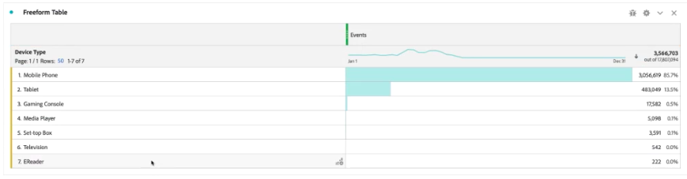

# Add standard lookups to your datasets

>[!IMPORTANT]
>
>Standard Lookups are only available for Analytics source connector data sources in Customer Journey Analytics. You can use them with standard Adobe Analytics implementations, or the [Adobe Experience Platform Web SDK](https://experienceleague.adobe.com/docs/experience-platform/edge/home.html), or the Experience Platform data collection APIs.
>

Standard lookups (also known as Adobe-supplied lookups) enhance the ability of Customer Journey Analytics to report on some dimensions/attributes that are not useful by themselves but are useful when joined with other data. Examples include attributes of mobile devices, and attributes of OS and Browser dimensions, such as browser version numbers. A 'Standard Lookup' is similar to a lookup dataset. Standard lookups are applicable across Experience Cloud organizations. They are automatically applied to all event datasets that contain certain XDM schema fields (see below for the specific fields.) A standard lookup dataset exists for each schema location that Adobe is classifying.

In traditional Adobe Analytics, these dimensions show up on their own, whereas in Customer Journey Analytics, you have to actively include these dimensions when you create data views. In the Connections workflow, you select a dataset that is flagged as one with a key for standard lookup. The Data Views UI automatically knows to include all the standard lookup dimensions as available for reporting. The lookup files are automatically kept up to date and available, across all regions and for all accounts. They are stored in region-specific organizations associated with the customer.

## Use standard lookups with Analytics source connector datasets

Standard lookup datasets automatically get applied at report time. If you use the Analytics source connector and you bring in a dimension for which Adobe provides a standard lookup, we automatically apply this standard lookup. If an event dataset contains XDM fields, we can apply standard lookups to it.

<!--
### Specific IDs that need to be populated

The following IDs need to be populated in the specific XDM mixins for this functionality to work:

* Environment Details Mixin – device/typeID value populated - Must match Device Atlas IDs and will populate device data.
* Adobe Analytics ExperienceEvent Template Mixin or Adobe Analytics ExperienceEvent Full Extension Mixin with analytics/environment/browserIDStr and analytics/environment/operatingSystemIDStr. Both must match the Adobe IDs and  populate browser and OS data, respectively.

You need these mixins with the three IDs populated (device/typeID, environment/browserIDStr, and environment/operatingSystemIDStr). The lookup dimensions will then be pulled automatically by Customer Journey Analytics and will be available in the Data View.

The catch here is that they can only populate those IDs today if they have a direct relationship with Device Atlas. They are Device Atlas IDs, and they provide an API to allow a customer to look them up. This is a significant hurdle, and we may just want to take the reference to this capability out of the product documentation until we have a productized way to expose the Device Atlas ID lookup functionality.
-->

### Available standard lookup fields

* `browser`
   * `browser`, `group_id`, `id`
* `browser_group`
   * `browser_group`, `id`
* `os`
   * `os`, `group_id`, `id`
* `os_group`
   * `os_group`, `id`
* `mobile_audio_support - multi`
* `mobile_color_depth`
* `mobile_cookie_support`
* `mobile_device_name`
* `mobile_device_number_transmit`
* `mobile_device_type`
* `mobile_drm - multi`
* `mobile_image_support - multi`
* `mobile_information_services`
* `mobile_java_vm - multi`
* `mobile_mail_decoration`
* `mobile_manufacturer`
* `mobile_max_bookmark_url_length`
* `mobile_max_browser_url_length`
* `mobile_max_mail_url_length`
* `mobile_net_protocols - multi`
* `mobile_os`
* `mobile_push_to_talk`
* `mobile_screen_height`
* `mobile_screen_size`
* `mobile_screen_width`
* `mobile_video_support - multi`

## Report on standard lookup dimensions

In order to report on Adobe standard lookup dimensions, you have to add one or more of these dimensions when you create a [data view](/help/data-views/data-views.md) in Customer Journey Analytics. In **[!UICONTROL Data view]** > **[!UICONTROL Components]**:

1. Select **[!UICONTROL Schema fields]** from the drop-down menu in the left rail.
1. Select **[!UICONTROL Adobe lookups]** from the list of schema fields containers.
1. Drill down into **[!UICONTROL Browser]**, **[!UICONTROL Mobile]**, or **[!UICONTROL Operating System]** until you find the dimension you want to add.
1. Drag the dimension into the **[!UICONTROL Metrics]** or **[!UICONTROL Dimensions]** table within **[!UICONTROL Included components]**.

   

You can then use the lookup data in Workspace:

