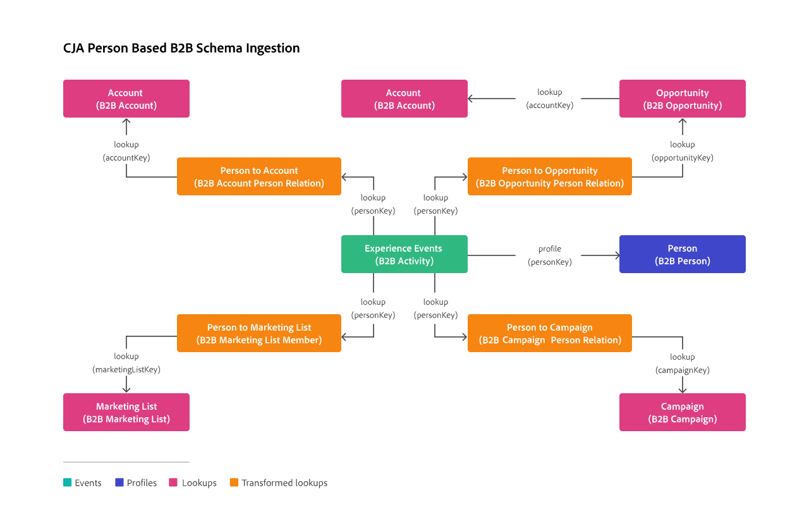

# Transform datasets for B2B lookups

To support person-based lookups on B2B data (including accounts, opportunities, marketing lists and campaigns), transformation of B2B lookup datasets can improve data accuracy.

This transformation is only available for datasets with data for B2B lookup schemas, based on the following classes:

* [XDM Business Account Person Relation](https://experienceleague.adobe.com/en/docs/experience-platform/xdm/classes/b2b/business-account-person-relation)
* [XDM Business Opportunity Person Relation](https://experienceleague.adobe.com/en/docs/experience-platform/xdm/classes/b2b/business-opportunity-person-relation)
* [XDM Business Marketing List Members](https://experienceleague.adobe.com/en/docs/experience-platform/xdm/classes/b2b/business-marketing-list-members)
* [XDM Business Campaign Members](https://experienceleague.adobe.com/en/docs/experience-platform/xdm/classes/b2b/business-campaign-members)

>[!NOTE]
>
>There is a limit of no more than 10,000 items for each id. This limitation implies that for any given person id you can only have 10,000 accounts, or 10,000 opportunities, or 10,000 marketing lists, or 10,000 campaigns.

>[!PREREQUISITES]
>
>For ingestion to work properly, you must validate that the B2B lookup datasets have data populated for the following fields (as defined in the B2B lookup schemas):
>
>| Dataset containing data conforming to schema | Field populated with data |
>|---|---|
>| XDM Business Account Person Relation | `accountPersonID` |
>| XDM Business Opportunity Person | `opportunityPersonID` |
>| XDM Business Marketing List | `marketingListMemberID` |
>| XDM Business Campaign Members | `campaign.sourceKey` |
>

To enable transformation for a B2B lookup dataset:

* Verify for each dataset the suggested values for **[!UICONTROL Key]** and **[!UICONTROL Matching key]**. If you change the values from the suggested values, you will see a warning asking you to continue. You must be sure that:

  * The value you select for **Key** is based on the Person ID data type.
  * The value you select for **Matching Key** is defined as the primary identity field for the event dataset.

* Select the options for importing new data and dataset backfill. 

* Select **[!UICONTROL Transform dataset for B2B lookups]**.

  This option transforms the dataset so it can be used for person-based lookups in B2B scenarios. 
  
  
  >[!IMPORTANT]
  >
  >Once turned on, and when the connection is saved, the transformation is irreversible. You cannot modify the Key, Matching key and Transform dataset configuration. You can only remove, add and then reconfigure the dataset. 

To enable transformation for one or more datasets that are already part of an existing connection:

1. Remove the datasets from the connection.
1. Save the connection.
1. Add the datasets to the connection while turning on transformation for the datasets.

## Background information

Non-transformed datasets, for schemas based on the four schema classes mentioned above, can contain multiple rows for a single person identifier. Person-based lookups only match the most recent occurrence of that person identifier, preventing a proper person id based lookup of accounts, opportunities, marketing lists or campaigns.

The transformation modifies the dataset of each of the four schema classes (orange in the illustration below) so that for each person identifier an (object) array is created for the relevant data (accounts, opportunities, marketing lists or campaigns) in the lookup datasets (pink in the illustration below). This transformation allows for a correct working of person id based lookups.

