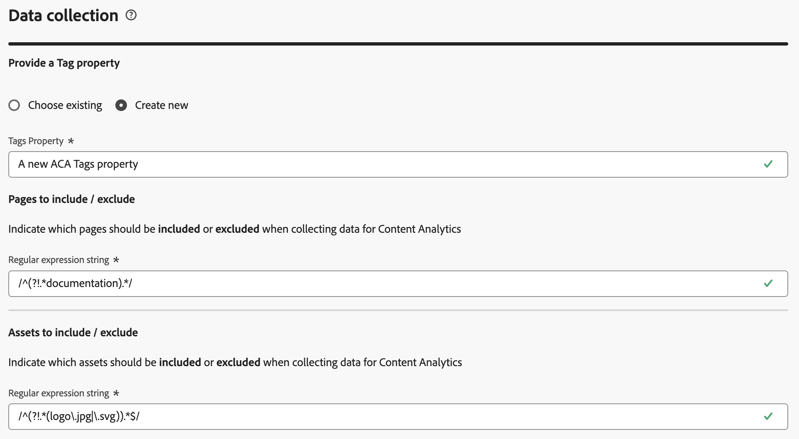
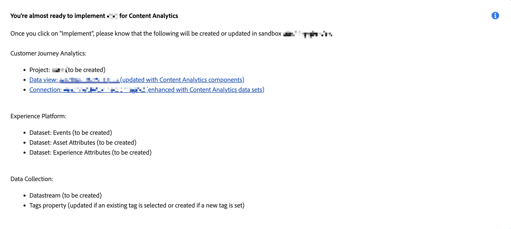

# Content Analytics guided configuration

The guided configuration helps you to configure Content Analytics quickly and easily. The guided configuration uses a wizard to set up the requirements to configure Content Analytics automatically for your organization. In the **[!UICONTROL Configuration]** screen, you can either create a new configuration or edit an existing configuration. 

>[!IMPORTANT]
>
>You can only have one Content Analytics configuration per sandbox in your organization.

To access the Content Analytics configuration

* Select **[!UICONTROL Data Management]** > **[!UICONTROL Content Analytics Configuration]** from the main menu in Customer Journey Analytics.

In the **[!UICONTROL Content Analytics Configurations]** screen, you see a table of existing Content Analytics configurations. 

For each configuration, the following details are available:

| Column | Description |
|---|---|
| **[!UICONTROL Name]** | The name of the configuration. |
| **[!UICONTROL Created by]** | The technical account that created the configuration. |
| **[!UICONTROL Created on]** | The timestamp when the configuration was created. |
| **[!UICONTROL Modified on]** | The timestamp when the configuration was last modified. |
| **[!UICONTROL Sandbox]** | The sandbox within the organization in which Content Analytics is (planned to be) configured and implemented. |
| **[!UICONTROL Status]** | The status of the configuration. The status can be:  **[!UICONTROL Draft]**: The configuration is saved for later, and not deployed.  **[!UICONTROL Failed]**: The configuration has failed. You can select **[!UICONTROL Edit]** to get information about the failure. Adobe proactively addresses any failed implementation. You can reach out to Customer Care for details.  **[!UICONTROL Complete]**: the configuration has been completed and implemented successfully. |

You can use  to customize the table. Select which columns to display in the **[!UICONTROL Customize table]** dialog and select **[!UICONTROL Apply]** to apply the changes.

From the Content Analytics **[!UICONTROL Configuration]** screen, you can create a new configuration or edit an existing configuration. 

To create a new configuration:

* Select **[!UICONTROL Create configuration]**. This action opens the [guided configuration wizard](#guided-configuration-wizard).

To edit an existing configuration:

* Select  and then  **[!UICONTROL Edit]** for an existing Content Analytics configuration. This action opens the [guided configuration wizard](#guided-configuration-wizard).

## Guided configuration wizard

The guided configuration wizard consists of four sections ([Details](#details), [Data view](#data-view), [Experience capture & definition](#experience-capture-and-definition), and [Data collection](#data-collection)), each prompting you for details that are required to set up and configure Content Analytics properly. Complete each section before moving to the next section, as some settings in a section might depend on configuration values in earlier sections.

### Details {#onboarding-details}

<!-- markdownlint-disable MD034 -->

>[!CONTEXTUALHELP]
>id="aca_onboarding_details_button"
>title="Details"
>abstract="Provide a name for the connection. In the **[!UICONTROL Data view]**, **[!UICONTROL Experience capture and definition]**, and **[!UICONTROL Data collection]** sections you provide more details to ensure that Content Analytics can be configured correctly."

>[!CONTEXTUALHELP]
>id="aca_onboarding_details_name_header"
>title="Details"
>abstract="This guide sets up the requirements needed to configure Content Analytics. Please provide a name for this configuration"    

<!-- markdownlint-enable MD034 -->

Each configuration requires a unique name. For example, `Example Content Analytics configuration`. The name is required to save or implement a configuration.

### Data view {#onboarding-data-view}

<!-- markdownlint-disable MD034 -->

>[!CONTEXTUALHELP]
>id="ac_onboarding_dataview_button"
>title="Data view"
>abstract="For the configuration of Content Analytics you need to select an existing data view. So, you can merge your Content Analytics data with other data."

>[!CONTEXTUALHELP]
>id="aca_onboarding_dataview_header"
>title="Data view"
>abstract="Select an existing data view from Customer Journey Analytics that you would like to merge your Content Analytics data with." 

>[!CONTEXTUALHELP]
>id="aca_onboarding_dataview_header_alt"
>title="Data view"
>abstract="Select an existing data view from Customer Journey Analytics that you would like to merge your Content Analytics data with. "

>[!CONTEXTUALHELP]
>id="aca_onboarding_dataview_change_dialog"
>title="New data view"
>abstract="You have selected a new data view for this configuration. The new data view will be updated to include Content Analytics metrics and dimensions. These metrics and dimensions will be removed from the originally selected data view.  If a different connection is associated with the new data view then the connection will be updated to include Content Analytics datasets. The Content Analytics datasets are not removed from the originally selected connection."

>[!CONTEXTUALHELP]
>id="aca_onboarding_dataview_current_cleanup_labels_dialog"
>title="Cleanup selected data view"
>abstract="You have selected a data view that is already provisioned for Content Analytics. That existing Content Analytics configuration is removed and the data view is provisioned with your new configuration."

>[!CONTEXTUALHELP]
>id="aca_onboarding_dataview_prev_cleanup_labels_dialog"
>title="Cleanup previous data view"
>abstract="You have selected a new data view. The Content Analytics configuration for the previous selected data view is removed."

>[!CONTEXTUALHELP]
>id="aca_onboarding_dataview_new_dialog"
>title="New data view"
>abstract="You have selected a new data view for this configuration. The new data view will be updated to include Content Analytics metrics and dimensions. Similar metrics and dimensions will be removed from the existing data view. If a different connection is associated with the new data view then the connection will be updated to include Content Analytics datasets. Note that Content Analytics datasets are not removed from the existing configuration."

<!-- markdownlint-enable MD034 -->

Your configuration requires the selection of a [Data view](/help/data-views/data-views.md). 

1. Select a data view

   * To select a new data view for a configuration, use  **[!UICONTROL Select Data view]**. 

     

   * To modify a data view for a configuration, select  **[!UICONTROL Edit]**.

     
  

   In both scenarios, you see a **[!UICONTROL Data view]** dialog, where you can select a data view for your configuration. 

   
   
   For a new configuration, the list only shows data views that are associated with sandboxes that do not have an active configuration. Also, you only see data views associated with sandboxes that you have access to and connections you have the rights to modify.
  
   If you edit an existing configuration, the list only shows data views available within the sandbox already associated with the existing configuration.

   You can perform the following actions:

   * To search for a specific data view, use the  field.
   * To filter the list of available data views, select . You can filter the list on [!UICONTROL Connection], [!UICONTROL Owner] and [!UICONTROL Sandbox]. Use  **[!UICONTROL Hide segments]** to hide the segment pane.
   * To define which columns to show in the table, select . Select which columns to display in the **[!UICONTROL Customize table]** dialog and select **[!UICONTROL Apply]** to apply the changes.
  
1. Select  the data view that you want to use.
1. Select **[!UICONTROL Save]** to confirm the selected data view. Select **[!UICONTROL Cancel]** to cancel.

In Customer Journey Analytics, a [data view](/help/data-views/data-views.md) is tied to a Customer Journey Analytics [connection](/help/connections/overview.md). And a connection is based on a sandbox within your organization. Once you save the configuration, the **[!UICONTROL Sandbox]** field is auto populated with the name of the sandbox, based on the selected data view.

### Experience capture and definition {#onboarding-experiences} 

<!-- markdownlint-disable MD034 -->

>[!CONTEXTUALHELP]
>id="aca_onboarding_experiences_button"
>title="Experience capture and definition"
>abstract="You can select to include experiences in the data you collect with Content Analytics. When selected, you have to define one or more combinations of a regex and query parameters to define for which URLs you want to include experiences."

>[!CONTEXTUALHELP]
>id="aca_onboarding_experiences_header"
>title="Experience capture and definition"
>abstract="Collect experiences in Content Analytics"

>[!CONTEXTUALHELP]
>id="aca_onboarding_experiences_parameters_header"
>title="Experience capture and definition"
>abstract="Specify the parameters that determine how content is rendered on your website."

>[!CONTEXTUALHELP]
>id="aca_onboarding_experiencecapture_new_include_experiences"
>title="Experience capture and definition"
>abstract="When enabled, experience data is collected, experience attributes are generated, and experience reporting is available."

>[!CONTEXTUALHELP]
>id="aca_onboarding_experiencecapture_edit_include_experiences"
>title="Experience capture and definition"
>abstract="When enabled, experience data is collected, experience attributes are generated, and experience reporting is available.   Use  **[!UICONTROL Edit]** to modify the data collection configuration for experiences in the Tags property that is associated with the current configuration."

>[!CONTEXTUALHELP]
>id="aca_onboarding_experiencecapture_edit_button"
>title="Experience capture and definition"
>abstract="You must edit the settings for experience data collection in the Adobe Content Analytics extension."

<!-- markdownlint-enable MD034 -->

In this section, you can select to include experiences in the data you collect with Content Analytics.  An experience is all text on a web page that is reproducible using the URL used by the initial user visiting that web page. 

By default, **[!UICONTROL Include experiences]** is turned off. When selected, you have to define for which URLs you want to include experiences.

Only consider to include experiences when the following is applicable:

* The pages on the site must be reproducible using the page URL. 
* The text content seen by any given user can be reproduced using the page URL and does not depend on cookies or other personalization mechanisms.

>[!IMPORTANT]
>
>Implement [Content Analytics versioning](manual.md#versioning) to collect changes that you make to the experiences (pages) subject to Content Analytics. 

#### New configuration {#new-experiences-configuration}

To include experiences in a new or not implemented configuration:

1. Enable **[!UICONTROL Include experiences]**. The toggle to enable experiences affects the following:

   * Data collection in the Content Analytics extension 
   * The process that generates experience attributes from Content Analytics event data 
   * The reporting template in Customer Journey Analytics. 
   
1. Specify the parameters for how content is rendered on your website. The parameters are zero or more combinations of a **[!UICONTROL Domain regular expression]** and **[!UICONTROL Query parameters]**. The query parameters indicate what parameters affect the content on your page. This input allows Content Analytics to ignore any parameters that don't affect content on the page, when defining a unique experience.
   1. Enter a **[!UICONTROL Domain regular expression]**, for example `/^(?!.*\b(store|help|admin)\b)/`. Ensure you escape regular expressions, using `/`. The domain regular expression indicates which URLs these parameters apply to. For example, you may have multiple sites, and for each site different parameters drive the content. If the query parameters apply to all of your pages, then you can use `.*` to indicate all pages.
   1. Specify a comma separated list of **[!UICONTROL Query parameters,]** for example `outdoors, patio, kitchen`.
1. Select **[!UICONTROL Remove]** if you want to remove a combination of domain regular expression and query parameters.
1. Select **[!UICONTROL Add Regex]** if you want to add another combination of a regular expression and query parameters.

#### Implemented configuration {#implemented-experiences-configuration}

To edit existing or include new experiences in an implemented configuration:

* Toggle **[!UICONTROL Include experiences]** to enable or disable:

   * The process that generates experience attributes from Content Analytics event data 
   * The reporting template in Customer Journey Analytics. 
   
* Select  **[!UICONTROL Edit]** to edit further the configuration of data collection for experiences in Content Analytics. You are redirected to the [Adobe Content Analytics extension](https://experienceleague.adobe.com/en/docs/experience-platform/tags/extensions/client/content-analytics/overview#configure-event-segmenting) in the Tags property that is associated with the current configuration.

### Data collection {#onboarding-data-collection}

In this section, you configure how to collect your Content Analytics data.

<!-- markdownlint-disable MD034 -->

>[!CONTEXTUALHELP]
>id="aca_onboarding_datacollection_button"
>title="Data collection"
>abstract="Define which Tags property you want to use, or create a new one. And define the pages and assets that you want to include or exclude, using regular expressions."

>[!CONTEXTUALHELP]
>id="aca_onboarding_datacollection_tag_header"
>title="Data collection"
>abstract="**Provide a Tags property**"

>[!CONTEXTUALHELP]
>id="aca_onboarding_datacollection_pages_excluded_boldheader"
>title="Data collection"
>abstract="**Pages to include / exclude**"

>[!CONTEXTUALHELP]
>id="aca_onboarding_datacollection_pages_excluded_header"
>title="Data collection"
>abstract="Indicate which pages should be **included** or **excluded** when collecting data for Content Analytics"

>[!CONTEXTUALHELP]
>id="aca_onboarding_datacollection_assets_excluded_boldheader"
>title="Data collection"
>abstract="**Assets to include / exclude**"

>[!CONTEXTUALHELP]
>id="aca_onboarding_datacollection_assets_excluded_header"
>title="Data collection"
>abstract="Indicate which assets should be **included** or **excluded** when collecting data for Content Analytics"

>[!CONTEXTUALHELP]
>id="aca_onboarding_datacollection_experiences_edit_button"
>title="Data collection"
>abstract="You can edit the settings for pages in the Adobe Content Analytics extension in the Tags property that is associated with the current configuration."

>[!CONTEXTUALHELP]
>id="aca_onboarding_datacollection_assets_edit_button"
>title="Data collection"
>abstract="You can edit the settings for assets in the Adobe Content Analytics extension in the Tags property that is associated with the current configuration."

>[!CONTEXTUALHELP]
>id="aca_onboarding_datacollection_tags_disabled_description "
>title="Tags property disabled"
>abstract="Content Analytics extension is already active."

<!-- markdownlint-enable MD034 -->

#### New configuration {#new-configuration}

In a new configuration, you need to define whether you want to use an existing Tags property or create a new Tags property. And you need to define the pages and assets you want to include or exclude, using regular expressions.

* To use an existing Tags property:

    

    1. Select **[!UICONTROL Choose existing]**.
    2. Select an existing property from the **[!UICONTROL Tags property]** drop-down menu. You can start typing to search for and limit the available options. You cannot select a Tags property that already is used by another implemented Content Analytics configuration.

* To create a new Tags property:

    

    1. Select **[!UICONTROL Create new]**.
    1. Specify a **[!UICONTROL Tags name]**, for example `ACA Test for Documentation`.
    1. Specify **[!UICONTROL Domains]**, for example, `example.com`.

* Indicate which pages should be included or excluded when collecting data for Content Analytics. 
  
  Specify a Regular expression string for **[!UICONTROL Pages to include / exclude]**.  For example: `^(?!.*documentation).*` to exclude all documentation pages from Content Analytics.

* Indicate which assets should be included or excluded when collecting data for Content Analytics. 
  
  Specify a Regular expression string for **[!UICONTROL Assets to include / exclude]**.  For example: `^(?!.*(logo\.jpg)).*$` to exclude all logo JPEG images from Content Analytics.

>[!IMPORTANT]
>
>Manually remove the automatic included Web SDK extension from the newly created Tags property in case you have an existing Web SDK implementation that uses the [JavaScript library](https://experienceleague.adobe.com/en/docs/experience-platform/web-sdk/install/library) instead of the [Tags extension](https://experienceleague.adobe.com/en/docs/experience-platform/tags/extensions/client/web-sdk/web-sdk-extension-configuration).
>

#### Existing configuration {#existing-configuration}

For an existing configuration, you cannot edit the Tags property. For updates to a Tags property associated to an existing configuration, use the [Content Analytics Tag extension configuration](https://experienceleague.adobe.com/en/docs/experience-platform/tags/extensions/client/content-analytics/overview). 

You can, however, edit the pages and assets to include or exclude.

* To edit which pages should be included or excluded when collecting data for Content Analytics, select  **[!UICONTROL Edit]** underneath **[!UICONTROL Experience]**. You are redirected to the [Adobe Content Analytics extension](https://experienceleague.adobe.com/en/docs/experience-platform/tags/extensions/client/content-analytics/overview#configure-event-segmenting) that is associated with the Tags property for the current Content Analytics configuration. You can edit the regular expression to include or exclude pages. Ensure you [publish](#publish) your changes.

* To edit which assets should be included or excluded when collecting data for Content Analytics, select  **[!UICONTROL Edit]** underneath **[!UICONTROL Asset]**. You are redirected to the [Adobe Content Analytics extension](https://experienceleague.adobe.com/en/docs/experience-platform/tags/extensions/client/content-analytics/overview#configure-event-segmenting) that is associated with the Tags property for the current Content Analytics configuration. You can edit the regular expression to include or exclude assets. Ensure you [publish](#publish) your changes.

### Header overrides

Optionally, you can specify in the **[!UICONTROL Header overrides]** section a header name and secret header value.  This header overrides configuration ensures that Content Analytics sends custom HTTP headers to bypass any bot detection or gate traffic technologies you have implemented.

1. Enable **[!UICONTROL Configure header overrides]**.
1. Enter the **[!UICONTROL Header name]**. For example, `x-asset-service`.
1. Enter the **[!UICONTROL Header value]**. Whatever you specify is secret  and not visible in the user interface (unless you expicitly select to disclose  the value during input).

### Summary {#summary}

Once you have provided all necessary details, a summary provides details on the artifacts that are created or modified.

* You see a **[!UICONTROL You're almost ready to implement _configuration name_ for Content Analytics]** summary when you implement a new configuration. 

* For existing implemented configurations, you see a **[!UICONTROL You have implemented _configuration name_ for Content Analytics]** summary.

### Actions {#actions}

<!-- markdownlint-disable MD034 -->

>[!CONTEXTUALHELP]
>id="aca_onboarding_implementation_warning_dialog"
>title="Confirmation of implementation"
>abstract="If you select **[!UICONTROL Implement]**, you will configure Content Analytics based on the input you have provided in this workflow. Several settings are chosen by default based on what is generally useful for Content Analytics, but you (as the data controller) must review the settings of each artifact to confirm the settings are implemented in accordance with your privacy policy, contractual rights and obligations, and consent requirements under applicable law.  Note that no data will be collected until the Tags library associated with this configuration is published manually.  In order to derive attributes of images and text, Adobe retrieves the attributes using:<ol><li>The URL of the page, captured at the time of the user's site visit, per the data collection settings you have configured, and</li><li>The URL where the image is hosted.</li></ol>You must not tag images that are hosted on third-party sites."

<!-- markdownlint-enable MD034 -->

When you create or edit a configuration you have these options:

* **[!UICONTROL Discard]**: All changes made as part of configuration are discarded.
* **[!UICONTROL Save for later]**: Changes made to a configuration are saved. You can revisit the configuration at a later stage to make further changes, or implement the configuration. Only a value for [!UICONTROL Name] is required to save a configuration.
* **[!UICONTROL Implement]**: Settings for or changes made to a configuration are saved and implemented. All fields marked as  required need to have proper values. The implementation consists of:
  
  * **[!UICONTROL Customer Journey Analytics]** configuration:
    * The selected data view is updated to include Content Analytics dimension and metrics.
    * The Connection tied to the selected data view is modified to include Content Analytics events and attributes datasets.
    * A Content Analytics reporting template is added to Workspace. 

  * **[!UICONTROL Adobe Experience Platform]** configuration:
    * The creation of schemas to model Content Analytics events, asset attributes, and (if configured) experience attributes.
    * The creation of datasets to collect Content Analytics events, asset attributes and (if configured) experience attributes.
    * The creation of a dataflow that uses the featurization service to generate and update content attributes from Content Analytics events.

  * **[!UICONTROL Data collection]** configuration:
    * The new or existing Tags property is configured to support Content Analytics data collection. This configuration implies the inclusion of the Adobe Content Analytics extension for Tags.
    * A datastream is created for Content Analytics events.
    * The Adobe Content Analytics extension is configured to ensure that Content Analytics events are sent to the datastream for Content Analytics. 
    * If the Web SDK is not configured for the Tags property, a new Web SDK configuration is created to send only Content Analytics events.
    * If the Web SDK is configured for this Tags property, no changes are made to the existing Web SDK configuration.

* **[!UICONTROL Save]**: Changes made to an implemented configuration are saved and the implementation is updated.
* **[!UICONTROL Exit]**. Exits the guided configuration. All changes made to an implemented configuration are discarded.

## Publish {#publish}

To start collecting data for your Content Analytics configuration, you need to [manually](manual.md) publish the Tags property that is created after you selected **[!UICONTROL Implement]**.

>[!MORELIKETHIS]
>
>[Manual configuration](manual.md)
>
