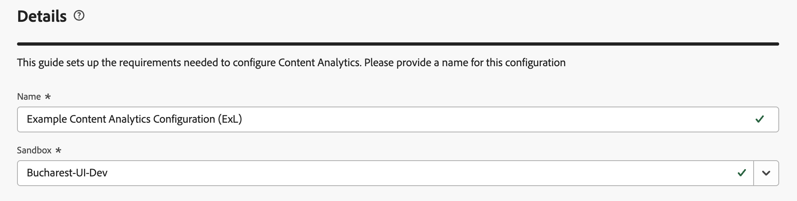

# Content Analytics guided configuration

The guided configuration helps you to configure Content Analytics quickly and easily. The guided configuration uses a wizard to set up the requirements to configure Content Analytics automatically for your organization. In the **[!UICONTROL Configuration]** screen, you can either create a new configuration or edit an existing configuration. 

>[!IMPORTANT]
>
>You can only have one Content Analytics configuration per sandbox in your organization.

>[!NOTE]
>
>The configuration wizard supports multiple dataviews and channels and is different from the earlier version that only supported one data view and only the web channel. You have to select a sandbox and connection before you can select one or more data views in the [Data views](#data-views) section. The configurations for **[!UICONTROL Experience capture]**, **[!UICONTROL Data collection]** and **[!UICONTROL Header overrides]** are channel dependent and are part of each of the channels you configure in the [Channels](#channels) section.

To access the Content Analytics configuration

* Select **[!UICONTROL Data Management]** > **[!UICONTROL Content Analytics Configuration]** from the main menu in Customer Journey Analytics.

In the **[!UICONTROL Content Analytics Configurations]** screen, you see a table of existing Content Analytics configurations. 

For each configuration, the following details are available:

| Column | Description |
|---|---|
| **[!UICONTROL Name]** | The name of the configuration. |
| **[!UICONTROL Created by]** | The technical account that created the configuration. |
| **[!UICONTROL Created on]** | The timestamp when the configuration was created. |
| **[!UICONTROL Modified on]** | The timestamp when the configuration was last modified. |
| **[!UICONTROL Sandbox]** | The sandbox within the organization in which Content Analytics is (planned to be) configured and implemented. |
| **[!UICONTROL Status]** | The status of the configuration. The status indicates for how many of the enabled channels the configuration is completed. Use  to open a popup with more detais. |

You can use  to customize the table. Select which columns to display in the **[!UICONTROL Customize table]** dialog and select **[!UICONTROL Apply]** to apply the changes.

From the Content Analytics **[!UICONTROL Configuration]** screen, you can create a new configuration or edit an existing configuration. 

To create a new configuration:

* Select **[!UICONTROL Create configuration]**. This action opens the [guided configuration wizard](#guided-configuration-wizard).

To edit an existing configuration:

* Select  and then  **[!UICONTROL Edit]** for an existing Content Analytics configuration. This action opens the [guided configuration wizard](#guided-configuration-wizard).

## Guided configuration wizard

The guided configuration wizard consists of four sections ([Details](#details), [Connection](#connection), [Data view](#data-view), and [Channels](#channels)), each prompting you for details that are required to set up and configure Content Analytics properly. Complete each section before moving to the next section, as some settings in a section might depend on configuration values in earlier sections.

### Details {#onboarding-details}

>[!CONTEXTUALHELP]
>id="aca_onboarding_details_button"
>title="Details"
>abstract="Provide a name for the connection. In the **[!UICONTROL Data view]**, **[!UICONTROL Experience capture and definition]**, and **[!UICONTROL Data collection]** sections you provide more details to ensure that Content Analytics can be configured correctly."

>[!CONTEXTUALHELP]
>id="aca_onboarding_details_name_header"
>title="Details"
>abstract="This guide sets up the requirements needed to configure Content Analytics. Please provide a name for this configuration"    

>[!CONTEXTUALHELP]
>id="aca_onboarding_connection_boldheader"
>title="Connection"
>abstract="**Connection**"    

>[!CONTEXTUALHELP]
>id="aca_onboarding_connection_header"
>title="Connection"
>abstract="Select an existing connection from Customer Journey Analytics that you would like to merge your Content Analytics data with."    

Each configuration requires a unique name. For example, `Example Content Analytics configuration`. The name is required to save or implement a configuration.

For each configuration you also need to select the sandbox for which you want to configure Content Analytics.

* **[!UICONTROL Name]**: Each configuration requires a unique name. For example, `Example Content Analytics configuration`. The name is required to save or implement a configuration.

* **[!UICONTROL Sandbox]**: The configuration requires a sandbox. Select a sandbox from the list of sandboxes you have access to and on which data is collected that you want to use for Content Analytics.

  If you change a configured sandbox for which you have defined a connection and optionally data views, you are notified that the connection and data views need to be reconfigured.

### Connection

You need to select a connection to which you want to add Content Analytics data collection.

If you have not selected a connection for your configuration:

1. Use  **[!UICONTROL Select a connection]** to open the **[!UICONTROL Select a connection]** dialog that lists all connections that are available on the sandbox.
1. In the **[!UICONTROL Select a connection]** dialog, select  a connection that you want to use. You can only select one connection.
1. Select **[!UICONTROL Use connection]**.

If you already have selected a connection, but you want to change that connection:

1. Select  **[!UICONTROL Edit]**.
1. In the **[!UICONTROL Select a connection]** dialog, modify the connection that you want to use.
1. Select **[!UICONTROL Use connection]**.

### Data views {#onboarding-data-view}

>[!CONTEXTUALHELP]
>id="ac_onboarding_dataview_button"
>title="Data view"
>abstract="For the configuration of Content Analytics you need to select an existing data view. So, you can merge your Content Analytics data with other data."

>[!CONTEXTUALHELP]
>id="aca_onboarding_dataview_header"
>title="Data view"
>abstract="Select an existing data view from Customer Journey Analytics that you would like to merge your Content Analytics data with." 

>[!CONTEXTUALHELP]
>id="aca_onboarding_dataview_header_alt"
>title="Data view"
>abstract="Select an existing data view from Customer Journey Analytics that you would like to merge your Content Analytics data with. "

>[!CONTEXTUALHELP]
>id="aca_onboarding_dataview_change_dialog"
>title="New data view"
>abstract="You have selected a new data view for this configuration. The new data view will be updated to include Content Analytics metrics and dimensions. These metrics and dimensions will be removed from the originally selected data view.  If a different connection is associated with the new data view then the connection will be updated to include Content Analytics datasets. The Content Analytics datasets are not removed from the originally selected connection."

>[!CONTEXTUALHELP]
>id="aca_onboarding_dataview_current_cleanup_labels_dialog"
>title="Cleanup selected data view"
>abstract="You have selected a data view that is already provisioned for Content Analytics. That existing Content Analytics configuration is removed and the data view is provisioned with your new configuration."

>[!CONTEXTUALHELP]
>id="aca_onboarding_dataview_prev_cleanup_labels_dialog"
>title="Cleanup previous data view"
>abstract="You have selected a new data view. The Content Analytics configuration for the previously selected data view is removed."

>[!CONTEXTUALHELP]
>id="aca_onboarding_dataview_new_dialog"
>title="New data view"
>abstract="You have selected a new data view for this configuration. The new data view will be updated to include Content Analytics metrics and dimensions. Similar metrics and dimensions will be removed from the existing data view. If a different connection is associated with the new data view then the connection will be updated to include Content Analytics datasets. Note that Content Analytics datasets are not removed from the existing configuration."

>[!CONTEXTUALHELP]
>id="ac_onboarding_dataviews_button"
>title="Data view"
>abstract="For the configuration of Content Analytics you need to select one or more data views. So, you can merge your Content Analytics data with other data."

>[!CONTEXTUALHELP]
>id="aca_onboarding_dataviews_header"
>title="Data views"
>abstract="Select one or more existing data views from Customer Journey Analytics that you would like to merge your Content Analytics data with." 

>[!CONTEXTUALHELP]
>id="aca_onboarding_dataviews_header_alt"
>title="Data views"
>abstract="Select one or more existing data views from Customer Journey Analytics that you would like to merge your Content Analytics data with. "

>[!CONTEXTUALHELP]
>id="aca_onboarding_dataviews_new_dialog"
>title="Selected data views"
>abstract="You have modified the selected data views for this configuration. The selected data views will be updated to include Content Analytics metrics and dimensions. These metrics and dimensions will be removed from previous selected data views that are no longer selected.  If a different connection is associated with the selected data views, then the connection will be updated to include Content Analytics datasets. The Content Analytics datasets are not removed from the originally selected connection.  All selected data views inherit the channels that are part of this configuration."

>[!CONTEXTUALHELP]
>id="aca_onboarding_dataviews_change_dialog"
>title="Selected data views"
>abstract="You have modified the selected data views for this configuration. The selected data views will be updated to include Content Analytics metrics and dimensions. These metrics and dimensions will be removed from previous selected data views that are no longer selected.  If a different connection is associated with the selected data views then the connection will be updated to include Content Analytics datasets. The Content Analytics datasets are not removed from the originally selected connection.  All selected data views inherit the channels that are part of this configuration."

>[!CONTEXTUALHELP]
>id="aca_onboarding_dataviews_current_cleanup_labels_dialog"
>title="Selected data views"
>abstract="You have modified the selected data views for this configuration. The selected data views will be updated to include Content Analytics metrics and dimensions. These metrics and dimensions will be removed from previously selected data views that are no longer selected.  If a different connection is associated with the selected data views then the connection will be updated to include Content Analytics datasets. The Content Analytics datasets are not removed from the originally selected connection.  All selected data views inherit the channels that are part of this configuration."

>[!CONTEXTUALHELP]
>id="aca_onboarding_dataviews_prev_cleanup_labels_dialog"
>title="Selected data views"
>abstract="You have modified the selected data views for this configuration. The selected data views will be updated to include Content Analytics metrics and dimensions. These metrics and dimensions will be removed from previously selected data views that are no longer selected.  If a different connection is associated with the selected data views then the connection will be updated to include Content Analytics datasets. The Content Analytics datasets are not removed from the originally selected connection.  All selected data views inherit the channels that are part of this configuration."

>[!CONTEXTUALHELP]
>id="aca_onboarding_channels_button"
>title="Channels"
>abstract="Enable and configure one or more channels for the configuration."

>[!CONTEXTUALHELP]
>id="aca_onboarding_channels_header"
>title="Channels"
>abstract="Enable and configure one or more channels for the configuration. All data views that are part of the configuration inherit the enabled channels."

Your configuration requires the selection of one or more [data views](/help/data-views/data-views.md). 

If you have not selected data views for your configuration:

1. Use  **[!UICONTROL Select data view]** to open the **[!UICONTROL Data view]** dialog that lists all data views available for the connection that you have configured for Content Analytics.
1. In the **[!UICONTROL Data view]** dialog, select  one or more data views that you want to use.
1. Select **[!UICONTROL Save]**.

If you already have selected one or more data views, but you want to change that selection:

1. Select  **[!UICONTROL Edit data view selection]**.
1. In the **[!UICONTROL Data view]** dialog, modify the selection  of the data views that you want to use.
1. Select **[!UICONTROL Save]**.

Once you select **[!UICONTROL Save]**, you see a **[!UICONTROL Selected data views]** dialog that informs you about implications of including Content Analytics for the selected data views. Select **[!UICONTROL Continue]** to continue or **[!UICONTROL Cancel]** to cancel.

The following actions are available within the **[!UICONTROL Data view]** dialog:

* To search for a specific data view, use the  field.
* To filter the list of available data views, select . You can filter the list on [!UICONTROL Owner]. Use  **[!UICONTROL Hide filters]** to hide the segment pane.
* To define which columns to show in the table, select . Select which columns to display in the **[!UICONTROL Customize table]** dialog and select **[!UICONTROL Apply]** to apply the changes.

### Channels

In the **[!UICONTROL Channels]** section, you select the channels you want to enable for Content Analytics. You can select between **[!UICONTROL Mobile]** and **[!UICONTROL Web]**.

* To select a channel you have not yet configured, select **[!UICONTROL Enable]**. 
* To select a channel that is already configured but for which you want to change the configuration, select **[!UICONTROL Edit configuration]**.

You can then configure the channel in more detail. That configuration is different depending on whether you enable and configure or edit a configuration for the [mobile](#mobile) or [web](#web) channel.

#### Mobile {#mobile}

<!-- For updated ACA -->

>[!CONTEXTUALHELP]
>id="aca_onboarding_datacollection_mobile_experience_locations_boldheader"
>title="Mobile experience locations data collection"
>abstract="**Experience locations to exclude**"

>[!CONTEXTUALHELP]
>id="aca_onboarding_datacollection_mobile_experience_locations_header"
>title="Mobile experience locations data collection"
>abstract="Indicate which experience locations should be **excluded** when collecting data for Content Analytics. Ensure you exclude personally identifiable experience locations."

>[!CONTEXTUALHELP]
>id="aca_onboarding_datacollection_mobile_asset_locations_boldheader"
>title="Mobile asset locations data collection"
>abstract="**Asset locations to exclude**"

>[!CONTEXTUALHELP]
>id="aca_onboarding_datacollection_mobile_asset_locations_header"
>title="Mobile asset locations data collection"
>abstract="Indicate which asset locations should be **excluded** when collecting data for Content Analytics. Ensure you exclude personally identifiable asset locations."

>[!CONTEXTUALHELP]
>id="aca_onboarding_datacollection_mobile_asset_urls_boldheader"
>title="Mobile asset URLs data collection"
>abstract="**Asset URLs to exclude**"

>[!CONTEXTUALHELP]
>id="aca_onboarding_datacollection_mobile_asset_urls_header"
>title="Mobile asset URLs data collection"
>abstract="Indicate which asset URLs should be **excluded** when collecting data for Content Analytics. Ensure you exclude personally identifiable asset URLs."

For the mobile channel, you can configure [experience capture and definition](#experience-capture-and-definition), [data collection](#data-collection), and [header overrides](#header-overrides).

##### Experience capture and definition {#mobile-experience-capture-and-definition}

In this section, you can select to include experiences in the mobile data you collect with Content Analytics.  For the mobile channel, an experience is what you have registered as an experience using the Adobe Experience Platform SDK for Content Analytics. 

By default, **[!UICONTROL Include experiences]** is disabled. 

Only consider to include experiences when you have instrumented your mobile app to register experiences and to track experience views and experience clicks.

##### Data collection {#mobile-data-collection}

The data collection settings allow you to define what data (experience locations, asset locations, asset URLs) you want to collect for Content Analytics. Ensure you do not collect any personally identifiable information as part of that data collection.

To configure data collection:

* Use an existing mobile Tags property or create a new mobile Tags property.

  * To use an existing mobile Tags property:

    1. Select **[!UICONTROL Choose existing]**.
    2. Select an existing property from the **[!UICONTROL Tags property]** drop-down menu. You can start typing to search for and limit the available options. You cannot select a Tags property that another implemented Content Analytics configuration already uses.

  * To create a new mobile Tags property:

    1. Select **[!UICONTROL Create new]**.
    1. Specify a **[!UICONTROL Tags name]**, for example `ACA Test for Documentation`.
    1. Specify **[!UICONTROL Domains]**, for example, `example.com`.

* Indicate which experience locations should be excluded when collecting data for Content Analytics. Ensure you exclude personally identifiable experience locations.
  
  Specify a **[!UICONTROL Regular expression string]** for **[!UICONTROL Experience locations to exclude]**.  For example: `^(?!.*documentation).*` to exclude all documentation experience locations from Content Analytics.

* Indicate which asset locations should be excluded when collecting data for Content Analytics. Ensure you exclude personally identifiable asset locations.
  
  Specify a **[!UICONTROL Regular expression string]** for **[!UICONTROL Asset locations to exclude]**.  For example: `^(?!.*(logo\.jpg)).*$` to exclude all asset locations with logo JPEG images from Content Analytics.

* Indicate which asset URLs should be excluded when collecting data for Content Analytics. Ensure you exclude personally identifiable asset URLs.

  Specify a **[!UICONTROL Regular expression string]** for **[!UICONTROL Asset URLs to exclude]**.  For example: `^(?!.*(logo\.jpg)).*$` to exclude all asset URLs referring to logo JPEG images from Content Analytics.

##### Header overrides {#mobile-header-overrides}

<!-- needs modification for mobile channel -->

Optionally, you can specify in the **[!UICONTROL Header overrides]** section a header name and secret header value.  This header overrides configuration ensures that Content Analytics sends a custom HTTP header to retrieve mobile app assets, bypassing bot detection or traffic gating technologies.

1. Enable **[!UICONTROL Configure header overrides]**.
1. Enter the **[!UICONTROL Header name]**. For example, `x-asset-service`.
1. Enter the **[!UICONTROL Header value]**. Whatever you specify is secret and not visible in the user interface (unless you explicitly select to disclose  the value during input).

##### Save {#mobile-save}

Once you have configured the mobile channel, select **[!UICONTROL Save]** to save the configuration. Select **[!UICONTROL Cancel]** to cancel the configuration.

#### Web {#web}

For the web channel, you can configure [experience capture and definition](#experience-capture-and-definition-1), [data collection](#data-collection-1), and [header overrides](#header-overrides-1).

>[!CONTEXTUALHELP]
>id="aca_onboarding_experiences_button"
>title="Experience capture and definition"
>abstract="You can select to include experiences in the data you collect with Content Analytics. When selected, you have to define one or more combinations of a regex and query parameters to define for which URLs you want to include experiences."

>[!CONTEXTUALHELP]
>id="aca_onboarding_experiences_header"
>title="Experience capture and definition"
>abstract="Collect experiences in Content Analytics"

>[!CONTEXTUALHELP]
>id="aca_onboarding_experiences_parameters_header"
>title="Experience capture and definition"
>abstract="Specify the parameters that determine how content is rendered on your website."

>[!CONTEXTUALHELP]
>id="aca_onboarding_experiencecapture_new_include_experiences"
>title="Experience capture and definition"
>abstract="When enabled, experience data is collected, experience attributes are generated, and experience reporting is available."

>[!CONTEXTUALHELP]
>id="aca_onboarding_experiencecapture_edit_include_experiences"
>title="Experience capture and definition"
>abstract="When enabled, experience data is collected, experience attributes are generated, and experience reporting is available.   Use  **[!UICONTROL Edit]** to modify the data collection configuration for experiences in the Tags property that is associated with the current configuration."

>[!CONTEXTUALHELP]
>id="aca_onboarding_experiencecapture_edit_button"
>title="Experience capture and definition"
>abstract="You must edit the settings for experience data collection in the Adobe Content Analytics extension."

>[!CONTEXTUALHELP]
>id="aca_onboarding_datacollection_button"
>title="Data collection"
>abstract="Define which Tags property you want to use, or create a new one. And define the pages and assets that you want to include or exclude, using regular expressions."

>[!CONTEXTUALHELP]
>id="aca_onboarding_datacollection_tag_header"
>title="Data collection"
>abstract="**Provide a Tags property**"

>[!CONTEXTUALHELP]
>id="aca_onboarding_datacollection_pages_excluded_boldheader"
>title="Data collection"
>abstract="**Pages to include / exclude**"

>[!CONTEXTUALHELP]
>id="aca_onboarding_datacollection_pages_excluded_header"
>title="Data collection"
>abstract="Indicate which pages should be **included** or **excluded** when collecting data for Content Analytics. Ensure you exclude personally identifiable pages."

>[!CONTEXTUALHELP]
>id="aca_onboarding_datacollection_assets_excluded_boldheader"
>title="Data collection"
>abstract="**Assets to include / exclude**"

>[!CONTEXTUALHELP]
>id="aca_onboarding_datacollection_assets_excluded_header"
>title="Data collection"
>abstract="Indicate which assets should be **included** or **excluded** when collecting data for Content Analytics. Ensure you exclude personally identifiable assets."

>[!CONTEXTUALHELP]
>id="aca_onboarding_datacollection_experiences_edit_button"
>title="Data collection"
>abstract="You can edit the settings for pages in the Adobe Content Analytics extension in the Tags property that is associated with the current configuration."

>[!CONTEXTUALHELP]
>id="aca_onboarding_datacollection_assets_edit_button"
>title="Data collection"
>abstract="You can edit the settings for assets in the Adobe Content Analytics extension in the Tags property that is associated with the current configuration."

>[!CONTEXTUALHELP]
>id="aca_onboarding_datacollection_tags_disabled_description "
>title="Tags property disabled"
>abstract="Content Analytics extension is already active."

<!-- For updated ACA -->

>[!CONTEXTUALHELP]
>id="aca_onboarding_datacollection_web_pages_boldheader"
>title="Web pages data collection"
>abstract="**Pages to include / exclude**"

>[!CONTEXTUALHELP]
>id="aca_onboarding_datacollection_web_pages_header"
>title="Web pages data collection"
>abstract="Indicate which pages should be **included** or **excluded** when collecting data for Content Analytics."

>[!CONTEXTUALHELP]
>id="aca_onboarding_datacollection_web_assets_boldheader"
>title="Web assets data collection"
>abstract="**Assets to include / exclude**"

>[!CONTEXTUALHELP]
>id="aca_onboarding_datacollection_web_assets_header"
>title="Web assets data collection"
>abstract="Indicate which assets should be **included** or **excluded** when collecting data for Content Analytics. Ensure you exclude personally identifiable assets."

##### Experience capture and definition {#web-experience-capture-and-definition}

In this section, you can select to include experiences in the web data you collect with Content Analytics.  An experience consists of all text on a web page that is reproducible using the URL from the initial user visit. 

By default, **[!UICONTROL Include experiences]** is turned off. When selected, define the URLs for which you want to include experiences.

Only consider to include experiences when the following is applicable:

* The pages on the site must be reproducible using the page URL. 
* The text content seen by any given user can be reproduced using the page URL and does not depend on cookies or other personalization mechanisms.

>[!IMPORTANT]
>
>Implement [Content Analytics versioning](manual.md#versioning) to collect changes that you make to the experiences (pages) subject to Content Analytics. 

###### New configuration {#new-experiences-configuration}

To include experiences in a new or not implemented configuration:

1. Enable **[!UICONTROL Include experiences]**. The toggle to enable experiences affects the following:

   * Data collection in the Content Analytics extension 
   * The process that generates experience attributes from Content Analytics event data 
   * The reporting template in Customer Journey Analytics. 
   
1. Select **[!UICONTROL Add Regex]** to add a combination of a domain regular expression and query parameters.
1. Specify how content renders on your website by defining combinations of a **[!UICONTROL Domain regular expression]** and **[!UICONTROL Query parameters]** that affect page content.
   1. Enter a **[!UICONTROL Domain regular expression]**, for example `/^(?!.*\b(store|help|admin)\b)/`. Ensure you escape regular expressions, using `/`. The domain regular expression indicates which URLs these parameters apply to. For example, you may have multiple sites, and for each site different parameters drive the content. If the query parameters apply to all of your pages, then you can use `.*` to indicate all pages.
   1. Specify a comma separated list of **[!UICONTROL Query parameters]**, for example `outdoors, patio, kitchen`.
1. Select **[!UICONTROL Remove]** if you want to remove a combination of domain regular expression and query parameters.
1. Select **[!UICONTROL Add Regex]** if you want to add another combination of a regular expression and query parameters.

###### Implemented configuration {#implemented-experiences-configuration}

To edit existing or include new experiences in an implemented configuration:

* Toggle **[!UICONTROL Include experiences]** to enable or disable:

   * The process that generates experience attributes from Content Analytics event data 
   * The reporting template in Customer Journey Analytics. 
   
* Select  **[!UICONTROL Edit]** to edit the configuration of data collection for experiences in Content Analytics further. You are redirected to the [Adobe Content Analytics extension](https://experienceleague.adobe.com/en/docs/experience-platform/tags/extensions/client/content-analytics/overview#configure-event-segmenting) in the Tags property that is associated with the current configuration.

##### Data collection {#web-data-collection}

The data collection settings allow you to define what data (pages, assets) you want to collect for Content Analytics. Do not collect any personally identifiable information as part of that data collection.

To configure data collection:

* Use an existing web Tags property or create a new web Tags property.

  * To use an existing web Tags property:

    1. Select **[!UICONTROL Choose existing]**.
    2. Select an existing property from the **[!UICONTROL Tags property]** drop-down menu. You can start typing to search for and limit the available options. You cannot select a Tags property that another implemented Content Analytics configuration already uses.

  * To create a new web Tags property:

    1. Select **[!UICONTROL Create new]**.
    1. Specify a **[!UICONTROL Tags name]**, for example `ACA Test for Documentation`.
    1. Specify **[!UICONTROL Domains]**, for example, `example.com`.

* Indicate which pages should be included or excluded when collecting data for Content Analytics. Ensure you exclude personally identifiable pages. 
  
  Specify a **[!UICONTROL Regular expression string]** for **[!UICONTROL Pages to include / exclude]**.  For example: `^(?!.*documentation).*` to exclude all documentation pages from Content Analytics.

* Indicate which assets should be included or excluded when collecting data for Content Analytics. Ensure you exclude personally identifiable assets.
  
  Specify a **[!UICONTROL Regular expression string]** for **[!UICONTROL Asset to include / exclude]**.  For example: `^(?!.*(logo\.jpg)).*$` to exclude all logo JPEG images from Content Analytics.

##### Header overrides {#web-header-overrides}

>[!CONTEXTUALHELP]
>id="aca_onboarding_datacollection_header_overrides_boldheader"
>title="Header overrides"
>abstract="**Header overrides**"

>[!CONTEXTUALHELP]
>id="aca_onboarding_datacollection_header_overrides_header"
>title="Header overrides"
>abstract="Advanced feature to bypass bot detection or gate traffic. Content Analytics includes your custom HTTP headers when calling your endpoints."

<!-- needs modification for mobile channel -->

Optionally, you can specify in the **[!UICONTROL Header overrides]** section a header name and secret header value.  This header override configuration ensures that Content Analytics sends custom HTTP headers to bypass any bot detection or traffic-gating technologies you have implemented.

1. Enable **[!UICONTROL Configure header overrides]**.
1. Enter the **[!UICONTROL Header name]**. For example, `x-asset-service`.
1. Enter the **[!UICONTROL Header value]**. Whatever you specify is secret and not visible in the user interface (unless you explicitly select to disclose  the value during input).

#### Save {#web-save}

After you have specified the details for the web channel, select **[!UICONTROL Save]** to save the configuration. Select **[!UICONTROL Cancel]** to cancel the configuration.

### Summary {#summary}

Once you have provided all necessary details, a summary provides details on the artifacts that are created or modified.

* You see a **[!UICONTROL You're almost ready to implement _configuration name_ for Content Analytics]** summary when you implement a new configuration. 

* For existing implemented configurations, you see a **[!UICONTROL You have implemented _configuration name_ for Content Analytics]** summary.

### Actions {#actions}

>[!CONTEXTUALHELP]
>id="aca_onboarding_implementation_warning_dialog"
>title="Confirmation of implementation"
>abstract="If you select **[!UICONTROL Implement]**, you will configure Content Analytics based on the input you have provided in this workflow. Several settings are chosen by default based on what is generally useful for Content Analytics, but you (as the data controller) must review the settings of each artifact to confirm the settings are implemented in accordance with your privacy policy, contractual rights and obligations, and consent requirements under applicable law.  Note that no data will be collected until the Tags library associated with this configuration is published manually.  In order to derive attributes of images and text, Adobe retrieves the attributes using:<ol><li>The URL of the page, captured at the time of the user's site visit, per the data collection settings you have configured, and</li><li>The URL where the image is hosted.</li></ol>You must not tag images that are hosted on third-party sites."

When you create or edit a configuration you have these options:

* **[!UICONTROL Discard]**: All changes made as part of configuration are discarded.
* **[!UICONTROL Save for later]**: Changes made to a configuration are saved. You can revisit the configuration at a later stage to make further changes, or implement the configuration. Only a value for [!UICONTROL Name] is required to save a configuration.
* **[!UICONTROL Implement]**: Settings for or changes made to a configuration are saved and implemented. All fields marked as  need to have proper values. The implementation consists of:
  
  * **[!UICONTROL Customer Journey Analytics]** configuration:
    * The selected data view is updated to include Content Analytics dimensions and metrics.
    * The Connection tied to the selected data view is modified to include Content Analytics events and attributes datasets.
    * A Content Analytics reporting template is added to Workspace. 

  * **[!UICONTROL Adobe Experience Platform]** configuration:
    * The creation of schemas to model Content Analytics events, asset attributes, and (if configured) experience attributes.
    * The creation of datasets to collect Content Analytics events, asset attributes and (if configured) experience attributes.
    * The creation of a dataflow that uses the featurization service to generate and update content attributes from Content Analytics events.

  * **[!UICONTROL Data collection]** configuration:
    * The new or existing Tags property is configured to support Content Analytics data collection. This configuration implies the inclusion of the Adobe Content Analytics extension for Tags.
    * A datastream is created for Content Analytics events.
    * The Adobe Content Analytics extension is configured to ensure that Content Analytics events are sent to the datastream for Content Analytics. 
    * If the Web SDK or Mobile SDK is not configured for the Tags property, a new Web SDK or Mobile SDK configuration is created to send only Content Analytics events.
    * If the Web SDK or Mobile SDK is configured for the Tags property, no changes are made to the existing Web SDK or Mobile SDK configuration.

* **[!UICONTROL Save]**: Changes made to an implemented configuration are saved and the implementation is updated.
* **[!UICONTROL Exit]**. Exits the guided configuration. All changes made to an implemented configuration are discarded.

## Publish {#publish}

To start collecting data for your Content Analytics configuration, you need to [manually](manual.md) publish the created Tags properties for the channels that you enabled.

>[!MORELIKETHIS]
>
>[Manual configuration](manual.md)
>

