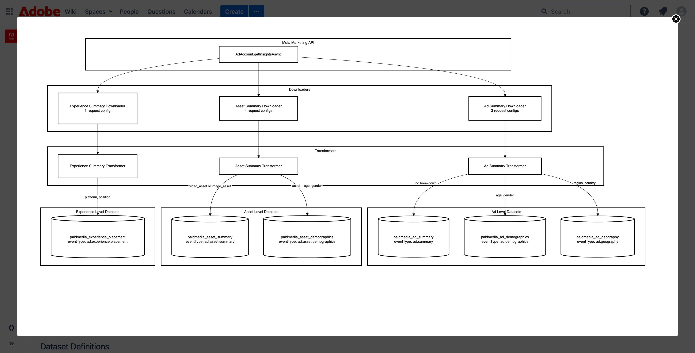

# Paid media automatic configuration

When you enable the Paid media channel in Content Analytics and save the configuration, Adobe updates the selected connection and data views with reporting configuration for the paid media datasets. You do not need to recreate the default dimensions, metrics, lookup logic, or summary-data groups yourself.

Three layers work together:

| Layer | What it contains | What it lets you do |
| --- | --- | --- |
| Summary datasets | Advertising-network performance data at ad, experience-placement, or asset grain, with separate demographic/geographic breakdowns where supported | Measure delivery, clicks, spend, and advertising-network-reported outcomes |
| Metadata and attribute lookups | Account, campaign, ad group, ad, experience, and asset details; Content Analytics creative attributes | Report with recognizable names, creative details, thumbnails, and content attributes rather than identifiers alone |
| Data-view components and configuration | Dimensions, metrics, calculated metrics, derived fields, and summary-data groups | Build Workspace analyses without manually rebuilding the relationships between these datasets |

Enabling paid media does not automatically connect it to your site's orders, bookings, or revenue. That uses your separately instrumented behavioral data and requires customer-specific tracking-key mapping and reporting configuration.

## Understand the six reporting grains

A reporting grain describes what each row of performance data represents. The six summary datasets are not six levels of the account-to-asset hierarchy.

| Summary dataset | What a row represents | Component suffix | Meta | Google |
| --- | --- | --- | --- | --- |
| Ad Summary | An ad's daily performance without demographic or geographic breakdowns | \| Ad Summary | Populated | Populated |
| Ad Demographics | An ad's daily performance broken down by age and gender | \| Ad Demo | Populated | Not populated |
| Ad Geography | An ad's daily performance broken down by country and region | \| Ad Geo | Populated | Not populated |
| Experience Placement | Daily performance associated with an ad's creative experience, broken down by platform and placement | \| Experience Placement | Populated | Populated |
| Asset Summary | Daily asset-level performance in its ad/campaign context, without demographic or geographic breakdowns | \| Asset Summary | Populated | Populated |
| Asset Demographics | Daily asset-level performance in its ad/campaign context, broken down by age and gender | \| Asset Demo | Populated | Not populated |

This table describes dataset coverage, not a guarantee that every metric or metadata field is populated by both networks. Check the fields needed for your analysis. An unavailable field or unsupported breakdown is not the same as a measured zero.

Separate lookup datasets describe Account, Campaign, Ad Group, Ad, Experience, and Asset. They provide names and metadata using entity GUIDs. There is not a one-to-one pairing between these six lookups and the six summary datasets.

### Diagram reference: internal architecture example (customer-facing version to be developed)

This internal Meta connector diagram illustrates how the six summary datasets are separated by entity grain and breakdown. It is included as a reference for a simplified customer-facing diagram. Metadata lookups and CJA reporting components are not shown.

Summary-data grouping brings equivalent dimensions together; it does not add the six performance-metric totals together.

## Why similar components appear more than once

Different networks return different performance breakdowns. Content Analytics preserves those distinctions instead of treating every version of a metric as interchangeable.

For example:

| Component | Meaning | Appropriate starting analysis |
| --- | --- | --- |
| Clicks \| Ad Summary | Clicks reported at the ad's no-breakdown grain | Campaign or ad performance |
| Clicks \| Asset Summary | Clicks reported at the asset grain | Creative-asset performance |
| Clicks \| Ad Geo | Clicks from the ad-geography report | Performance by country or region |
| Clicks \| Experience Placement | Clicks from the experience-placement report | Creative performance by placement |

These are different reporting contexts, not separate click sources to add into a grand total. The same underlying advertising activity can be represented in more than one summary dataset.

Dimensions work differently. For example, the same campaign GUID can appear in all six summary datasets. Adobe provides the corresponding lookup-derived name fields and groups them so analysts can use one logical Campaign Name in Workspace. The data-view editor can still contain the backing variants, with noncanonical variants hidden from reporting.

Derived fields are part of this reporting configuration. They translate identifiers into names and metadata, expose creative attributes, and support the equivalent dimensions used across reporting sources. They do not create additional advertising activity or automatically attribute a website conversion.

Use the same grain for the metrics within an analysis, and dimensions supported by that grain. Meta's demographic and geographic totals do not necessarily equal its no-breakdown totals. That difference is not, by itself, evidence of an ingestion failure.

## Start with your business question

Start with one of the reporting questions below after paid-media setup and ingestion. Use the canonical grouped dimensions where available, and choose metrics from the matching reporting grain.

| Business question | Starting grain | Rows and breakdowns | Starting metrics | Important boundary |
| --- | --- | --- | --- | --- |
| How are my campaigns and ads performing? | Ad Summary | Campaign Name, AdGroup Name, Ad Name; optionally Ad Network and Account Name | Impressions \| Ad Summary, Clicks \| Ad Summary, Spend \| Ad Summary, matching CTR and CPC | Use one grain for delivery/spend totals; validate currency before combining accounts |
| Which creative assets get the strongest response? | Asset Summary | Asset Name (Paid Media), asset identity; optionally Ad Network | Impressions \| Asset Summary, Clicks \| Asset Summary, Click-Through Rate \| Asset Summary | This is asset performance reported by the network, not proof of a later on-site conversion |
| Which image characteristics are associated with performance? | Asset Summary | Asset Tags, Asset Objects, Asset People Categories, Asset Scenes, or other available asset attributes | Asset Summary impressions, clicks, and CTR | Attribute extraction must be available; multivalued attribute categories can overlap |
| Which messaging characteristics are associated with paid performance? | Experience Placement | Experience Keywords, Experience Tones, Experience Persuasion Strategies, or other available experience attributes; optionally Platform and Placement | Impressions \| Experience Placement, Clicks \| Experience Placement, matching CTR | Requires populated experience attributes; results are placement-specific and describe association, not causal impact |
| Which placements perform best? | Experience Placement | Experience Name, Platform, Placement | Impressions \| Experience Placement, Clicks \| Experience Placement, matching CTR | Placement definitions and available values vary by advertising network |
| How do Meta and Google ads/assets/experiences compare? | Ad Summary, Asset Summary, or Experience Placement, chosen for the question | Ad Network with the appropriate campaign, asset, or experience dimension | The same grain and metric definition for both networks | Only compare fields populated by both networks; Google does not populate the three demographic/geographic summaries in this model |

These reports can reveal associations between creative attributes and performance, not prove that an attribute caused a result.

Avoid incompatible combinations: Asset Name (Paid Media) with Ad Summary metrics is not a substitute for an asset report. Use Asset Summary metrics for asset analysis and Ad Geography metrics for Region analysis. Empty or zero cells from an incompatible pairing should not be interpreted as proof of no activity.

### Example: campaign performance

In Analysis Workspace, use Campaign Name as the rows and these columns:

| Column | Reporting grain |
| --- | --- |
| Impressions | Ad Summary |
| Clicks | Ad Summary |
| Spend | Ad Summary |
| Click-Through Rate | Ad Summary |
| Cost Per Click | Ad Summary |

Optionally break down Campaign Name by Ad Name. Keep all five columns at Ad Summary grain.

For illustrative values of 100,000 impressions, 1,000 clicks, and USD 500 spend, CTR is 1% and CPC is USD 0.50. These are fictional values, not a customer result.

To investigate individual assets, use a separate table with Asset Name (Paid Media) and the matching Asset Summary columns. Do not add the two tables' totals together.

### Additional breakdowns: geography and demographics

Where are my Meta ads performing best? Use Country and Region with Impressions | Ad Geo, Clicks | Ad Geo, and matching CTR. You can also include Campaign Name or Ad Name. Google does not populate this geographic summary; do not add its totals to Ad Summary.

How does Meta performance differ by demographic audience? Use the appropriate ad or asset dimension with matching | Ad Demo or | Asset Demo metrics. Before breaking down by age or gender, confirm that an administrator has configured those dimensions from the corresponding demographic dataset: they are not present in the inspected default dimension templates. Google does not populate these demographic summaries.
