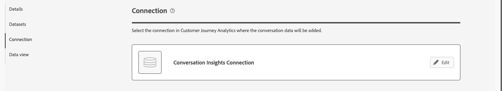

# Create or edit configurations

Conversation Insights enables you to analyze conversations from the agent experiences you offer to your customers. Those agent experiences can be based on large language models (LLM) or based on human conversations. For example, a chatbot interacting with a customer or call center transcripts. 
Through Conversation Insights you are able to understand the impact of agents on actual user outcomes.

Through the Conversation Insights configuration interface you can quickly create or edit a configuration and the associated artifacts (connection, data views, and more).

When you create or edit a Conversation Insights configuration, you specify the sandbox and the event datasets that contain prompts, responses and feedback data. You also select the Customer Journey Analytics connection to which you want to add these datasets. And the data view to which you want to add the Conversation Insights metrics and dimensions.

Only system administrators can create or edit Conversation Insights configurations.

You create or edit configurations from the [Conversation Insights Configurations interface](./manage.md).

## Restore missing blended dataset

If you edit a configuration and the blended dataset that has been generated for the configuration no longer exists, select **[!UICONTROL Restore]** to regenerate the blended dataset.

## Configuration steps

For each configuration:

1. In the **[!UICONTROL Details]** section, specify the following information:

   

   | Field | Description |
   |---------|----------|
   | **[!UICONTROL Name]** | Specify a name for the configuration. |
   | **[!UICONTROL Sandbox]** | Select the Experience Platform sandbox that contains the prompts, responses and feedback event datasets that you want to add to your connection.  |

1. In the **[!UICONTROL Datasets]** section, specify the following information:

   

   | Field | Description |
   |---------|----------|
   | **[!UICONTROL Prompts event dataset]** | Select the dataset that contains the prompts event data. |
   | **[!UICONTROL Responses event dataset]** | Select the dataset that contains the responses event data. |
   | **[!UICONTROL Feedback event dataset]** | Select the dataset that contains the feedback event data. |

1. In the **[!UICONTROL Connection]** section, if no connection is already configured, use **[!UICONTROL Select a connection]** to select a connection. 
   
   

   If a connection is already configured, select  **[!UICONTROL Edit]** to select another connection.

   

   In the **[!UICONTROL Select a connection]** dialog:

   
   
   1. Select the checkbox next to the connection to which you want to add the prompts, responses and feedback event datasets.
   1. Select **[!UICONTROL Use connection]**.

   * To search in the list of connections to select from, use the  field.
   * To configure which columns to display in the table, select . In the **[!UICONTROL Customize table]** dialog, select the columns to show. Then select **[!UICONTROL Apply]**.

1. In the **[!UICONTROL Data views]** section, if no data views are already configured, select **[!UICONTROL Select data views]** to select data views.

   If data views are already configured, select  **[!UICONTROL Edit data view selection]** to reconfigure the selection of data views.

   In the **[!UICONTROL Select multiple data views]** dialog:
   
   

   1. Select one or more data views you want to use for the Conversation Insights configuration.

   1. Select **[!UICONTROL Use data views]** to use the data views. Select Cancel to cancel.

   * To search in the list of data views to select from, use the  field.
   * To configure which columns to display in the table, select . In the **[!UICONTROL Customize table]** dialog, select the columns to show. Then select **[!UICONTROL Apply]**.

1. To finish the configuration:

   * Select **[!UICONTROL Discard]** for a new configuration that is not created.

   * Select **[!UICONTROL Save for later]** for a new configuration you want to save but you do not want to create the artifact for (updates to data views for example). You can revisit the configuration later and finish the actual creation of the configuration.
   
   * Select **[!UICONTROL Create]** to create the new configuration. 
   
   * Select **[!UICONTROL Save]** to save the modified configuration.

   * Select **[!UICONTROL Restore]** to restore the configuration to regenerate a new blended dataset for the configuration.
   
   * Select **[!UICONTROL Exit]** to ignore any change to the configuration.

## Data view verification

The data views you have configured in [Configuration steps](#configuration-steps), have **[!UICONTROL Conversation Insights]** as value for **[!UICONTROL Integrations]** in [Data views](/help/data-views/manage-dataviews.md).

For each of the configured data views:

* **Containers**: The [Containers tab](/help/data-views/create-dataview.md#containers) contains a new **[!UICONTROL Container name]**: **[!UICONTROL conversation]** with **[!UICONTROL Display name]**: **[!UICONTROL Container]** as an additional **[!UICONTROL System]** **[!UICONTROL Container type]**.
* **Components**: You see additional schema field folders. For example: agentExperience and conversation. Additionally the following components are automatically added:

   | Metrics | Schema data type | Schema path |
   |---|---|---|
   | Customer Feedbacks | String | eventType |
   | Positive Sentiments | String | Derived Fields |
   | Recommendations | String | eventType |
   | Turns | String | eventType |

   | Dimensions | Schema data type | Schema path |
   |---|---|---|
   | Agent ID | String | `agenticExperience.agents.agentID` |
   | Agent Name | String | `agenticExperience.agents.name` |
   | Concierge Name | String | `agenticExperience.name` |
   | Concierge Version | String | `agenticExperience.version` |
   | Conversation ID | String | `conversation.conversationID` |
   | Conversation Name | String | `conversation.conversationName` |
   | Conversation Signal Name | String | `conversation.signals.name` |
   | Conversation Summary Boolean Value | Boolean | `conversation.signals.values.booleanValue` |
   | Conversation Summary Confidence | Double | `conversation.signals.values.confidence` |
   | Conversation Summary Metadata Key | String | `conversation.signals.values.metadata.key` |
   | Conversation Summary Number Value | Double | `conversation.signals.values.numberValue` |
   | Conversation Summary Qualifiers | String | `conversation.signals.values.qualifiers` |
   | Conversation Tone Signals | String | `conversation.signals.attributes.tones.values` |
   | Environment | String | `agenticExperience.environment` |
   | Feedback Classification | String | Derived Fields |
   | Feedback Rating Classification | String | `conversation.feedback.rating.classification` |
   | Feedback Section Purpose | String | `conversation.feedback.raw.purpose` |
   | Feedback Source | String | `conversation.feedback.source` |
   | Phrase | String | `conversation.signals.attributes.subjects.values.phrase` |
   | Response Raw Text | String | `conversation.response.raw.text` |
   | Response Source | String | `conversation.response.source` |
   | Sentiment Classification | String | Derived Fields |
   | Skill Name | String | `agenticExperience.agents.skills.name` |
   | Skill Version | String | `agenticExperience.agents.skills.version` |
   | Value | String | `agenticExperience.agents.skills.parameters.value` |

<!--

1. In the Data views dialog, select the checkbox next to one or more data views that you want to use when analyzing Experience Platform audience data within Analysis Workspace. These data views are automatically configured with Experience Platform audience data for reporting.

1. Select **[!UICONTROL Use data views]**.

1. Select **[!UICONTROL Create]** to create the configuration.

   >[!IMPORTANT]
   >
   >Because the profile dataset is updated once per day, audiences are available in Customer Journey Analytics data views on the day after you create the audience analysis configuration.

1. After 24 hours, [view audience dimensions in the data view](#view-audience-dimensions-in-the-data-view) to verify that the audience dimensions are available in the data views that you selected. 

## View audience dimensions in the data view

After you [create an audience analysis configuration](#create-an-audience-analysis-configuration), you can verify that audience dimensions were added to the data views that you selected during the configuration.

To view audience dimensions in the data view, you must be a product profile administrator for the product profile that the data view is assigned to. For more information, see [Access control](/help/technotes/access-control.md).

To view the audience analysis dimensions in the data view:

1. In Customer Journey Analytics, select **[!UICONTROL Data Management]** > **[!UICONTROL Data views]**.

1. In the **[!UICONTROL Dimensions]** section, the following dimensions should now be available:

   * **[!UICONTROL Audience Name]**

   * **[!UICONTROL Audience Origin]**

   * **[!UICONTROL Exited Audience Origin]**

   * **[!UICONTROL Exited Audience Name]**

   Note that each of these dimensions was added to the profile dataset that is associated with the merge policy that you selected during the audience analysis configuration, and each was added to the new lookup dataset that was created.

   

1. Use the audience analysis dimensions in Analysis Workspace. 

   Users who have access to use the data view in Analysis Workspace can now see the new dimensions and use them in their analyses. For information about how to use the audience analysis dimensions in Analysis Workspace, see [Analyze Experience Platform audiences in Customer Journey Analytics](/help/connections/audience-analysis/analyze-audiences.md).

-->