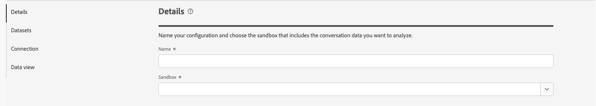
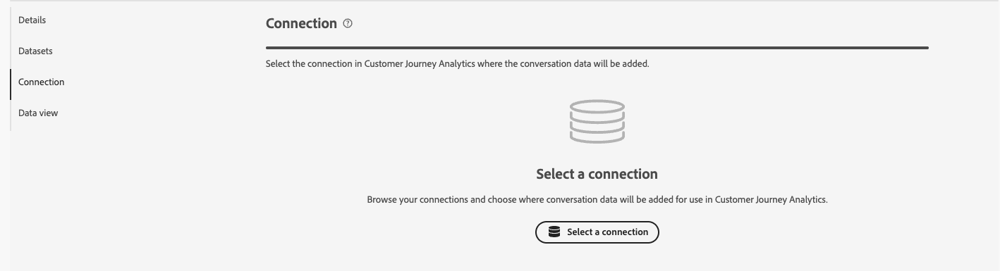
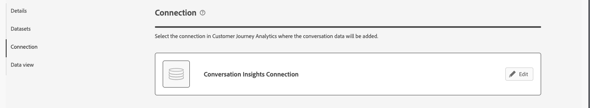

# Configure Conversation Insights configurations

Conversation Insights enables you to analyze conversations (from large language models (LLM) or humans) at scale and given those conversations context within the full customer journey. Through Conversation Insights you are able to understand the impact of agents on actual user outcomes.

## Create an Conversation Insights configuration

When you create an Conversation Insights analysis configuration, you specify the sandbox and the event datasets that contain prompts, responses and feedback data. You also select the Customer Journey Analytics connection to which you want to add these datasets, And the data view to which you want add the Conversation Insights metrics and dimensions.

Only system administrators can create Conversation Insights configurations.

To create an Conversation Insights configuration:

1. In Customer Journey Analytics, select **[!UICONTROL Data Management]** > **[!UICONTROL Conversation Insights configuration]**.

   

1. Select **[!UICONTROL Create configuration]**.

1. In the **[!UICONTROL Details]** section, specify the following information:

   

   | Field | Description |
   |---------|----------|
   | **[!UICONTROL Name]** | Specify a name for the configuration. |
   | **[!UICONTROL Sandbox]** | Select the Experience Platform sandbox that contains the prompts, responses and feedback event datasets that you want to add to your connection.  |

1. In the **[!UICONTROL Datasets]** section, specify the following information:

   

   | Field | Description |
   |---------|----------|
   | **[!UICONTROL Prompts event dataset]** | Select the dataset that contains the prompts event data. |
   | **[!UICONTROL Responses event dataset]** | Select the dataset that contains the responses event data. |
   | **[!UICONTROL Feedback event dataset]** | Select the dataset that contains the feedback event data. |

1. In the **[!UICONTROL Connection]** section, if no connection is already configured, use **[!UICONTROL Select a connection]** to select a connection. 
   
   

   If a connection is already configured, select  **[!UICONTROL Edit]** to select another connection.

   

   In the **[!UICONTROL Select a connection]** dialog:

   
   
   1. Select the checkbox next to the connection to which you want to add the prompts, responses and feedback event datasets.
   1. Select **[!UICONTROL Use connection]**.

   * To search in the list of connections to select from, use the  field.
   * To configure which columns to display in the table, select . In the **[!UICONTROL Customize table]** dialog, select the columns to show. Then select **[!UICONTROL Apply]**.

1. In the **[!UICONTROL Data views]** section, click **[!UICONTROL Select data views]**.

<!--

1. In the Data views dialog, select the checkbox next to one or more data views that you want to use when analyzing Experience Platform audience data within Analysis Workspace. These data views are automatically configured with Experience Platform audience data for reporting.

1. Select **[!UICONTROL Use data views]**.

1. Select **[!UICONTROL Create]** to create the configuration.

   >[!IMPORTANT]
   >
   >Because the profile dataset is updated once per day, audiences are available in Customer Journey Analytics data views on the day after you create the audience analysis configuration.

1. After 24 hours, [view audience dimensions in the data view](#view-audience-dimensions-in-the-data-view) to verify that the audience dimensions are available in the data views that you selected. 

 
## View audience dimensions in the data view

After you [create an audience analysis configuration](#create-an-audience-analysis-configuration), you can verify that audience dimensions were added to the data views that you selected during the configuration.

To view audience dimensions in the data view, you must be a product profile administrator for the product profile that the data view is assigned to. For more information, see [Access control](/help/technotes/access-control.md).

To view the audience analysis dimensions in the data view:

1. In Customer Journey Analytics, select **[!UICONTROL Data Management]** > **[!UICONTROL Data views]**.

1. In the **[!UICONTROL Dimensions]** section, the following dimensions should now be available:

   * **[!UICONTROL Audience Name]**

   * **[!UICONTROL Audience Origin]**

   * **[!UICONTROL Exited Audience Origin]**

   * **[!UICONTROL Exited Audience Name]**

   Note that each of these dimensions was added to the profile dataset that is associated with the merge policy that you selected during the audience analysis configuration, and each was added to the new lookup dataset that was created.

   

1. Use the audience analysis dimensions in Analysis Workspace. 

   Users who have access to use the data view in Analysis Workspace can now see the new dimensions and use them in their analyses. For information about how to use the audience analysis dimensions in Analysis Workspace, see [Analyze Experience Platform audiences in Customer Journey Analytics](/help/connections/audience-analysis/analyze-audiences.md).

-->