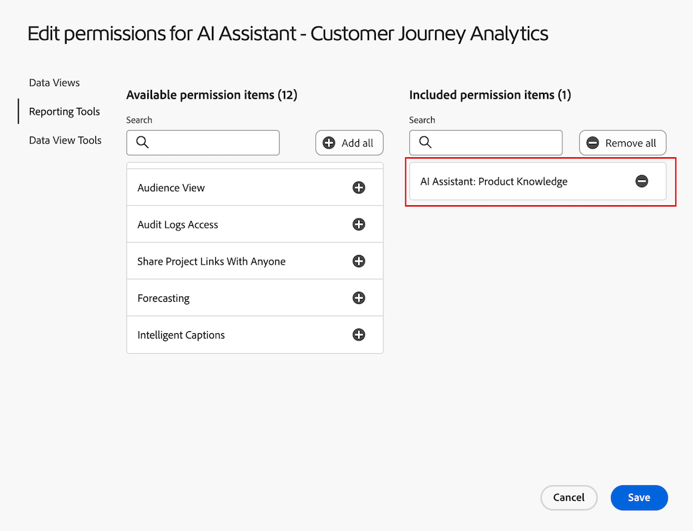

# Visualize data with Data Insights Agent

>[!AVAILABILITY]
>
>Data Insights Agent is available to eligible customers for a limited time. Access to Data Insights Agent is available through February 28, 2026. To continue using Data Insights Agent beyond this date without interruption, please contact your Adobe account representative to learn more about licensing Adobe Experience Platform Agent Orchestrator.

Data Insights Agent, accessible from the [AI Assistant](/help/ai-assistant.md) in Customer Journey Analytics, is a generative AI conversation agent that quickly and efficiently answers questions about your data. It builds relevant visualizations in Analysis Workspace using components from your data view and using your actual data.

Using Data Insights Agent to answer data-centric questions in Analysis Workspace can save countless hours that you might otherwise spend manually building visualizations in Analysis Workspace and familiarizing yourself with your data view components. 

## In-scope vs. out-of-scope features

| Feature | In scope | Out of scope |
| --- | --- | --- |
| **Visualization types** | <ul><li>Line</li><li>Multi-line</li><li>Freeform table</li><li>Bar</li><li>Donut</li><li>Summary number</li></ul> | <ul><li>Flow</li><li>Fallout</li><li>Cohort Table</li><li>Area, Area Stacked</li><li>Bar Stacked</li><li>Bullet</li><li>Combo</li><li>Histogram</li><li>Horizontal Bar, Horizontal Bar Stacked</li><li>Key Metric Summary</li><li>Scatter</li><li>Summary Change</li><li>Text</li><li>Treemap</li><li>Venn</li><li>Guided analysis: Active growth, Conversion trends, Engagement, First use impact, Frequency, Funnel, Net growth, Release impact, Retention, Timeline, Trends</li></ul> |
| **Workspace actions and agent capabilities** | <ul><li>Build and update visualizations
Generates a freeform table and associated visualization (such as a line, bar, donut, and so forth).
For example, *What is the profit across SKUs from February to May?*
</li><li>Ask follow-up questions
Respond to a prompt in the context from any prior prompts. For example:
 <ul><li>Prompt 1: *Trend events from March.*</li><li>Prompt 2: *Show me the data from March to April instead*</li></ul> </li><li>Out-of-scope prompt detection
If you submit a prompt that is out of scope, such as *Export this project*, Data Insights Agent responds by informing you that the question is out of scope.
</li></ul> | <ul><li>Share</li><li>Export</li><li>Download</li><li>Manage user preferences</li><li>Manage data view</li><li>Analytics Dashboards app</li><li>Attribution</li><li>In-line summary or response
Data Insights Agent cannot respond in-line in the chat rail with a summary answer of a user prompt. Examples of out-of-scope prompts are, *Give me a summary of the insights from my last prompt* and *Summarize the highlights from the line visualization.*
</li></ul> |
| **Clarifying questions** | If you ask a question that does not have enough context for Data Insights Agent to answer, or is too generic, Data Insights Agent responds with a clarifying question or suggested options. 
The following clarifying questions are examples of component-related questions:
<ul><li>Metric: *Which "revenue" metric did you mean?*</li><li>Dimension: *Which of the below "regions" do you want to focus on?*</li><li>Segment: *Which "Account" segment did you want to apply?*</li><li>Date Range: *By "last month," did you mean the last full month or the last 30 days?*</li></ul>
The following clarifying question is an example of a question related to dimension items:
 <ul><li>Which "store name" did you mean? (For example, Store #5274, Store #2949, and so forth.)</li></ul> | Clarifying questions are limited to components and dimension items. Data Insights Agent cannot clarify things such as data views, visualizations, data granularity, comparison, and scope. When clarifying questions cannot be used, the agent defaults to what you are most likely asking for. If it returns an unexpected visualization or data granularity, you can ask a follow-up question or adjust the visualization and data. |
| **Data verifiability and correctness** |  Data verifiability and correctness can be confirmed by viewing the generated freeform table and data visualization. 
For example, if you ask Data Insights Agent to *Trend orders last month*, you can confirm that the correct metric ("orders") and date range ("last month") were selected in the newly generated panel, data visualization, and freeform table. | Data Insights Agent does not respond by informing you which components or visualizations were added.
 |
| **Feedback mechanisms** | <ul><li>Thumbs up</li><li>Thumbs down</li><li>Flag</li></ul> |  |
 

## Manage access to Data Insights Agent {#manage-access}

<!-- markdownlint-disable MD034 -->

>[!CONTEXTUALHELP]
>id="cja-enable-data-insights-data-view"
>title="Enable for Data Insights Agent"
>abstract="This option enables this data view for usage with Data Insights Agent. Data Insights Agent is a generative AI conversation agent that is accessible from the AI Assistant in Customer Journey Analytics. It helps you quickly analyze your data with text prompts. It builds relevant visualizations in Analysis Workspace using components from your data view and using your actual data."

<!-- markdownlint-enable MD034 -->

The following parameters govern access to Data Insights Agent in Customer Journey Analytics:

* **Solution access**: Data Insights Agent is available for all Customer Journey Analytics customers as part of a limited access program until November 30, 2025. It is not available in Adobe Analytics.

* **Contractual access**: If you are not able to use Data Insights Agent in the AI Assistant, please contact your organization's administrator or Adobe account team. Before your organization can use Data Insights Agent, you must agree to certain legal terms related to generative AI.

* **Permissions**: Necessary permissions must be granted in the [!UICONTROL Adobe Admin Console] before users can access Data Insights Agent. 

  To grant permissions, a [product profile admin](https://helpx.adobe.com/enterprise/using/manage-product-profiles.html) must complete the following steps in the [!UICONTROL Admin Console]:
   1. In the **[!UICONTROL Admin Console]**, select the **[!UICONTROL Products]** tab to view the **[!UICONTROL All products and services]** page.
   1. Select **[!UICONTROL Customer Journey Analytics]**.
   1. On the **[!UICONTROL Product Profiles]** tab, select the title of the product profile for which you want to provide access to [!UICONTROL AI Assistant: Product Knowledge].
   1. In the specific product profile, select the **[!UICONTROL Permissions]** tab.

      

   1. In the **[!UICONTROL Reporting Tools]** row in the provided table, select the edit icon .
   1. Scroll to or search for **[!UICONTROL AI Assistant: Product Knowledge]**, then select the plus icon  next to this permission. 
   1. Scroll to or search for **[!UICONTROL Data Insights Agent]**, then select the plus icon  next to this permission. 
   
      The **[!UICONTROL AI Assistant: Product Knowledge]** permission and the **[!UICONTROL Data Insights Agent]** permission are added to the **[!UICONTROL Included permission items]** column.
   
      .

   1. Select **[!UICONTROL Save]** to save the permissions.

   For additional information about access control, see [Access control](/help/technotes/access-control.md#access-control).

* **Data view access**: Data views must be enabled for Data Insights Agent.

  >[!IMPORTANT]
  >
  >Consider the following when enabling data views:
  >* You can enable a maximum of 50 data views per IMS organization. If you enable more than 50 data views across all product profiles for a given organization, the Data Insights Agent will use the 50 most-used data views. 
  >* The Data Insights Agent can reference the included data views sometime during the same day that you enable them. 

  To enable data views for Data Insights Agent, see the [AI Settings for a data view](/help/data-views/create-dataview.md#ai-settings).

  You can use the [info on the Data Insights Agent column in Data views](/help/data-views/manage-dataviews.md#manage-data-views) to view the number of data views that are enabled for Data Insights Agent in your IMS organization.

## Access Data Insights Agent in the AI Assistant

1. Go to [experience.adobe.com](https://experience.adobe.com/) and login with your Adobe ID.

2. Select **Customer Journey Analytics** from Experience Cloud Home.

3. Select **[!UICONTROL Blank project]** in the banner at the top of the projects page to open a new blank project.

4. Ensure that the selected data view for the panel is a data view that was enabled for use with Data Insights Agent, as described in [Manage access to Data Insights Agent in Customer Journey Analytics](#manage-access-to-data-insights-agent-in-customer-journey-analytics). 

5. Select the AI Assistant chat icon at the top-right area of the page. 

   If you do not see the chat icon, contact your administrator so they can enable the following features in the Admin Conole:
   
   * Reporting Tools: **[!UICONTROL AI Assistant: Product Knowledge]**

   * Data View Tools: **[!UICONTROL Data Insights Agent]**
   
   For additional details, see [Manage access to Data Insights Agent in Customer Journey Analytics](#manage-access-to-data-insights-agent-in-customer-journey-analytics). 

   

6. In the **[!UICONTROL Ask about Customer Journey Analytics]** dialog at the bottom of the page, ask a data visualization question using Data Insights Agent.
 
   For more information, see the following examples.

### Example 1

For example, let's say you are interested in the orders your business received in July. 

**Prompt:** Enter *"Trend orders in July."*

   

**Response:** Data Insights Agent gathers insights by looking through the data in the data view, including the metrics and components. It translates the prompt into the right dimensions and metrics within the data range.

   As you can see, it automatically generated a line graph and a freeform table to show orders for July.

   

### Example 2

Next, you want to see how your revenue compares by region.

**Prompt:** In the prompt window, enter *"Show revenue by region."*

**Response:** Data Insights Agent intelligently understands that by "region," you mean "customer region." It produces a bar chart that best shows revenue by region:

   
   
### Example 3

Next, in addition to understanding revenue by region, you also want to see data for profit by region. Instead of repeating the previous prompt, you can ask Data Insights Agent to update the most recent visualization and freeform table. 

**Prompt:** In the prompt window, type *"Add profit."*

**Response:** The **[!UICONTROL Bar]** chart still provides the most concise answer, but the profit metric has been added as a column in the freeform table:

   

### Example 4

Finally, let's look at the revenue by product category.

**Prompt:** In the prompt window, enter *"Proportion of revenue by product category."*

**Response:** Again, Data Insights Agent picks the most appropriate visualization, in this case the **[!UICONTROL Donut]** visualization, to answer the question.

   

## Access Data Insights Agent across Experience Cloud applications

Adobe Experience Platform Agent Orchestrator allows you to access the functionality of Data Insights Agent in multiple Adobe Experience Cloud applications, such as Adobe Journey Optimizer and Real-Time CDP. 

Agent Orchestrator interprets your request, determines which specialized agents are needed, and orchestrates them to deliver the right response. It keeps track of context across multi-turn interactions, so you can build on prior queries naturally. 

For more information, see [Adobe Experience Platform Agent Orchestrator](http://www.adobe.com/go/agent-orchestrator-home).

## Example data visualization prompts

The following are some examples of common prompts and the visualizations used by Data Insights Agent to respond to those prompts.

| Example prompt | Expected visualization |
| --- | --- |
| Show me profits in [Month] | Line
Asking for a trend or metric within a certain time range by default returns a line visualization. |
| Trend orders in [Month] | Line |
| Show revenue by region in [Month] | Bar |
| Share of revenue by product category | Donut |
| Orders by day of week, from January to May | Bar |
| Show orders by gender, from March to June | Bar |
| What is the profit across SKUs from February to May | Bar |
| Revenue by store name in [Month] | Bar |
| What were my top 10 SKUs by profit in [Month]? | Bar |
| Proportion of purchases by month of year | Donut |
| Total profit in [Month] | Summary Number
Asking for the "total" of a metric across a certain time range should return a Summary number visualization. |

## Prompting best practices

Data Insights Agent processes the context provided by each user prompt and tries to respond intelligently with the most appropriate visualization and components in a freeform table. 

Responses can vary based on the specific words and phrases used in the prompt, and slight changes in language can lead to different results. 

To achieve the best results, consider the following guidelines: 

* **Be specific:** Include exact terms to narrow down the response. The following is an example of a specific prompt: "Last month's sales in California"

* **Use clear metrics, dimensions, and segments:** Adding specific metrics (such as "Revenue"), dimensions (such as "website name"), segments (such as "iPhone users"), and date ranges (such as "last three months") helps Data Insights Agent focus on the right data.

* **Ask direct questions:** Phrasing questions directly makes it easier for Data Insights Agent to provide clear, relevant insights. The following is an example of asking a direct question in a prompt: "What is the average revenue by product category this year?" 

Review the following table of example terms and phrases that you can use in prompts with Data Insights Agent, along with the types of responses you can expect. 

These examples are designed to help you get familiar with how specific words or structures can influence Data Insight Agent's output, ensuring more precise and valuable insights. Data Insights Agent uses generative AI, so visualizations or selected data may vary slightly across similar prompts.
  
| Desired outcome | Example terms and phrases |
| --- | --- |
| Summary number visualization | <ul><li>Total</li></ul> |
| Compare components | <ul><li>Compare</li><li>VS</li><li>Contrast</li><li>Week-to-Week</li><li>Month-over-Month</li><li>Quarter-over-Quarter</li><li>Year-over-Year</li></ul> |
| Donut visualization | <ul><li>Proportion</li><li>Share of</li><li>Distribution</li><li>Percentage</li><li>Contribution</li><li>Portion</li><li>Parts</li></ul> |
| Line visualization | <ul><li>Trend</li><li>[Metric] in [Time range]</li></ul> |
| Bar visualization | <ul><li>[Metric] by [Dimension]</li></ul> |

<!--

## Beta testing expectations and requested feedback

After posing each question, carefully review the assistant's provided answer. It's crucial to evaluate the generated visualizations comprehensively before providing feedback. 

Consider the following when evaluating a response from Data Insights Agent: 

* Chat rail response or template: Evaluate the textual response provided. Is the response appropriate given the context of your prompt? 

* Visualization/chart: Evaluate the visualization. Is it the appropriate or expected visualization for your question, or would you have expected a different visualization?  

* Freeform table: Evaluate the freeform table. Is the freeform table data correct? Is it breaking down data where requested? Are the applied segments those that you requested or expected? 

* Error Message / Out-of-Scope: If a generic error message is given stating the question is out of scope, provide feedback on whether you think the out-of-scope message is appropriate, given your prompt. Was your prompt actually in scope? 

**For every response, give a thumbs up or thumbs down, based on the response.**

Following the thumbs up or thumbs down selection, please make a selection for the relevant multi-select feedback boxes. If you want to provide additional feedback, add notes in the open text box.

## Questions and Contact

* Send questions and feedback in the Beta Slack channel: #data-insights-agent-in-cja-beta

-->

## Configuration best practices

Below are best practices for your Customer Journey Analytics configuration (data view, calculated metrics, segments, and more) to ensure that the Data Insights Agent can locate the correct components and return cleaner answers without having to prompt you for additional information.

* **Balance what components you need**. Do not add all the fields of your datasets as metrics or dimension components to your data view. Especially, those you most certainly will not use in your analysis. On the other hand, do not strictly limit yourself only to the fields you anticipate you require for your analysis. A too limited data view restricts the flexibility in your analysis and the Data Insights Agent functionality.
* **Always use friendly display names**. Ensure that all fields you define in your data view, either as a metric or dimension component, have a friendly component name. The process of renaming fields with a friendly name is especially relevant for fields from Adobe Analytics source connector datasets. These fields often have non-friendly unidentifiable names, like `eVar41` or `prop25`.
* **Use distinctive names**. Distinctive names are especially relevant when you use the same field as both a metric and a dimension component in your data view. Or when you use a field in multiple components of the same type (such as in two different metrics), each with different component settings. 
* **Use a component naming convention**. You can use a component naming convention to group components. For example, **[!UICONTROL Orders | Product]** and  **[!UICONTROL Orders | Customer]** can distinguish between different order metrics that might exist in your data.
* **Use the Data Dictionary**. Add description and other relevant data for components in the Data Dictionary. The Data Insight Agent currently does not use description and tags from the Data Dictionary, but it might in the future. 
* **Use approved calculated metrics**. Agree on a process to use only approved calculated metrics as components in your data view, and avoid using experimental calculated metrics.
* **Share required segments**. Ensure that you share segments and make segments visible that are required for Data Insights Agent prompts.
* **Standardize on component names across data views**. If you use the same fields as a component in multiple data views, ensure that you use a single friendly name and a single identifier for that component. A single name and identifier allows the Data Insights Agent to switch data views without losing context.

>[!MORELIKETHIS]
>
>[Component settings](/help/data-views/component-settings/overview.md)
>[Data Dictionary](/help/components/data-dictionary/data-dictionary-overview.md)
>[Approve calculated metric](/help/components/calc-metrics/cm-workflow/cm-approving.md)
>[Share segments](/help/components/segments/seg-share.md)
>
