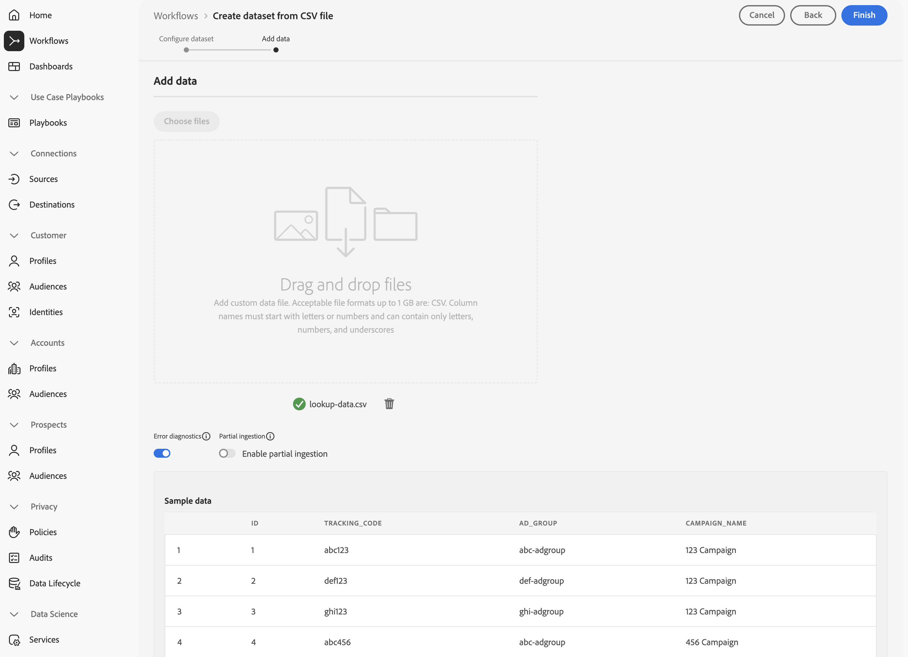

# Ingest and use ad hoc data

This quick start guide explains how you can ingest ad hoc data into Adobe Experience Platform and then use that data in Customer Journey Analytics.

To accomplish this, you need to:

- **Create a dataset with a CSV file** in Adobe Experience Platform to define the model (schema) of the data that you want to collect and where to actually collect the data (dataset).

- **Use a source connector** in Adobe Experience Platform to get your data into the dataset configured.

- **Set up a connection** in Customer Journey Analytics. This connection should (at least) include your Adobe Experience Platform dataset.

- **Set up a data view** in Customer Journey Analytics to define metrics and dimension that you want to use in Analysis Workspace.

- **Set up a project** in Customer Journey Analytics to build your reports and visualizations.

>[!NOTE]
>
>This quick start guide is a simplified guide on how to ingest ad hoc data using into Adobe Experience Platform and use it in Customer Journey Analytics. It is highly recommended to study the additional information when referred to.

## Create a dataset with a CSV file

For this quick start, you want to use a CSV file that represents lookupdata data and contains information similar to the one shown below.

|  _id | tracking_code | ad_group    | campaign_name |
| ---: | :---          | :---        | :---          |
|    1 | abc123        | abc-adgroup | 123 Campaign  |
|    2 | def123        | def-adgroup | 123 Campaign  |
|    3 | ghi123        | ghi-adgroup | 123 Campaign  |
|    4 | abc456        | abc-adgroup | 456 Campaign  |
|    5 | def456        | def-adgroup | 456 Campaign  |

You do not need to create an XDM schema for ad hoc data. Adobe Experience Platform supports a workflow that, based on the data in the CSV file:

1. Creates an ad hoc schema conforming to the columns of the CSV file.
1. Creates a dataset based on the ad hoc schema containing the data from the CSV file.

To start the workflow:

1. In the Adobe Experience Platform UI, in the left rail, select **[!UICONTROL Workflows]**.
1. Select  **[!UICONTROL Create dataset from CSV file]**.
1. Select **[!UICONTROL Launch]** from the right pane.
1. In the Workflows > **[!UICONTROL Create dataset from CSV file]** wizard:
   1. In the **[!UICONTROL Configure dataset]** step:
      1. Enter a **[!UICONTROL Name]** for the dataset. For example `Sample Data From CSV`. 
      1. Add an optional **[!UICONTROL Description]**. For example: `Sample data from a CSV file`.
      1. Add one or more optional **[!UICONTROL Tags]**, or select one or more existing **[!UICONTROL Tags]**.
         
         

      1. Select **[!UICONTROL Next]**.
   1. In the **[!UICONTROL Add data]** step:
      1. Select **[!UICONTROL Choose Files]** to select your CSV file from your computer or network. Alternatively drag and drop the file from its location on your computer or network onto **[!UICONTROL Drag and drop files]**. The file is uploaded and **[!UICONTROL Sample data]** is displayed.
      1. Enable or disable **[!UICONTROL Error diagnostics]** and **[!UICONTROL Enable partial ingestion]** in line with your preferences. When you **[!UICONTROL Enable Partial ingestion]**, you can define an **[!UICONTROL Error treshold %]**.
         
         

      1. Select **[!UICONTROL Finish]**.

The data is prepared and uploaded. After the data is successfully uploaded, you are redirected to **[!UICONTROL Datasets]** in the Adobe Experience Platform UI.  You see the **[!UICONTROL Dataset activity]** for your **[!UICONTROL Sample Data from CSV]** dataset with the status  **[!UICONTROL Processing]**.

To further inspect the ad hoc data:

1. In the Adobe Experience Platform UI, in the left rail, select **[!UICONTROL Datasets]**.
1. Select the **[!UICONTROL Browse]** tab in **[!UICONTROL Datasets]**. You should see your dataset listed. 
1. Select the name of the schema from the **[!UICONTROL Schema]** column. For example: **[!UICONTROL Sample Data From CSV…]**.

   

1. In the popup, select the **[!UICONTROL Schema name]**. For example **[!UICONTROL Sample Data From CSV - adhoc schema - XXXXXXXXXXX]**. You are redirected to the **[!UICONTROL Schemas]** > **[!UICONTROL Sample Data From CSV - adhoc schema - XXXXXXXXXXX]** interface.
   
In the **[!UICONTROL Schemas]** > **[!UICONTROL Sample Data From CSV - adhoc schema - XXXXXXXXXXX]** interface:

- Select the topmost tenant name object underneath **[!UICONTROL Schemas]** > **[!UICONTROL Sample Data From CSV - adhoc schema - XXXXXXXXXXX]** to reveal the fields within the object. The fields within the object represent the structure of the CSV file. The schema is created automatically based on the upload of the ad hoc data.

   

## Set up a connection

To use the Adobe Experience Platform dataset in Customer Journey Analytics, you create a connection that includes the ad hoc data resulting from the workflow. 

A connection lets you integrate datasets from Adobe Experience Platform into Workspace. To report on these datasets, you first have to establish a connection between datasets in Adobe Experience Platform and Workspace.

To create your connection:

1. In the Customer Journey Analytics UI, select **[!UICONTROL Connections]**, optionally from **[!UICONTROL Data management]**, in the top menu.

1. Select **[!UICONTROL Create new connection]**.

1. In the **[!UICONTROL Untitled connection]** screen:

   1. Name and describe your connection in **[!UICONTROL Connection Settings]**.

   1. Select the correct sandbox from the **[!UICONTROL Sandbox]** list in **[!UICONTROL Data settings]** and select the number of daily events from the **[!UICONTROL Average number of daily events]** list.

      
    
   1. Select **[!UICONTROL Add datasets]**. 
    
1. In the **[!UICONTROL Select datasets]** step in **[!UICONTROL Add datasets]**:
    
   1. Select the dataset that you created earlier (`Sample Data From CSV`) and any other dataset you want to include in your connection.

      

   1. Select **[!UICONTROL Next]**.

1. In the **[!UICONTROL Datasets settings]** step in **[!UICONTROL Add datasets]**:

   For your ad hoc dataset:

   1. Select the type of ad hoc dataset. In our example, they dataset type is Event. 
   1. Select a [!UICONTROL Person ID] from the available identities defined in the dataset schemas in Adobe Experience Platform.
    
   1. Select the correct data source from the [!UICONTROL Data source type] list. If you specify **[!UICONTROL Other]**, then add a description for your data source.

   1. Set **[!UICONTROL Import all new data]** and **[!UICONTROL Dataset backfill existing data]** according to your preferences.

      

   1. Select **[!UICONTROL Add datasets]**.

   1. Select **[!UICONTROL Save]**.

After you create a [connection](/help/connections/overview.md), you can perform various management tasks, such as [selecting and combining datasets](/help/connections/combined-dataset.md), [checking the status of a connection's datasets and the status of data ingestion](/help/connections/manage-connections.md), and more.

## Set up a data view

A data view is a container specific to Customer Journey Analytics that lets you determine how to interpret data from a connection. It specifies all dimensions and metrics available in Analysis Workspace and which columns those dimensions and metrics obtain their data from. Data views are defined in preparation for reporting in Analysis Workspace.

To create your data view:

1. In the Customer Journey Analytics UI, select **[!UICONTROL Data views]**, optionally from **[!UICONTROL Data management]**, in the top menu.

2. Select **[!UICONTROL Create new data view]**.

3. In the [!UICONTROL Configure] step:

    1. Select your connection from the [!UICONTROL Connection] list.

    1. Name and (optionally) describe your connection.

       

    1. Select **[!UICONTROL Save and continue]**.

4. In the [!UICONTROL Components] step:

    Add any schema field and/or standard component that you want to include to the [!UICONTROL METRICS] or [!UICONTROL DIMENSIONS] component boxes.

    

    Select **[!UICONTROL Save and continue]**.

5. In the [!UICONTROL Settings] step:

    

    Leave the settings as they are and select **[!UICONTROL Save and finish]**.

See [Data views overview](../data-views/data-views.md) for more information on how to create and edit a data view, what components are available for you to use in your data view and how to use segment and sessions settings.

## Set up a project

Analysis Workspace is a flexible browser tool that allows you to quickly build analyses and share insights based on your data. You use Workspace projects to combine data components, tables, and visualizations to craft your analysis and share with anyone in your organization.

To create your project:

1. In the Customer Journey Analytics UI, select **[!UICONTROL Projects]** in the top menu.

2. Select **[!UICONTROL Projects]** in the left navigation.

3. Select **[!UICONTROL Create project]**.

    

    Select **[!UICONTROL Blank project]**.

    

4. Select your data view from the list.

    .

5. To create your first report, start dragging and dropping dimensions and metrics on the [!UICONTROL Freeform table] in the [!UICONTROL Panel] . As an example, drag `Program Points Balance` and `Page View` as metrics and `email` as dimension to get a quick overview of profiles that have visited your website and are part of the loyalty program collecting loyalty points.

    

See [Analysis Workspace overview](../analysis-workspace/home.md) for more information on how to create projects and build your analysis using components, visualizations, and panels.

>[!SUCCESS]
>
>You have completed all the steps. Starting by defining what loyalty data you want to collect (schema) and where to store it (dataset) in Adobe Experience Platform, you configured the appropriate source connector to provide you with the loyalty data. You defined a connection in Customer Journey Analytics to use the ingested loyalty data and other data. Your data view definition allowed you to specify which dimension and metrics to use and finally you created your first project visualizing and analyzing your data.
