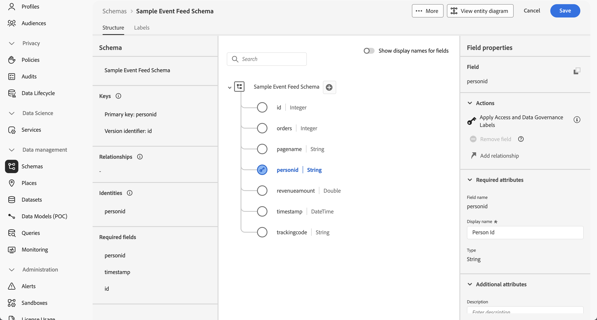
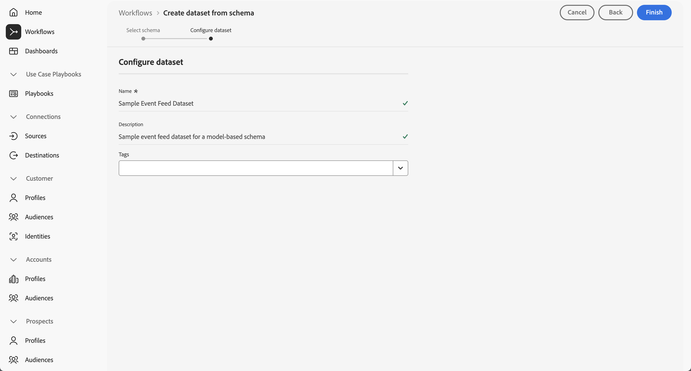

# Ingest and use model-based data

This quick start guide explains how you can ingest model-based data into Adobe Experience Platform and then use that data in Customer Journey Analytics. 

To accomplish this, you need to:

- **Set up a schema and dataset** in Adobe Experience Platform to define the model (schema) of the data that you want to collect and where to actually collect the data (dataset).

- **Use a source connector** in Adobe Experience Platform to get your data into the dataset configured.

- **Set up a connection** in Customer Journey Analytics. This connection should (at least) include your Adobe Experience Platform model-based dataset.

- **Set up a data view** in Customer Journey Analytics to define metrics and dimension that you want to use in Analysis Workspace.

- **Set up a project** in Customer Journey Analytics to build your reports and visualizations.

Model-based data is used in Experience Platform to support two specific use cases:

- Campaign orchestration for Journey Optimizer.
- Data mirror for Customer Journey Analytics.

You should not consider model-based data, datasets, and schemas for any other use case.

>[!NOTE]
>
>This quick start guide is a simplified guide on how to ingest ad hoc data using into Adobe Experience Platform and use it in Customer Journey Analytics. It is highly recommended to study the additional information when referred to.

## Set up a schema and dataset

To ingest data into Adobe Experience Platform, you first must define which data you want to collect. Typically, all data ingested into Adobe Experience Platform must conform to a standard, denormalized structure for the data be recognized and acted upon by downstream capabilities and features. Experience Data Model (XDM) is typically the standard framework that provides the structure in the form of schemas. However, model-based schemas (alongside [ad hoc schemas](adhoc.md)) do not have to conform the Experience Data Model (XDM) framework.

Once you have defined a schema, you use one or more datasets to store and manage the collection of data. A dataset is a storage and management construct for a collection of data (typically a table) that contains a schema (columns) and fields (rows). 

All data that is ingested into Adobe Experience Platform must conform to a pre-defined schema before it can be persisted as a dataset.

### Set up a schema

For this quick start, you want to feed event data, for example data that contains page name, tracking code, orders and revenue details for persons into Adobe Experience Platform.

+++ Details of sample event data

| timestamp                 |    id | page_name         | person_id       | tracking_code | orders | revenue_amount |
| :---                      |  ---: | :---              | :---            | :---          |   ---: | :---           |
| 2025-03-06T19:15:39+00:00 | 10001 | home page         | person-1abc123  | abc123        |        |                |
| 2025-03-06T19:15:39+00:00 | 10002 | confirmation page | person-1abc123  |               |      1 | 174.25         |
| 2025-03-06T19:15:39+00:00 | 10003 | home page         | person-2def123  | def123        |        |                |
| 2025-03-06T19:15:39+00:00 | 10004 | home page         | person-3ghi123  | ghi123        |        |                |
| 2025-03-06T19:15:39+00:00 | 10005 | confirmation page | person-3ghi123  |               |      1 | 149.25         |
| 2025-03-06T19:15:39+00:00 | 10006 | home page         | person-4abc456  | abc456        |        |                |
| 2025-03-06T19:15:39+00:00 | 10007 | home page         | person-5def456  | def456        |        |                |
| 2025-03-06T19:15:39+00:00 | 10008 | home page         | person-6ghi456  | ghi456        |        |                |
| 2025-03-06T19:15:39+00:00 | 10009 | confirmation page | person-6ghi456  |               |      1 | 159.25         |
| 2025-03-06T19:15:39+00:00 | 10010 | home page         | person-7abc789  | abc789        |        |                |
| 2025-03-06T19:15:39+00:00 | 10011 | home page         | person-8def789  | def789        |        |                |
| 2025-03-06T19:15:39+00:00 | 10012 | home page         | person-9ghi789  | ghi789        |        |                |
| 2025-03-06T19:15:39+00:00 | 10013 | confirmation page | person-9ghi789  |               |      1 | 124.25         |
| 2025-03-06T19:15:39+00:00 | 10014 | home page         | person-10abc987 | abc987        |        |                |
| 2025-03-06T19:15:39+00:00 | 10015 | home page         | person-11def987 | def987        |        |                |
| 2025-03-06T19:15:39+00:00 | 10016 | home page         | person-12ghi987 | ghi987        |        |                |
| 2025-03-06T19:15:39+00:00 | 10017 | home page         | person-13abc654 | abc654        |        |                |
| 2025-03-06T19:15:39+00:00 | 10018 | home page         | person-14def654 | def654        |        |                |
| 2025-03-06T19:15:39+00:00 | 10019 | home page         | person-15ghi654 | ghi654        |        |                |
| 2025-03-06T19:15:39+00:00 | 10020 | confirmation page | person-15ghi654 |               |      1 | 174.25         |

+++

You first must define a schema that models this data.

To set up your schema:

1. In the Adobe Experience Platform UI, in the left rail, select **[!UICONTROL Schemas]** within **[!UICONTROL Data Management]**.

1. Select **[!UICONTROL Create schema]**. 
1. From the drop-down menu, select **[!UICONTROL Model-based]**.
1. In the **[!UICONTROL Schemas]** > **[!UICONTROL Create model-based schema]** interface:
   1. Enter a **[!UICONTROL Schema display name]**. For example: `Sample Event Feed Schema`.
   1. Enter a **[!UICONTROL Description]**. For example: `Sample event feed schema for a model-based schema`.
   1. Select **[!UICONTROL  Time series]** as the **[!UICONTROL Schema behavior]**. You select **[!UICONTROL Time series]** for time-series based data and **[!UICONTROL Record]** for record base data. The behavior defines the structure of the sechema and the properties that are included. 

      

   1. Select **[!UICONTROL Finish]**.

1. In the **[!UICONTROL Schemas]** > **[!UICONTROL Sample Event Feed Schema]** interface you see a warning that model-based schemas support ingestion as change rows. Ingestion as change rows is also known as change cata capture (CDC). To support change data capture, the schema requires:

   - Primary key.
   - Version identifier.
   - Timestamp identifier for time-series data.

   <!--
   Add content later about relevancy of this when Data mirror docs are finished
   -->

1. Select  next to Sample Event Feed Schema to start to add fields to the schema. Add the following fields with data type and additional attributes to the schema.

   | Field name | Display name | Type | Additional attributes |
   |---|---|---|---|
   | id | Id | Integer |  Version Identifier|
   | orders | Orders | Integer | | 
   | pagename | Page Name | String | |
   | personid | Person Id | String |  Primary key   Identity Select CRMID for Identity namespace. |
   | revenueamount | Revenue Amount | Double | |
   | timestamp | Timestamp | DateTime |  Timestamp identifier |
   | trackingcode | Tracking Code | String | |

   Your schema should look like:

   

   If you have defined primary key, version identifier and timestamp identifier correctly, the warning on top of the schema definition disappears.

1. Select **[!UICONTROL Save]** to save your schema.

### Set up a dataset

With your schema, you have defined your data model. You now have to define the construct to store and manage that data, which is done through datasets.

To set up your dataset:

1. In the Adobe Experience Platform UI, in the left rail, select **[!UICONTROL Datasets]** within **[!UICONTROL Data Management]**.

1. Select **[!UICONTROL Create dataset]**.

    

1. Select **[!UICONTROL Create dataset from schema]**.

    

1. In the the **[!UICONTROL Workflows]** > **[!UICONTROL Create dataset from schema]** wizard, in the **[!UICONTROL Select schema]** step
   1. Select the schema that you created earlier. For example **[!UICONTROL Sample Event Feed Schema]**.
   1. select **[!UICONTROL Next]**.

1. In the **[!UICONTROL Workflows]** > **[!UICONTROL Create dataset from schema]** wizard, in the **[!UICONTROL Configure dataset]** step:

   1. Enter a **[!UICONTROL Schema display name]**. For example: `Sample Event Feed Dataset`.
   1. Enter a **[!UICONTROL Description]**. For example: `Sample event feed dataset for a model-based schema`.

      

1. Select **[!UICONTROL Finish]**. You are directed to the **[!UICONTROL Dataset]** > **[!UICONTROL Sample Event Feed Dataset]** interface.

## Source connector

Model-based data
