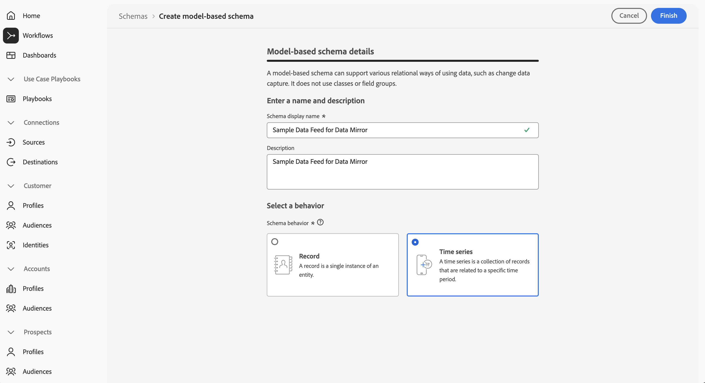

# Configure Experience Platform

The Experience Platform Data Mirror feature for Customer Journey Analytics requires the proper configuration of several Experience Platform components:

* schema
* dataset
* source connector

## Schema

You need to create a model-based schema that models the data warehouse native table you want to mirror. When you construct the model-based schema, ensure the following requirements are met:

* Select the appropriate schema for the type of data. For time series data (event data like call-center interactions), select Time series. For record data (profiles, product info, and more).
  
  

* Select a field that represents the primary key. That field should contain a unique identifier for each row in the data.

