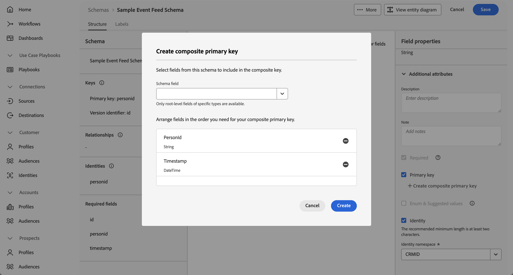
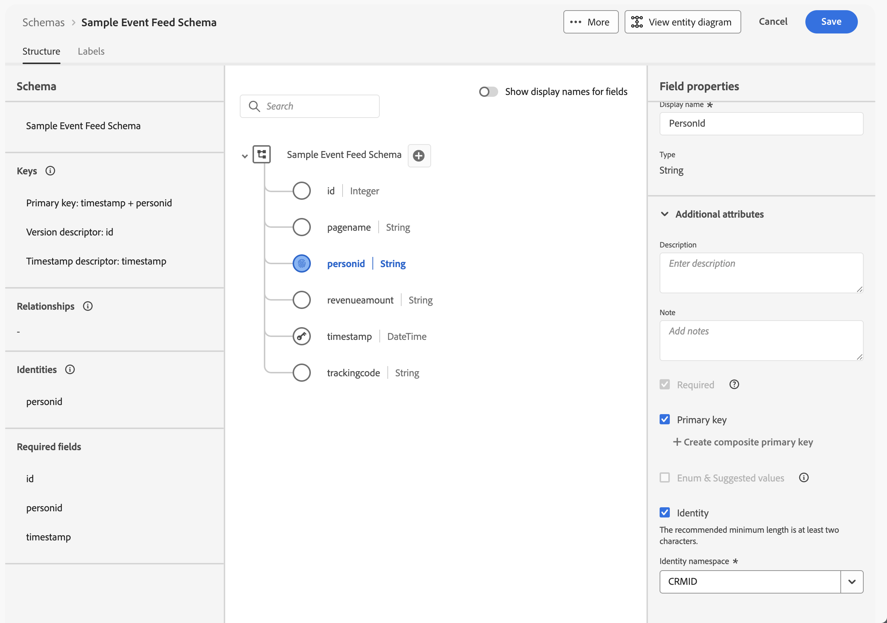

# Configure Experience Platform

The Experience Platform Data Mirror feature for Customer Journey Analytics requires the proper configuration of several Experience Platform components:

* schema
* dataset
* source connector

## Schema

You need to create a model-based schema that models the data warehouse native table you want to mirror. When you construct the model-based schema, ensure the following requirements are met:

* When prompted for the type of model-based, select Create manually. Do not select From a DDL file.
* Select the appropriate schema for the type of data. For time series data (event data like call-center interactions), select Time series. For record data (profiles, product info, and more).
  
  

* Define the fields in your schema and their attributes
* Configure the required attributes for fields: a primary key, a version identifier, and a timestamp identifier.

  In the example below:

  * The id field is configured as version identifier.

    

  * The personid field is configured, together with timestamp as the primary key. To do this, select  Create composite key and select both personid and timestamp. 

    

    The personid field is also configured as an identity, with CRMID as the namespace.

    

  * The timestamp field is configured, together with personid field as the primary key. And the timestamp field is also configured as timestamp identifier. You only need to define a field as timestamp identifier for time series model-based data.

    

## Dataset

You can set up a dataset for your schema in advance, or create a dataset when you set up your source connector. 

When you create a dataset in advance, ensure you create a dataset from a schema, and select the model-based schema you created earlier. 

## Source connector

To set up the source connector to the supported data warehouse native solutions, you use the Sources workflow that guide you through the setup. That workflow consist of the following steps:

### Authentication

For authentication against the supported data warehouse native solution, see the relevant Experience Platform documentation:

* [Azure Databricks](https://experienceleague.adobe.com/en/docs/experience-platform/sources/connectors/databases/databricks)
* [Google BigQuery](https://experienceleague.adobe.com/en/docs/experience-platform/sources/connectors/databases/bigquery)
* [Snowflake](https://experienceleague.adobe.com/en/docs/experience-platform/sources/connectors/databases/snowflake)

### Select data

Once successfully connected to your data warehouse native solution, select the table you want to use for data mirror. Once selected, a preview of the contents of the data is shown.

### Dataflow detail

Ensure you select **[!UICONTROL Enable change data capture]**. You see an information panel, explaining the requirements for change data capture.

Specify a new dataset and provide the name the output dataset. Specify and select other options in the Dataflow detail interface.

## Mapping

Map the fiels of the table in the data warehouse native solution to the fields you have specified for the model-based schema.

## Scheduling

Define a schedule to mirror the data from the table in the data warehouse native solution to the dataset in Experience Platform.

## Review

Review the settings for the source connector to the data warehouse native solution that supports data mirror and change data capture.

If you select Finish, the dataflow is created and from that moment on data changes (inserts, updates, deletions) in the data in table in the data warehouse native solution are mirrored into the specified dataset.

