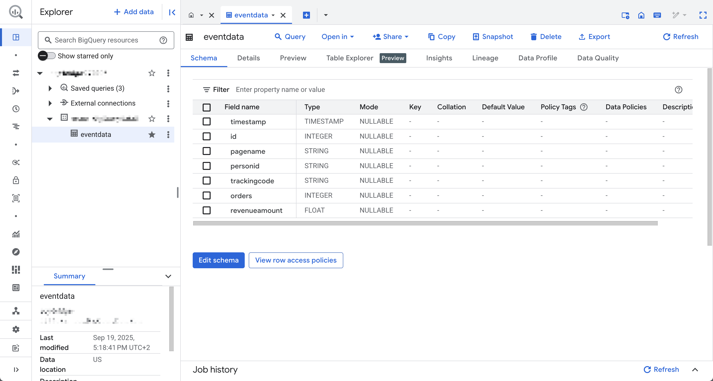
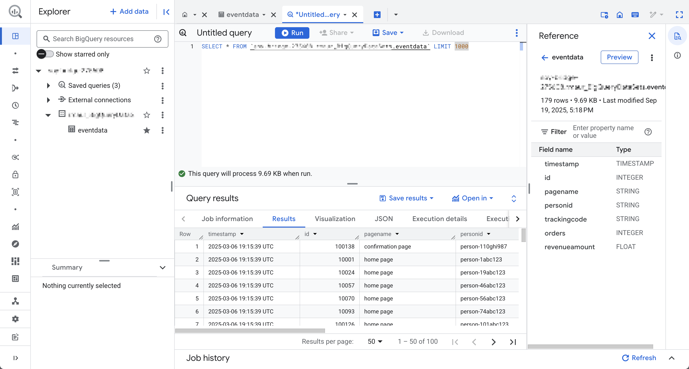
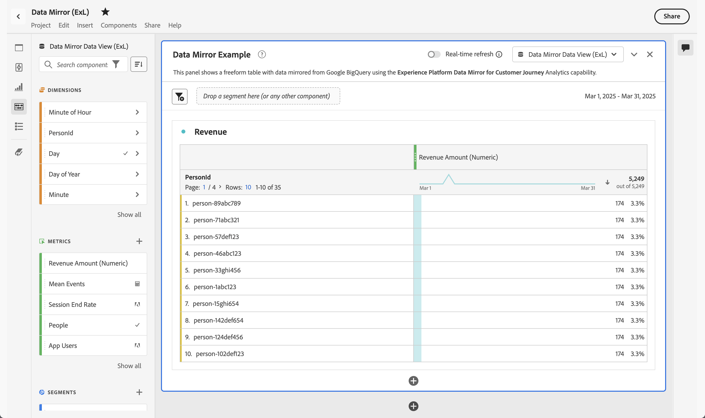

# Mirror and use model-based data

{{release-limited-testing}}

This quick start guide explains how to use [Experience Platform Data Mirror for Customer Journey Analytics](data-mirror.md) to mirror model-based data from a data warehouse native solution in Adobe Experience Platform. And then use that data in Customer Journey Analytics.

To accomplish this use case, you need to:

* **Use a data warehouse native solution** to store data that you want to mirror in Experience Platform. And then use that data in Customer Journey Analytics to report on and to analyze.
  
* **Set up a schema** in Experience Platform to define the model (schema) of the data that you want to mirror.

* **Use a source connector** in Experience Platform to get your mirrored data into a dataset.

* **Set up a connection** in Customer Journey Analytics. This connection should (at least) include your Experience Platform model-based dataset.

* **Set up a data view** in Customer Journey Analytics to define metrics and dimension that you want to use in Analysis Workspace.

* **Set up a project** in Customer Journey Analytics to build your reports and visualizations.

Experience Platform Data Mirror for Customer Journey Analytics requires model-based schemas. 


>[!NOTE]
>
>This quick start guide is a simplified guide on how to mirror model-based data in Adobe Experience Platform and use that data in Customer Journey Analytics. It is highly recommended to study the additional information when referred to.


## Use a data warehouse native solution

This quicks tart guide uses [[!DNL Google BigQuery]](datawarehouse.md#google-bigquery) as the data warehouse native solution. Other [supported solutions](datawarehouse.md) are [[!DNL Snowflake]](datawarehouse.md#snowflake) and [[!DNL Azure Databricks]](datawarehouse.md#azure-databricks).

Within [!DNL Google BigQuery], the following example data is stored and updated regularly in a table named **[!UICONTROL eventdata]**.

+++ Details of sample event data

| timestamp                 |    id | pagename         | personid       | trackingcode | orders | revenueamount |
| :---                      |  ---: | :---              | :---            | :---          |   ---: | :---           |
| 2025-03-06T19:15:39+00:00 | 10001 | home page         | person-1abc123  | abc123        |        |                |
| 2025-03-06T19:15:39+00:00 | 10002 | confirmation page | person-1abc123  |               |      1 | 174.25         |
| 2025-03-06T19:15:39+00:00 | 10003 | home page         | person-2def123  | def123        |        |                |
| 2025-03-06T19:15:39+00:00 | 10004 | home page         | person-3ghi123  | ghi123        |        |                |
| 2025-03-06T19:15:39+00:00 | 10005 | confirmation page | person-3ghi123  |               |      1 | 149.25         |
| 2025-03-06T19:15:39+00:00 | 10006 | home page         | person-4abc456  | abc456        |        |                |
| 2025-03-06T19:15:39+00:00 | 10007 | home page         | person-5def456  | def456        |        |                |
| 2025-03-06T19:15:39+00:00 | 10008 | home page         | person-6ghi456  | ghi456        |        |                |
| 2025-03-06T19:15:39+00:00 | 10009 | confirmation page | person-6ghi456  |               |      1 | 159.25         |
| 2025-03-06T19:15:39+00:00 | 10010 | home page         | person-7abc789  | abc789        |        |                |
| 2025-03-06T19:15:39+00:00 | 10011 | home page         | person-8def789  | def789        |        |                |
| 2025-03-06T19:15:39+00:00 | 10012 | home page         | person-9ghi789  | ghi789        |        |                |
| 2025-03-06T19:15:39+00:00 | 10013 | confirmation page | person-9ghi789  |               |      1 | 124.25         |
| 2025-03-06T19:15:39+00:00 | 10014 | home page         | person-10abc987 | abc987        |        |                |
| 2025-03-06T19:15:39+00:00 | 10015 | home page         | person-11def987 | def987        |        |                |
| 2025-03-06T19:15:39+00:00 | 10016 | home page         | person-12ghi987 | ghi987        |        |                |
| 2025-03-06T19:15:39+00:00 | 10017 | home page         | person-13abc654 | abc654        |        |                |
| 2025-03-06T19:15:39+00:00 | 10018 | home page         | person-14def654 | def654        |        |                |
| 2025-03-06T19:15:39+00:00 | 10019 | home page         | person-15ghi654 | ghi654        |        |                |
| 2025-03-06T19:15:39+00:00 | 10020 | confirmation page | person-15ghi654 |               |      1 | 174.25         |

+++

The data is stored in a database table with an associated schema. To inspect the database table:

1. Log in to Google BigQuery.
1. Select **[!UICONTROL BigQuery]** > **[!UICONTROL Studio]**.
1. Select your project, dataset and table. In the **[!UICONTROL Schema]** tab, you see an overview of the schema for the event data.

   

To inspect the data:

1. Select **[!UICONTROL Query]**.
1. Run a sample query in the query editor, where `project` is the name of your project and `datasets` is the name of your datasets: 

   ```sql
   SELECT * FROM `project.datasets.eventdata` LIMIT 100
   ```

   

For Experience Platform Data Mirror for Customer Journey Analytics, the tables in your data warehouse native solution must be enabled for change history. To verify that the table is enabled for change history:

1. Run the following SQL statement in the query editor to check the setting, where `project` is the name of your project and `datasets` is the name of your datasets:

   ```sql
   SELECT
      table_name,
      MAX(CASE WHEN option_name = 'enable_change_history' THEN option_value END) AS enable_change_history
   FROM `project.datasets.INFORMATION_SCHEMA.TABLE_OPTIONS`
   WHERE table_name = 'eventdata'
   GROUP BY table_name
   ORDER BY table_name;
   ```
   
1. If the result is not **[!UICONTROL TRUE]**, use the following SQL statement to enable change history, where `project` is the name of your project and `datasets` is the name of your datasets:

   ```sql
   ALTER TABLE `project.datasets.eventdata` 
   SET OPTIONS (enable_change_history = TRUE);
   ```

The data in the table in your data warehouse native solution is ready for Experience Platform Data Mirror for Customer Journey Analytics.


## Set up a schema

To mirror data in Experience Platform, you first must define the schema for the data. All data that you want to mirror in Experience Platform and that uses Experience Platform Data Mirror for Customer Journey Analytics must conform to a model-based schema.

Define a schema that models this data. To set up your schema:

1. In the Adobe Experience Platform UI, in the left rail, select **[!UICONTROL Schemas]** within **[!UICONTROL Data Management]**.

1. Select **[!UICONTROL Create schema]**. 
1. From the drop-down menu, select **[!UICONTROL Model-based]**.
1. If you see a popup with the option to select between **[!UICONTROL Create manually]** or **[!UICONTROL Upload a DDL file]**:
   1. Select **[!UICONTROL select Create manually]**.

      

   1. Select **[!UICONTROL Next]**.
1. In the **[!UICONTROL Schemas]** > **[!UICONTROL Create model-based schema]** interface:
   1. Enter a **[!UICONTROL Schema display name]**. For example: `Sample Event Feed Schema`.
   1. Enter a **[!UICONTROL Description]**. For example: `Sample event feed schema for a model-based schema`.
   1. Select **[!UICONTROL Time series]** as the **[!UICONTROL Schema behavior]**. You select **[!UICONTROL Time series]** for time-series based data and **[!UICONTROL Record]** for record based data. The behavior defines the structure of the schema and the properties that are included. 
   
      Experience Platform Data Mirror for Customer Journey Analytics is mostly used for time series data (for example, event data).

      

   1. Select **[!UICONTROL Finish]**.

1. In the **[!UICONTROL Schemas]** > **[!UICONTROL Sample Event Feed Schema]** interface, you see a warning that model-based schemas support ingestion as change rows. 

   
   
   Ingestion as change rows is also known as change data capture (CDC). To support change data capture, the schema requires:

   * Primary key.
   * Version descriptor.
   * Timestamp descriptor for time-series data.

1. Select  next to **[!UICONTROL Sample Event Feed Schema]** to start to add fields to the schema. Add the following fields with data type and additional attributes to the schema.

   | Field name | Display name | Type | Additional attributes |
   |---|---|---|---|
   | `id` | `Id` | **[!UICONTROL Integer]** |  Version descriptor|
   | `orders` | `Orders` | **[!UICONTROL Integer]** | | 
   | `pagename` | `Page Name` | **[!UICONTROL String]** | |
   | `personid` | `Person Id` | **[!UICONTROL String]** |  Primary key<br/>  Identity<br/>Select CRMID for Identity namespace. |
   | `revenueamount` | `Revenue Amount` | **[!UICONTROL Double]** | |
   | `timestamp` | `Timestamp` | **[!UICONTROL DateTime]** |  Timestamp descriptor |
   | `trackingcode` | `Tracking Code` | **[!UICONTROL String]** | |


   * The **[!UICONTROL id]** field is configured as **[!UICONTROL Version descriptor]**.

     

   * The **[!UICONTROL personid]** field is configured, together with **[!UICONTROL timestamp]** as the **[!UICONTROL Primary key]**. Select  **[!UICONTROL Create composite primary key]** to create a composite key.

     

     The **[!UICONTROL personid]** field is also configured as an **[!UICONTROL Identity]**, with **[!UICONTROL CRMID]** as the **[!UICONTROL Identity namespace]**.

     

   * The **[!UICONTROL timestamp]** field is configured, together with **[!UICONTROL personid]** field as the **[!UICONTROL Primary key]**. The **[!UICONTROL timestamp]** field is also configured as **[!UICONTROL Timestamp descriptor]**. You only need to define a field as **[!UICONTROL Timestamp descriptor]** for time series model-based data.

     


   If you have defined **[!UICONTROL Primary key]**, **[!UICONTROL Version descriptor]** and **[!UICONTROL Timestamp descriptor]** correctly, the warning on top of the schema definition disappears.

1. Select **[!UICONTROL Save]** to save your schema.


## Use a source connector

You use a source connector to connect the data warehouse native solution to Experience Platform. 

In the Experience Platform interface:

1. Select **[!UICONTROL Sources]**.
1. Select or search for **[!UICONTROL Google BigQuery]**.
1. Select **[!UICONTROL Add data]**.

The Add data wizard guides you through the following steps to connect the data from the table in [!DNL Google BigQuery] to Experience Platform.

### Authentication

In the **[!UICONTROL Authentication]** step, select:

* **[!UICONTROL Existing account]** when you have already an account setup for Google BigQuery. Continue to the [Select data](#select-data) step.
* **[!UICONTROL New account]** when you need to connect to Google BigQuery.
   1. Specify an **[!UICONTROL Account name]** and (optional) **[!UICONTROL Description]**.
   1. Select your **[!UICONTROL Authentication type]**: **[!UICONTROL Basic Authentication]** or **[!UICONTROL Service Authentication]**. Based on your selection, provide the required input.
   1. Select **[!UICONTROL Connect to source]**
      
      

      Your connection is verified. A  **[!UICONTROL Connected]** indicated a successful connection.
   
   1. Select **[!UICONTROL Next]**.

   See the Experience Platform documentation for details on how to connect and authenticate when you use the [Azure Databricks](https://experienceleague.adobe.com/en/docs/experience-platform/sources/connectors/databases/databricks) or [Snowflake](https://experienceleague.adobe.com/en/docs/experience-platform/sources/connectors/databases/snowflake) connector.


### Select data

In the **[!UICONTROL Select data]** step:

1. Select the table from the list of tables. For example: **[!UICONTROL eventdata]**.

   

   You see a sample of the data displayed for verification.

1. Select **[!UICONTROL Next]** to continue.


### Dataflow detail

In the **[!UICONTROL Dataflow detail]** step:

1. Select **[!UICONTROL Enable change data capture]**. A **[!UICONTROL Change data capture requirement]** information box displays with more information.
1. Select **[!UICONTROL New dataset]** for **[!UICONTROL Target dataset]** to create a new dataset that contains the mirrored data.
1. Enter an **[!UICONTROL Output dataset name]**. For example: `event-data-mirror`.
1. Select the model-based schema that you created earlier from the **[!UICONTROL Schema]** drop-down menu. For example: **[!UICONTROL Sample Event Feed Schema]**.

   

1. Specify other details.
1. Select **[!UICONTROL Next]**.


### Mapping

In the **[!UICONTROL Mapping]** step:

1. Map the fields. From the schema in Google BigQuery (**[!UICONTROL Source data]**) to the fields in the schema that you have defined in Experience Platform (**[!UICONTROL Target fields]**).

   

1. If all fields are mapped correctly, select **[!UICONTROL Next]** to continue.


### Scheduling

In the **[!UICONTROL Scheduling]** step:

1. Specify the **[!UICONTROL Frequency]** and **[!UICONTROL Interval]** to schedule the synchronization of the mirrored data.
1. Specify the **[!UICONTROL Start time]** for the schedule.

   

1. Select **[!UICONTROL Next]** to continue.


### Review

In the **[!UICONTROL Review]** step. 

1. Review the configuration for the source connector.

   

1. Select **[!UICONTROL Finish]**. You are directed to the configured dataflow.

   


## Set up a connection

In this quick start guide, you create a new connection to use the mirrored data from Experience Platform. Alternatively you can add the mirrored data to an existing connection.

In the Customer Journey Analytics interface:

1. Select **[!UICONTROL Connections]** from the **[!UICONTROL Data Management]** menu.
1. Select **[!UICONTROL Create new connection]**.
1. Specify the required **[!UICONTROL Connection name]**, **[!UICONTROL Sandbox]**, **[!UICONTROL Average number of daily evens]**, and other optional parameters.
1. Select **[!UICONTROL Add datasets]**.

   1. In the **[!UICONTROL Select datasets]** step of **[!UICONTROL Add datasets]**:
 
      1. Select the dataset that contains the mirrored data. For example: **[!UICONTROL event-data-mirror]**. The dataset has **[!UICONTROL Model]** as the **[!UICONTROL Dataset type]**.
   
         

      1. Add any additional datasets that are relevant for the connection.
      1. Select **[!UICONTROL Next]**.

   1. In the **[!UICONTROL Dataset settings]** step of **[!UICONTROL Add datasets]**:

      For the **[!UICONTROL event-data-mirror]** model-based dataset

      1. Select **[!UICONTROL Event]** as the **[!UICONTROL Dataset type]**.
      1. Select the **[!UICONTROL PersonId]** field as the **[!UICONTROL Person ID]**.
      1. **[!UICONTROL Timestamp]** is automatically populated as the **[!UICONTROL Timestamp]**.
      1. Select **[!UICONTROL Other]** as the **[!UICONTROL Data source type]**.
      1. Enter `Google BigQuery Event Data` as the **[!UICONTROL Data source description]**.
      1. Specify other details, like **[!UICONTROL Import all new data]** and **[!UICONTROL Backfill all existing data]**.     

         

      Optionally, specify details for other datasets.

   1. Select **[!UICONTROL Add datasets]**.
1. Select **[!UICONTROL Save]**.

After you create a [connection](/help/connections/overview.md), you can perform various management tasks. Such as [selecting and combining datasets](/help/connections/combined-dataset.md), [checking the status of a connection's datasets and the status of data ingestion](/help/connections/manage-connections.md), and more.


## Set up a data view

To create your data view:

1. In the Customer Journey Analytics interface, select **[!UICONTROL Data views]**, optionally from **[!UICONTROL Data management]**, in the top menu.

2. Select **[!UICONTROL Create new data view]**.

3. In the **[!UICONTROL Configure]** step:

   1. Select your connection from the **[!UICONTROL Connection]** list.

   1. Name and (optionally) describe your connection.

   1. Select **[!UICONTROL Save and continue]**.

4. In the **[!UICONTROL Components]** step:

   1. Add any schema field and/or standard component that you want to include to the **[!UICONTROL METRICS]** or **[!UICONTROL DIMENSIONS]** component boxes. Ensure you add relevant fields from the dataset that contains the mirrored data. To access those fields:

      1. Select **[!UICONTROL Event datasets]**.
      1. Select **[!UICONTROL Adhoc & Model-based fields]**.
      1. Drag and drop fields from the model-based schemas onto **[!UICONTROL METRICS]** or **[!UICONTROL DIMENSIONS]**.

         

   1. Define derived fields for fields that do not have the proper type, are not in the proper format, or you want to modify for other reasons. For example,  for **[!UICONTROL Revenue Amount]**.

      1. Select **[!UICONTROL Create derived field.]**
      1. In the derived field editor:
         1. Define a new `Revenue Amount (Numeric)` field, like below.

            

         1. Select **[!UICONTROL Save]**.
      1. Drag the new **[!UICONTROL Revenue Amount (Numeric)]** derived field and drop the field in **[!UICONTROL METRICS]**.

         

   1. Select **[!UICONTROL Save and continue]**.

5. In the **[!UICONTROL Settings]** step:

   Leave the settings as they are and select **[!UICONTROL Save and finish]**.

See [Data views overview](../data-views/data-views.md) for more information on how to create and edit a data view. And what components are available for you to use in your data view and how to use segment and sessions settings.


## Set up a project 

Analysis Workspace is a flexible browser tool that allows you to build analyses quickly and share insights based on your data. You use Workspace projects to combine data components, tables, and visualizations to craft your analysis and share with anyone in your organization.

To create your project:

1. In the Customer Journey Analytics interface, select **[!UICONTROL Workspace]** in the top menu.

2. Select **[!UICONTROL Projects]** in the left navigation.

3. Select **[!UICONTROL Create project]**. In the popup:


   1. Select **[!UICONTROL Blank Workspace project]**.
   
   1. Select **[!UICONTROL Create]**.


4. In the **[!UICONTROL New project]** workspace, ensure that your [data view](#set-up-a-data-view) is selected. That data view links to the [connection](#set-up-a-connection) that contains the mirrored data.

5. To create your first report, drag and drop dimensions and metrics on the **[!UICONTROL Freeform table]** in the **[!UICONTROL Freeform]** panel. For example, drag **[!UICONTROL Revenue Amount (Numeric)]** onto **[!UICONTROL _Drag a metric here_]**. And drag **[!UICONTROL PersonId]** and drop the field on the first column header. Make some other adjustments as you see fit.

   The final result is an overview of profiles and their revenues based on mirrored data originating from a Google BigQuery table.
   
   

See [Analysis Workspace overview](../analysis-workspace/home.md) for more information on how to create projects and build your analysis using components, visualizations, and panels.

>[!SUCCESS]
>
>You have completed all the steps. You started by defining what mirrored data you wanted to collect (schema) from a data warehouse native solution. And where to store that data (dataset) in Experience Platform. You configured the appropriate source connector to provide you with the mirrored data in Experience Platform. You defined a connection in Customer Journey Analytics to use the mirrored event data and (optionally) other data. Your data view definition allowed you to specify which dimension and metrics to use from the mirrored data. And finally you created your first project visualizing and analyzing your mirrored data.
