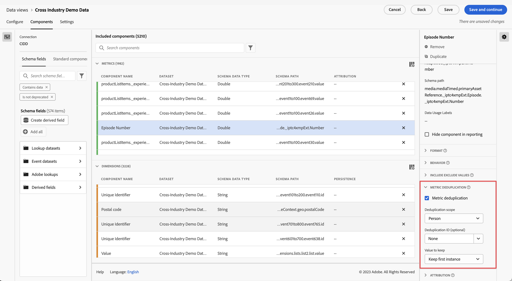

# Metric deduplication component settings {#metric-deduplication-component-settings}

<!-- markdownlint-disable MD034 -->

>[!CONTEXTUALHELP]
>id="dataview_component_metric_deduplication"
>title="Metric deduplication"
>abstract="Configure a metric to only count values that occur non-repetitively."

<!-- markdownlint-enable MD034 -->

Metric deduplication lets you configure a metric to only count values non-repetitively.

| Setting | Description |
| --- | --- |
| [!UICONTROL Metric deduplication] | A checkbox that allows you to enable metric deduplication. Disabled by default. |
| [!UICONTROL Deduplication scope] | Lets you determine how far back the unique check goes. **[!UICONTROL Global account]**: Only the first metric occurrence in the reporting window is counted. **[!UICONTROL Account]**: Only the first metric occurrence in the reporting window is counted. **[!UICONTROL Opportunity]**: Only the first metric occurrence in the reporting window is counted. **[!UICONTROL Buying group]**: Only the first metric occurrence in the reporting window is counted. **[!UICONTROL Person]**: Only the first metric occurrence in the reporting window is counted. **[!UICONTROL Session]**: Only the first metric occurrence of the session is counted.  |
| [!UICONTROL Deduplication ID] | Instead of applying deduplication on the metric itself, allows you to apply metric deduplication based on a dimension instead. Valuable for dimensions like Purchase ID to apply deduplication. |
| [!UICONTROL Value to keep]|<ul><li>**Keep first instance**: Use this in situations where the initial instance of the metric is the valid one. The most common one would probably be a purchase confirmation. Even if someone inadvertently reloads the page and we get another instance of a purchase confirmation, the initial event is the valid one.</li><li>**Keep last instance**: Use this in situations where the last instance makes more sense to collect. Example: Someone makes an update to their online profile. We only want to count one of these updates per session. However, they may update their profile multiple times during the session. If we keep the first instance, there could be activities which would not tie to the event. In this case, it makes more sense to keep the last instance.</li></ul> |

{style="table-layout:auto"}

>[!CAUTION]
>
>Deduplication at a _person_ scope is evaluated by complete months in UTC time. A partial-month reporting window may not display all first or last instances, if some occurred within the full month but outside of the reporting dates.
