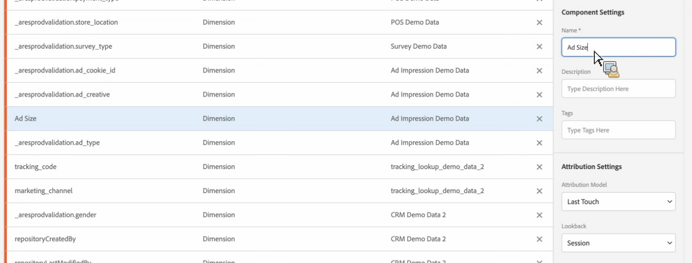

# Component and attribution settings

eVars, props, and events in the traditional Adobe Analytics sense no longer exist in Customer Journey Analytics. Instead, you have unlimited schema elements (dimensions, metrics, list fields). All of the attribution settings that you used to apply to eVars and props during the data collection process are now applied at query time - also known as report-time processing. 

Keep this in mind before you apply attribution settings:

* In the data views user interface, you specify the default attribution. **Note**: At a later date, you will be able to override these settings in Workspace projects. However, this functionality is not currently available.

* Attribution settings in Customer Journey Analytics are non-destructive and retroactive. In other words, you cannot do irreparable harm to your datasets in Customer Journey Analytics. Even if you accidentally delete something, you can always go back to Experience Platform and bring the dataset back in. (Keep in mind, however, that bringing the dataset back in will incur additional cost.)

* If you wish to have a dimension "behave" like a traditional eVar (conversion variable), you should configure it with "Last Touch Visit" attribution by default.

* If you wish to have a dimension "behave" like a traditional prop (traffic variable), you should configure it with "Same Touch" attribution by default.

* If you wish to have a metric "behave" like a default metric, you shouldn't change anything.

## Specify component and attribution settings

After you have [set and saved data view settings](/help/data-views/create-dataview.md) and added components, you are ready to specify  attribution settings, if you choose to do so.

>[!IMPORTANT]
>If you do not 

1. Specify component and attribution settings for dimensions and metrics. See below for information on individual settings.

1. Click **[!UICONTROL Save]** to save your data view.

### Component Setting

You can change the name of the metric or dimension to something more user friendly. Note that the underlying name does not change, just the display name.

### Attribution Model

The model describes the distribution of conversions to the events in a group. For example, first touch or last touch. Determines how Customer Journey Analytics assigns credit for a success event if a variable receives multiple values before the event. 

| UI icon | Attribution model | Definition | When to use |
| --- | --- | --- | --- |
|  | Last Touch | Gives 100% credit to the touch point occurring most recently before conversion. | The most basic and common attribution model. It is frequently used for conversions with a short consideration cycle. Last Touch is commonly used by teams managing search marketing or analyzing internal search keywords. |
|  | First Touch | Gives 100% credit to the touch point first seen in the attribution lookback window. | Another common attribution model useful for analyzing marketing channels intended to drive brand awareness or customer acquisition. It is frequently used by display or social marketing teams, but is also great for assessing onsite product recommendation effectiveness. |
|  | Same Touch | Gives 100% credit to the very hit where the conversion occurred. If a touch point does not happen on the same hit as a conversion, It is bucketed under "None". | A helpful model when evaluating the content or user experience that was presented immediately at the time of conversion. Product or design teams often use this model to assess the effectiveness of a page where conversion happens. |
|  | Linear | Gives equal credit to every touch point seen leading up to a conversion. | Useful for conversions with longer consideration cycles or user experiences that need more frequent customer engagement. It is often used by teams measuring mobile app notification effectiveness or with subscription-based products. |
|  | U-Shaped | Gives 40% credit to the first interaction, 40% credit to the last interaction, and divides the remaining 20% to any touch points in between. For conversions with a single touch point, 100% credit is given. For conversions with two touch points, 50% credit is given to both. | A great model for those who value interactions that introduced or closed a conversion, but still want to recognize assisting interactions. U-Shaped attribution is commonly used by teams who take a more balanced approach but want to give more credit to channels that found or closed a conversion. |
|  | J-Shaped | Gives 60% credit to the last interaction, 20% credit to the first interaction, and divides the remaining 20% to any touch points in between. For conversions with a single touch point, 100% credit is given. For conversions with two touch points, 75% credit is given to the last interaction, and 25% credit is given to the first. | This model is great for those who prioritize finders and closers, but want to focus on closing interactions. J-Shaped attribution is frequently used by teams who take a more balanced approach and want to give more credit to channels that closed a conversion. |
|  | Inverse J | Gives 60% credit to the first touch point, 20% credit to the last touch point, and divides the remaining 20% to any touch points in between. For conversions with a single touch point, 100% credit is given. For conversions with two touch points, 75% credit is given to the first interaction, and 25% credit is given to the last. | This model is ideal for those who prioritize finders and closers, but want to focus on finding interactions. Inverse J attribution is used by teams who take a more balanced approach and want to give more credit to channels that initiated a conversion. |
|  | Custom | Allows you to specify the weights you want to give to first touch points, last touch points, and any touch points in between. Values specified are normalized to 100% even if the custom numbers entered do not add to 100. For conversions with a single touch point, 100% credit is given. For interactions with two touch points, the middle parameter is ignored. The first and last touch points are then normalized to 100%, and credit is assigned accordingly. | This model is perfect for those who want full control over their attribution model and have specific needs that other attribution models do not fulfill. |
|  | Time-Decay | Follows and exponential decay with a custom half-life parameter, where the default is 7 days. The weight of each channel depends on the amount of time that passed between the touch point initiation and the eventual conversion. The formula used to determine credit is `2``(-t/halflife)`, where `t` is the amount of time between a touch point and a conversion. All touch points are then normalized to 100%. | Great for teams who regularly run video advertising or market against events with a predetermined date. The longer a conversion happens after a marketing event, the less credit is given. |
|  | Participation | Gives 100% credit to all unique touch points. The total number of conversions is inflated compared to other attribution models. Participation deduplicates channels that are seen multiple times. | Excellent for understanding who often customers are exposed to a given interaction. Media organizations frequently use this model to calculate content velocity. Retail organizations often use this model to understand which parts of their site are critical to conversion. |

### Expiration

Specifies a time period, or event, after which the dimension value expires (no longer receives credit for success events). You can set the attribution expiration at the session, person, or custom level.

|Setting|Definition|
|---|---|
|Session|Formerly known as the 'Visit' level. Conversion events beyond the page view or session do not associate with the dimension or metric.|
|Person (Reporting Window)|Formerly known as the 'Visitor' level. Conversion events not tied to this person do not associate with the dimension or metric.|
|Custom Time|Specify the custom minutes, hours, days, months, or quarters. Conversion events beyond the specified time period do not associate with the dimension or metric.|

For more information, see the [Attribution IQ doc](https://docs.adobe.com/content/help/en/analytics/analyze/analysis-workspace/panels/attribution/attribution.html).