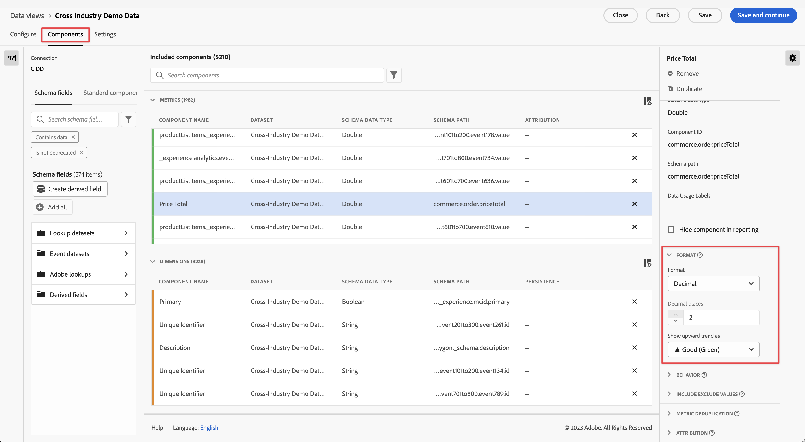

# Create a new data view

Creating a data view involves either creating metrics and dimensions from schema elements or utilizing standard components. Creating metrics or dimensions gives you an enormous amount of flexibility. Previously, the assumption was that if you had datasets in Adobe Experience Platform, string fields were used as dimensions and numeric fields were used as metrics. In order to change any of these fields, you had to edit your schema in Platform. The data views UI now allows a [more freeform definition of metrics and dimensions](/help/data-views/data-views.md). For more use cases, see [Data views use cases](/help/data-views/data-views-usecases.md).

## 1. Configure Data Views settings and containers

1. In Customer Journey Analytics, go to the **[!UICONTROL Data Views]** tab.
2. Click **[!UICONTROL Add]** to create a new data view and configure its settings.

| Setting | Description/Use case |
| --- | --- |
| [!UICONTROL Connection] | This field links the data view to the connection that you established earlier, which contains one or more Adobe Experience Platform dataset/s.|
| [!UICONTROL Name] | Giving the data view a name is mandatory. |
| [!UICONTROL Description] | A detailed description is not mandatory but is recommended. |
| [!UICONTROL Time zone] | Choose which time zone you want your data to be presented in. |
| [!UICONTROL Tags] | [!UICONTROL Tags] let you organize your data views into categories. |
| [!UICONTROL Containers] | You can rename your containers here to determine how they appear in any Workspace project that is based on this data view. [!UICONTROL Containers] are used in filters and fallout/flow, and so on, to define how broad or narrow the scope or context is. [Learn more](https://experienceleague.adobe.com/docs/analytics-platform/using/cja-components/cja-filters/filters-overview.html?lang=en#filter-containers) |
| [!UICONTROL Person container name is…] | [!UICONTROL Person] (default). The [!UICONTROL Person] container includes every visit and page view for visitors within a specified time frame. You can rename this container to 'User' or any other term you prefer. |
| [!UICONTROL Session container name is…] | [!UICONTROL Session] (default). The [!UICONTROL Session] container lets you identify page interactions, campaigns, or conversions for a specific session. You can rename this container to 'Visit' or any other term you prefer. |
| [!UICONTROL Event container name is…] | [!UICONTROL Event] (default). The [!UICONTROL Event] container defines which page events you would like to include or exclude from a filter. |

Next, you can create metrics and dimensions from schema elements. You can also use Standard components.

## 2. Create metrics and dimensions from schema elements

1. In [!UICONTROL Customer Journey Analytics] > [!UICONTROL Data Views], click the [!UICONTROL Components] tab.

You can see the [!UICONTROL Connection] at the top left, which contains the datasets, and its [!UICONTROL Schema fields] below. Keep in mind that:

* The components already included are the standard required components (system generated.) 
* Adobe applies the filter **[!UICONTROL Contains data]** by default, so that only Schema fields that contain data appear. If you are looking for a field that does not contain data, remove the filter.

1. Now drag a schema field, such as [!UICONTROL pageTitle], from the left rail into the Metrics or Dimensions section. 

   You can drag the same schema field into the dimensions or metrics sections multiple times and configure the same dimension or metric in different ways. 
   For example, from the **[!UICONTROL pageTitle]** field, you can create a dimension called "Product Pages", and another one "Error pages", etc., by renaming the **[!UICONTROL Component Name]** on the right. From the **[!UICONTROL pageTitle]**; field, you can also create metrics from a string value. For example,you could create one or more **[!UICONTROL Orders]** metrics with different attribution settings and different include/exclude values.

   

   >[!NOTE]
   >
   >You can drag in whole schema field folders from the left rail and they will automatically be sorted into traditional sections. String fields will end up in the [!UICONTROL Dimensions] section and numerics in the [!UICONTROL Metrics] section. Or, you can click **[!UICONTROL Add all]** and all schema fields will be added.

1. Once you select the component, you see a number of settings appear on the right. Configure the component using the settings described below.

### Configure Component Settings

| Setting | Description/Use case |
| --- | --- |
| [!UICONTROL Component type] | Required. Allows you to change a component from Metric to Dimension or vice versa. |
| [!UICONTROL Component Name] | Required. Lets you specify the friendly name that will appear in Analysis Workspace. You can rename a component to give it a data-view-specific name. |
| [!UICONTROL Description] | Optional, but recommended, to provide information on the component for other users. |
| [!UICONTROL Tags] | Optional. Lets you tag the component with custom or out-of-the-box tags for easier searching/filtering in the Analysis Workspace UI. |
| [!UICONTROL Field Name] | The name of the schema field. |
| [!UICONTROL Dataset type] | Required. A non-editable field showing which dataset type (event, lookup, or profile) the component came from. |
| [!UICONTROL Dataset] | Required. A non-editable field showing which type of field the component came from (e.g. String, Integer, etc.). This field can contain multiple datasets. |
| [!UICONTROL Schema Data Type] | Refers to whether the component is a string, integer, and so on.  While you can use any supported schema field type in Platform, not all fields types are supported in CJA. You can add datasets to CJA with schema field types other than strings or integers, but CJA cannot display that data. In addition, only Strings are allowed in Lookup datasets at this time. |
| [!UICONTROL Component ID] | Required. The [CJA API](https://adobe.io/cja-apis/docs) uses this field to reference the component. You can click the edit icon and modify this component ID. However, changing this component ID breaks all existing Workspace projects that contain this component. If you ever create another data view that uses a different field for a pageTitle dimension, you can rename it and make the dimension cross-data view compatible. |
| [!UICONTROL Schema Path] | Required. A non-editable field showing the schema path that the component came from. |
| [!UICONTROL Hide component in reporting] | Default = off. Lets you curate the component out of the Data View when used in reporting. This does not impact permissions, just component curation. In other words, you can hide the component from non-Admins in reporting. Admins can still access it by clicking [!UICONTROL Show All Components] in an Analysis Workspace project. |

### Configure Format settings

Format settings are for metrics only.

| Setting | Description/Use case |
| --- | --- |
| [!UICONTROL Format] | Lets you specify the formatting of a metric, as Decimal, Time, Percent, or Currency. |
| [!UICONTROL Decimal Places] | Lets you specify the number of decimal places a metric should display. |
| [!UICONTROL Show upward trend as] | Lets you specify whether an upward trend on this metric should be considered good (green) or bad (red). |
| [!UICONTROL Currency] | This setting appears only if the selected metric format is [!UICONTROL Currency]. A list of currency options are available. Defaults to no currency. This allows you to represent revenue in the currency of your choice in reporting. This is not a currency conversion, just a UI formatting option. |

### Configure Attribution settings

| Setting | Description/Use case |
| --- | --- |
| [!UICONTROL Set attribution] | Lets you specify the attribution settings you want to apply to this metric by default when it is used. This default can be overridden in a [!UICONTROL Freeform Table] or in a Calculated Metric. |
| [!UICONTROL Attribution model] | Lets you specify a default attribution model - only active when you turn on the [!UICONTROL Use Non-default attribution model] setting. Defaults to [!UICONTROL Last Touch]. Options are: Last Touch, First Touch, Linear, Participation, Same Touch, U-Shaped, J Curve, Inverse J, Time Decay, Custom, Algorithmic. Some of these options create additional fields that need to be filled out - like Custom or Time Decay. You can create multiple metrics using the same field - this means you can have one [!UICONTROL Last touch] revenue metric and one [!UICONTROL First Touch] revenue metric, but based on the same revenue field in the schema. |
| [!UICONTROL Lookback window] | Lets you specify a default lookback window to a metric - only active when you turn on the [!UICONTROL Use Non-default attribution model] setting. Options are: [!UICONTROL Person] (Reporting Window), [!UICONTROL Session], [!UICONTROL Custom]. When [!UICONTROL Custom] is selected, we also give you the option to select any number of days/weeks/months/etc. (up to 90 days), just like [!UICONTROL Attribution IQ]. You can have multiple metrics using the same schema field, but each with a separate lookback window. |

### Configure Include/Exclude Values settings

This setting allows you to modify the underlying data that you are reporting on, at query time. It is not the same as a filter. But filters will respect this new dimension, as will pathing and attribution.

For example, you could create a dimension out of the pageTitle field, but call it "error pages" and include any page that [!UICONTROL contains the phrase] "error".

| Setting | Description/Use case |
| --- | --- |
| [!UICONTROL Case sensitive] | Default = On. This setting applies only to the [!UICONTROL Include/Exclude Values] section. It allows you to say whether the include/exclude rule you are applying should be case sensitive. |
| [!UICONTROL Match] | Lets you specify which values you would like to consider for reporting prior to attribution and filters (e.g., only use values containing the phrase "error"). You can specify: **[!UICONTROL If all criteria are met]**, or **[!UICONTROL If any criteria are met]**. |
| [!UICONTROL Criteria] | Lets you specify the match logic that should be applied to a specific filter rule.<ul><li>**String**: Contains the phrase, Contains any term, Contains all terms, Does not contain any term, Does not contain the phrase, Equals, Does not equal, Starts with, Ends wit</li><li>**Double/Integer**: equals, does not equal, is greater than, is less than, is greater than or equal to, is less than or equal to</li><li>**Date**: equals, does not equal, is later than, is before, occurs within</li></ul> |
| [!UICONTROL Match operand] | Lets you specify the match operand that the match operator should be applied to.<ul><li>**String**: Text field</li><li>**Double/Integer**: Text Field with up/down arrows for numeric values</li><li>**Date**: Day granularity selector (calendar)</li><li>**Date Time**: Date and time granularity selector</li></ul> |
| [!UICONTROL Add rule] | Lets you specify an additional match operator and operand. |

### Configure Behavior settings

Lets you specify how a metric should behave in reporting.

| Setting | Description/Use case |
| --- | --- |
| [!UICONTROL Count values] | For Boolean metrics only, this setting allows you to specify whether you want to [!UICONTROL Count True], [!UICONTROL Count False], or [!UICONTROL Count True or False] as the metric value. The default is [!UICONTROL Count True]. This gives you the actual value of a metric, such as “50” if there was an order value of 50. |
| [!UICONTROL Count instances] | Lets you specify whether a numeric or date type field used as a metric should count the times it was set rather than the value itself.  If you want to add up the instances of a numeric field and want to simply add up the number of times a field was *set* rather than the actual value inside. This is useful for creating an [!UICONTROL Orders] metric from a [!UICONTROL Revenue] field, for example. If revenue was set, then we want to count 1 single order rather than the numeric revenue amount. |

### Configure [!UICONTROL No Value Options] settings

[!UICONTROL No Value Options] settings are analogous to [!UICONTROL Unspecified] or [!UICONTROL None] values in reporting. In the data views UI, on a component-by-component basis, you can decide how you want these values to be treated in reporting. You can also rename [!UICONTROL No value] to something that better suits your environment, such as [!UICONTROL Null], [!UICONTROL Not set], or others.

Also note that whatever you specify in this field can be used for special UI treatment of the [!UICONTROL No Value] line item in reporting as stated in the [!UICONTROL No Value Options] setting.

| Setting | Description/Use case |
| --- | --- |
| [!UICONTROL If shown, call No value...] | This is where you can rename **[!UICONTROL No value]** to something else. |
| [!UICONTROL Don't show No value by default] | Does not show this value in reporting. |
| [!UICONTROL Show No value by default] | Does show this value in reporting. |
| [!UICONTROL Treat No value as a value] | This setting will replace blank values in the data with the text that you specified under [!UICONTROL If shown, call No value ...]. For example, if you had Mobile device types as the dimension, you could rename the **[!UICONTROL No value]** item to "Desktop". Note that when you change this field to a custom value, the custom value will be treated as a legitimate string value. Therefore, if you enter the value "Red" into this field, any instances of the string "Red" appearing in the data itself will also roll under the same line item that you have specified.|

### Configure Persistence settings

For more information, see the topic on [Persistence](/help/data-views/persistence.md).

| Setting | Description/Use case |
| --- | --- |
| [!UICONTROL Set persistence] | Toggle key |
| [!UICONTROL Allocation] | Lets you specify the allocation model used on a dimension for persistence. Options are: [!UICONTROL Most recent], [!UICONTROL Original], [!UICONTROL Instance], [!UICONTROL All]. If you want a value to persist (similar to eVars in traditional Analytics), this is where you'd set it. The only key difference is that the maximum persistence you can set is 90 days. Also, [!UICONTROL Never expire] is not an option. |
| [!UICONTROL Expiration] | Lets you specify the persistence window for a dimension. Options are: [!UICONTROL Session] (default), [!UICONTROL Person], [!UICONTROL Time], [!UICONTROL Metric]. You might need to be able to expire the dimension on a purchase (such as internal search terms or other merchandising use cases). [!UICONTROL Metric] lets you specify any of the defined metrics as the expiration for this dimension (e.g., a [!UICONTROL Purchase] metric). **Note**: You cannot set a custom expiration for a dimension when you select an allocation of [!UICONTROL All]. |

### Configure Value Bucketing settings

For example, a bucket of ‘between 5 and up to 10’ will appear as a line item ‘5 to 10’ in Workspace reporting.

 

| Setting | Description/Use case |
| --- | --- |
| [!UICONTROL Bucket value] | Allows you to create a bucketed version of a numeric dimension. This lets you report on buckets of revenue or other numeric values as a dimension in reporting. |
| [!UICONTROL Up to] | Lets you specify the boundaries of the first numeric dimension bucket. This applies to numeric dimensions only. |
| [!UICONTROL Between and up to] | Lets you specify the boundaries of subsequent numeric dimension buckets. |
| [!UICONTROL Add bucket] | Lets you add another bucket to numeric dimension bucketing. |

### Use [!UICONTROL Standard components]

Besides creating metrics and dimensions from schema elements, you can also use standard components in your data views.

[!UICONTROL Standard components] are components that are not generated from dataset schema fields but are instead system generated. Some system components are required in any data view to facilitate reporting capabilities in Analysis Workspace, while other system components are optional.

These required standard components are added to each data view by default.

| Component Name | Dimension or Metric | Notes |
| --- | --- | --- |
| [!UICONTROL People] | Metric | This metric is based on the person ID specified in a [!UICONTROL Connection]. |
| [!UICONTROL Sessions] | Metric | This metric is based on the sessionization settings specified below. |
| [!UICONTROL Events] | Metric | This metric represents the number of rows from all event datasets in a [!UICONTROL Connection]. |
| [!UICONTROL Day] | Dimension | The ‘Day’ dimension reports the day that a given metric occurred. The first dimension item is the first day in the date range, and the last dimension item is the last day in the date range. |
| [!UICONTROL Week] | Dimension | The ‘Week’ dimension reports the week that a given metric occurred. The first dimension item is the first week in the date range, and the last dimension item is the last week in the date range.|
| [!UICONTROL Month] | Dimension | The Month dimension reports the month that a given metric occurred. The first dimension item is the first month in the date range, and the last dimension item is the last month in the date range. |
| [!UICONTROL Quarter] | Dimension | The ‘Quarter’ dimension reports the quarter that a given metric occurred. The first dimension item is the first quarter in the date range, and the last dimension item is the last quarter in the date range. |
| [!UICONTROL Year] | Dimension | The ‘Year’ dimension reports the year that a given metric occurred. The first dimension item is the first year in the date range, and the last dimension item is the most recent year in the date range. |
| [!UICONTROL Hour] | Dimension | The ‘Hour’ dimension reports the hour that a given metric occurred (rounded down). The first dimension item is the first hour in the date range, and the last dimension item is the last hour in the date range. |
| [!UICONTROL Minute] | Dimension | The ‘Minute’ dimension reports the minute that a given metric occurred (rounded down). The first dimension item is the first minute in the date range, and the last dimension item is the last minute in the date range. |

### Optional Standard components

Optional Standard components are available under the **[!UICONTROL Standard Components]** tab.

| Component Name | Dimension or Metric | Notes |
| --- | --- | --- |
| [!UICONTROL Session Starts] | Metric | This metric counts the number of events that were the first event of a session. When used in a filter definition (e.g. '[!UICONTROL Session Starts] exists'), it filters down to just the first event of every session. |
| [!UICONTROL Session Ends] | Metric | This metric counts the number of events that were the last event of a session. Similar to [!UICONTROL Session Starts], it can also be used in a filter definition to filter things down to the last event of every session. |
| [!UICONTROL Time Spent (seconds)] | Metric | The [!UICONTROL Time Spent] metric adds up the time between two different values for a dimension. |
| [!UICONTROL Time Spent per Event] | Dimension | [!UICONTROL Time Spent per Event] buckets the [!UICONTROL Time Spent] metric into [!UICONTROL Event] buckets. |
| [!UICONTROL Time Spent per Session] | Dimension | [!UICONTROL Time Spent per Session] buckets the [!UICONTROL Time Spent] metric into [!UICONTROL Session] buckets. |
| [!UICONTROL Time Spent per Person] | Dimension | [!UICONTROL Time Spent per Person] buckets the [!UICONTROL Time Spent] metric into [!UICONTROL Person] buckets. |
| [!UICONTROL Batch ID] | Dimension | Represents the Experience Platform batch that an [!UICONTROL Event] was part of. |
| [!UICONTROL Dataset ID] | Dimension | Represents the Experience Platform dataset that an [!UICONTROL Event] was part of. |

## Use the [!UICONTROL Duplicate] feature

Duplicating metrics or dimensions and then modifying specific settings is an easy way to create multiple metrics or dimensions from a single schema field. Just select the [!UICONTROL Duplicate] setting underneath the metric's or dimensions's name at the top right. Then modify the new metric or dimension and save it under a more descriptive name.

### Filter schema fields and dimensions/metrics

You can filter schema fields in the left rail by the following data types:

You can also filter by datasets and by whether a schema field contains data or whether it is an identity. By default, we apply the **[!UICONTROL Contains data]** filter to all data views.

## Add a global filter to you data view

You can add filters that apply to your entire data view. This filter will be applied to any report that you run in Workspace.

1. Click the [!UICONTROL Settings] tab in [!UICONTROL Data views].
1. Drag a filter from the list in the left rail to the [!UICONTROL Add filters] field.
