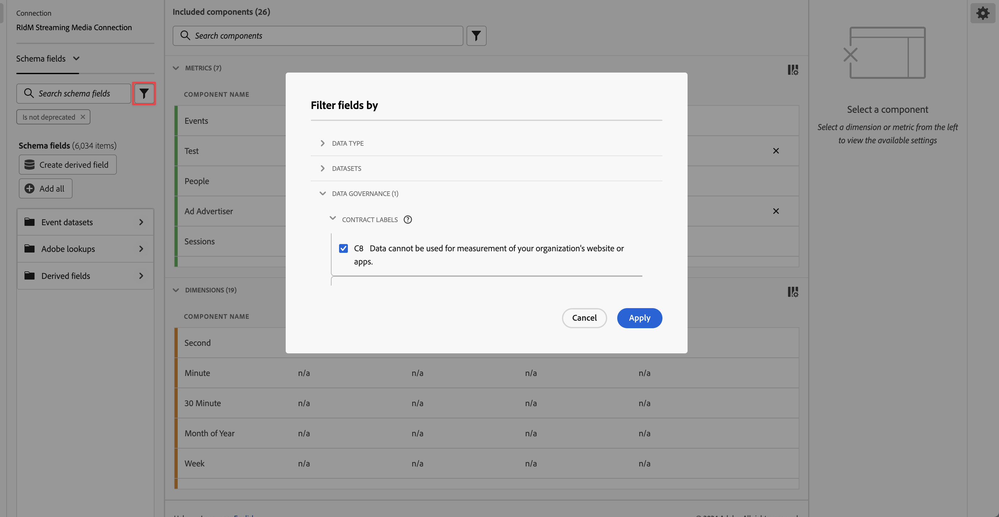
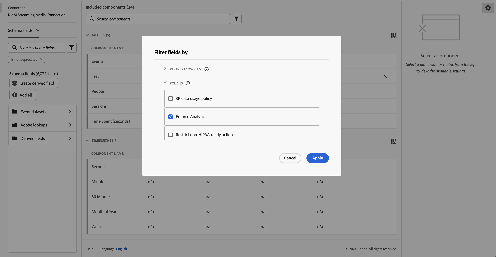

# Labels and policies

When you create a dataset in Experience Platform, you can create [data usage labels](https://experienceleague.adobe.com/docs/experience-platform/data-governance/labels/reference.html?lang=en) for some or all of the elements in the dataset. You can view these labels and policies in Customer Journey Analytics. 

The following labels are of special interest to Customer Journey Analytics:

* The `C8` label - **[!UICONTROL No measurement]**. This label signifies that data cannot be used for analytics on your organization's websites or apps.

* The `C12` label - **[!UICONTROL No General Data Export]**. Schema fields labeled this way cannot be exported or downloaded from Customer Journey Analytics (via reporting, export, API, etc.)

>[!NOTE]
>
>Data usage labels are not automatically propagated to stitched datasets. They can, however, be added manually.

Labeling in itself does not mean that these data usage labels are enforced. That's what policies are used for. You create your policies using the [Experience Platform UI](https://experienceleague.adobe.com/docs/experience-platform/data-governance/policies/user-guide.html?lang=en) or via the [Policy Service API](https://experienceleague.adobe.com/docs/experience-platform/data-governance/api/overview.html?lang=en) in Experience Platform.

Two Adobe-defined policies are surfaced in Customer Journey Analytics and affect reporting and download/sharing:

* **[!UICONTROL Enforce Analytics]** policy
* **[!UICONTROL Enforce Download]** policy

## View data labels in Customer Journey Analytics data views

Data labels that were created in Experience Platform are shown in three locations in the data views user interface:

| Location | Description |
| --- | --- |
| Info button on a schema field | Clicking this button indicates which [!UICONTROL Data Usage Labels] currently apply to a field:
 |
| Right rail under [Component settings](/help/data-views/component-settings/overview.md) | Any [!UICONTROL Data Usage Labels] are listed here:
 |
| Add Data Labels as a column | You can add [!UICONTROL Data Usage Labels] as a column to the [!UICONTROL Included Components] columns in data views. Just click the column selector icon and select **[!UICONTROL Data Usage Labels]**:
 |

{style="table-layout:auto"}

## Filter on Data Governance labels in data views

In the data views editor, click the [!UICONTROL filter] icon in the left trail and filter the data views components by **[!UICONTROL Data Governance]** and type of **[!UICONTROL Label]**:

Click **[!UICONTROL Apply]** to see which components have labels attached to them.

## Filter on Data Governance policies in data views

You can check to see if a policy is turned on that blocks the use of certain Customer Journey Analytics data view elements for analytics or export purposed. 

Again, click the [!UICONTROL filter] icon in the left rail and under **[!UICONTROL Data Governance]**, click **[!UICONTROL Policies]**:

Click **[!UICONTROL Apply]** to see which policies that are enabled.

## How enabled policies affect data views

If the **[!UICONTROL Enforce Analytics]** or **[!UICONTROL Enforce Download]** policies are turned on, those schema components that have certain data labels (such as C8 or C12) associated with them cannot be added to data views. 

These components are greyed out in the left rail [!UICONTROL Schema fields] list:

You also cannot save a data view that has blocked fields in it.

>[!MORELIKETHIS]
>[Download sensitive data](/help/analysis-workspace/export/download-send.md)

>[!MORELIKETHIS]
>[What are restricted labels in Report Builder?](https://experienceleague.adobe.com/docs/analytics-platform/using/cja-reportbuilder/restricted-labels.html?lang=en)

