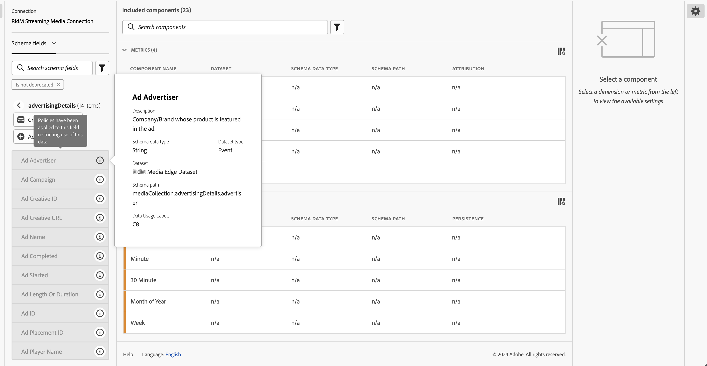

# Labels, policies, and marketing actions

When you create a dataset in Experience Platform, you can create [data usage labels](https://experienceleague.adobe.com/en/docs/experience-platform/data-governance/labels/reference) for some or all elements in the dataset. You can view these labels and policies in Customer Journey Analytics. 

The following labels and marketing actions are of special interest to Customer Journey Analytics:

| Label | Marketing action | Definition |
|---------|----------|---------|
| `C2` | [!UICONTROL Export to third parties] | The label and associated marketing action signify that data cannot be exported to a third party, if the corresponding DULE policy is enabled. |
| `C3` | [!UICONTROL Combine with directly identifiable data] | The label and associated marketing action signify that data cannot be combined or otherwise used with directly identifiable information, if the corresponding DULE policy is enabled. |
| `C8` | [!UICONTROL Analytics] | The label and associated marketing action signify that data cannot be used for analytics on your organization's websites or apps, if the corresponding DULE policy is enabled. |
| `C9` | [!UICONTROL Data Science] | The label and associated marketing action signify that data cannot be used in data science workflows, if the corresponding DULE policy is enabled. |
| `C12` | [!UICONTROL Data Export] | The label and associated marketing action signify that schema fields labeled this way cannot be exported or downloaded from Customer Journey Analytics (via reporting, export, API, and so forth), if the corresponding DULE policy is enabled. |

>[!NOTE]
>
>Data usage labels are not automatically propagated to stitched datasets. They can, however, be added manually.

Labeling in itself does not mean that these data usage labels are enforced. That's what policies are used for. You can create your policies using the [Experience Platform UI](https://experienceleague.adobe.com/en/docs/experience-platform/data-governance/policies/user-guide) or via the [Policy Service API](https://experienceleague.adobe.com/en/docs/experience-platform/data-governance/api/overview) in Experience Platform.

Five Adobe-defined policies are available in Experience Platform that can surface in Customer Journey Analytics and affect reporting and data export:

| Policy | Label | 
|---------|----------|
| [!UICONTROL Restrict third-party data export] | `C2` |
| [!UICONTROL Restrict directly identifiable data combination] | `C3` |
| [!UICONTROL Restrict usage analytics and user based measurement] | `C8` |
| [!UICONTROL Restrict data science] | `C9` |
| [!UICONTROL Restrict data export] | `C12` |

## View data labels in Customer Journey Analytics data views

Data labels that you or others created in Experience Platform are shown in three locations in the data views user interface:

| Location | Description |
| --- | --- |
| Info button on a schema field | Clicking this button indicates which [!UICONTROL Data Usage Labels] currently apply to a field:
 |
| Right rail under [Component settings](/help/data-views/component-settings/overview.md) | Any [!UICONTROL Data Usage Labels] are listed here:
 |
| Add Data Labels as a column | You can add [!UICONTROL Data Usage Labels] as a column to the [!UICONTROL Included Components] columns in data views. Just select the column selector icon and select **[!UICONTROL Data Usage Labels]**:
 |

{style="table-layout:auto"}

## Filter on Data Governance labels in data views

In the data views editor, select the [!UICONTROL filter] icon in the left trail and filter the data views components by **[!UICONTROL Data Governance]** and type of **[!UICONTROL Label]**:

Click **[!UICONTROL Apply]** to see which components have labels attached to them.

## Filter on Data Governance policies in data views

You can check to see if a policy (for example, a policy you created, named **[!UICONTROL Enforce Analytics]**) is turned on. And whether that policy blocks the use of certain Customer Journey Analytics data view elements for analytics or data export. 

Again, select the [!UICONTROL filter] icon in the left rail and under **[!UICONTROL Data Governance]**, select **[!UICONTROL Policies]**:

Click **[!UICONTROL Apply]** to see which policies are enabled.

## How enabled policies affect data views

If one or more policies are turned on with C1, C2, C3, C8, C9, or C12 labels, those schema components that have certain data labels applied cannot be added to data views. 

These components are grayed out in the left rail [!UICONTROL Schema fields] list:

You also cannot save a data view that has blocked fields in it.

Be cautious to try to apply access and data governance labels (through policies) on fields or field groups in Experience Platform, for which you already have components defined in your data view. You might see this dialog.

You first need to resolve the violation (for example remove the components from the data view).

>[!MORELIKETHIS]
>
>[Download sensitive data](/help/analysis-workspace/export/download-send.md)

>[!MORELIKETHIS]
>
>[What are restricted labels in Report Builder?](https://experienceleague.adobe.com/en/docs/analytics-platform/using/cja-reportbuilder/restricted-labels)

