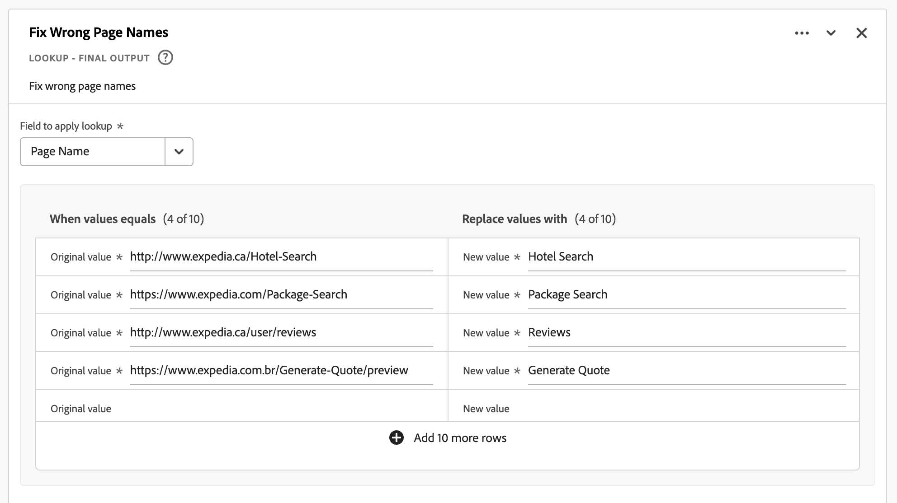

# Derived fields

Derived fields are an important aspect of the real-time reporting functionality in Customer Journey Analytics (CJA). A derived field allows you to define (often complex) data manipulations on the fly, through a customizable rule builder. You can then use that derived field as a component (metric or dimension) in [Workspace](../../analysis-workspace/home.md) or even further define the derived field as a component in [Data view](../data-views.md). 

Derived fields can save a significant amount of time and effort, compared to transforming or manipulating your data in other locations outside of CJA. Such as [Data Prep](https://experienceleague.adobe.com/docs/experience-platform/data-prep/home.html), [Data Distiller](https://experienceleague.adobe.com/docs/experience-platform/query/data-distiller/overview.html?lang=en), or within your own Extract Transform Load (ETL) / Extract Load Transform (ELT) processes.

Derived fields are defined within [Data views](../data-views.md), are based on a set of functions defined as rules, and applied to available standard and/or schema fields.

Example use cases are:

- Define a derived Page Name field that corrects improper collected page name values to correct page name values. 

- Define a derived Marketing Channel field that determines the proper marketing channel based on one or more conditions (for example URL parameter, page URL, page name).

## Derived field interface

When you create or edit a derived field, you use the derived field interface.

|  | Name | Description |
|---------|----------|--------|
| 1 | **Selector** | You use the selector area to select and drag and drop your function, function template, schema field, or standard field on to the rule builder.  Use the drop-down to select between:   [!UICONTROL Functions] - lists available [functions](#function-reference),   [!UICONTROL Function templates] - lists available [function templates](#function-templates),    [!UICONTROL Schema fields] - lists fields available from dataset categories (event, profile, lookup) and previously defined derived fields, and   [!UICONTROL Standard fields] - standard available fields (like Platform Dataset ID). Only string and numeric standard fields are displayed in the selector. If the function supports other data types, standard fields with these other data types can be selected for values or fields within the rule interface. You can search for function, function templates, schema, and standard fields using the  Search box.  You can filter the selected object list by selecting  Filter and specify filters in the [!UICONTROL Filter fields by] dialog. You can easily remove filters using  for each filter. | 
| 2 | **Rule builder** | You build your derived field sequentially using one or more rules. A rule is a specific implementation of a function and is therefore always associated with only one function. You create a rule by dragging and dropping a function into the rule builder. The function type determines the interface of the rule. See the [Rule interface](#rule-interface) for more information.  You can insert a function at the start, end, or in between rules already available in the rule builder. The last rule in the rule builder determines the final output of the derived field. |
| 3 | **[!UICONTROL **Field Settings**]** | You can name and describe your derived field and inspect its field type. | 
| 4 | **[!UICONTROL **Final Output**]** | This area shows an on-the-fly updated preview of output values, based on data over the last 30 days and the changes you make to the derived field in the rule builder. |

{style="table-layout:auto"}

## Field template wizard

When you access the derived field interface for the first time, the [!UICONTROL Start with a field template] wizard is shown. 

1. Select the template that best describes the type of field you are trying to create. 
2. Select the **[!UICONTROL **Select**]** button to continue.

Your derived field dialog is populated with rules (and functions) required or useful for the type of field that you selected. See [Function templates](#function-templates) for more information on the available templates.

## Rule interface

When you define a rule in the rule builder, you use the rule interface.

|  | Name | Description |
|---------|----------|--------|
| A | **Rule Name** | By default the rule name is **Rule X** (X referring to a sequence number). To edit the name of a rule, select its name and type in the new name, for example `Query Parameter`. |
| B | **Function Name** | The selected function name for the rule, for example [!UICONTROL URL PARSE]. When the function is the last in the sequence of functions and determines the final output values, the function name is followed by [!UICONTROL - FINAL OUTPUT], for example [!UICONTROL URL PARSE - FINAL OUTPUT].  To show a popup with more information on the function, select . |
| C | **Rule Description** | You can optionally add a description to a rule. Select , then select **[!UICONTROL **Add Description**]** to add a description or **[!UICONTROL **Edit Description**]** to edit an existing description. Use the editor to enter a description. You can use the toolbar to format the text (using style selector, bold, italic, underline, right, left, centered, color, number list, bullet list) and adding links to external information.  To finish editing the description, click outside of the editor. |
| D | **Function Area** | Defines the logic of the function. The interface depends on the type of function. The dropdown for [!UICONTROL Field] or [!UICONTROL Value] shows all categories of fields (rules, standard fields, fields) available, based on the type of input the function expects. See [Function reference](#function-reference) on detailed information for each of the functions supported. |

{style="table-layout:auto"}

## Create a derived field

1. Select an existing Data view or create a Data view. See [Data views](../data-views.md) for more information.

2. Select the **[!UICONTROL **Components**]** tab of the Data view.

3. Select **[!UICONTROL **Create derived field**]** from the left rail.
   
4. To define your derived field, use the [!UICONTROL Create derived field] interface. See [Derived field interface](#derived-field-interface).

    To save your new derived field, select **[!UICONTROL **Save**]**.

5. Your new derived field is added to the [!UICONTROL Derived fields >] container, as part of **[!UICONTROL **Schema fields**]** in the left rail of your Data view.

## Edit a derived field

1. Select an existing Data view. See [Data views](../data-views.md) for more information.

2. Select the **[!UICONTROL **Components**]** tab of the Data view.

3. Select **[!UICONTROL **Schema fields**]** tab in the [!UICONTROL Connection] pane on the left.

4. Select **[!UICONTROL **Derived fields >**]** container.

5. Hover over the derived field that you want to edit, and select .

6. To edit your derived field, use the [!UICONTROL Edit derived field] interface. See [Derived field interface](#derived-field-interface).

   - Select **[!UICONTROL **Save**]** to save your updated derived field.

   - Select **[!UICONTROL **Cancel**]** to cancel any changes you made to the derived field.

   - Select **[!UICONTROL **Save As**]** to save the derived field as a new derived field. The new derived field has the same name as the original edited derived field with `(copy)` added to it.

## Delete a derived field

1. Select an existing Data view. See [Data views](../data-views.md) for more information.

2. Select the **[!UICONTROL **Components**]** tab of the Data view.

3. Select **[!UICONTROL **Schema fields**]** tab in [!UICONTROL Connection] pane.

4. Select **[!UICONTROL **Derived fields >**]** container.

5. Hover over the derived field that you want to delete, and select .

6. In the Use **[!UICONTROL **Edit derived field**]** interface, select Delete.

    A [!UICONTROL Delete component] dialog asks you to confirm the deletion. Consider any external references there might exist to the derived field outside of the Data view. 
    
   - Select **[!UICONTROL **Continue**]** to delete the derived field.

>[!NOTE]
>
>Derived fields are managed at a Connection level in CJA. Any change made to a derived field in any of the Data views associated with that Connection applies across all these associated Data views.

## Function templates

To quickly create a derived field for specific use cases, function templates are available. These function templates can be accessed from the selector area in the derived field interface or are presented upon first use in the [!UICONTROL Start with a field template] wizard.

### Marketing channels

This template is configured to use the [Url Parse](#dnl-url-parse) and [Case When](#dnl-case-when) functions multiple times to get appropriate values from a URL. Logic is then applied on these values to associate the URL to a specific marketing channel.

+++ Details

To use the template, you have to specify the correct parameters for each function listed as part of the rules in the template. See [Function reference](#function-reference) for more information.

+++

<!--

+++ Data clean up template

>[!WARNING]
>
>Could not find any information on this template.
+++

-->

## Function reference

For each supported function, find details below on:

- specifications: 
  - input data type: type of data supported,
  - input: possible values for input,
  - included operators: operators supported for this function (if any),
  - limitations: limitations that apply for this specific function,
  - output.

- use cases, including:
  - data before defining the derived field,
  - how to define the derived field,
  - data after defining the derived field.

- constraints (if applicable).

<!-- Concatenate -->

### Concatenate

Combines two or more fields, derived fields, or user-entered values into a single field with defined delimiters.

+++ Details

## Specifications {#concatenate-io}

| Input Data Type | Input | Included Operators | Limitations | Output |
|---|---|---|---|---|
| 
String
 | <ul><li>For each [!UICONTROL Value]:<ul><li>Rule</li><li>Standard field</li><li>Field</li><li>User-entered input</li></ul></li><li>For each [!UICONTROL Delimiter]:<ul><li>User-entered input</li></ul></li> </ul> | 
N/A
| 
2 functions per derived field
 | 
New derived field
 |

{style="table-layout:auto"}

## Use case {#concatenate-uc}

You currently collect origin and destination airport codes as separate fields. You would like to take the two fields and combine them into a single dimension separated by a hyphen (-). So you can analyze the combination of origin and destination to identify top routes booked.

Assumptions:

- Origin and destination values are collected in separate fields in the same table.
- The user determines to use the delimiter '-' between the values.

Imagine the following bookings occur:

- Customer ABC123 books a flight between Salt Lake City (SLC) and Orlando (MCO)
- Customer ABC456 books a flight between Salt Lake City (SLC) and Los Angeles (LAX)
- Customer ABC789 books a flight between Salt Lake City (SLC) and Seattle (SEA)
- Customer ABC987 books a flight between Salt Lake City (SLC) and San Jose (SJO)
- Customer ABC654 books a flight between Salt Lake City (SLC) and Orlando (MCO)

The desired report should look like:

| Origin / Destination | Bookings |
|----|---:|
| SLC-MCO | 2 |
| SLC-LAX | 1 |
| SLC-SEA | 1 |
| SLC-SJO | 1 |

{style="table-layout:auto"}

### Data before {#concatenate-uc-databefore}

| Origin | Destination |
|----|---:|
| SLC | MCO |
| SLC | LAX |
| SLC | SEA |
| SLC | SJO |
| SLC | MCO |

{style="table-layout:auto"}

### Derived field {#concatenate-derivedfield}

You define a new [!UICONTROL Origin - Destination] derived field. You use the [!UICONTROL CONCATENATE] function to define a rule to concatenate the [!UICONTROL Original] and [!UICONTROL Destination] fields using the `-` [!UICONTROL Delimiter].

### Data after {#concatenate-dataafter}

| Origin - Destination (derived field) |
|---|
| SLC-MCO |
| SLC-LAX |
| SLC-SEA |
| SLC-SJO |
| SLC-MCO |

{style="table-layout:auto"}

+++

<!-- CASE WHEN -->

### Case When

Applies conditionals, based on defined criteria from one or more fields. These criteria are then used to define the values in a new derived field, based on the sequence of the conditions.

+++ Details

## Specifications {#casewhen-io}

| Input Data Type | Input | Included Operators | Limitations | Output |
|---|---|---|---|---|
| <ul><li>String</li><li>Numeric</li><li>Date</li></ul> | <ul><li>For each [!UICONTROL If], [!UICONTROL Else If] container:
<ul><li>[!UICONTROL Value]</li><ul><li>Rule</li><li>Standard field</li><li>Field</li></ul><li>[!UICONTROL Criterion] (see included operators, based on selected value type)</li></ul></li><li>For each [!UICONTROL Then set value to], [!UICONTROL Otherwise set value to]:
<ul><li>[!UICONTROL Value]</li><ul><li>Rule</li><li>Standard field</li><li>Field</li></ul></ul></li></ul> | 
Strings
<ul><li>Equals</li><li>Equals any term</li><li>Contains the phrase</li><li>Contains any term</li><li>Contains all terms</li><li>Starts with</li><li>Starts with any term</li><li>Ends with</li><li>Ends with any term</li><li>Does not equal</li><li>Does not equal any term</li><li>Does not contain the phrase</li><li>Does not contain any term</li><li>Does not contain all terms</li><li>Does not start with</li><li>Does not start with any term</li><li>Does not end with</li><li>Does not end with any term</li><li>Is set</li><li>Is not set</li></ul>
Numeric
<ul><li>Equals</li><li>Does not equal</li><li>Is greater than</li><li>Is greater than or equal to</li><li>Is less than</li><li>Is less than or equal to</li><li>Is set</li><li>Is not set</li></ul>
Dates
<ul><li>Equals</li><li>Does not equal</li><li>Is later than</li><li>Is later than or equal to</li><li>Is before</li><li>Is before or equal to</li><li>Is set</li><li>Is not set</li></ul> | <ul><li>5 functions per derived field</li><li>200 operators per derived field. An example of one single operator is 'Referring Domain contains google'. </li></ul> |
New derived field
 |

{style="table-layout:auto"}

## Use case 1 {#casewhen-uc1}

You want to define rules to identify various marketing channels, by applying cascading logic to set a marketing channel field to the proper value:

- If the referrer is from a search engine and the page has a query string value where `cid` contains `ps_`, the marketing channel should be identified as a [!DNL *Paid Search*].
- If the referrer is from a search engine and the page does not have the query string `cid`, the marketing channel should be identified as a [!DNL *Natural Search*].
- If a page has a query string value where `cid` contains `em_`, the marketing channel should be identified as an [!DNL *Email*].
- If a page has a query string value where `cid` contains `ds_`, the marketing channel should be identified as a [!DNL *Display Ad*].
- If a page has a query string value where `cid` contains `so_`, the marketing channel should be identified as a [!DNL *Paid Social*].
- If the referrer is from a referring domain of [!DNL twitter.com], [!DNL facebook.com], [!DNL linkedin.com], or [!DNL tiktok.com], the marketing channel should be identified as a [!DNL *Natural Social*].
- If none of the above rules are matched, then the marketing channel should be identified as [!DNL *Other Referrer*].

In case your site receives the following sample events, containing [!UICONTROL Referrer] and [!UICONTROL Page URL], these events should be identified as follows:

| [!DNL Event] | [!DNL Referrer] | [!DNL Page URL] | [!DNL Marketing Channel] |
|:--:|----|----|----|
| 1 | `https://facebook.com` | `https://site.com/home` | [!DNL Natural Social] |
| 2 | `https://abc.com` | `https://site.com/?cid=ds_12345678` | [!DNL Display] |
| 3 | |  `https://site.com/?cid=em_12345678` | [!DNL Email] |
| 4 | `https://google.com` | `https://site.com/?cid=ps_abc098765` | [!DNL Paid Search] |
| 5 | `https://google.com` | `https://site.com/?cid=em_765544332` | [!DNL Email] |
| 6 | `https://google.com` |  | [!DNL Natural Search] |

{style="table-layout:auto"}

### Data before {#casewhen-uc1-databefore}

| [!DNL Referrer]| [!DNL Page URL] |
|----|----|
| `https://facebook.com` | `https://site.com/home` |
| `https://abc.com` | `https://site.com/?cid=ds_12345678` |
|  | `https://site.com/?cid=em_12345678` |
| `https://google.com` | `https://site.com/?cid=ps_abc098765` |
| `https://google.com` | `https://site.com/?cid=em_765544332` |
| `https://google.com` | 

{style="table-layout:auto"}

### Derived field {#casewhen-uc1-derivedfield}

You define a new `Marketing Channel` derived field. You use the [!UICONTROL CASE WHEN] functions to define rules that create values for the based on existing values for both the `Page URL` and `Referring URL` field.

Note the usage of the function [!UICONTROL URL PARSE] to define rules to fetch the values for `Page Url` and `Referring Url` before the [!UICONTROL CASE WHEN] rules are applied.

### Data after {#casewhen-uc1-dataafter}

| [!DNL Marketing Channel] |
|----|
| [!DNL Natural Social] |
| [!DNL Display] |
| [!DNL Email] |
| [!DNL Paid Search] |
| [!DNL Email] |
| [!DNL Natural Search] |

{style="table-layout:auto"}

## Use case 2 {#casewhen-uc2}

You have collected several different variations of search within your [!DNL Product Finding Methods] dimension. To understand the overall performance of search vs. browse, you must spend a great deal of time combining the results manually.

Your site collects the following values for your [!DNL Product Finding Methods] dimension. In the end, all of these values indicate a search.

| Collected value | Actual value |
|---|---|
| [!DNL search p13n_no] | [!DNL search] |
| [!DNL search p13n_yes] | [!DNL search] |
| [!DNL search refine p13n_no] | [!DNL search] |
| [!DNL search refine p13n_yes ]| [!DNL search] |
| [!DNL search redirect p13n_yes] | [!DNL search] |
| [!DNL search-redirect] | [!DNL search] |

{style="table-layout:auto"}

### Data before {#casewhen-uc2-databefore}

| [!DNL Product Finding Methods] |
|----|
| [!DNL search p13_no] | 
| [!DNL search p13_yes] | 
| [!DNL browse] | 
| [!DNL search refine p13_no] | 
| [!DNL search refine p13_yes] | 
| [!DNL browse] | 
| [!DNL search redirect p13_yes] | 
| [!DNL search-redirect] | 
| [!DNL browse] |

{style="table-layout:auto"}

### Derived field {#casewhen-uc2-derivedfield}

You define a `Product Finding Methods (new)` derived field. You create the following [!UICONTROL CASE WHEN] rules in rule builder. These rules apply logic to all possible variations of the old [!UICONTROL Product Finding Methods] field values for `search` and `browse` using the [!UICONTROL Contains the phrase] criterion.

### Data after {#casewhen-uc2-dataafter}

| [!DNL Product Finding Methods (new)] |
|----|
| [!DNL search] |
| [!DNL search] |
| [!DNL browse] |
| [!DNL search] |
| [!DNL search] |
| [!DNL browse] |
| [!DNL search] |
| [!DNL search] |
| [!DNL browse] |

{style="table-layout:auto"}

## Use case 3 {#casewhen-uc3}

As a travel company, you would like to bucket trip duration for booked trips so you can report on bucketed lengths of trips. 

Assumptions:

- The organization is collecting trip duration into a numeric field.
- They would like to bucket 1-3 day durations into a bucket called '[!DNL short trip]'
- They would like to bucket 4-7 day durations into a bucket called '[!DNL medium trip]'
- They would like to bucket 8+ day durations into a bucket called '[!DNL long trip]'
- 132 trips were booked for a 1-day duration
- 110 trips were booked for a 2-day duration
- 105 trips were booked for a 3-day duration
- 99 trips were booked for a 4-day duration
- 92 trips were booked for a 5-day duration
- 85 trips were booked for a 6-day duration
- 82 trips were booked for a 7-day duration
- 78 trips were booked for an 8-day duration
- 50 trips were booked for a 9-day duration
- 44 trips were booked for a 10-day duration
- 38 trips were booked for an 11-day duration
- 31 trips were booked for a 12-day duration

Your desired report should look like:

| [!DNL Trip Duration Type] | [!DNL Bookings] |
|----|---:|
| [!DNL medium trip] | 358 |
| [!DNL short trip] | 347 |
| [!DNL long trip] | 241 |

{style="table-layout:auto"}

### Data before {#casewhen-uc3-databefore}

| [!DNL Trip Duration] |
|---:|
| 1 | 
| 12 |
| 3 | 
| 6 | 
| 4 | 
| 8 | 
| 6 | 
| 2 | 
| 1 | 
| 2 | 
| 21 | 
| 8 | 

### Derived field {#casewhen-uc3-derivedfield}

You define a `Trip Duration (bucketed)` derived field. You create the following [!UICONTROL CASE WHEN] rule in rule builder. This rule applies logic to bucket the old [!UICONTROL Trip Duration] field values into three values: `short trip`, `medium  trip`, and `long trip`.

### Data after {#casewhen-uc3-dataafter}

| [!DNL Trip Duration (bucketed)] |
|---|
| [!DNL short trip] |
| [!DNL long trip] |
| [!DNL short trip] |
| [!DNL medium trip] |
| [!DNL medium trip] |
| [!DNL long trip] |
| [!DNL medium trip] |
| [!DNL short trip] |
| [!DNL short trip] |
| [!DNL short trip] |
| [!DNL long trip] |
| [!DNL long trip] |

## Constraints

CJA uses a nested container structure, modeled after Adobe Experience Platform's [XDM](https://experienceleague.adobe.com/docs/experience-platform/xdm/home.html?lang=en) (Experience Data Model). See [Containers](../create-dataview.md#containers) and [Filter containers](../../components/filters/filters-overview.md#filter-containers) for more background information. This container model, albeit flexible by nature, imposes some constraints when using the rule builder. 

CJA uses the following default container model:

The following constraints do apply and are enforced when *selecting* and *setting* values.

|  |  Constraints |
|:---:|----|
| **A** | Values you *select* within the same [!UICONTROL If], [!UICONTROL Else If] construct (using [!UICONTROL And] or [!UICONTROL Or]) in a rule must originate from the same container and can be of any type (string , numeric , and so forth).  |
| **B** | All the values you *set* across a rule must be from the same container and have the same type or a derived value of the same type.    |
| **C** | The values you *select* across [!UICONTROL If], [!UICONTROL Else If] constructs in the rule do *not* have to originate from the same container and do *not* have to be of the same type.     |

{style="table-layout:auto"}

+++

<!-- FIND AND REPLACE -->

### Find and Replace

Finds all values in a selected field and replaces those values with a different value in a new derived field.

+++ Details

## Specifications {#findreplace-io}

| Input Data Type | Input | Included Operators | Limitations | Output |
|---|---|---|---|---|
| 
String
 |<ul><li>For criteria:<ul><li>[!UICONTROL Value]<ul><li>Rule</li><li>Standard field</li><li>Field</li></ul></li></ul></li><li>For each [!UICONTROL Find all], [!UICONTROL and replace all with]:<ul><li>[!UICONTROL Value]</li><ul><li>User-entered input</li></ul></li></ul></ul> | 
Strings
<ul><li>[!UICONTROL Find all], [!UICONTROL and replace all with]</li></ul> | 
5 functions per derived field
 | 
New derived field
 |

{style="table-layout:auto"}

## Use case {#findreplace-uc}

You have received some malformed values for your external marketing channels report, for example `email%20 marketing` instead of `email marketing`. These malformed values fracture your reporting and make it more difficult to see how email is performing. You want to replace `email%20marketing` with `email marketing`.

**Original Report**

| [!DNL External Marketing Channels] | [!DNL Sessions] |
|---|--:|
| [!DNL email marketing] | 500 |
| [!DNL email %20marketing] | 24 |

{style="table-layout:auto"}

**Preferred Report**

| [!DNL External Marketing Channels] | [!DNL Sessions] |
|---|--:|
| [!DNL email marketing] | 524 |

### Data before {#findreplace-uc-databefore}

| [!DNL External Marketing] |
|----|
| [!DNL email marketing] | 
| [!DNL email%20marketing] |
| [!DNL email marketing] | 
| [!DNL email marketing] | 
| [!DNL email%20marketing] |

{style="table-layout:auto"}

### Derived field {#findreplace-uc-derivedfield}

You define an `Email Marketing (updated)` derived field. You use the [!UICONTROL FIND AND REPLACE] function to define a rule to find and replace all occurrences of `email%20marketing` with `email marketing`.

### Data after {#findreplace-uc-dataafter}

| [!DNL External Marketing (updated)] |
|----|
| [!DNL email marketing] |
| [!DNL email marketing] |
| [!DNL email marketing] |
| [!DNL email marketing] |
| [!DNL email marketing] |

{style="table-layout:auto"}

+++

<!-- LOOKUP -->

### Lookup

Defines a set of lookup values that are replaced by corresponding values.

+++ Details

## Specifications {#lookup-io}

| Input Data Type | Input | Included Operators | Limitations | Output |
|---|---|---|---|---|
| <ul><li>String</li><li>Numeric</li><li>Date</li></ul> | <ul><li>For [!UICONTROL Field to apply lookup]:<ul><li>Rule</li><li>Standard field</li><li>Field</li></ul></li><li>For [!UICONTROL When value equals] and [!UICONTROL Replace values with]:
<ul><li>User-entered input</li></ul></li></ul> | 
N/A
 | 
5 functions per derived field
 | 
New derived field
 |

{style="table-layout:auto"}

## Use case 1 {#lookup-uc1}

You do have a CSV-file that includes a key column for `hotelID` and one or more additional columns associated with the `hotelID`: `city`, `rooms`, `hotel name`.
You are collecting [!DNL Hotel ID] in a dimension but would like to create a [!DNL Hotel Name] dimension derived from the `hotelID` in the CSV file.

**CSV-file structure and content**

| [!DNL hotelID] | [!DNL city] | [!DNL rooms] | [!DNL hotel name] |
|---|---|---:|---|
| [!DNL SLC123] | [!DNL Salt Lake City] | 40 | [!DNL SLC Downtown] |
| [!DNL LAX342] | [!DNL Los Angeles] | 60 | [!DNL LA Airport] |
| [!DNL SFO456] | [!DNL San Francisco] | 75 | [!DNL Market Street] |

{style="table-layout:auto"}

**Current Report**

| [!DNL Hotel ID] | Product Views |
|---|---:|
| [!DNL SLC123] | 200 |
| [!DNL LX342] | 198 |
| [!DNL SFO456] | 190 |

{style="table-layout:auto"}

**Desired Report**

| [!DNL Hotel Name] | Product Views |
|----|----:|
| [!DNL SLC Downtown] | 200 |
| [!DNL LA Airport] | 198 |
| [!DNL Market Street] | 190 |

{style="table-layout:auto"}

### Data before {#lookup-uc1-databefore}

| [!DNL Hotel ID] |
|----|
| [!DNL SLC123] | 
| [!DNL LAX342] | 
| [!DNL SFO456] |

{style="table-layout:auto"}

### Derived field {#lookup-uc1-derivedfield}

You define a `Hotel Name` derived field. You use the [!UICONTROL LOOKUP] function to define a rule where you can look up values of the [!UICONTROL Hotel ID] field and replace with new values.

### Data after {#lookup-uc1-dataafter}

| [!DNL Hotel Name] |
|----|
| [!DNL SLC Downtown] |
| [!DNL LA Airport] |
| [!DNL Market Street] |

{style="table-layout:auto"}

## Use case 2 {#lookup-uc2}

You have collected URLs instead of the friendly page name for several pages. This mixed collection of values breaks the reporting.

### Data before {#lookup-uc2-databefore}

| [!DNL Page Name] |
|---|
| [!DNL Home Page] | 
| [!DNL Flight Search] | 
| `http://www.adobetravel.ca/Hotel-Search` |
| `https://www.adobetravel.com/Package-Search` |
| [!DNL Deals & Offers] |
| `http://www.adobetravel.ca/user/reviews` | 
| `https://www.adobetravel.com.br/Generate-Quote/preview` |

{style="table-layout:auto"}

### Derived field {#lookup-uc2-derivedfield}

You define a `Page Name (updated)` derived field. You use the [!UICONTROL LOOKUP] function to define a rule where you can look up values of your existing [!UICONTROL Page Name] field and replace with updated correct values.

### Data after {#lookup-uc2-dataafter}

| [!DNL Page Name (updated)] |
|---|
| [!DNL Home Page] |
| [!DNL Flight Search] |
| [!DNL Hotel Search] |
| [!DNL Package Search] |
| [!DNL Deals & Offers] |
| [!DNL Reviews] |
| [!DNL Generate Quote] |

+++

<!-- URL PARSE -->

### URL Parse

Parses out different parts of a URL including protocol, host, path, or query parameters.

+++ Details

## Specifications {#urlparse-io}

| Input Data Type | Input | Included Operators | Limit | Output |
|---|---|---|---|---|
| <ul><li>String</li></ul> | <ul><li>For [!UICONTROL Field]:</li><ul><li>Rule</li><li>Standard field</li><li>Field</li></ul><li>For [!UICONTROL Option]:<ul><li>[!UICONTROL Get protocol]</li><li>[!UICONTROL Get host]</li><li>[!UICONTROL Get path]</li><li>[!UICONTROL Get query string value]<ul><li>[!UICONTROL Query parameter]:<ul><li>User-entered input</li></ul></li></ul></li><li>[!UICONTROL Get hash value]</li></ul></li></ul></li></ul> | 
N/A
 | 
5 functions per derived field
 | 
New derived field
 |

{style="table-layout:auto"}

## Use case 1 {#urlparse-uc1}

You only want use the referring domain from the referring URL as part of a marketing channel's set of rules.

### Data before {#urlparse-uc1-databefore}

| [!DNL Referring URL] |
|----|
| `https://www.google.com/` |
| `https://duckduckgo.com/` | 
| `https://t.co/` |
| `https://l.facebook.com/`| 

{style="table-layout:auto"}

### Derived field {#urlparse-uc1-derivedfield}

You define a  `Referring Domain` derived field. You use the [!UICONTROL URL PARSE] function to define a rule to fetch the host from the [!UICONTROL Referring URL] field and store that in the new derived field.

### Data after {#urlparse-uc1-dataafter}

| [!DNL Referrer Domain] |
|----|
| [!DNL www.google.com] |
| [!DNL duckduckgo.com] |
| [!DNL t.co] |
| [!DNL l.facebook.com] |

{style="table-layout:auto"}

## Use case 2 {#urlparse-uc2}

You want to use the value of the `cid` parameter of a query string in a [!DNL Page URL] as part of the output of a derived tracking code report.

### Data before {#urlparse-uc2-databefore}

| [!DNL Page URL] |
|----|
| `https://www.adobe.com/?cid=abc123` |
| `https://www.adobe.com/?em=email1234&cid=def123` | 
| `https://www.adobe.com/landingpage?querystring1=test&test2=1234&cid=xyz123` | 

{style="table-layout:auto"}

### Derived field {#urlparse-uc2-derivedfield}

You define a `Query String CID` derived field. You use the [!UICONTROL URL PARSE] function to define a rule to fetch the value of the query string parameter in the [!UICONTROL Page URL] field, specifying `cid` as the query parameter. The output value is stored in the new derived field.

### Data after {#urlparse-uc2-dataafter}

| [!DNL Query String CID] |
|----|
| [!DNL abc123] |
| [!DNL def123] |
| [!DNL xyz123] |

{style="table-layout:auto"}

+++

## Limitations

The following limitations apply to the Derived field functionality in general:

- You can use a maximum of 10 different schema fields (not including standard fields) when defining rules for a derived field.
- You can have a maximum of 100 derived fields per CJA connection.
