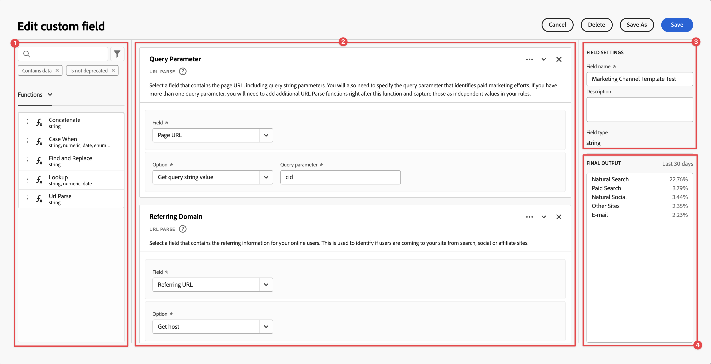

# Derived fields

Derived fields are important aspect of the real-time reporting functionality in Customer Journey Analytics (CJA). A derived (custom) field allows you to define (often complex) data manipulations on the fly, through a customizable rule builder. You can then use that derived field as a component (metric or dimension) in Workspace or even further define as a component in Data view. 

Derived fields can save a significant amount of time and effort, compared to transforming or manipulating your data in other locations outside of CJA. Such as Data Prep, Data Distiller, or within Extract Transform Load (ETL) / Extract Load Transform (ELT) processes.

Derived fields are defined as custom fields within [Data views](../data-views.md), and are based on a set of functions and applied to available standard and/or schema fields.

Example use cases are:

-   Define a custom Page Name field that corrects improper collected page name values to correct page name values. 

-   Define a custom Marketing Channel field that determines the proper marketing channel based on one or more conditions (for example URL parameter, page URL, page name).

## Custom field interface

When you create or edit a custom field, you use the custom field interface.

|  | Name | Description |
|---------|----------|--------|
| 1 | **Selector** | You use the selector area to select and drag and drop your  function, function template, schema field, orstandard field on to the rule builder.  Use the drop-down to select between [!UICONTROL Functions], [!UICONTROL Function templates], [!UICONTROL Schema fields], and [!UICONTROL Standard fields]. You can search for function, function templates, schema, and standard fields using the Search box.  You can filter the selected object list by selecting  Filter and specify filters in the [!UICONTROL Filter fields by] dialog. You can easily remove filters using  for each filter. | 
| 2 | **Rule builder** | You build your custom field sequentially using one or more rules. A rule is a specific implementation of a function and is therefore always associated with only one function. You create a rule by dragging and dropping a function into the Rule Builder. The function type determines the interface of the rule. See the [Rule interface](#rule-interface) for more information.  You can insert a function at the start, end, or in between rules already available in the Rule Builder. The last rule in the Rule Builder determines the final output of the custom field. |
| 3 | **[!UICONTROL **Field Settings**]** | You can name and describe your custom field and inspect its field type. | 
| 4 | **[!UICONTROL **Final Output**]** | This area shows an on-the-fly updated preview of output values, based on data over the last 30 days and the changes you make to the custom field in the Rule builder. |

When you access the Custom field interface for the first time, the [!UICONTROL Start with a field template] wizard is shown. 

1. Select the template that best describes the type of field you are trying to create. 
2. Select the **[!UICONTROL **Select**]** button to continue.

Your Custom field dialog is populated with rules (and functions) required or useful for the type of field that you selected. See [Function templates](#function-templates) for more information on the available templates.

## Rule interface

When you define a rule in the Rule builder, you use the rule interface.

|  | Name | Description |
|---------|----------|--------|
| A | **Rule Name** | By default the rule name is **Rule X** (X referring to a sequence number). To edit the name of a rule, select its name and type in the new name, for example `Query Parameter`. |
| B | **Function Name** | The selected function name for the rule, for example **URL PARSE**. When the function is the last in the sequence of functions and determines the final output values, the function name is followed by **FINAL OUTPUT**, for example **URL PARSE - FINAL OUTPUT**.  To show a popup with more information on the function, select . |
| C | **Rule Description** | You can optionally add a description to a rule. Select , then select **[!UICONTROL **Add Description**]** to add a description or **[!UICONTROL **Edit Description**]** to edit an existing description. Use the editor to enter a description. You can use the toolbar to format the text (using style selector, bold, italic, underline, right, left, centered, color, number list, bullet list) and adding links to external information.  To finish editing the description, click outside of the editor. |
| D | **Function Area** | Defines the logic of the function. The interface depends on the type of function. See [Custom field functions](custom-field-functions.md) on detailed information for each of the functions supported. |

{style="table-layout:auto"}

## Create a custom field

1.  Select an existing Data view or create a Data view. See [Data views](../data-views.md) for more information.

2.  Select the **[!UICONTROL **Components**]** tab of the Data view.

3.  Select **[!UICONTROL **Create custom field**]** from the left rail.
   
4.  To define your custom field, use the [!UICONTROL Create custom field] interface. See [Custom field interface](#custom-field-interface).

    To save your new custom field, select **[!UICONTROL **Save**]**.

5.  Your new custom field is added to the **[!UICONTROL **Custom fields >**]** container, as part of **[!UICONTROL **Schema fields**]** in the left rail of your Data view.

## Edit a custom field

1.  Select an existing Data view. See [Data views](../data-views.md) for more information.

2.  Select the **[!UICONTROL **Components**]** tab of the Data view.

3.  Select **[!UICONTROL **Schema fields**]** tab in the [!UICONTROL Connection] pane on the left.

4.  Select **[!UICONTROL **Custom fields >**]** container.

5.  Hover over the custom field that you want to edit, and select .

6.  To edit your custom field, use the [!UICONTROL Edit custom field] interface. See [Custom field interface](#custom-field-interface).

    -   Select **[!UICONTROL **Save**]** to save your updated custom field.

    -   Select **[!UICONTROL **Cancel**]** to cancel any changes you made to the custom field.

    -   Select **[!UICONTROL **Save As**]** to save the custom field as a new custom field. The new custom field has the same name as the original edited custom field with `(copy)` added to it.

## Delete a custom field

1.  Select an existing Data view. See [Data views](../data-views.md) for more information.

2.  Select the **[!UICONTROL **Components**]** tab of the Data view.

3.  Select **[!UICONTROL **Schema fields**]** tab in [!UICONTROL Connection] pane.

4.  Select **[!UICONTROL **Custom fields >**]** container.

5.  Hover over the custom field that you want to delete, and select .

6.  In the Use **[!UICONTROL **Edit custom field**]** interface, select Delete.

    A [!UICONTROL Delete component] dialog asks you to confirm the deletion. Consider any external references there might exist to the custom field outside of the Data view. 
    
    - Select **[!UICONTROL **Continue**]** to delete the custom field.

## Function templates

To quickly create a custom field for specific use cases, function templates are available. These function templates can be accessed from the Selector area in the Custom field interface or are presented upon first use in the [!UICONTROL Start with a field template] wizard.

+++ Marketing channels

This template is configured to use the [!UICONTROL URL PARSE] and [!UICONTROL CASE WHEN] functions multiple times to get appropriate values from a URL. Logic is then applied on these values to associate the URL to a specific marketing channel.

To use the template, you have to specify the correct parameters for each function listed as part of the rules in the template. See [Function reference](#function-reference) for more information.

+++

<!--

+++ Data clean up template

>[!WARNING]
>
>Could not find any information on this template.
+++

-->

## Function reference

For each supported function, find below:

-   inputs, operators and, outputs

-   use cases, including:
    - data before defining the custom field
    - how to define the custom field
    - data after defining the custom field

<!-- Concatenate -->

+++ Concatenate

Combines two or more fields, custom fields, or user-entered values into a single field with defined delimiters.

## Inputs / Operators / Outputs

| Input Data Type | Input | Included Operators | Output |
|---|---|---|---|
| 
String
 | <ul><li>Two or more values to combine<ul><li>Fields</li><li>Derived value from a previous rule</li><li>User-entered value</li></ul></li><li>Delimiters<ul><li>Input or selection of a delimiter for each value</li></ul></li> </ul> | 
N/A
| 
New custom field
 |

{style="table-layout:auto"}

## Use case

You currently collect origin and destination airport codes as separate fields. You would like to take the two fields and combine them into a single dimension separated by a hyphen (-). So you can analyze the combination of origin and destination to identify top routes booked.

Assumptions:

- Origin and destination values are collected in separate fields in the same table.
- The user determines to use the delimiter '-' between the values.

Imagine the following bookings occur:

- Customer ABC123 books a flight between Salt Lake City (SLC) and Orlando (MCO)
- Customer ABC456 books a flight between Salt Lake City (SLC) and Los Angeles (LAX)
- Customer ABC789 books a flight between Salt Lake City (SLC) and Seattle (SEA)
- Customer ABC987 books a flight between Salt Lake City (SLC) and San Jose (SJO)
- Customer ABC654 books a flight between Salt Lake City (SLC) and Orlando (MCO)

The desired report should look like:

| Origin / Destination | Bookings |
|---|---|
| SLC-MCO | 2 |
| SLC-LAX | 1 |
| SLC-SEA | 1 |
| SLC-SJO | 1 |

{style="table-layout:auto"}

### Data before

| Origin | Destination |
|----|----|
| SLC | MCO |
| SLC | LAX |
| SLC | SEA |
| SLC | SJO |
| SLC | MCO |

{style="table-layout:auto"}

### Custom field

You define a new **[!UICONTROL **Origin - Destination**]** custom field. You use the **[!UICONTROL CONCATENATE]** function to define a rule to concatenate the [!UICONTROL Original] and [!UICONTROL Destination] fields using the `-` [!UICONTROL Delimiter].

### After

| Origin - Destination (custom field) |
|---|
| SLC-MCO |
| SLC-LAX |
| SLC-SEA |
| SLC-SJO |
| SLC-MCO |

{style="table-layout:auto"}

+++

<!-- CASE WHEN -->

+++ Case When

Applies conditionals, based on defined criteria from one or more fields. These criteria are then used to define the values in a new custom field, based on the sequence of the conditions.

## Inputs / Operators / Outputs

| Input Data Type | Input | Included Operators | Output |
|---|---|---|---|
| <ul><li>String</li><li>Numeric</li><li>Date/Date-Time</li></ul> | <ul><li>Input Fields</li><li>Criteria</li></ul> | 
<u>Strings</u>
<ul><li>Equals</li><li>Equals any term</li><li>Contains the phrase</li><li>Contains any term</li><li>Contains all terms</li><li>Starts with</li><li>Starts with any term</li><li>Ends with</li><li>Ends with any term</li><li>Does not equal</li><li>Does not equal any term</li><li>Does not contain the phrase</li><li>Does not contain any term</li><li>Does not contain all terms</li><li>Does not start with</li><li>Does not start with any term</li><li>Does not end with</li><li>Does not end with any term</li><li>Is set</li><li>Is not set</li></ul>
<u>Numeric</u>
<ul><li>Equals</li><li>Does not equal</li><li>Is greater than</li><li>Is greater than or equal to</li><li>Is less than</li><li>Is less than or equal to</li><li>Is set</li><li>Is not set</li></ul>
<u>Dates</u>
<ul><li>Equals</li><li>Does not equal</li><li>Is later than</li><li>Is later than or equal to</li><li>Is before</li><li>Is before or equal to</li><li>Is set</li><li>Is not set</li></ul> | 
New custom field
 |

{style="table-layout:auto"}

## Use case 1

You want to define rules to identify various marketing channels, by applying cascading logic to set a marketing channel field to the proper value:

- If the referrer is from a search engine and the page has a query string value where `cid` contains `ps_`, the marketing channel should be identified as a **Paid Search**.
- If the referrer is from a search engine and the page does not have the query string `cid`, the marketing channel should be identified as a **Natural Search**.
- If a page has a query string value where `cid` contains `em_`, the marketing channel should be identified as an **Email**.
- If a page has a query string value where `cid` contains `ds_`, the marketing channel should be identified as a **Display Ad**.
- If a page has a query string value where `cid` contains `so_`, the marketing channel should be identified as a **Paid Social**.
- If the referrer is from a referring domain of twitter.com, facebook.com, linkedin.com, or tiktok.com, the marketing channel should be identified as a **Natural Social**.
- If none of the above rules are matched, then the marketing channel should be identified as **Other Referrer**.

In case your site receives the following sample events, containing Referrer and Page URL, these events should be identified as follows:

| Event | Referrer | Page URL | Marketing Channel |
|:----:|----|----|----|
| 1 | `https://facebook.com` | `https://site.com/home` | Natural Social |
| 2 | `https://abc.com` | `https://site.com/?cid=ds_12345678` | Display |
| 3 | |  `https://site.com/?cid=em_12345678` | Email |
| 4 | `https://google.com` | `https://site.com/?cid=ps_abc098765` | Paid Search |
| 5 | `https://google.com` | `https://site.com/?cid=em_765544332` | Email |
| 6 | `https://google.com` |  | Natural Search |

{style="table-layout:auto"}

### Data before

| Referrer | Page URL |
|----|----|
| `https://facebook.com` | `https://site.com/home` |
| `https://abc.com` | `https://site.com/?cid=ds_12345678` |
|  | `https://site.com/?cid=em_12345678` |
| `https://google.com` | `https://site.com/?cid=ps_abc098765` |
| `https://google.com` | `https://site.com/?cid=em_765544332` |
| `https://google.com` | 

{style="table-layout:auto"}

### Custom field

You define a new `Marketing Channel` custom field. You use the **[!UICONTROL CASE WHEN]** functions to define rules that create values for the based on existing values for both the `Page URL` and `Referring URL` field.

Note the usage of the function **[!UICONTROL **URL PARSE**]** to define rules to fetch the values for `Page Url` and `Referring Url` before the **[!UICONTROL **CASE WHEN**]** rules are applied.

### Data after

| Marketing Channel |
|----|
| Natural Social |
| Display |
| Email |
| Paid Search |
| Email |
| Natural Search |

{style="table-layout:auto"}

## Use case 2

You have collected several different variations of search within your Product Finding Methods dimension. To understand the overall performance of search vs. browse, you must spend a great deal of time combining the results manually.

Your site collects the following values for your Product Finding Methods dimension. In the end, all of these values indicate a search.

| Collected value | Actual value |
|---|---|
search p13n_no | search |
search p13n_yes | search |
search refine p13n_no | search |
search refine p13n_yes | search |
search redirect p13n_yes | search |
search-redirect | search |

{style="table-layout:auto"}

### Data before

| Product Finding Methods |
|----|
| search p13_no | 
| search p13_yes | 
| browse | 
| search refine p13_no | 
| search refine p13_yes | 
| browse | 
| search redirect p13_yes | 
| search-redirect | 
| browse |

{style="table-layout:auto"}

### Custom field

You define a `Product Finding Methods (new)` custom field. You create the following **[!UICONTROL **CASE WHEN**]** rules in Rule Builder. These rules apply logic to all possible variations of the old **[!UICONTROL **Product Finding Methods**]** field values for `search` and `browse` using the **[!UICONTROL Contains the phrase]** criterion.

### Data after

| Product Finding Methods (new) |
|----|
| search |
| search |
| browse |
| search |
| search |
| browse |
| search |
| search |
| browse |

{style="table-layout:auto"}

## Use case 3

As a travel company, you would like to bucket trip duration for booked trips so you can report on bucketed lengths of trips. 

Assumptions:

- The organization is collecting trip duration into a numeric field.
- They would like to bucket 1-3 day durations into a bucket called 'short trip'
- They would like to bucket 4-7 day durations into a bucket called 'medium trip'
- They would like to bucket 8+ day durations into a bucket called 'long trip'
- 132 trips were booked for a 1-day duration
- 110 trips were booked for a 2-day duration
- 105 trips were booked for a 3-day duration
- 99 trips were booked for a 4-day duration
- 92 trips were booked for a 5-day duration
- 85 trips were booked for a 6-day duration
- 82 trips were booked for a 7-day duration
- 78 trips were booked for an 8-day duration
- 50 trips were booked for a 9-day duration
- 44 trips were booked for a 10-day duration
- 38 trips were booked for an 11-day duration
- 31 trips were booked for a 12-day duration

Your desired report should look like:

| Trip Duration Type | Bookings |
|----|---:|
| medium trip | 358 |
| short trip | 347 |
| long trip | 241 |

{style="table-layout:auto"}

### Data before

| Trip Duration |
|---:|
| 1 | 
| 12 |
| 3 | 
| 6 | 
| 4 | 
| 8 | 
| 6 | 
| 2 | 
| 1 | 
| 2 | 
| 21 | 
| 8 | 

{style="table-layout:auto"}

### Custom field

You define a `Trip Duration (bucketed)` custom field. You create the following **[!UICONTROL **CASE WHEN**]** rule in Rule Builder. This rule applies logic to bucket the old **[!UICONTROL **Trip Duration**]** field values into three values: `short trip`, `medium  trip`, and `long trip`.

### Data after

| Trip Duration (bucketed) |
|---|
|short trip|
|long trip|
|short trip|
|medium trip|
|medium trip|
|long trip|
|medium trip|
|short trip|
|short trip|
|short trip|
|long trip|
|long trip|

+++

<!-- FIND AND REPLACE -->

+++ Find and Replace

Finds all values in a selected field and replaces those values with a different value in a new custom field.

## Inputs / Operators / Outputs

| Input Data Type | Input | Included Operators | Output |
|---|---|---|---|
| 
String
 | <ul><li>'When to replace' field criteria</li><li>'Replace with' field value<ul><li>User-entered</li><li>Separate field</li></ul></li></ul> | 
<u>Strings</u>
<ul><li>Find All and Replace All</li></ul> | 
New custom field
 |

{style="table-layout:auto"}

## Use case

You have received some malformed values for your external marketing channels report, for example `email%20 marketing` instead of `email marketing`. These malformed values fracture your reporting and make it more difficult to see how email is performing. You want to replace `email%20marketing` with `email marketing`.

**Original Report**

| External Marketing Channels | Sessions |
|---|---|
| email marketing | 500 |
| email%20marketing| 24 |

{style="table-layout:auto"}

**Preferred Report**

| External Marketing Channels | Sessions |
|---|---|
| email marketing | 524 |

### Data before

| External Marketing |
|----|
| email marketing | 
| email%20marketing |
| email marketing | 
| email marketing | 
| email%20marketing |

{style="table-layout:auto"}

### Custom field

You define a `Email Marketing (updated)` custom field. You use the **[!UICONTROL FIND AND REPLACE]** function to define a rule to find and replace all occurrences of `email%20marketing` with `email marketing`.

### Data after

| External Marketing (custom field) |
|----|
| email marketing |
| email marketing |
| email marketing |
| email marketing |
| email marketing |

{style="table-layout:auto"}

+++

<!-- LOOKUP -->

+++ Lookup

Defines a set of lookup values that are replaced by corresponding values.

## Inputs / Operators / Outputs

| Input Data Type | Input | Included Operators | Output |
|---|---|---|---|
| <ul><li>String</li><li>Numeric</li><li>Date</li></ul> | <ul><li>Sing field</li><li>Lookup file<ul><li>Key Column</li><li>New Field Column</li></ul></li></ul> | 
N/A
 | 
New custom field
 |

{style="table-layout:auto"}

## Use case 1

You do have a CSV-file that includes a key column for `hotelID` and one or more additional columns associated with the `hotelID`: `city`, `rooms`, `hotel name`.
You are collecting Hotel ID in a dimension but would like to create a Hotel Name dimension derived from the `hotelID` in the CSV file.

**CSV-file structure and content**

| hotelID | city | rooms | hotel name |
|---|---|---:|---|
| SLC123 | Salt Lake City | 40 | SLC Downtown |
| LAX342 | Los Angels | 60 | LA Airport |
| SFO456 | San Francisco | 75 | Market Street |

{style="table-layout:auto"}

**Current Report**

| Hotel ID | Product Views |
|---|---:|
| SLC123 | 200 |
| LX342 | 198 |
| SFO456 | 190 |

{style="table-layout:auto"}

**Desired Report**

| Hotel Name | Product Views |
|----|----:|
| SLC Downtown | 200 |
| LA Airport | 198 |
| Market Street | 190 |

{style="table-layout:auto"}

### Data before

| Hotel ID |
|----|
| SLC123 | 
| LAX342 | 
| SFO456 |

{style="table-layout:auto"}

### Custom field

You define a `Hotel Name` custom field. You use the **[!UICONTROL **LOOKUP**]** function to define a rule where you can look up values of the **[!UICONTROL **Hotel ID**]** field and replace with new values.

### Data after

| Hotel Name |
|----|
| SLC Downtown |
| LA Airport |
 Market Street |

{style="table-layout:auto"}

## Use case 2

You have collected URLs instead of the friendly page name for several pages. This mixed collection of values breaks the reporting.

### Data

| Page Name |
|---|
| Home Page | 
| Flight Search | 
| `http://www.expedia.ca/Hotel-Search` |
| `https://www.expedia.com/Package-Search` |
| Deals & Offers |
| `http://www.expedia.ca/user/reviews` | 
| `https://www.expedia.com.br/Generate-Quote/preview` |

{style="table-layout:auto"}

### Custom field

You define a `Page Name (updated)` custom field. You use the **[!UICONTROL **LOOKUP**]** function to define a rule where you can look up values of your existing **[!UICONTROL **Page Name**]** field and replace with updated correct values.

### Data after

| Page Name (updated) |
|---|
| Home Page |
| Flight Search |
| Hotel Search |
| Package Search |
| Deals & Offers |
| Reviews |
| Generate Quote |

+++

<!-- URL PARSE -->

+++ URL Parse

Parses out different parts of a URL including protocol, host, path, or query parameters.

## Inputs / Operators / Outputs

| Input Data Type | Input | Included Operators | Output |
|---|---|---|---|
| <ul><li>String</li></ul> | <ul><li>Sing field</li><li>Parsing option<ul><li>Get protocol</li><li>Get host</li><li>Get path</li><li>Get query value<ul><li>Query param</li></ul></li><li>Get hash value</li></ul></li></ul></li></ul> | 
N/A
 | 
New custom field
 |

{style="table-layout:auto"}

## Use case 1

You only want use the referring domain from the referring URL as part of a marketing channel's set of rules.

### Data before

| Referring URL |
|----|
| `https://www.google.com/` |
| `https://duckduckgo.com/` | 
| `https://t.co/` |
| `https://l.facebook.com/`| 

{style="table-layout:auto"}

### Custom field

You define a  `Referring Domain` custom field. You use the **[!UICONTROL **URL PARSE**]** function to define a rule to fetch the host from the **Referring URL** and store that in the new custom field.

### Data after

| Referrer Domain |
|----|
| www.google.com |
| duckduckgo.com |
| t.co |
| l.facebook.com |

{style="table-layout:auto"}

## Use case 2

You want to use the value of the `cid` parameter of a query string in a Page URL as part of the output of a derived tracking code report.

### Data before

| Page URL |
|----|
| `https://www.adobe.com/?cid=abc123` |
| `https://www.adobe.com/?em=email1234&cid=def123` | 
| `https://www.adobe.com/landingpage?querystring1=test&test2=1234&cid=xyz123` | 

{style="table-layout:auto"}

### Custom field

You define a `Query String CID` custom field. You use the **[!UICONTROL **URL PARSE**]** function to define a rule to fetch the value of the query string parameter in the Page URL, specifying `cid` as the query parameter. The output value is stored in the new custom field.

### Data after

| Query String CID |
|----|
| abc123 |
| def123 |
| xyz123 |

{style="table-layout:auto"}

+++
