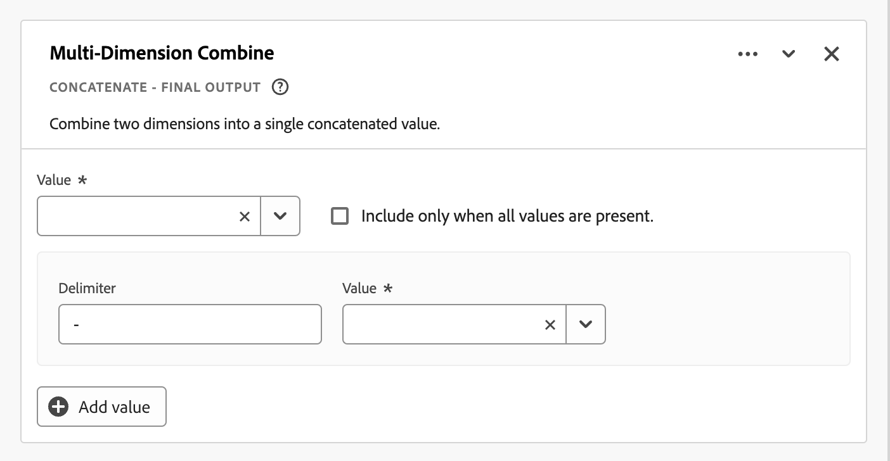
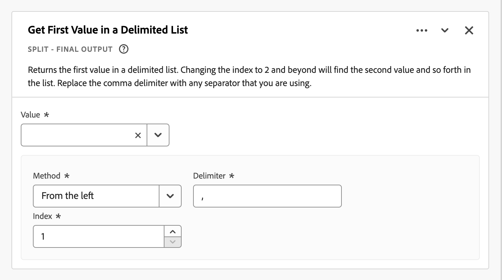
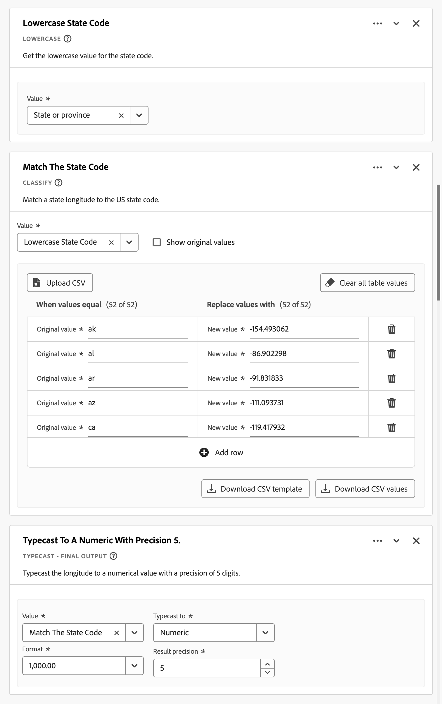
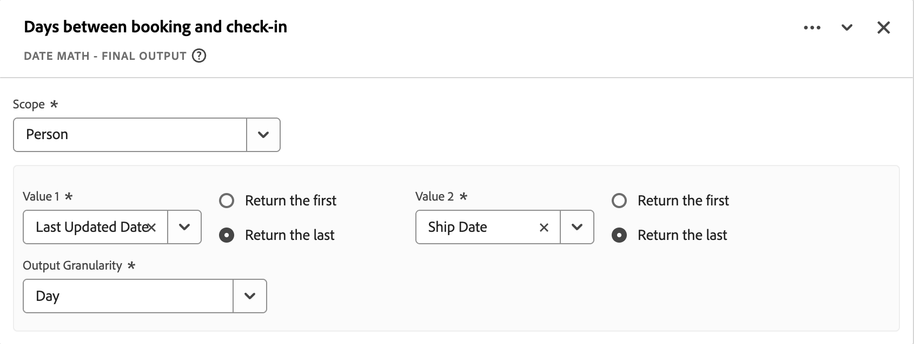
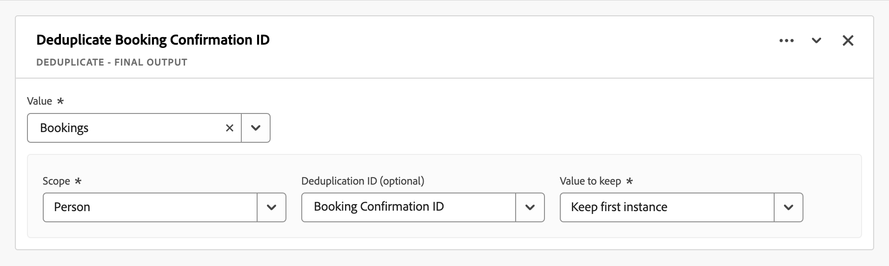

# Derived fields {#derived-fields}

>[!CONTEXTUALHELP]
>id="dataview_derivedfields"
>title="Derived fields"
>abstract="A derived field allows you to define data manipulations on the fly, through a customizable rule builder. You can then use that derived field as a component (metric or dimension) in Workspace or even further define as a component in Data view."

Derived fields are an important aspect of the real-time reporting functionality in Adobe Customer Journey Analytics. A derived field allows you to define (often complex) data manipulations on the fly, through a customizable rule builder. You can then use that derived field as a component (metric or dimension) in [Workspace](../../analysis-workspace/home.md) or even further define the derived field as a component in [Data view](../data-views.md). 

Derived fields can save a significant amount of time and effort, compared to transforming or manipulating your data in other locations outside of Customer Journey Analytics. Such as [Data Prep](https://experienceleague.adobe.com/docs/experience-platform/data-prep/home.html), [Data Distiller](https://experienceleague.adobe.com/docs/experience-platform/query/data-distiller/overview.html), or within your own Extract Transform Load (ETL) / Extract Load Transform (ELT) processes.

Derived fields are defined within [Data views](../data-views.md), are based on a set of functions defined as rules, and applied to available standard and/or schema fields.

>[!NOTE]
>
>[Standard components](../component-reference.md) are tied to and associated with event datasets. As a result, standard components that are used as part of a derived field only work against data from an event dataset.
>

Example use cases are:

- Define a derived Page Name field that corrects improper collected page name values to correct page name values. 

- Define a derived Marketing Channel field that determines the proper marketing channel based on one or more conditions (for example URL parameter, page URL, page name).

Standard components are only supported on event datasets in derived fields. 

## Derived field interface {#interface}

When you create or edit a derived field, you use the derived field interface.

|  | Name | Description |
|---------|----------|--------|
| 1 | **Selector** | You use the selector area to select and drag and drop your function, function template, schema field, or standard field on to the rule builder.  Use the drop-down to select between:   [!UICONTROL Functions] - lists available [functions](#function-reference),   [!UICONTROL Function templates] - lists available [function templates](#function-templates),    [!UICONTROL Schema fields] - lists fields available from dataset categories (event, profile, lookup) and previously defined derived fields, and   [!UICONTROL Standard fields] - standard available fields (like Platform Dataset ID). Only string and numeric standard fields are displayed in the selector. If the function supports other data types, standard fields with these other data types can be selected for values or fields within the rule interface. You can search for function, function templates, schema, and standard fields using the  Search box.  You can filter the selected object list by selecting  Filter and specify filters in the [!UICONTROL Filter fields by] dialog. You can easily remove filters using  for each filter. |
| 2 | **Rule builder** | You build your derived field sequentially using one or more rules. A rule is a specific implementation of a function and is therefore always associated with only one function. You create a rule by dragging and dropping a function into the rule builder. The function type determines the interface of the rule. See the [Rule interface](#rule-interface) for more information.  You can insert a function at the start, end, or in between rules already available in the rule builder. The last rule in the rule builder determines the final output of the derived field. |
| 3 | **[!UICONTROL **Field Settings**]** | You can name and describe your derived field and inspect its field type. |
| 4 | **[!UICONTROL **Final Output**]** | This area shows an on-the-fly updated preview of output values, based on data over the last 30 days and the changes you make to the derived field in the rule builder. |

{style="table-layout:auto"}

## Field template wizard {#wizard}

When you access the derived field interface for the first time, the [!UICONTROL Start with a field template] wizard is shown. 

1. Select the template that best describes the type of field you are trying to create. 
2. Select the **[!UICONTROL **Select**]** button to continue.

Your derived field dialog is populated with rules (and functions) required or useful for the type of field that you selected. See [Function templates](#function-templates) for more information on the available templates.

## Rule interface {#rules}

When you define a rule in the rule builder, you use the rule interface.

|  | Name | Description |
|---------|----------|--------|
| A | **Rule Name** | By default the rule name is **Rule X** (X referring to a sequence number). To edit the name of a rule, select its name and type in the new name, for example `Query Parameter`. |
| B | **Function Name** | The selected function name for the rule, for example [!UICONTROL URL PARSE]. When the function is the last in the sequence of functions and determines the final output values, the function name is followed by [!UICONTROL - FINAL OUTPUT], for example [!UICONTROL URL PARSE - FINAL OUTPUT].  To show a popup with more information on the function, select . |
| C | **Rule Description** | You can optionally add a description to a rule. Select , then select **[!UICONTROL **Add Description**]** to add a description or **[!UICONTROL **Edit Description**]** to edit an existing description. Use the editor to enter a description. You can use the toolbar to format the text (using style selector, bold, italic, underline, right, left, centered, color, number list, bullet list) and adding links to external information.  To finish editing the description, click outside of the editor. |
| D | **Function Area** | Defines the logic of the function. The interface depends on the type of function. The drop-down menufor [!UICONTROL Field] or [!UICONTROL Value] shows all categories of fields (rules, standard fields, fields) available, based on the type of input the function expects. Alternatively, you can drag and drop a field from the Schema and Standard fields selector on to a Field or Value. When that dragged field is originating from a Lookup dataset, a Lookup function is automatically inserted before the function you define.  See [Function reference](#function-reference) on detailed information for each of the functions supported. |

{style="table-layout:auto"}

## Create a derived field {#create}

1. Select an existing Data view or create a Data view. See [Data views](../data-views.md) for more information.

2. Select the **[!UICONTROL **Components**]** tab of the Data view.

3. Select **[!UICONTROL **Create derived field**]** from the left rail.
   
4. To define your derived field, use the [!UICONTROL Create derived field] interface. See [Derived field interface](#derived-field-interface).

    To save your new derived field, select **[!UICONTROL **Save**]**.

5. Your new derived field is added to the [!UICONTROL Derived fields >] container, as part of **[!UICONTROL **Schema fields**]** in the left rail of your Data view.

## Edit a derived field {#edit}

1. Select an existing Data view. See [Data views](../data-views.md) for more information.

2. Select the **[!UICONTROL **Components**]** tab of the Data view.

3. Select **[!UICONTROL **Schema fields**]** tab in the [!UICONTROL Connection] pane on the left.

4. Select **[!UICONTROL **Derived fields >**]** container.

5. Hover over the derived field that you want to edit, and select .

6. To edit your derived field, use the [!UICONTROL Edit derived field] interface. See [Derived field interface](#derived-field-interface).

   - Select **[!UICONTROL **Save**]** to save your updated derived field.

   - Select **[!UICONTROL **Cancel**]** to cancel any changes you made to the derived field.

   - Select **[!UICONTROL **Save As**]** to save the derived field as a new derived field. The new derived field has the same name as the original edited derived field with `(copy)` added to it.

Alternatively, if you have used a derived field as a component for dimensions or metrics in your data view:

1. Select the component. Note that the component might have a different name than your derived field. 

1. In the Component panel, select the  next to your derived field, underneath Schema field name.

1. To edit your derived field, use the [!UICONTROL Edit derived field] interface. See [Derived field interface](#derived-field-interface).

   - Select **[!UICONTROL **Save**]** to save your updated derived field.

   - Select **[!UICONTROL **Cancel**]** to cancel any changes you made to the derived field.

   - Select **[!UICONTROL **Save As**]** to save the derived field as a new derived field. The new derived field has the same name as the original edited derived field with `(copy)` added to it.

## Delete a derived field {#delete}

1. Select an existing Data view. See [Data views](../data-views.md) for more information.

2. Select the **[!UICONTROL **Components**]** tab of the Data view.

3. Select **[!UICONTROL **Schema fields**]** tab in [!UICONTROL Connection] pane.

4. Select **[!UICONTROL **Derived fields >**]** container.

5. Hover over the derived field that you want to delete, and select .

6. In the [!UICONTROL Edit derived field] interface, select **[!UICONTROL Delete]**.

    A [!UICONTROL Delete component] dialog asks you to confirm the deletion. Consider any external references there might exist to the derived field outside of the Data view. 
    
   - Select **[!UICONTROL **Continue**]** to delete the derived field.

Alternatively, if you have used a derived field as a component for dimensions or metrics in your data view:

1. Select the component. Note that the component might have a different name than your derived field. 

1. In the Component panel, select the  next to your derived field, underneath Schema field name.

1. In the [!UICONTROL Edit derived field] interface, select **[!UICONTROL Delete]**.

    A [!UICONTROL Delete component] dialog asks you to confirm the deletion. Consider any external references there might exist to the derived field outside of the Data view. 
    
   - Select **[!UICONTROL **Continue**]** to delete the derived field.

>[!NOTE]
>
>Derived fields are managed at a Connection level in Customer Journey Analytics. Any change made to a derived field in any of the Data views associated with that Connection applies across all these associated Data views.

## Function templates {#templates}

To quickly create a derived field for specific use cases, function templates are available. These function templates can be accessed from the selector area in the derived field interface or are presented upon first use in the [!UICONTROL Start with a field template] wizard.

### Marketing channels {#mchannel}

This function template uses a collection of rules to build marketing channels.

+++ Details

To use the template, you have to specify the correct parameters for each function listed as part of the rules in the template. See [Function reference](#function-reference) for more information.

+++

### Bounces {#bounces}

This function template uses a collection of rules to identify site bounces.

+++ Details

{{select-package}}

To use the template, you have to specify the correct parameters for each function listed as part of the rules in the template. See [Function reference](#function-reference) for more information.

+++

### Multi-Dimension Combine {#multi-dim}

This function template combines two values into one.

+++ Details

{{select-package}}

To use the template, you have to specify the correct parameters for each function listed as part of the rules in the template. See [Function reference](#function-reference) for more information.

+++

### Friendly Dataset Name {#friendlyname}

This function template provides a readable dataset name.

+++ Details

{{select-package}}

To use the template, you have to specify the correct parameters for each function listed as part of the rules in the template. See [Function reference](#function-reference) for more information.

+++

### Page Name from URL {#pagename}

This function template creates a simple page name.

+++ Details

{{select-package}}

To use the template, you have to specify the correct parameters for each function listed as part of the rules in the template. See [Function reference](#function-reference) for more information.

+++

### Holiday Season {#holiday}

This function template classifies key times of the year.

+++ Details

{{select-package}}

To use the template, you have to specify the correct parameters for each function listed as part of the rules in the template. See [Function reference](#function-reference) for more information.

+++

### Monthly Goals {#goals}

This function template sets custom monthly goals.

+++ Details

{{select-package}}

To use the template, you have to specify the correct parameters for each function listed as part of the rules in the template. See [Function reference](#function-reference) for more information.

+++

### Get All Values in Delimited List {#allvalues}

This function template converts a limited list to an array.

+++ Details

{{select-package}}

To use the template, you have to specify the correct parameters for each function listed as part of the rules in the template. See [Function reference](#function-reference) for more information.

+++

### Get First Value in Delimited List {#firstvalue}

This function template gets the first value in a delimited list.

+++ Details

{{select-package}}

To use the template, you have to specify the correct parameters for each function listed as part of the rules in the template. See [Function reference](#function-reference) for more information.

+++

### Get Last Value in Delimited List {#lastvalue}

This function template gets the last value in a delimited list.

+++ Details

{{select-package}}

To use the template, you have to specify the correct parameters for each function listed as part of the rules in the template. See [Function reference](#function-reference) for more information.

+++

### Domain Name {#domain}

This function template extracts the domain name using a regular expression.

+++ Details

{{select-package}}

To use the template, you have to specify the correct parameters for each function listed as part of the rules in the template. See [Function reference](#function-reference) for more information.

+++

### Get Query String Parameter {#querystring}

This function template extracts query string values.

+++ Details

{{select-package}}

To use the template, you have to specify the correct parameters for each function listed as part of the rules in the template. See [Function reference](#function-reference) for more information.

+++

### Transition Field {#transition}

This function template transitions reporting from one field to another field.

+++ Details

{{select-package}}

To use the template, you have to specify the correct parameters for each function listed as part of the rules in the template. See [Function reference](#function-reference) for more information.

+++

### Simple Bot Detection {#botdetection}

This function template implements light bot identification.

+++ Details

{{select-package}}

To use the template, you have to specify the correct parameters for each function listed as part of the rules in the template. See [Function reference](#function-reference) for more information.

+++

### Exit Link {#exit}

This function template identifies last link clicked in a session.

+++ Details

{{select-package}}

To use the template, you have to specify the correct parameters for each function listed as part of the rules in the template. See [Function reference](#function-reference) for more information.

+++

### Download Link {#download}

This function template flags common download links.

+++ Details

{{select-package}}

To use the template, you have to specify the correct parameters for each function listed as part of the rules in the template. See [Function reference](#function-reference) for more information.

+++

### State Latitude {#state-latitude}

This function template gets the latitude for a US state with a precision of 5 digits.

+++ Details

{{select-package}}

To use the template, you have to specify the correct parameters for each function listed as part of the rules in the template. See [Function reference](#function-reference) for more information.

+++

### State Longitude {#state-longitude}

This function template gets the longitude for a US state with a precision of 5 digits.

+++ Details

{{select-package}}

To use the template, you have to specify the correct parameters for each function listed as part of the rules in the template. See [Function reference](#function-reference) for more information.

+++

<!--

+++ Data clean up template

>[!WARNING]
>
>Could not find any information on this template.
+++

-->

## Function reference {#functionref}

{{select-package}}

For each supported function, find details below on:

- specifications: 
  - input data type: type of data supported,
  - input: possible values for input,
  - included operators: operators supported for this function (if any),
  - limitations: limitations that apply for this specific function,
  - output.

- use cases, including:
  - data before defining the derived field,
  - how to define the derived field,
  - data after defining the derived field.

- constraints (if applicable).

<!-- CASE WHEN -->

### Case When {#casewhen}

>[!CONTEXTUALHELP]
>id="dataview_derivedfields_casewhen"
>title="Case When"
>abstract="This function provides the ability to apply conditionals based on defined criteria from one or more fields. Those criteria are then used to define the values in the new derived field, based on the sequence of the conditions."

Applies conditionals, based on defined criteria from one or more fields. These criteria are then used to define the values in a new derived field, based on the sequence of the conditions.

+++ Details

## Specifications {#casewhen-io}

| Input Data Type | Input | Included Operators | Limitations | Output |
|---|---|---|---|---|
| <ul><li>String</li><li>Numeric</li><li>Date</li></ul> | <ul><li>[!UICONTROL If], [!UICONTROL Else If] container:
<ul><li>[!UICONTROL Value]</li><ul><li>Rules</li><li>Standard fields</li><li>Fields</li></ul><li>[!UICONTROL Criterion] (see included operators, based on selected value type)</li></ul></li><li>[!UICONTROL Then set value to], [!UICONTROL Otherwise set value to]:
<ul><li>[!UICONTROL Value]</li><ul><li>Rules</li><li>Standard fields</li><li>Fields</li></ul></ul></li></ul> | 
Strings
<ul><li>Equals</li><li>Equals any term</li><li>Contains the phrase</li><li>Contains any term</li><li>Contains all terms</li><li>Starts with</li><li>Starts with any term</li><li>Ends with</li><li>Ends with any term</li><li>Does not equal</li><li>Does not equal any term</li><li>Does not contain the phrase</li><li>Does not contain any term</li><li>Does not contain all terms</li><li>Does not start with</li><li>Does not start with any term</li><li>Does not end with</li><li>Does not end with any term</li><li>Is set</li><li>Is not set</li></ul>
Numeric
<ul><li>Equals</li><li>Does not equal</li><li>Is greater than</li><li>Is greater than or equal to</li><li>Is less than</li><li>Is less than or equal to</li><li>Is set</li><li>Is not set</li></ul>
Dates
<ul><li>Equals</li><li>Does not equal</li><li>Is later than</li><li>Is later than or equal to</li><li>Is before</li><li>Is before or equal to</li><li>Is set</li><li>Is not set</li></ul> | <ul><li>5 functions per derived field</li><li>200 [operators](#operators) per derived field. An example of one single operator is 'Referring Domain contains google'. </li></ul> |
New derived field
 |

{style="table-layout:auto"}

## Use case 1 {#casewhen-uc1}

You want to define rules to identify various marketing channels, by applying cascading logic to set a marketing channel field to the proper value:

- If the referrer is from a search engine and the page has a query string value where `cid` contains `ps_`, the marketing channel should be identified as a [!DNL *Paid Search*].
- If the referrer is from a search engine and the page does not have the query string `cid`, the marketing channel should be identified as a [!DNL *Natural Search*].
- If a page has a query string value where `cid` contains `em_`, the marketing channel should be identified as an [!DNL *Email*].
- If a page has a query string value where `cid` contains `ds_`, the marketing channel should be identified as a [!DNL *Display Ad*].
- If a page has a query string value where `cid` contains `so_`, the marketing channel should be identified as a [!DNL *Paid Social*].
- If the referrer is from a referring domain of [!DNL twitter.com], [!DNL facebook.com], [!DNL linkedin.com], or [!DNL tiktok.com], the marketing channel should be identified as a [!DNL *Natural Social*].
- If none of the above rules are matched, then the marketing channel should be identified as [!DNL *Other Referrer*].

In case your site receives the following sample events, containing [!UICONTROL Referrer] and [!UICONTROL Page URL], these events should be identified as follows:

| [!DNL Event] | [!DNL Referrer] | [!DNL Page URL] | [!DNL Marketing Channel] |
|:--:|----|----|----|
| 1 | `https://facebook.com` | `https://site.com/home` | [!DNL Natural Social] |
| 2 | `https://abc.com` | `https://site.com/?cid=ds_12345678` | [!DNL Display] |
| 3 | |  `https://site.com/?cid=em_12345678` | [!DNL Email] |
| 4 | `https://google.com` | `https://site.com/?cid=ps_abc098765` | [!DNL Paid Search] |
| 5 | `https://google.com` | `https://site.com/?cid=em_765544332` | [!DNL Email] |
| 6 | `https://google.com` |  | [!DNL Natural Search] |

{style="table-layout:auto"}

### Data before {#casewhen-uc1-databefore}

| [!DNL Referrer]| [!DNL Page URL] |
|----|----|
| `https://facebook.com` | `https://site.com/home` |
| `https://abc.com` | `https://site.com/?cid=ds_12345678` |
|  | `https://site.com/?cid=em_12345678` |
| `https://google.com` | `https://site.com/?cid=ps_abc098765` |
| `https://google.com` | `https://site.com/?cid=em_765544332` |
| `https://google.com` | |

{style="table-layout:auto"}

### Derived field {#casewhen-uc1-derivedfield}

You define a `Marketing Channel` derived field. You use the [!UICONTROL CASE WHEN] functions to define rules that create values for the based on existing values for both the `Page URL` and `Referring URL` field.

Note the usage of the function [!UICONTROL URL PARSE] to define rules to fetch the values for `Page Url` and `Referring Url` before the [!UICONTROL CASE WHEN] rules are applied.

### Data after {#casewhen-uc1-dataafter}

| [!DNL Marketing Channel] |
|----|
| [!DNL Natural Social] |
| [!DNL Display] |
| [!DNL Email] |
| [!DNL Paid Search] |
| [!DNL Email] |
| [!DNL Natural Search] |

{style="table-layout:auto"}

## Use case 2 {#casewhen-uc2}

You have collected several different variations of search within your [!DNL Product Finding Methods] dimension. To understand the overall performance of search vs. browse, you must spend a great deal of time combining the results manually.

Your site collects the following values for your [!DNL Product Finding Methods] dimension. In the end, all of these values indicate a search.

| Collected value | Actual value |
|---|---|
| [!DNL search p13n_no] | [!DNL search] |
| [!DNL search p13n_yes] | [!DNL search] |
| [!DNL search refine p13n_no] | [!DNL search] |
| [!DNL search refine p13n_yes ]| [!DNL search] |
| [!DNL search redirect p13n_yes] | [!DNL search] |
| [!DNL search-redirect] | [!DNL search] |

{style="table-layout:auto"}

### Data before {#casewhen-uc2-databefore}

| [!DNL Product Finding Methods] |
|----|
| [!DNL search p13_no] |
| [!DNL search p13_yes] |
| [!DNL browse] |
| [!DNL search refine p13_no] |
| [!DNL search refine p13_yes] |
| [!DNL browse] |
| [!DNL search redirect p13_yes] |
| [!DNL search-redirect] |
| [!DNL browse] |

{style="table-layout:auto"}

### Derived field {#casewhen-uc2-derivedfield}

You define a `Product Finding Methods (new)` derived field. You create the following [!UICONTROL CASE WHEN] rules in rule builder. These rules apply logic to all possible variations of the old [!UICONTROL Product Finding Methods] field values for `search` and `browse` using the [!UICONTROL Contains the phrase] criterion.

### Data after {#casewhen-uc2-dataafter}

| [!DNL Product Finding Methods (new)] |
|----|
| [!DNL search] |
| [!DNL search] |
| [!DNL browse] |
| [!DNL search] |
| [!DNL search] |
| [!DNL browse] |
| [!DNL search] |
| [!DNL search] |
| [!DNL browse] |

{style="table-layout:auto"}

## Use case 3 {#casewhen-uc3}

As a travel company, you would like to bucket trip duration for booked trips so you can report on bucketed lengths of trips. 

Assumptions:

- The organization is collecting trip duration into a numeric field.
- They would like to bucket 1-3 day durations into a bucket called '[!DNL short trip]'
- They would like to bucket 4-7 day durations into a bucket called '[!DNL medium trip]'
- They would like to bucket 8+ day durations into a bucket called '[!DNL long trip]'
- 132 trips were booked for a 1-day duration
- 110 trips were booked for a 2-day duration
- 105 trips were booked for a 3-day duration
- 99 trips were booked for a 4-day duration
- 92 trips were booked for a 5-day duration
- 85 trips were booked for a 6-day duration
- 82 trips were booked for a 7-day duration
- 78 trips were booked for an 8-day duration
- 50 trips were booked for a 9-day duration
- 44 trips were booked for a 10-day duration
- 38 trips were booked for an 11-day duration
- 31 trips were booked for a 12-day duration

Your desired report should look like:

| [!DNL Trip Duration Type] | [!DNL Bookings] |
|----|---:|
| [!DNL medium trip] | 358 |
| [!DNL short trip] | 347 |
| [!DNL long trip] | 241 |

{style="table-layout:auto"}

### Data before {#casewhen-uc3-databefore}

| [!DNL Trip Duration] |
|---:|
| 1 |
| 12 |
| 3 |
| 6 |
| 4 |
| 8 |
| 6 |
| 2 |
| 1 |
| 2 |
| 21 |
| 8 |

### Derived field {#casewhen-uc3-derivedfield}

You define a `Trip Duration (bucketed)` derived field. You create the following [!UICONTROL CASE WHEN] rule in rule builder. This rule applies logic to bucket the old [!UICONTROL Trip Duration] field values into three values: `short trip`, `medium  trip`, and `long trip`.

### Data after {#casewhen-uc3-dataafter}

| [!DNL Trip Duration (bucketed)] |
|---|
| [!DNL short trip] |
| [!DNL long trip] |
| [!DNL short trip] |
| [!DNL medium trip] |
| [!DNL medium trip] |
| [!DNL long trip] |
| [!DNL medium trip] |
| [!DNL short trip] |
| [!DNL short trip] |
| [!DNL short trip] |
| [!DNL long trip] |
| [!DNL long trip] |

## More information {#casewhen-more-info}

Customer Journey Analytics uses a nested container structure, modeled after Adobe Experience Platform's [XDM](https://experienceleague.adobe.com/docs/experience-platform/xdm/home.html) (Experience Data Model). See [Containers](../create-dataview.md#containers) and [Segment containers](/help/components/segments/seg-overview.md#containers) for more background information. This container model, albeit flexible by nature, imposes some constraints when using the rule builder. 

Customer Journey Analytics uses the following default container model:

The following constraints apply and are enforced when *selecting* and *setting* values.

|  |  Constraints |
|:---:|----|
| **A** | Values you *select* within the same [!UICONTROL If], [!UICONTROL Else If] construct (using [!UICONTROL And] or [!UICONTROL Or]) in a rule must originate from the same container and can be of any type (string , numeric , and so forth).  |
| **B** | All the values you *set* across a rule must be from the same container and have the same type or a derived value of the same type.    |
| **C** | The values you *select* across [!UICONTROL If], [!UICONTROL Else If] constructs in the rule do *not* have to originate from the same container and do *not* have to be of the same type.     |

{style="table-layout:auto"}

+++

<!-- CLASSIFY -->

### Classify {#classify}

>[!CONTEXTUALHELP]
>id="dataview_derivedfields_classify"
>title="Classify"
>abstract="This function provides the ability to define a set of values that are replaced by corresponding values by text entry."

Defines a set of values that are replaced by corresponding values in a new derived field.

+++ Details

## Specifications {#classify-io}

| Input Data Type | Input | Included Operators | Limitations | Output |
|---|---|---|---|---|
| <ul><li>String</li><li>Numeric</li><li>Date</li></ul> | <ul><li>[!UICONTROL Field to classify]:<ul><li>Rules</li><li>Standard fields</li><li>Fields</li></ul></li><li>[!UICONTROL When value equals] and [!UICONTROL Replace values with]:
<ul><li>String</li></ul><li>Show original values<ul><li>Boolean</li></ul></li></ul> | 
N/A
 | <ul><li>5 functions per derived field</li><li>200 [operators](#operators) per derived field. Every entry for [!UICONTROL When value equals original value] [!UICONTROL Replace value with New value] is considered an operation.</li></ul>| 
New derived field
 |

{style="table-layout:auto"}

## Use case 1 {#classify-uc1}

You do have a CSV-file that includes a key column for `hotelID` and one or more additional columns associated with the `hotelID`: `city`, `rooms`, `hotel name`.
You are collecting [!DNL Hotel ID] in a dimension but would like to create a [!DNL Hotel Name] dimension derived from the `hotelID` in the CSV file.

**CSV-file structure and content**

| [!DNL hotelID] | [!DNL city] | [!DNL rooms] | [!DNL hotel name] |
|---|---|---:|---|
| [!DNL SLC123] | [!DNL Salt Lake City] | 40 | [!DNL SLC Downtown] |
| [!DNL LAX342] | [!DNL Los Angeles] | 60 | [!DNL LA Airport] |
| [!DNL SFO456] | [!DNL San Francisco] | 75 | [!DNL Market Street] |
| [!DNL AMS789] | [!DNL Amsterdam] | 50 | [!DNL Okura] |

{style="table-layout:auto"}

**Current Report**

| [!DNL Hotel ID] | Product Views |
|---|---:|
| [!DNL SLC123] | 200 |
| [!DNL LX342] | 198 |
| [!DNL SFO456] | 190 |
| [!DNL AMS789] | 150 |

{style="table-layout:auto"}

**Desired Report**

| [!DNL Hotel Name] | Product Views |
|----|----:|
| [!DNL SLC Downtown] | 200 |
| [!DNL LA Airport] | 198 |
| [!DNL Market Street] | 190 |

{style="table-layout:auto"}

### Data before {#classify-uc1-databefore}

| [!DNL Hotel ID] |
|----|
| [!DNL SLC123] |
| [!DNL LAX342] |
| [!DNL SFO456] |
| [!DNL AMS789] |

{style="table-layout:auto"}

### Derived field {#classify-uc1-derivedfield}

You define a `Hotel Name` derived field. You use the [!UICONTROL CLASSIFY] function to define a rule where you can classify values of the [!UICONTROL Hotel ID] field and replace with new values. 

If you want to include original values that you have not defined as part of the values to classify (for example Hotel ID AMS789), ensure you select **[!UICONTROL Show original values]**. This ensures AMS789 is part of the output for the derived field, despite that value not being classified.

### Data after {#classify-uc1-dataafter}

| [!DNL Hotel Name] |
|----|
| [!DNL SLC Downtown] |
| [!DNL LA Airport] |
| [!DNL Market Street] |

{style="table-layout:auto"}

## Use case 2 {#classify-uc2}

You have collected URLs instead of the friendly page name for several pages. This mixed collection of values breaks the reporting.

### Data before {#classify-uc2-databefore}

| [!DNL Page Name] |
|---|
| [!DNL Home Page] |
| [!DNL Flight Search] |
| `http://www.adobetravel.ca/Hotel-Search` |
| `https://www.adobetravel.com/Package-Search` |
| [!DNL Deals & Offers] |
| `http://www.adobetravel.ca/user/reviews` |
| `https://www.adobetravel.com.br/Generate-Quote/preview` |

{style="table-layout:auto"}

### Derived field {#classify-uc2-derivedfield}

You define a `Page Name (updated)` derived field. You use the [!UICONTROL CLASSIFY] function to define a rule where you can classify values of your existing [!UICONTROL Page Name] field and replace with updated correct values.

### Data after {#classify-uc2-dataafter}

| [!DNL Page Name (updated)] |
|---|
| [!DNL Home Page] |
| [!DNL Flight Search] |
| [!DNL Hotel Search] |
| [!DNL Package Search] |
| [!DNL Deals & Offers] |
| [!DNL Reviews] |
| [!DNL Generate Quote] |

## More information {#classify-moreinfo}

The following additional functionality is available in the Classify rule interface:

- To quickly clear all table values, select  **[!UICONTROL Clear all table values]**.
- To upload a CSV file containing original values for When values equal and new values for Replace values with, select  **[!UICONTROL Upload CSV]**.
- To download a template for creating a CSV file with original and new values to upload, select  **[!UICONTROL Download CSV template]**.
- To download a CSV file with all original and new values populated in the rule interface, select  **[!UICONTROL Download CSV values]**.
 

+++

<!-- CONCATENATE -->

### Concatenate {#concatenate}

<!-- markdownlint-disable MD034 -->

>[!CONTEXTUALHELP]
>id="dataview_derivedfields_concatenate"
>title="Concatenate"
>abstract="This function provides the ability to combine two or more fields, derived fields, or user-entered string values into a single field with defined delimiters"

<!-- markdownlint-enable MD034 -->

Combines field values into a single new derived field with defined delimiters.

+++ Details

## Specifications {#concatenate-io}

| Input Data Type | Input | Included Operators | Limitations | Output |
|---|---|---|---|---|
| <ul><li>String</li></ul> | <ul><li>[!UICONTROL Value]:<ul><li>Rules</li><li>Standard fields</li><li>Fields</li><li>String</li></ul></li><li>[!UICONTROL Delimiter]:<ul><li>String</li></ul></li> </ul> | 
N/A
| 
2 functions per derived field
 | 
New derived field
 |

{style="table-layout:auto"}

## Use case {#concatenate-uc}

You currently collect origin and destination airport codes as separate fields. You would like to take the two fields and combine them into a single dimension separated by a hyphen (-). So you can analyze the combination of origin and destination to identify top routes booked.

Assumptions:

- Origin and destination values are collected in separate fields in the same table.
- The user determines to use the delimiter '-' between the values.

Imagine the following bookings occur:

- Customer ABC123 books a flight between Salt Lake City (SLC) and Orlando (MCO)
- Customer ABC456 books a flight between Salt Lake City (SLC) and Los Angeles (LAX)
- Customer ABC789 books a flight between Salt Lake City (SLC) and Seattle (SEA)
- Customer ABC987 books a flight between Salt Lake City (SLC) and San Jose (SJO)
- Customer ABC654 books a flight between Salt Lake City (SLC) and Orlando (MCO)

The desired report should look like:

| Origin / Destination | Bookings |
|----|---:|
| SLC-MCO | 2 |
| SLC-LAX | 1 |
| SLC-SEA | 1 |
| SLC-SJO | 1 |

{style="table-layout:auto"}

### Data before {#concatenate-uc-databefore}

| Origin | Destination |
|----|---:|
| SLC | MCO |
| SLC | LAX |
| SLC | SEA |
| SLC | SJO |
| SLC | MCO |

{style="table-layout:auto"}

### Derived field {#concatenate-derivedfield}

You define an `Origin - Destination` derived field. You use the [!UICONTROL CONCATENATE] function to define a rule to concatenate the [!UICONTROL Original] and [!UICONTROL Destination] fields using the `-` [!UICONTROL Delimiter].

### Data after {#concatenate-dataafter}

| Origin - Destination (derived field) |
|---|
| SLC-MCO |
| SLC-LAX |
| SLC-SEA |
| SLC-SJO |
| SLC-MCO |

{style="table-layout:auto"}

+++

<!-- DATE MATH -->

### Date Math {#datemath}

>[!CONTEXTUALHELP]
>id="dataview_derivedfields_datemath"
>title="Date Math"
>abstract="This function provides the ability to return the difference between two date or date-time fields. Person-based fields (from profile datasets) do not have options for **[!UICONTROL Return the first]** and **[!UICONTROL Return the last.]**."

Returns the difference between two dates or two date-time fields.

+++ Details

## Specifications {#datemath-io}

| Input Data Type | Input | Included Operators | Limitations | Output |
|---|---|---|---|---|
| <ul><li>Date</li><li>Date-time</li></ul> | <ul><li>[!UICONTROL Scope]<ul><li>Event</li><li>Session</li><li>Person</li></ul></li><li>[!UICONTROL Value]:<ul><li>Date</li><li>Date-Time</li><li>Static Date (user entered)</li><li>Static Date-time (user entered)</li><li>Dynamic Date<ul><li>Today</li></ul></li><li>Dynamic Date-time<ul><li>Now</li></ul></li></ul></li><li>[!UICONTROL Granularity]:<ul><li>Seconds</li><li>Minutes</li><li>Hours</li><li>Days</li><li>Weeks</li><li>Months</li><li>Quarters</li><li>Years</li></ul></li><li>For each Date or Date-time return:<ul><li>First (within session or person)</li><li>Last (within session or person)</li></ul></li></ul> | 
N/A
| 
2 functions per derived field
 | 
New derived field
 |

{style="table-layout:auto"}

## Use case 1 {#datemath-uc1}

 As the marketing analyst of an hotel company you would like to understand the difference of the number of days between customers check-in dates and booking dates over the last week.

### Derived field {#datemath-uc1-derivedfield}

You define a `Days between booking and check-in` derived field. You use the [!UICONTROL DATE MATH] function to define a rule to calculate the days for [!UICONTROL Scope] [!DNL Person] between the [!UICONTROL Booking Date] and [!UICONTROL Check-in Date]. You select [!UICONTROL Day] as [!UICONTROL Output granularity]. And you select [!UICONTROL Return the last] for both [!UICONTROL Booking Date] and [!UICONTROL Check-in Date] to ensure the last person scoped value is used in the calculation.

## Use case 2 {#datemath-uc2}

As a marketing analyst of a brick and mortar shop you want to understand how many days ago was the last visit of a customer to the store. You use geolocation functionality within a mobile app and beacons in the shop to capture physical visits of customers.

### Derived field {#datemath-uc2-derivedfield}

You define a new `Days Since Visit To Shop` derived field. You use the [!UICONTROL DATE MATH] function to define a rule to calculate the days between a Custom Date-Time (which you specify in [!UICONTROL Date]) and the [!UICONTROL Local Time] (from your [!UICONTROL placeContext] field group of your event dataset) with a [!UICONTROL Deduplication scope] of [!UICONTROL Person]. You select [!UICONTROL Return the last] to ensure the last person scoped value for [!UICONTROL Local time] is used in the calculation. You select Day as the [!UICONTROL Output granularity]. 

Alternatively, you can use the convenience Dynamic date range value Now to calculate between now and the [!UICONTROL Local Time] (from your [!UICONTROL placeContext] field group of your event dataset)

## Use case 3 {#datemath-uc3}

You want to understand the search time in minutes before a customer within a session places an order.

You define a new `Time Between Search And Order In Minutes` derived field that is the result of two [[!UICONTROL CASE WHEN] functions](#case-when) to define [!UICONTROL Search Time] and [!UICONTROL Order Time] values. 
Then you use these two values to calculate the difference with a [!UICONTROL DATE MATH] function with [!UICONTROL Scope] set to [!UICONTROL Session], values set to [!UICONTROL Search Time] and [!UICONTROL Order Time] and [!UICONTROL Output granularity] set to [!UICONTROL Minute]. For both values you select [!UICONTROL Return the first] to ensure the first [!UICONTROL Search Time] and [!UICONTROL Order Time] is returned.

## More information {#datemath-more-info}

The options for [!UICONTROL Return the first] or [!UICONTROL Return the last] are not available when you select a person-based (from a profile dataset) field. A person-based field can have only one value for a Date or Date-time field for a person.
+++

<!-- DEDUPLICATE -->

### Deduplicate {#dedup}

>[!CONTEXTUALHELP]
>id="dataview_derivedfields_deduplicate"
>title="Deduplicate"
>abstract="This function provides the ability to configure a field to only count values non-repetitively at either the session or person level. Additionally, a deduplication ID can be used to ensure that based on a given ID (such as a purchase ID), only one value is used (either the first instance or the last instance)."

Prevents counting a value multiple times.

+++ Details

## Specifications {#deduplicate-io}

| Input Data Type | Input | Included Operators | Limitations | Output |
|---|---|---|---|---|
| <ul><li>String</li><li>Numeric</li></ul> | <ul><li>[!UICONTROL Value]:<ul><li>Rules</li><li>Standard fields</li><li>Fields</li><li>String</li></ul></li><li>[!UICONTROL Scope]:<ul><li>Person</li><li>Session</li></ul></li><li>[!UICONTROL Deduplication ID]:<ul><li>Rules</li><li>Standard fields</li><li>Fields</li><li>String</li></ul><li>[!UICONTROL Value to keep]:<ul><li>Keep first instance</li><li>Keep last instance</li></ul></li></ul> | 
N/A
| 
5 functions per derived field
 | 
New derived field
 |

{style="table-layout:auto"}

## Use case 1 {#deduplicate-uc1}

You want to prevent counting duplicate revenue when a user reloads the booking confirmation page. You use the booking confirmation ID at the identifier to not count the revenue again, when received on the same event.

### Data before {#deduplicate-uc1-databefore}

| Booking Confirmation ID | Revenue |
|----|---:|
| ABC123456789 | 359 |
| ABC123456789 | 359 |
| ABC123456789 | 359 |

{style="table-layout:auto"}

### Derived field {#deduplicate-uc1-derivedfield}

You define a `Booking Confirmation` derived field. You use the [!UICONTROL DEDUPLICATE] function to define a rule to deduplicate the [!UICONTROL Value] [!DNL Booking] for [!UICONTROL Scope] [!DNL Person] using [!UICONTROL Deduplication ID] [!UICONTROL Booking Confirmation ID]. You select [!UICONTROL Keep first instance] as [!UICONTROL Value to keep].

### Data after {#deduplicate-uc1-dataafter}

| Booking Confirmation ID | Revenue |
|----|---:|
| ABC123456789 | 359 |
| ABC123456789 | 0 |
| ABC123456789 | 0 |

{style="table-layout:auto"}

## Use case 2 {#deduplicate-uc2}

You use events as a proxy for campaign click-throughs with external marketing campaigns. Reloads & redirects are causing the event metric to be inflated. You would like to deduplicate the tracking code dimension so only the first is collected and minimize the event overcounting.

### Data before {#deduplicate-uc2-databefore}

| Visitor ID | Marketing Channel | Events |
|----|---|---:|
| ABC123 | paid search | 1 |
| ABC123 | paid search | 1 |
| ABC123 | paid search | 1 |
| DEF123 | email | 1 |
| DEF123 | email | 1 |
| JKL123 | natural search | 1 |
| JKL123 | natural search | 1 |

{style="table-layout:auto"}

### Derived field {#deduplicate-uc2-derivedfield}

You define a new `Tracking Code (deduplicated)` derived field. You use the [!UICONTROL DEDUPLICATE] function to define a rule to deduplicate the [!UICONTROL Tracking Code] with a [!UICONTROL Deduplication scope] of [!UICONTROL Session] and [!UICONTROL Keep first instance] as the [!UICONTROL Value to keep].

### Data after {#deduplicate-uc2-dataafter}

| Visitor ID | Marketing Channel | Events |
|----|---|---:|
| ABC123 | paid search | 1 |
| DEF123 | email | 1 |
| JKL123 | natural search | 1 |

{style="table-layout:auto"}

+++

<!-- DEPTH -->

### Depth {#depth}

>[!CONTEXTUALHELP]
>id="dataview_derivedfields_depth"
>title="Depth"
>abstract="This function provides the ability to return the depth of any field, similar to the functionality of the event depth standard component."

Returns the depth of a field, similar to what is possible with the out-of-the-box [standard Event Depth dimension](/help/components/dimensions/overview.md#standard-dimensions).

+++ Details

## Specifications {#depth-io}

| Input Data Type | Input | Included Operators | Limitations | Output |
|---|---|---|---|---|
| Any | Any field| N/A | 3 functions per derived field | New derived field |

{style="table-layout:auto"}

## Use case {#depth-uc1}

You want to understand the internal search depth (which you can also interpret as the number of searches). So you can use that internal search depth later to break down on the search term associated with a specific search depth.

### Derived field {#depth-uc1-derivedfield}

You define a new `Internal Search Depth` derived field. You use the [!UICONTROL DEPTH] function to define a rule to retrieve the depth of [!UICONTROL Internal Search Term] and store that in a new derived field.

And then use that new derived field in a visualization to break down on what term has been used to search for at the first search.

+++

<!-- FIND AND REPLACE -->

### Find and Replace {#find-and-replace}

<!-- markdownlint-disable MD034 -->

>[!CONTEXTUALHELP]
>id="dataview_derivedfields_findandreplace"
>title="Find and replace"
>abstract="This function provides the ability to find all values in a selected field and replace those values with a different value in a new derived field."

Finds all values in a selected field and replaces those values with a different value in a new derived field.

+++ Details

## Specifications {#findreplace-io}

| Input Data Type | Input | Included Operators | Limitations | Output |
|---|---|---|---|---|
| <ul><li>String</li></ul> | <ul><li>[!UICONTROL Value]<ul><li>Rules</li><li>Standard fields</li><li>Fields</li></ul></li><li>[!UICONTROL Find all], [!UICONTROL and replace all with]:<ul><li>String</li></ul></li></ul></ul> | 
Strings
<ul><li>[!UICONTROL Find all], [!UICONTROL and replace all with]</li></ul> | 
5 functions per derived field
 | 
New derived field
 |

{style="table-layout:auto"}

## Use case {#findreplace-uc}

You have received some malformed values for your external marketing channels report, for example `email%20 marketing` instead of `email marketing`. These malformed values fracture your reporting and make it more difficult to see how email is performing. You want to replace `email%20marketing` with `email marketing`.

**Original Report**

| [!DNL External Marketing Channels] | [!DNL Sessions] |
|---|--:|
| [!DNL email marketing] | 500 |
| [!DNL email %20marketing] | 24 |

{style="table-layout:auto"}

**Preferred Report**

| [!DNL External Marketing Channels] | [!DNL Sessions] |
|---|--:|
| [!DNL email marketing] | 524 |

### Data before {#findreplace-uc-databefore}

| [!DNL External Marketing] |
|----|
| [!DNL email marketing] |
| [!DNL email%20marketing] |
| [!DNL email marketing] |
| [!DNL email marketing] |
| [!DNL email%20marketing] |

{style="table-layout:auto"}

### Derived field {#findreplace-uc-derivedfield}

You define an `Email Marketing (updated)` derived field. You use the [!UICONTROL FIND AND REPLACE] function to define a rule to find and replace all occurrences of `email%20marketing` with `email marketing`.

### Data after {#findreplace-uc-dataafter}

| [!DNL External Marketing (updated)] |
|----|
| [!DNL email marketing] |
| [!DNL email marketing] |
| [!DNL email marketing] |
| [!DNL email marketing] |
| [!DNL email marketing] |

{style="table-layout:auto"}

+++

<!-- LOOKUP -->

### Lookup {#lookup}

>[!CONTEXTUALHELP]
>id="dataview_derivedfields_lookup"
>title="Lookup"
>abstract="This function provides the ability to use fields from a lookup dataset using a matching key between datasets."

Lookup values using a field from a lookup dataset and returns a value in a new derived field or for further rule processing.

+++ Details

## Specification {#lookup-io}

| Input Data Type | Input | Included Operators | Limit | Output |
|---|---|---|---|---|
| <ul><li>String</li><li>Numeric</li><li>Date</li></ul> | <ul><li>[!UICONTROL Field to apply lookup]:</li><ul><li>Rules</li><li>Standard fields</li><li>Fields</li></ul><li>[!UICONTROL Lookup dataset]</li><ul><li>Dataset</li></ul><li>[!UICONTROL Matching key]<ul><li>Rules</li><li>Fields</li></ul></li><li>Values to return<ul><li>Rules</li><li>Fields</li></ul></li></ul> | 
N/A
 | 
3 functions per derived field
 | 
New derived field or value for further processing in next rule
 |

{style="table-layout:auto"}

## Use case {#lookup-uc}

You would like to lookup the activity name using the activity id collected when your customers clicked on a personalized banner shown through Adobe Target. You want to use a lookup dataset with Analytics for Target (A4T) activities containing activity ids and activity names.

### A4T lookup dataset {#lookup-uc-lookup}

| Activity Id | Activity Name |
|---|---|
| 415851 | MVT Test Category Pages |
| 415852 | Luma - Campaign Max 2022 |
| 402922 | Home Page Banners |

{style="table-layout:auto"}

### Derived field {#lookup-uc-derivedfield}

You define an `Activity Name` derived field. You use the [!UICONTROL LOOKUP] function to define a rule to lookup the value from your collected data, specified in the [!UICONTROL Field to apply lookup] field (for example **[!DNL ActivityIdentifier]**). You select the lookup dataset from the [!UICONTROL Lookup dataset] list (for example **[!DNL New CJA4T Activities]**). Then you selecting the identifier field (for example **[!DNL ActivityIdentifier]**) from the [!UICONTROL Matching key] list and the field to return from the [!UICONTROL Values to return] list (for example **[!DNL ActivityName]**).

## More information {#lookup-more-info}

The Lookup function is applied at report time to the data retrieved by Customer Journey Analytics from the lookup dataset you have configured as part of your connection. 

You can quickly insert a [!UICONTROL Lookup] function in the rule builder, already containing one or more other functions.

  1. Select **[!UICONTROL Schema fields]** from selector.
  1. Select  **[!UICONTROL Lookup datasets]**.
  1. Select your lookup dataset and find the field you want to use for lookup.
  1. Drag and drop the lookup field on any of the available input fields for a function (for example Case When). When valid, a blue box, labeled **[!UICONTROL + Add]**, allows you to drop the field and automatically insert a Lookup function before the function you dropped the lookup field on. The inserted Lookup function is automatically populated with relevant values for all fields.
      

+++

<!-- LOWERCASE -->

### Lowercase {#lowercase}

>[!CONTEXTUALHELP]
>id="dataview_derivedfields_lowercase"
>title="Lowercase"
>abstract="This function converts the entire string text to lowercase values."

Converts values from a field to lowercase and stores it into a new derived field.

+++ Details

## Specification {#lowercase-io}

| Input Data Type | Input | Included Operators | Limit | Output |
|---|---|---|---|---|
| <ul><li>String</li><li>Numeric</li><li>Date</li></ul> | <ul><li>[!UICONTROL Field]:</li><ul><li>Rules</li><li>Standard fields</li><li>Fields</li></ul> | 
N/A
 | 
2 functions per derived field
 | 
New derived field
 |

{style="table-layout:auto"}

## Use case {#lowercase-uc}

You would like to convert all collected product names into lowercase for proper reporting.

### Data before {#lowercase-uc-databefore}

| Collected Product Names | Product Views |
|---|---:|
| Tennis racket | 35 |
| Tennis Racket | 33 |
| tennis racket | 21 |
| Baseball bat | 15 |
| Baseball Bat | 12 |
| baseball bat | 10 |

{style="table-layout:auto"}

### Derived field {#lowercase-uc-derivedfield}

You define a `Product Names` derived field. You use the [!UICONTROL LOWERCASE] function to define a rule to convert the value from the [!UICONTROL Collected Product Names] field to lowercase and store that in the new derived field.

### Data after {#lowercase-uc-dataafter}

| Product Names | Product Views |
|---|---|
| tennis racket | 89 |
| baseball bat | 37 |

{style="table-layout:auto"}

+++

<!-- MATH -->

### Math {#math}

>[!CONTEXTUALHELP]
>id="dataview_derivedfields_math"
>title="Math"
>abstract="This function provides the ability to perform mathematical operations on a field. The function can be used to perform basic arithmetic operations, such as addition, subtraction, multiplication, and division."

Use basic mathematical operators (add, subtract, multiply, divide & raise to a power) on numeric fields.

+++ Details

## Specification {#math-io}

| Input Data Type | Input | Included Operators | Limit | Output |
|---|---|---|---|---|
| <ul><li>Numeric</li></ul> | <ul><li>One or multiple numeric fields</li><li>One or multiple operators (add, subtract, multiply, divide, raise to a power)</li><li>User input value</li></ul> | <ul><li>`+` (add)</li><li>`-` (subtract)</li><li>`*` (multiply)</li><li>`/` (divide)</li><li>`^` (raise to power)</li></ul> | <ul><li>25 operations per derived field</li><li>5 Math functions per derived field</li></ul> | 
New derived field
 |

{style="table-layout:auto"}

## Use case {#math-uc}

Due to inflation you want to correct the revenue numbers of ingested CRM data  with 5% inflation.

### Data before {#math-uc-databefore}

| CRM ID | Annual Revenue |
|---|---:|
| 1234 | 35,070,000 |
| 4133 | 7,500,000 |
| 8110 | 10,980 |
| 2201 | 42,620 |

{style="table-layout:auto"}

### Derived field {#math-uc-derivedfield}

You define a `Corrected Annual Revenue` derived field. You use the [!UICONTROL MATH] function to define a rule that multiplies the original Annual Revenue number with 1.05. 

### Data after {#math-uc-dataafter}

| CRM ID | Corrected Annual Revenue |
|---|---:|
| 1234 | 36,823,500 |
| 4133 | 7,875,000 |
| 8110 | 11,529,00 |
| 2201 | 44,751 |

{style="table-layout:auto"}

## More information {#math-more-info}

To create a formula: 

1. Simply start typing in the Formula field and numeric fields that match what you type will appear in a popup menu. Alternatively, you can drag and drop a numeric field from the available fields in the left pane.
  

1. Add the operand (for example `*` to multiply)  followed by another field or a static value. You can use parenthesis to define more complex formulas.

1. To insert a static value (for example `1.05`), type the value and select **[!UICONTROL Add *x* as a static value]** or **[!UICONTROL Add -*x* as a negative static value]** from the popup menu.
  

1. A green checkmark  indicates whether your math formula is valid, otherwise you will see a warning  and the message [!UICONTROL Invalid formula expression].
   

There are some important considerations when working with static numbers in the [!UICONTROL MATH] function:

- Static values need to be associated with a field. For example, using the [!UICONTROL MATH] function with only static fields is not supported.
- You cannot use the raise to power operator (`ˆ`) on a static value.
- If you are using multiple static values in a formula, these static values should be grouped using parenthesis for the formula to be valid. For example: 
  
  - This formula returns an error.
    

  - This formula is valid.
    

Use the Math function for hit-level based calculations. Use the [Summarize](#summarize) function for event, session or person scope based calculations.

+++

<!-- MERGE FIELDS -->

### Merge Fields {#merge}

>[!CONTEXTUALHELP]
>id="dataview_derivedfields_mergefields"
>title="Merge Fields"
>abstract="This function provides the ability to take values from two different fields and include their respective values in a single dimension. The rule first checks to see if the first value is set. If not, then it will use the second value and so on."

Merges values from two different fields into a new derived field.

+++ Details

## Specification {#merge-fields-io}

| Input Data Type | Input | Included Operators | Limit | Output |
|---|---|---|---|---|
| <ul><li>String</li><li>Numeric</li><li>Date</li></ul> | <ul><li>[!UICONTROL Field]:</li><ul><li>Rules</li><li>Standard fields</li><li>Fields</li></ul> | 
N/A
 | 
5 functions per derived field
 | 
New derived field
 |

{style="table-layout:auto"}

## Use case {#merge-fields-uc}

You would like to create a dimension made up from the page name field and the call reason field with the intent of analyzing the journey across channels.

### Data before {#merge-fields-uc-databefore}

| Page Name | Session | Visitors |
|---|--:|--:|
| help page | 250 | 200 |
| home page | 500 | 250 |
| product detail page | 300 | 200 |

{style="table-layout:auto"}

| Call Reason | Session | Visitors |
|---|--:|--:|
| questions about my order | 275 | 250 |
| make a change to my order | 150 | 145 |
| problem with ordering | 100 | 95 |

{style="table-layout:auto"}

### Derived field {#merge-fields-uc-derivedfield}

You define a `Cross Channel Interactions` derived field. You use the [!UICONTROL MERGE FIELDS] function to define a rule to merge the values from the [!UICONTROL Page Name] field and [!UICONTROL Call Reason] field and store that in the new derived field.

### Data after {#merge-fields-uc-dataafter}

| Cross Channel Interactions | Sessions | Visitors |
|---|--:|--:|
| home page | 500 | 250 |
| product detail page | 300 | 200 |
| questions about my order | 275 | 250 |
| help page | 250 | 200 |
| make a change to my order | 150 | 145 |
| problem with ordering | 100 | 95 |

{style="table-layout:auto"}

## More information {#merge-fields-moreinfo}

You must select the same type of fields within a Merge Fields rule. For example, if you select a Date field, all other fields you want to merge have to be Date fields.

+++

<!-- NEXT OR PREVIOUS -->

### Next or Previous {#next-previous}

>[!CONTEXTUALHELP]
>id="dataview_derivedfields_nextprevious"
>title="Next or Previous"
>abstract="This function provides the ability to look at the next or previous value collected for a given field."

Takes a field as input and resolves the next or previous value for that field within the scope of the session or use. This will only apply to the Visit and Event table fields.

+++ Details

## Specification {#prevornext-io}

| Input Data Type | Input | Included Operators | Limit | Output |
|---|---|---|---|---|
| <ul><li>String</li><li>Numeric</li></ul> | <ul><li>[!UICONTROL Field]:</li><ul><li>Rules</li><li>Standard fields</li><li>Fields</li></ul><li>[!UICONTROL Method]:<ul><li>Previous value</li><li>Next value</li></ul></li><li>[!UICONTROL Scope]:<ul><li>Person</li><li>Session</li></ul></li><li>[!UICONTROL Index]:<ul><li>Numeric</li></ul><li>[!UICONTROL Include repeats]:<ul><li>Boolean</li></ul></li></ul> | 
N/A
 | 
3 functions per derived field
 | 
New derived field
 |

{style="table-layout:auto"}

## Use case {#prevornext-uc1}

You would like to understand what the **next** or **previous** value is of the data that you receive, taken into account repeat values.

### Data {#prevornext-uc1-databefore}

**Example 1 - Handling include repeats**

| Data received | Next value Session Index = 1 Include Repeats | Next value Session Index = 1 NOT Include Repeats | Previous value Session Index = 1 Include Repeats | Previous value Session Index = 1 NOT Include Repeats |
|---|---|---|---|---|
| home | home | search | *No value* | *No value* |
| home | search | search | home | *No value* |
| search | search | product detail | home | home |
| search | product detail | product detail | search | home |
| product detail | search | search | search | search |
| search | product details | product detail | product detail  | product detail |
| product detail | search | search | search | search |
| search | search | *No value* | product detail | product detail |
| search | *No value* | *No value* | search | product detail |

{style="table-layout:auto"}

**Example 2 - Handling include repeats with blank values in data received**

| Data received | Next value Session Index = 1 Include Repeats | Next value Session Index = 1 NOT Include Repeats | Previous value Session Index = 1 Include Repeats | Previous value Session Index = 1 NOT Include Repeats |
|---|---|---|---|---|
| home | home | search | *No value* | *No value* |
| home | home | search | home | *No value* |
| home | search | search | home | *No value* |
| search | search | product detail | home | home |
| &nbsp; | &nbsp; | &nbsp; | &nbsp; | &nbsp; |
| search | search | product detail | search | home |
| search | product detail | product detail | search | home |
| product detail | *No value* | *No value* | search | search |
| &nbsp; | &nbsp; | &nbsp; | &nbsp; | &nbsp; |

{style="table-layout:auto"}

### Derived field {#prevnext-uc1-derivedfield}

You define a `Next Value` or `Previous value` derived field. You use the [!UICONTROL NEXT OR PREVIOUS] function to define a rule that selects the [!UICONTROL Data received] field, select [!UICONTROL Next value] or [!UICONTROL Previous value] as [!UICONTROL Method], [!UICONTROL Session] as Scope and set the value of [!UICONTROL Index] to `1`.

## More information {#prevnext-moreinfo}

You can only select fields that belong to the Visit or Event table.

[!UICONTROL Include repeats] determines how to handle repeating values for the [!UICONTROL NEXT OR PREVIOUS] function. 

- Include repeats looks and the next or previous values. If [!UICONTROL Include Repeats] is selected, it will ignore any sequential repeats of next or previous values from the current hit.

- Rows with no (blank) values for a selected field will not have next or previous values returned as part of the [!UICONTROL NEXT OR PREVIOUS] function output.

+++

<!-- REGEX REPLACE -->

### Regex Replace {#regex-replace}

>[!CONTEXTUALHELP]
>id="dataview_derivedfields_regexreplace"
>title="Regex Replace"
>abstract="This function provides the ability to extract parts of a string using regular expressions."

Replaces a value from a field using a regular expression into a new derived field.

+++ Details

## Specification {#regex-replace-io}

| Input Data Type | Input | Included Operators | Limit | Output |
|---|---|---|---|---|
| <ul><li>String</li><li>Numeric</li></ul> | <ul><li>[!UICONTROL Field]:</li><ul><li>Rules</li><li>Standard fields</li><li>Fields</li></ul></ul><ul><li>[!UICONTROL Regex]:</li><ul><li>String</li></ul></li><li>[!UICONTROL Output Format]:<ul><li>String</li></ul></ul><ul><li>Case sensitive</li><ul><li>Boolean</li></ul></li></ul></li> | 
N/A
 | 
1 function per derived field
 | 
New derived field
 |

{style="table-layout:auto"}

## Use case {#regex-replace-uc}

You would like to grab a potion of a URL and use that as a unique page identifier to analyze traffic. You use `[^/]+(?=/$|$)` for the regular expression to capture the end of the URL and `$1` as the output pattern.

### Data before {#regex-replace-uc-databefore}

| Page URL|
|---|
| `https://business.adobe.com/products/analytics/adobe-analytics-benefits.html` |
| `https://business.adobe.com/products/analytics/adobe-analytics.html` |
| `https://business.adobe.com/products/experience-platform/customer-journey-analytics.html` |
| `https://business.adobe.com/products/experience-platform/adobe-experience-platform.html` |

{style="table-layout:auto"}

### Derived field {#regex-replace-uc-derivedfield}

You create a `Page Identifier` derived field. You use the [!UICONTROL REGEX REPLACE] function to define a rule to replace value of the [!UICONTROL Referring URL] field using a [!UICONTROL Regex] of `[^/]+(?=/$|$)` and [!UICONTROL Output format] of `$1`.

### Data after {#regex-replace-uc-dataafter}

| Page Identifier |
|---|
| adobe-analytics-benefits.html |
| adobe-analytics.html |
| customer-journey-analytics.html |
| adobe-experience-platform.html |

## More information {#regex-replace-more-info}

Customer Journey Analytics uses a subset of the Perl regex syntax. The following expressions are supported:

| Expression | Description |
| --- | --- |
| `a` | A single character `a`. |
| `a\|b` | A single character `a` or `b`. |
| `[abc]` | A single character `a`, `b`, or `c`. |
| `[^abc]` | Any single character except `a`, `b`, or `c`. |
| `[a-z]` | Any single character in the range of `a`-`z`. |
| `[a-zA-Z0-9]` | Any single character in the range of `a`-`z`, `A`-`Z`, or digits `0`-`9`. |
| `^` | Matches the beginning of the line. |
| `$` | Matches the end of the line. |
| `\A` | Start of string. |
| `\z` | End of string. |
| `.` | Matches any character. |
| `\s` | Any whitespace character. |
| `\S` | Any non-whitespace character. |
| `\d` | Any digit. |
| `\D` | Any non-digit. |
| `\w` | Any letter, number, or underscore. |
| `\W` | Any non-word character. |
| `\b` | Any word boundary. |
| `\B` | Any character that is not a word boundary. |
| `\<` | Start of word. |
| `\>` | End of word. |
| `(...)` | Capture everything enclosed. |
| `(?:...)` | Non-marking capture. Prevents the match from being referenced in the output string. |
| `a?` | Zero or one of `a`. |
| `a*` | Zero or more of `a`. |
| `a+` | One ore more of `a`. |
| `a{3}` | Exactly 3 of `a`. |
| `a{3,}` | 3 or more of `a`. |
| `a{3,6}` | Between 3 and 6 of `a`. |

You can use these sequences in the [!UICONTROL Output format] any number of times and in any order to achieve the desired string output.

| Output placeholder sequence | Description |
| --- | --- |
| `$&` | Outputs what matched the whole expression. |
| `$n` | Outputs what matched the nth sub-expression. For example, `$1` outputs the first sub-expression. |
| ``$` `` | Outputs the text between the end of the last match found (or the start of the text if no previous match was found), and the start of the current match. |
| `$+` | Outputs what matched the last marked sub-expression in the regular expression. |
| `$$` | Outputs the string character `"$"`. |

{style="table-layout:auto"}

+++

<!-- SPLIT -->

### Split {#split}

>[!CONTEXTUALHELP]
>id="dataview_derivedfields_split"
>title="Split"
>abstract="This function provides the ability to split a field into multiple fields based on a delimiter."

Splits a value from a field into a new derived field.

+++ Details

## Specification {#split-io}

| Input Data Type | Input | Included Operators | Limit | Output |
|---|---|---|---|---|
| <ul><li>String</li><li>Numeric</li></ul> | <ul><li>[!UICONTROL Field]:</li><ul><li>Rules</li><li>Standard fields</li><li>Fields</li></ul></ul><ul><li>[!UICONTROL Method]:</li><ul><li>From the left</li><li>From the right</li><li>Convert to array</li></ul></li><li>For Delimiter:<ul><li>String</li></ul><li>For Index:<ul><li>Numeric</li></ul></li> | 
N/A
 | 
2 functions per derived field
 
Returns a maximum of 10 values
 | 
New derived field
 |

{style="table-layout:auto"}

## Use case 1 {#split-uc1}

You collect voice app responses into a delimited list in a single dimension. You would like each value in the list to be a unique value in the responses report.

### Data before {#split-uc1-databefore}

| Voice App Responses | Events |
|---|--:|
| it was great,made perfect sense,will recommend to others | 1 |
| it was great,somewhat confusing,will recommend to others | 1 |
| it was not great,very confusing,will not recommned to others | 1 |

{style="table-layout:auto"}

### Derived field {#split-u1-derivedfield}

You create a `Responses` derived field. You use the [!UICONTROL SPLIT] function to define a rule to use the  [!UICONTROL Convert to array] method to convert the values from the [!UICONTROL Voice App Response] field using `,` as the [!UICONTROL Delimiter].

### Data after {#split-uc1-dataafter}

| Responses | Events |
|---|--:|
| it was great | 2 |
| will recommend to others | 2 |
| it was not great | 1 |
| made perfect sense | 1 |
| somewhat confusing | 1 |
| very confusing | 1 |
| will not recommend to others | 1 |

{style="table-layout:auto"}

## Use case 2 {#split-uc2}

You collect voice app responses into a delimited list in a single dimension. You would like the responses from the first value in the list into its own dimension. You would like to put the last value in the list into its own dimension.

### Data before {#split-uc2-databefore}

| Responses | Events |
|---|--:|
| it was great,made perfect sense,will recommed to others | 1 |
| it was great,somewhat confusing,will recommend to others | 1 |
| it was not great,very confusing,will not recommned to others | 1 |

{style="table-layout:auto"}

### Derived field {#split-u2-derivedfield}

You create a  `First Response` derived field. You use the [!UICONTROL SPLIT] function to define a rule to take the first value from the [!UICONTROL Responses] field from the left of the response `,` as the delimiter. 

You create a `Second Response` derived field to take the last value  from the [!UICONTROL Responses] field by selecting From the right, 1 as the Delimiter and 1 as the Index.

### Data after {#split-uc2-dataafter}

| First Response | Events |
|---|--:|
| it was great | 2 |
| it was not great | 1 |

{style="table-layout:auto"}

| Second Response | Events |
|---|--:|
| will recommend to others | 2 |
| will not recommend to others | 1 |

{style="table-layout:auto"}

+++

<!-- SUMMARIZE -->

### Summarize {#summarize}

>[!CONTEXTUALHELP]
>id="dataview_derivedfields_summarize"
>title="Summarize"
>abstract="This function provides the ability to aggregate values at an event, session or person level. Depending on the field type for the select field, different options will be available."

Applies aggregation-type functions to metrics or dimensions at event, session, and user levels.

+++ Details

## Specification {#summarize-io}

| Input Data Type | Input | Included Operators | Limit | Output |
|---|---|---|---|---|
| <ul><li>String</li><li>Numeric</li><li>Date</li></ul> | <ul><li>Value<ul><li>Rules</li><li>Standard fields</li><li>Fields</li></ul></li><li>Summarize methods</li><li>Scope<ul><li>Event</li><li>Session</li><li>Person</li></ul></li></ul> | <ul><li>Numeric<ul><li>MAX - return largest value from a set of values</li><li>MIN - returns smallest value from a set of values</li><li>MEDIAN - returns median for a set of values</li><li>MEAN - returns average for a set of values</li><li>SUM - returns the sum for a set of values</li><li>COUNT - returns the number of values received</li><li>DISTINCT - returns set of distinct values</li></ul></li><li>Strings<ul><li>DISTINCT - returns set of distinct values</li><li>COUNT DISTINCT - returns the number of distinct values</li><li>MOST COMMON - returns the string value most often received</li><li>LEAST COMMON - returns the string value least often received</li><li>FIRST - The first value received; only applicable for the session &amp; event tables</li><li>LAST- The last value received; only applicable for the session &amp; event tables</li></ul></li><li>Dates<ul><li>DISTINCT - returns set of distinct values</li><li>COUNT DISTINCT - returns the number of distinct values</li><li>MOST COMMON - returns the string value most often received</li><li>LEAST COMMON - returns the string value least often received</li><li>FIRST - The first value received; only applicable for the session &amp; event tables</li><li>LAST- The last value received; only applicable for the session &amp; event tables</li><li>EARLIEST - The earliest value received (determined by time); only applicable for the session &amp; event tables</li><li>LATEST - The latest value received (determined by time); only applicable for the session &amp; event tables</li></ul></li></ul> | 3 function per derived field | New derived field |

{style="table-layout:auto"}

## Use case {#summarize-uc}

You would like to categorize Add to Cart Revenue into three different categories: Small, Medium, and Large. This allows you to analyze and identify the characteristics of high-value customers.

### Data before {#summarize-uc-databefore}

Assumptions:

- Add to Cart Revenue is collected as a numeric field.

Scenarios:

- CustomerABC123 adds $35 to their cart for ProductABC, then separately adds ProductDEF to their cart for $75.
- CustomerDEF456 adds $50 to their cart for ProductGHI, then separately adds ProductJKL to their cart for $275.
- CustomerGHI789 adds $500 to their cart for ProductMNO.

Logic:

- If Total Add to Cart Revenue for a visitor is less than $150, set to Small.
- If Total Add to Cart Revenue for a visitor is greater than $150, but less than $500, set to Medium.
- If Total Add to Cart Revenue for a visitor is greater than or equal to $500, set to Large.

Results:

- Total Add to Cart Revenue for $110 for CustomerABC123.
- Total Add to Cart Revenue for $325 for CustomerDEF456.
- Total Add to Cart Revenue for $500 for CustomerGHI789.

### Derived field {#summarize-uc-derivedfield}

You create an `Add To Cart Revenue Size` derived field. You use the [!UICONTROL SUMMARIZE] function and the [!UICONTROL Sum] [!UICONTROL Summarize method] with [!UICONTROL Scope] set to [!UICONTROL Person] to sum the values of the [!UICONTROL cart_add] field. Then you use a second [!UICONTROL CASE WHEN] rule to split the result in the tree category sizes.

### Data after {#summarize-uc-dataafter}

| Add To Cart Revenue Size | Visitors |
|---|--:|
| Small | 1 |
| Medium | 1 |
| Large | 1 |

{style="table-layout:auto"}

## More information {#summarize-more-info}

Use the Summarize function for event, session or person scope based calculations. Use the [Math](#math) function for hit-level based calculations.

+++

<!-- TRIM -->

### Trim {#trim}

>[!CONTEXTUALHELP]
>id="dataview_derivedfields_trim"
>title="Trim"
>abstract="This function provides the ability to trim either whitespace or special characters from either the beginning or the end of a string. Also the ability to specify the number of characters to use for the returned value, either from the front or the end of the string."

Trims whitespace, special characters, or number of characters from either the beginning or the end of field values into a new derived field.

+++ Details

## Specification {#trim-io}

| Input Data Type | Input | Included Operators | Limit | Output |
|---|---|---|---|---|
| <ul><li>String</li></ul> | <ul><li>[!UICONTROL Field]<ul><li>Rules</li><li>Standard fields</li><li>Fields</li></ul></li><li>Trim whitespace</li><li>Trim special characters<ul><li>Input of special characters</li></ul></li><li>Trim from left<ul><li>From&nbsp;<ul><li>String start</li><li>Position<ul><li>Position #</li></ul></li><li>String<ul><li>String value</li><li>Index</li><li>Flag to include string</li></ul></li></ul></li><li>To<ul><li>String end</li><li>Position<ul><li>Position #</li></ul></li><li>String<ul><li>String value</li><li>Index</li><li>Flag to include string</li></ul></li><li>Length</li></ul></li></ul></li><li>Trim from right<ul><li>From&nbsp;<ul><li>String end</li><li>Position<ul><li>Position #</li></ul></li><li>String<ul><li>String value</li><li>Index</li><li>Flag to include string</li></ul></li></ul></li><li>To<ul><li>String start</li><li>Position<ul><li>Position #</li></ul></li><li>String<ul><li>String value</li><li>Index</li><li>Flag to include string</li></ul></li><li>Length</li></ul></li></ul></li></ul> | 
N/A
 | 
1 function per derived field
 | 
New derived field
 |

## Use case 1 {#trim-uc1}

You collect product data, however that data contains hidden whitespace characters which fragment reporting. You would like to easily trim any excess whitespace

### Data before {#trim-uc1-databefore}

| Product ID | Events |
|---|--:|
| `"prod12356 "` | 1 |
| `"prod12356"` | 1 |
| `" prod12356"` | 1 |

{style="table-layout:auto"}

### Derived field {#trim-u1-derivedfield}

You create a `Product Identifier` derived field. You use the [!UICONTROL TRIM] function to define a rule to **[!UICONTROL Trim whitespace]** from the **[!UICONTROL Product ID]** field.

### Data after {#trim-uc1-dataafter}

| Product Identifier | Events |
|---|--:|
| `"prod12356"` | 3 |

{style="table-layout:auto"}

## Use case 2 {#trim-uc2}

Your data on page names collected includes some erroneous special characters at the end of the page name which must be removed.

### Data before {#trim-uc2-databefore}

| Name | Events |
|---|--:|
| home page# | 1 |
| home page? | 1 |
| home page% | 1 |
| home page& | 1 |
| home page/ | 1 |

{style="table-layout:auto"}

### Derived field {#trim-u2-derivedfield}

You create a  `Page Name` derived field. You use the [!UICONTROL TRIM] function to define a rule to [!UICONTROL Trim special characters] from the [!UICONTROL Name] field using the [!UICONTROL Special characters] `#?%&/`.

### Data after {#trim-uc2-dataafter}

| Page Name | Events |
|---|--:|
| home page | 5 |

{style="table-layout:auto"}

## Use case 3 {#trim-uc3}

You collect data including a storeID. The storeID contains the abbreviated US state code as the first two characters. You want to only use that state code in your reporting.

### Data before {#trim-uc3-databefore}

| storeID | Events |
|---|--:|
| CA293842 | 1 |
| CA423402 | 1 |
| UT123418 | 1 |
| UT189021 | 1 |
| ID028930 | 1 |
| OR234223 | 1 |
| NV22342 | 1 |

{style="table-layout:auto"}

### Derived field {#trim-u3-derivedfield}

You create a  `Store Identifier` derived field. You use the [!UICONTROL TRIM] function to define a rule to [!UICONTROL Truncate from right] the [!UICONTROL storeID] field from String end to position `3`.

### Data after {#trim-uc3-dataafter}

| Store Identifier | Events |
|---|--:|
| CA | 2 |
| UT | 2 |
| ID | 1 |
| OR | 1 |
| NV | 1 |

{style="table-layout:auto"}

+++

<!-- TYPECASE -->

### Typecast {#typecast}

>[!CONTEXTUALHELP]
>id="dataview_derivedfields_typecast"
>title="Typecast"
>abstract="This function provides the ability to change the field type on the fly to make the field available for additional transformations within Customer Journey Analytics."

Changes the field type of a field to make it available for additional transformations within Customer Journey Analytics.

+++ Details

## Specifications {#typecast-io}

| Input Data Type | Input | Included Operators | Limit | Output |
|---|---|---|---|---|
| <ul><li>Numeric</li><li>Date</li><li>Date-time</li><li>String</li></ul> | <ul><li>[!UICONTROL Field] | 
<ul><li>Integer<ul><li>To String</li></ul></li><li>Double<ul><li>To String<ul><li>Include # of decimal places to inherit (max 5?)</li></ul></li><li>To Integer</li></ul></li><li>Byte<ul><li>To String</li></ul></li><li>Long<ul><li>To String</li></ul></li><li>Date<ul><li>To String<ul><li>Provide the ability to define the output format</li></ul></li><li>Examples<ul><li>Date (Example of January 7, 2025)<ul><li data-stringify-indent="1" data-stringify-border="0">MM-DD-YY<ul><li data-stringify-indent="2" data-stringify-border="0">Ex. 01-07-25</li></ul></li><li data-stringify-indent="1" data-stringify-border="0">MM-DD-YYYY<ul><li data-stringify-indent="2" data-stringify-border="0">Ex. 01-07-2025</li></ul></li><li data-stringify-indent="1" data-stringify-border="0">DD-MM-YY<ul><li data-stringify-indent="2" data-stringify-border="0">Ex. 07-01-25</li></ul></li><li data-stringify-indent="1" data-stringify-border="0">DD-MM-YYYY<ul><li data-stringify-indent="2" data-stringify-border="0">Ex. 07-01-2025</li></ul></li><li data-stringify-indent="1" data-stringify-border="0">YY-MM-DD<ul><li data-stringify-indent="2" data-stringify-border="0">Ex. 25-01-07</li></ul></li><li data-stringify-indent="1" data-stringify-border="0">YYYY-MM-DD<ul><li data-stringify-indent="2" data-stringify-border="0">Ex. 2025-01-07</li></ul></li><li data-stringify-indent="1" data-stringify-border="0">MM/DD/YY<ul><li data-stringify-indent="2" data-stringify-border="0">Ex. 01/07/25</li></ul></li><li data-stringify-indent="1" data-stringify-border="0">MM/DD/YYYY<ul><li data-stringify-indent="2" data-stringify-border="0">Ex. 01/07/2025</li></ul></li><li data-stringify-indent="1" data-stringify-border="0">YYYY/MM/DD<ul><li data-stringify-indent="2" data-stringify-border="0">Ex. 2025/01/07</li></ul></li><li data-stringify-indent="1" data-stringify-border="0">YY/MM/DD<ul><li data-stringify-indent="2" data-stringify-border="0">Ex. 25/01/07</li></ul></li><li data-stringify-indent="1" data-stringify-border="0">MMM DD, YYYY<ul><li data-stringify-indent="2" data-stringify-border="0">Ex. January 07, 2025</li></ul></li></ul></li></ul></li></ul></li><li>Date-time<ul><li>To String<ul><li>Provide the ability to define the output format</li></ul></li><li>Examples<ul><li data-stringify-indent="0" data-stringify-border="0">Date-Time (Example of January 7, 2025 at 1:30pm, 52 seconds)<ul><li data-stringify-indent="2" data-stringify-border="0">MM-DD-YY hhmmss<ul><li data-stringify-indent="3" data-stringify-border="0">Ex. 01-07-25 13:30:52</li></ul></li><li data-stringify-indent="2" data-stringify-border="0">MM-DD-YYYY hhmmss<ul><li data-stringify-indent="3" data-stringify-border="0">Ex. 01-07-2025 13:30:52</li></ul></li><li data-stringify-indent="2" data-stringify-border="0">DD-MM-YY hhmmss<ul><li data-stringify-indent="3" data-stringify-border="0">Ex. 07-01-25 13:30:52</li></ul></li><li data-stringify-indent="2" data-stringify-border="0">DD-MM-YYYY hhmmss<ul><li data-stringify-indent="3" data-stringify-border="0">Ex. 07-01-2025 13:30:52</li></ul></li><li data-stringify-indent="2" data-stringify-border="0">YY-MM-DD hhmmss<ul><li data-stringify-indent="3" data-stringify-border="0">Ex. 25-01-07 13:30:52</li></ul></li><li data-stringify-indent="2" data-stringify-border="0">YYYY-MM-DD hhmmss<ul><li data-stringify-indent="3" data-stringify-border="0">Ex. 2025-01-07 13:30:52</li></ul></li><li data-stringify-indent="2" data-stringify-border="0">MM/DD/YY hhmmss<ul><li data-stringify-indent="3" data-stringify-border="0">Ex. 01/07/25 13:30:52</li></ul></li><li data-stringify-indent="2" data-stringify-border="0">MM/DD/YYYY hhmmss<ul><li data-stringify-indent="3" data-stringify-border="0">Ex. 01/07/2025 13:30:52</li></ul></li><li data-stringify-indent="2" data-stringify-border="0">YYYY/MM/DD hhmmss<ul><li data-stringify-indent="3" data-stringify-border="0">Ex. 2025/01/07 13:30:52</li></ul></li><li data-stringify-indent="2" data-stringify-border="0">YY/MM/DD hh:mm :ss<ul><li data-stringify-indent="3" data-stringify-border="0">Ex. 25/01/07 13:30:52</li></ul></li><li data-stringify-indent="2" data-stringify-border="0">MMM DD, YYYY hhmmss<ul><li data-stringify-indent="3" data-stringify-border="0">Ex. January 07, 2025 13:30:52</li></ul></li></ul></li></ul></li><li>String<ul><li>To Numeric<ul><li>If we have values that are not numeric in nature, they will return null.</li><li>We will need the user to input the precision and the locale to use.&nbsp;</li></ul></li></ul></li></ul></li></ul>
 | 
3 functions per derived field
 | 
New derived field
 |

{style="table-layout:auto"}

## Use case 1 {#typecast-uc1}

You have an integer field, screen height (for example device.screenHeight from your event dataset), that you would like to use as a string based dimension.

### Derived field {#typecast-uc1-derivedfield}

You define a  `Screen Height` derived field. You use the [!UICONTROL TYPECAST] function to define a rule to [!UICONTROL Typecast to] [!UICONTROL String] the [!UICONTROL Screen height] field and store that in the new derived field.

## Use case 2 {#typecast-uc2}

You want to use Revenue in a Cohort table (which only supports integers), but the Revenue field has a Double type.

### Derived field {#typecast-uc2-derivedfield}

You define a  `Revenue (integer)` derived field. You use the [!UICONTROL TYPECAST] function to define a rule to [!UICONTROL Typecast to] [!UICONTROL Integer] the [!UICONTROL Revenue] field and store that in the new derived field.

+++

<!-- URL PARSE -->

### URL Parse {#urlparse}

>[!CONTEXTUALHELP]
>id="dataview_derivedfields_urlparse"
>title="Url Parse"
>abstract="This function provides the ability to parse out different parts of a URL including the host, path or query parameters."

Parses out different parts of a URL including protocol, host, path, or query parameters.

+++ Details

## Specifications {#urlparse-io}

| Input Data Type | Input | Included Operators | Limit | Output |
|---|---|---|---|---|
| <ul><li>String</li></ul> | <ul><li>[!UICONTROL Field]:</li><ul><li>Rules</li><li>Standard fields</li><li>Fields</li></ul><li>[!UICONTROL Option]:<ul><li>[!UICONTROL Get protocol]</li><li>[!UICONTROL Get host]</li><li>[!UICONTROL Get path]</li><li>[!UICONTROL Get query string value]<ul><li>[!UICONTROL Query parameter]:<ul><li>String</li></ul></li></ul></li><li>[!UICONTROL Get hash value]</li></ul></li></ul></li></ul> | 
N/A
 | 
5 functions per derived field
 | 
New derived field
 |

{style="table-layout:auto"}

## Use case 1 {#urlparse-uc1}

You only want use the referring domain from the referring URL as part of a marketing channel's set of rules.

### Data before {#urlparse-uc1-databefore}

| [!DNL Referring URL] |
|----|
| `https://www.google.com/` |
| `https://duckduckgo.com/` |
| `https://t.co/` |
| `https://l.facebook.com/`|

{style="table-layout:auto"}

### Derived field {#urlparse-uc1-derivedfield}

You define a  `Referring Domain` derived field. You use the [!UICONTROL URL PARSE] function to define a rule to fetch the host from the [!UICONTROL Referring URL] field and store that in the new derived field.

### Data after {#urlparse-uc1-dataafter}

| [!DNL Referrer Domain] |
|----|
| [!DNL www.google.com] |
| [!DNL duckduckgo.com] |
| [!DNL t.co] |
| [!DNL l.facebook.com] |

{style="table-layout:auto"}

## Use case 2 {#urlparse-uc2}

You want to use the value of the `cid` parameter of a query string in a [!DNL Page URL] as part of the output of a derived tracking code report.

### Data before {#urlparse-uc2-databefore}

| [!DNL Page URL] |
|----|
| `https://www.adobe.com/?cid=abc123` |
| `https://www.adobe.com/?em=email1234&cid=def123` |
| `https://www.adobe.com/landingpage?querystring1=test&test2=1234&cid=xyz123` |

{style="table-layout:auto"}

### Derived field {#urlparse-uc2-derivedfield}

You define a `Query String CID` derived field. You use the [!UICONTROL URL PARSE] function to define a rule to fetch the value of the query string parameter in the [!UICONTROL Page URL] field, specifying `cid` as the query parameter. The output value is stored in the new derived field.

### Data after {#urlparse-uc2-dataafter}

| [!DNL Query String CID] |
|----|
| [!DNL abc123] |
| [!DNL def123] |
| [!DNL xyz123] |

{style="table-layout:auto"}

+++

## Limitations

The following limitations apply to the Derived field functionality in general:

- You can use a maximum of ten different schema fields (not including standard fields) when defining rules for a derived field. 
  - From this maximum of ten different schema fields, only a maximum of three lookup schema or profile schema fields are allowed.
- You can have a maximum number of derived fields per Customer Journey Analytics connection depending on the package you license. See [Product Description](https://helpx.adobe.com/legal/product-descriptions/customer-journey-analytics.html){target="_blank"} for more information.

### Summary of function limitations

| Function | Limitations |
|---|---|
| 
Case When
 | <ul><li>5 Case When functions per derived field</li><li>200 [operators](#operators) per derived field</li></ul> |
| 
Classify
 | <ul><li>5 Classify functions per derived field</li><li>200 [operators](#operators) per derived field</li></ul> |
| 
Concatenate
 | <ul><li>2 Concatenate functions per derived field</li><li>3 values per Concatenate function</ul> |
| 
Date Math
 | <ul><li>2 Date Math functions per derived field</li></ul> |
| 
Deduplicate
 | <ul><li>5 Deduplicate functions per derived field</li></ul> |
| 
Depth
 | <ul><li>3 Depth functiond per derived field</li></ul> |
| 
Find &amp; Replace
 | <ul><li>2 Find &amp; Replace functions per derived field</li></ul> |
| 
Lookup
 | <ul><li>5 Lookup functions per derived field</li></ul> |
| 
Lowercase
 | <ul><li>2 Lowercase functions per derived field</li></ul> |
| 
Math
 | <ul><li>25 operations per derived field</li><li>5 Math functions per derived field</li></ul> |
| 
Merge Fields
 | <ul><li>2 Merge Fields functions per derived field</li></ul> |
| 
Next or Previous
 | <ul><li>3 Next or Previous functions per derived field</li></ul> |
| 
Regex Replace
 | <ul><li>1 Regex Replace function per derived field</li></ul> |
| 
Split
 | <ul><li>2 Split functions per derived field</li><li>Maximum of 10 values are returned</ul> |
| 
Summarize
 | <ul><li>3 Summarize functions per derived field</li></ul> |
| 
Trim
 | <ul><li>1 Trim function per derived field</li></ul> |
| 
Typecast
 | <ul><li>3 Typecast functions per derived field</li></ul> |
| 
URL Parse
 | <ul><li>5 URL Parse functions per derived field</li></ul> |

{style="table-layout:auto"}

### Operators

An operator in an If or Else If construct within a Case When function is the combination of a criterion with **one** value. Every additional value for the criterion adds to the number of operators.

As an example, the condition below uses 13 operators.

An operator in the Classify function is a single entry for [!UICONTROL When value equal Original value] [!UICONTROL Replace value with New value].

As an example, the Classify rule below uses 3 operators.

## More information {#trim-more-info}

[`Trim`](#trim) and [`Lowercase`](#lowercase) are features already available in the component settings in [Data views](../component-settings/overview.md). Using Derived Fields allows you to combine these functions to do more complex data transformation directly in Customer Journey Analytics. For example, you can use `Lowercase` to remove case sensitivity in an event field, and then use [`Lookup`](#lookup) to match the new lowercase field to a lookup dataset that only has lookup keys in lowercase. Or you can use `Trim` to remove characters before setting up `Lookup` on the new field.

Support for lookup and profile fields in Derived Fields enables you to transform data based on event lookups and profile attributes. This can be especially helpful in B2B scenarios with account-level data in lookup or profile datasets. Additionally, this support is useful to manipulate data in common fields from lookup data (like campaign info and offer type), or from profile data (like member tier and account type).

>[!MORELIKETHIS]
>
>- [Blog: Making the Most of Your Data: A Framework for Using Derived Fields in Customer Journey Analytics](https://experienceleaguecommunities.adobe.com/t5/adobe-analytics-blogs/making-the-most-of-your-data-a-framework-for-using-derived/ba-p/601670)
>- [Blog: Derived Fields Use Cases for Customer Journey Analytics](https://experienceleaguecommunities.adobe.com/t5/adobe-analytics-blogs/derived-fields-use-cases-for-customer-journey-analytics/ba-p/601679)
>- [Blog: Adobe Customer Journey Analytics Derived Fields Enhancements](https://experienceleaguecommunities.adobe.com/t5/adobe-analytics-blogs/adobe-customer-journey-analytics-derived-fields-enhancements/ba-p/697808)

