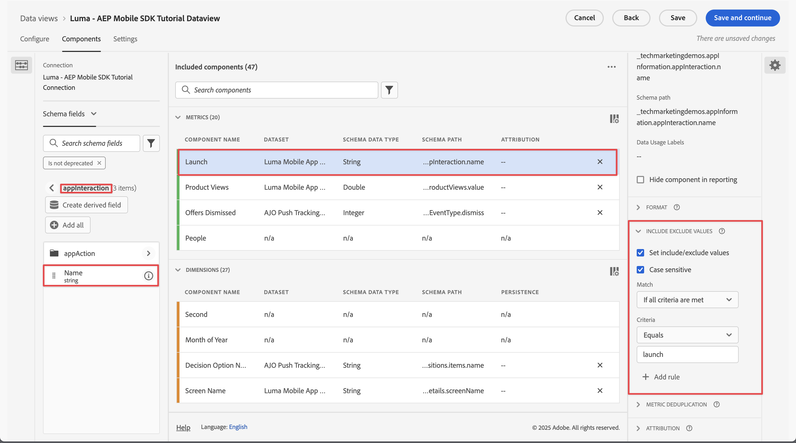

# Session settings {#session-settings}

<!-- markdownlint-disable MD034 -->

>[!CONTEXTUALHELP]
>id="dataview_settings_datapreview"
>title="Data preview"
>abstract="Compares the data of this data view with data of the connection. The preview percentage is based on the total number in the connection from the **last 90 days**.  If the preview is not loading, your connection could still be backfilling."

<!-- markdownlint-enable MD034 -->

<!-- markdownlint-enable MD034 -->

In Customer Journey Analytics, you can define a session in any way to match how persons interact with your digital experiences. You configure session settings within a data view.

Session settings definitions are non-destructive and do not alter the underlying data. You can set up multiple data views (each with their own specific session settings definition) as a foundation for your Workspace projects.

To define the context of a session within a data view:

1. Select **[!UICONTROL Data views]**, optionally from **[!UICONTROL Data management]**, in the main navigation of the Customer Journey Analytics UI.

1. Create a new or edit an existing data view. See [Create or edit a data view](create-dataview.md) for more information.

1. Select the **[!UICONTROL Settings]** tab. Underneath [!UICONTROL Session settings]:

   1. Enter a value for **[!UICONTROL Session timeout]** in [!UICONTROL minute(s)], [!UICONTROL hour(s)], [!UICONTROL day(s)], or [!UICONTROL week(s)]. The session timeout determines how long a session can be idle (no events occur) before starting a new session.

      Use a short session timeout (for example 30 minutes) if you are interested in analyzing mostly online interactions. For example, analyzing whether profiles visiting your online store product pages did add products to their cart or even purchased online.

      Use a long session timeout (for example 3 months) if you are combining online and offline data and want to analyze whether customers that have purchased one or more of your products, have called your contact center within the first three months after their purchase.

   1. Select a segment from the **[!UICONTROL Add segments]** drop-down menu if you want to segment a data view. Alternatively, you can drag and drop a segment from  **[!UICONTROL Segments]** in the left pane on the **[!UICONTROL _Drop a segment here_]**.  
 
      Only those segments are listed that are shared, to which you do have access, and that can be evaluated based on the components you have defined for the data view.

   1. Select a metric from the **[!UICONTROL Start new session with a metric]** drop-down menu . Alternatively, you can drag and drop a metric from  **[!UICONTROL Metrics]** in the left pane on the **[!UICONTROL _Drop a metric here_]**. The selected metric defines the start of a new session. You can define more than one metric.
   
      You can use any kind of metric to define a new session. As an example, imagine you want to define a new session every time a profile launches your mobile app. In **[!UICONTROL Data view]** > **[!UICONTROL Components]**, you define a component of type metric, named **[!UICONTROL Launch]**, based on an **[!UICONTROL appInteraction]** **[!UICONTROL Name]** schema field. You further specify the **[!UICONTROL Launch]** metric component to only count the value when the value matches `launch`. 
      
      
      
      Then you drag and drop, or select the **[!UICONTROL Launch]** metric as the metric to define a new session.

      

1. Select **[!UICONTROL Save]** or **[!UICONTROL Save and finish]** to save the session settings definition.
