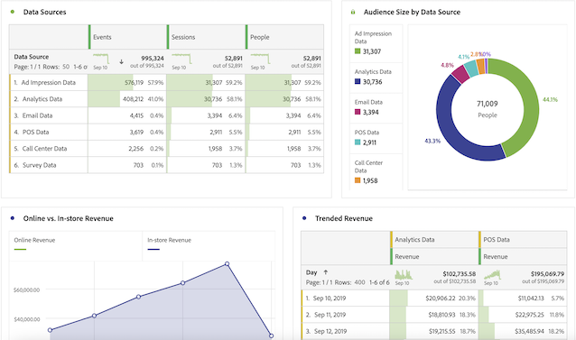
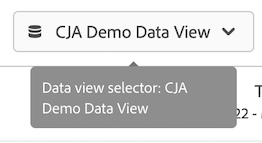

# User Guide for Adobe Analytics users

If your organization is starting to employ Adobe Customer Journey Analytics, you may notice some similarities and differences between Adobe Analytics and Customer Journey Analytics. This page aims to explain those differences to help acclimate your organization to the new implementation and reporting workflow. This page also provides additional resources on new concepts, and further steps to make your journey as an analyst easier and more successful.

Several features in Customer Journey Analytics are renamed and redesigned to align with industry standards. Some updated terminology includes segments, virtual report suites, classifications, customer attributes, and container names. The limitations of eVars and props no longer exist, in favor of flexible custom dimensions and metrics.

## What hasn't changed

Much of what you are familiar with on the reporting side has not changed.

* You can still use the power of [Analysis Workspace](/help/analysis-workspace/home.md) to analyze your data. Workspace operates the same as it does in traditional Adobe Analytics.
* The same version of [Adobe Analytics dashboards](/help/mobile-app/home.md) is available, and works similarly between Customer Journey Analytics and Adobe Analytics.
* [Report Builder](/help/report-builder/rb-overview.md) has a new interface and runs on MS Windows, MacOS, and the web version of Excel. (Before this version of Report Builder, you couldn't use in on Mac unless you ran it on VMware.) This version doesn't support traditional AA data request yet.

## Changes to reporting

You have access to a lot more cross-channel data to analyze. For example, you can create a workspace project that analyzes performance of multiple channels, provided these datasets are ingested by your organization and included in data views used by Customer Journey Analytics (see "Changes to data architecture" below).

## Changes to data architecture {#architecture}

Customer Journey Analytics gets its data from Adobe Experience Platform. Experience Platform lets you centralize and standardize customer data and content from any system or channel and applies data science and machine learning to improve the design and delivery of personalized experiences.

Customer data in the Experience Platform is stored as datasets, which consist of a [schema](https://experienceleague.adobe.com/docs/platform-learn/tutorials/schemas/schemas-and-experience-data-model.html) and batches of data. For more detail on the platform, see [Adobe Experience Platform Architecture Overview](https://experienceleague.adobe.com/docs/platform-learn/tutorials/intro-to-platform/basic-architecture.html).

Your Customer Journey Analytics Admin establishes [connections](/help/connections/create-connection.md) to datasets in Experience Platform. They then build [data views](/help/data-views/data-views.md) using those connections. Data views are conceptually similar to virtual report suites, and are the basis of reporting in Customer Journey Analytics. Since Experience Platform sources all data for reporting, report suites no longer exist as a container for data.

A connection lets your Analytics Admin integrate datasets from Adobe Experience Platform into Customer Journey Analytics.

<!--
Outdated UI

>[!BEGINSHADEBOX]

See  [Configuring connections](https://video.tv.adobe.com/){target="_blank"} for a demo video.

>[!ENDSHADEBOX]

-->

Adobe offers multiple ways to bring data in to Adobe Experience Platform, including report suite data through the Analytics source connector or the Web SDK. Existing implementations from multiple report suites can be combined in Experience Platform. The connections and data views that are based on these datasets can combine data that previously existed in separate report suites.

## Changes to the concept of virtual report suites {#data-views}

[!UICONTROL Data views] take the concept of virtual report suites as they exist today and expand it to [enable additional controls on the data](/help/data-views/create-dataview.md) made available by connections. These changes make general settings like timezone and session time-out intervals configurable and retroactive. Individual variable settings like attribution and expiration can also be customized on a report or data view level. These settings are non-destructive and retroactive.

Notice that the report suite selector in the top right now lets you choose from available data views:

See [Use cases around data views](/help/use-cases/data-views/data-views-usecases.md) for more information around this concept.

## Changes to the concept of eVars and props

The concepts of [!UICONTROL eVars], [!UICONTROL props], and [!UICONTROL events] in traditional Adobe Analytics no longer exist in [!UICONTROL Customer Journey Analytics]. In Adobe Analytics, eVars and props store descriptions of content, customers, campaigns, etc. and events count things like revenue, subscriptions, or leads generated. Customer Journey Analytics preserves both types of data, and you can access them the same way — from the left rail in Analysis Workspace, under Dimensions or Metrics, respectively. 

In Customer Journey Analytics, unlimited schema elements are available, including dimensions, metrics, and list fields. These are mapped to unlimited schema elements including dimensions, metrics and list fields in Experience Platform. All visit and attribution settings applied after processing rules in Adobe Analytics now apply at query time in Customer Journey Analytics.

With this flexibility, you may run into situations in which a single schema field can be used as both a dimensions and a metric to support different tracking needs.

## Changes to the concept of segments

While segments are not technically migrated from Adobe Analytics to Customer Journey Analytics, you can use the component migration tool to re-create your Adobe Analytics segments in Customer Journey Analytics. Segments are re-created in Customer Journey Analytics based on the dimensions and metrics that are mapped. For more information, see [Prepare to migrate components and projects from Adobe Analytics to Customer Journey Analytics](https://experienceleague.adobe.com/docs/analytics/admin/admin-tools/component-migration/prepare-component-migration.html).

While you cannot yet share or publish [!UICONTROL segments] ([!UICONTROL segments]) from [!DNL Customer Journey Analytics] to Experience Platform Unified Profile, this functionality is under development.

In addition to the concept of segments changing, segment containers are also updated.

* **Hit containers are now [!UICONTROL Event] containers**. The [!UICONTROL Event] container lets you break down person information based on individual events. 
* **Visit containers are now [!UICONTROL Session] containers**. The [!UICONTROL Session] container lets you identify page interactions, campaigns, or conversions for a specific session.
* **Visitor containers are now [!UICONTROL Person] containers**. The [!UICONTROL Person] container includes every session and event for a person within the specified time frame.

## Changes to the concept of calculated metrics

Calculated metrics are similarly named between Adobe Analytics and Customer Journey Analytics. However, [!UICONTROL Customer Journey Analytics] no longer uses eVars, props, or events and instead uses any Experience Platform schema element. This fundamental change means that none of the existing calculated metrics are compatible with [!UICONTROL Customer Journey Analytics]. 

>[!BEGINSHADEBOX]

See  [Moving calculated metrics from Adobe Analytics to Customer Journey Analytics](https://experienceleague.adobe.com/en/docs/customer-journey-analytics-learn/tutorials/components/calc-metrics/moving-your-calculated-metrics-from-adobe-analytics-to-customer-journey-analytics){target="_blank"} for a demo video on how to move calculated metrics.

>[!ENDSHADEBOX]

## Changes to variable attribution and expiration settings

[!UICONTROL Customer Journey Analytics] applies all variable settings, including attribution and expiration, at report time. These settings now reside in [data views](/help/data-views/component-settings/persistence.md), and some variable settings (like attribution) can be changed in Workspace projects.

You can have multiple versions of the same variable in the same data view. For example, you can have one Tracking Code dimension that expires after 30 days, and another that expires at the end of a session. Both of these Tracking Code dimensions use the same source data, but use different attribution settings.

You can also have multiple data views based on the same connection. For example, you can have one data view with a session timeout of 30 minutes, and another with a session timeout of 15 minutes. Both data views appear in the upper right selector so you can seamlessly transition between them.

## Changes to the concept of classifications

"Classifications" are now known as *Lookup datasets*. Lookup datasets are used to look up values or keys found in your Event or Profile data. For example, you might upload lookup data that maps numeric IDs in your event data to product names.

## Changes to the concept of customer attributes

"Customer attributes" are now known as "Profile datasets". Profile datasets contain data that is applied to your persons, users, or customers in the [!UICONTROL Event] data. For example, it allows you to upload CRM data about your customers. You can pick which Person ID you want to include. Each dataset defined in [!DNL Experience Platform] has its own set of one or more Person IDs defined.

## Changes to how Adobe identifies visitors

Customer Journey Analytics expands the concepts of identities beyond ECIDs to include any ID you want to use, including Customer ID, Cookie ID, Stitched ID, User ID, Tracking Code, and so on. Using a common namespace ID across datasets, or using [Stitching](../stitching/overview.md) helps link people together across different datasets. Any user setting up a Workspace project in Customer Journey Analytics must understand the IDs used across the datasets. See the following video that highlights the use of identities in Customer Journey Analytics

>[!BEGINSHADEBOX]

See  [Using identity in Customer Journey Analytics](https://experienceleague.adobe.com/en/docs/customer-journey-analytics-learn/tutorials/visitor-id/understanding-how-customer-journey-analytics-uses-identity){target="_blank"} for a demo video.

>[!ENDSHADEBOX]

## Changes to the concept of low-traffic dimension item

In traditional Adobe Analytics, a variable that receives too many unique values starts bucketing dimension items under [!UICONTROL Low-Traffic]. Customer Journey Analytics has fewer limitations to high-cardinality fields. Changes to the reporting architecture allow Analysis Workspace to report on many more unique dimension items. See [High cardinality dimensions](../components/dimensions/high-cardinality.md) for more information around how Customer Journey Analytics optimizes reporting for dimensions with many unique values.
