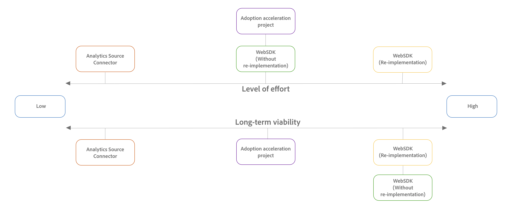

# Migration planning guide: Adobe Analytics to Customer Journey Analytics

## Step 1 - Understand the benefits of Customer Journey Analytics

Customer Journey Analytics is the next generation of analytics. It allows multi-channel data collection (both online and offline data), combined with powerful report-time processing functionality (through the definition of components and derived fields in data views). 

As you plan your migration, learn how Customer Journey Analytics can benefit your organization. Following are some of the key benefits: (For a comprehensive list, as well as more information about each of these key features, see [Features available only in Customer Journey Analytics](/help/getting-started/aa-vs-cja/cja-aa.md#adobe-customer-journey-analytics-features-not-available-in-adobe-analytics).) 

* Multi-channel reporting

  Customer Journey Analytics is combined with Experience Platform's ability to hold all kinds of data schemas and types. Collect and report on data from multiple channels, such as digital (Web), Point-of-Sale systems, mobile, CRM systems, and more.

* Report-time transformations in data views

  Data views in Customer Journey Analytics allow you to further interpret data from a connection. You can alter or remove data without changing your implementation, use substrings to manipulate dimensions, create metrics from any value, filter subevents, or use derived fields. All of these transformations are non-destructive. 

  For more information, see [Customer Journey Analytics data views](/help/getting-started/aa-vs-cja/vrs-dataview-sandbox-adc.md#customer-journey-analytics-data-views)

* Transformation apply to historical and new data

  Data View manipulation can be applied to both historical and new data in a non-destructive manner. For more information, see [Data Views](/help/getting-started/aa-vs-cja/vrs-dataview-sandbox-adc.md).

* Derived fields

  Derived fields allow for report-time transformations to your data. Data can be combined, corrected, or created on the fly and applies retroactively to all reporting.

* Combine Connections (report suites in Adobe Analytics)

  You can combine data from multiple Connections (report suites in Adobe Analytics) as if they were a single Connection.

* Unlimited customer dimensions and metrics

  Values can be numeric, text, objects, lists, or mixtures of all. Dimensions can be nested or hierarchical.

## Step 2: Choose your Customer Journey Analytics migration method

After you decide to migrate to Customer Journey Analytics, you need to determine the optimal migration method for your organization.  

The method that you choose for migrating from Adobe Analytics to Customer Journey Analytics depends on the following factors: 

* Your current Adobe Analytics implementation 

* Your goals for the future 

Use the following sections to determine which Customer Journey Analytics migration method best aligns with your organization's current environment and future goals: 

### Assess the migration methods available to you based on your current Adobe Analytics implementation

There are various options available for migrating from Adobe Analytics to Customer Journey Analytics.  

#### Understand migration methods  

In general, each migration method differs in the level of effort required to execute the migration, as well as in the long-term viability achieved after the migration completes.  

The following table lists each migration method, its level of effort, and its long-term viability: 

| Migration method | Level of effort | Long-term viability |
|---------|----------|---------|
| WebSDK (re-implementation)  | High | High |
| WebSDK (without re-implementation)  | Moderate | High |
| Adoption acceleration project | Moderate | Moderate |
| [Analytics Source Connector](/help/data-ingestion/analytics.md) | Low | Low |

{style="table-layout:auto"}

Use the following diagram to help visualize where each migration method falls on the spectrum in terms of level of effort, as well as the long-term viability that each achieves:

#### Migration methods available based on your Adobe Analytics implementation

Not all migration methods are available for each type of Adobe Analytics implementation. The following table shows which migration methods are available to you, based on your current Adobe Analytics implementation: 

|Current Adobe Analytics implementation | Available migration methods |
|---------|----------|
| AppMeasurement | <ul><li>WebSDK (re-implementation)</li><li>[Analytics Source Connector](/help/data-ingestion/analytics.md)</li></ul>  | 
| Adobe Analytics extension | <ul><li>WebSDK (re-implementation)</li><li>[Analytics Source Connector](/help/data-ingestion/analytics.md)</li><li>Adoption acceleration project</li></ul> | 
| WebSDK | <ul><li>WebSDK (without re-implementation)</li></ul> | 

{style="table-layout:auto"}

### Weigh the pros and cons of the migration methods available to you

The pros and cons of a given migration method differ depending on your current Adobe Analytics implementation. 

Before you use the information below to determine which migration method is right for you, review the information in [Understand migration methods](#understand-migration-methods) if you haven't already.

#### AppMeasurement 

AppMeasurement is the oldest supported Adobe Analytics implementation. Because of this, the methods available for migrating to Customer Journey Analytics from this implementation type are more limited.

The following table shows the migration methods available for organizations who have implemented Adobe Analytics with AppMeasurement:

| Migration method | Pros | Cons |
|---------|----------|---------|
| **WebSDK (re-implementation)** |<ul><li>Highly performant reporting (low latency) because the infrastructure is built around real-time data </li><li>Future-proof (will receive all the latest features and functionality)</li><li>Consolidate tags for Adobe Experience Cloud data collection between other Experience Cloud products (AJO, RTCDP, etc.)</li></ul> | <ul><li>Most time-consuming and demanding migration method</li><li>Must re-create the full schema in XDM</li></ul> |
| **Analytics Source Connector** | <ul><li>Least time-consuming and demanding migration method: Data is migrated to Customer Journey Analytics quickly with minimal investment </li></ul> | <ul><li>Difficult to move to WebSDK in the future</li><li>Uses the Analytics Experience Event field group in your schema</li><li>This field group adds many Adobe Analytics events that are not needed in your Customer Journey Analytics schema.  This can lead to a more cluttered, complex schema than what is otherwise needed for Customer Journey Analytics.</li><li>Highest level of [latency](/help/admin/guardrails.md#latencies) across all implementation methods</li><li>Data cannot be shared with other Adobe Experience Platform applications; it is constrained to Customer Journey Analytics only</li></ul> |

{style="table-layout:auto"}

#### Adobe Analytics extension

The following table shows the migration methods available for organizations who have implemented Adobe Analytics with the Adobe Analytics extension:

| Migration method | Pros | Cons |
|---------|----------|---------|
| **WebSDK (re-implementation)** |<ul><li>Highly performant reporting (low latency) because the infrastructure is built around real-time data </li><li>Future-proof (will receive all the latest features and functionality)</li><li>Consolidate tags for Adobe Experience Cloud data collection between other Experience Cloud products (AJO, RTCDP, etc.)</li></ul> | <ul><li>Most time-consuming and demanding migration method</li><li>Must re-create the full schema in XDM</li></ul> |
| **Analytics Source Connector** | <ul><li>Least time-consuming and demanding migration method: Data is migrated to Customer Journey Analytics quickly with minimal investment </li></ul> | <ul><li>Difficult to move to WebSDK in the future</li><li>Uses the Analytics Experience Event field group in your schema</li><li>This field group adds many Adobe Analytics events that are not needed in your Customer Journey Analytics schema.  This can lead to a more cluttered, complex schema than what is otherwise needed for Customer Journey Analytics.</li><li>Highest level of [latency](/help/admin/guardrails.md#latencies) across all implementation methods</li><li>Data cannot be shared with other Adobe Experience Platform applications; it is constrained to Customer Journey Analytics only</li></ul> |
| **Adoption acceleration project** | <ul><li>Provides a good middle ground between a WebSDK re-implementation and using the Analytics Source Connector. </li><li>Quickest method for migrating to the Customer Journey Analytics WebSDK.</li></ul> |  |

{style="table-layout:auto"}

#### Adobe Analytics WebSDK

The following table shows the migration methods available for organizations who have implemented Adobe Analytics with the WebSDK:

| Migration method | Pros | Cons |
|---------|----------|---------|
| **WebSDK (without re-implementation)** |<ul><li>The ideal migration method; available only with Adobe Analytics WebSDK implementations</li><li>Infrastructure is built around real-time data; this equates to highly performant reporting with low latency</li><li>Future-proof (will receive all the latest features and functionality)</li><li>Consolidate tags for Adobe Experience Cloud data collection between other Experience Cloud products (AJO, RTCDP, etc.)</li></ul> | None |

{style="table-layout:auto"}

## Step 3: Determine how to retain historical data

Choose one of the following options to retain historical data when moving from Adobe Analytics to Customer Journey Analytics: 

* Utilize the [Analytics Source Connector](/help/data-ingestion/analytics.md)

  Regardless of the migration method that you choose (even if you migrate using the WebSDK), you can use the Analytics Source Connector to retain historical data from your Adobe Analytics environment. 

  You can use the Analytics Source Connector to retain historical data in the following ways:
  
  * Bring historical data to its own dedicated location, separate from your current data.

  * Map historical data in a way that allows you to tie it to your new data. <!-- Possible? Explain -->

* Maintain your current Adobe Analytics implementation alongside your new Customer Journey Analytics implementation for a specific time frame (for example, 1 year). You can decommission the Adobe Analytics implementation after you have sufficient data in Customer Journey Analytics. 

## Step 4: Plan data mapping to the XDM schema

Working with your data team, identify your organization's ideal schema design for Customer Journey Analytics, then determine how you will map eVars and Props to XDM. 

## Step 5: Plan user onboarding

## Step 6: Port the reporting API usage 

Port the reporting API usage from the Adobe Analytics reporting API to the Customer Journey Analytics reporting API. 

The Customer Journey Analytics reporting API is the same format, but a different endpoint.

## Step 7: Plan Data Feeds and Data Warehouse replacements

If you currently use Data Feeds or Data Warehouse in Adobe Analytics, use the following table to learn about the various export options available in Customer Journey Analytics:

| Adobe Analytics | Customer Journey Analytics | 
|---------|----------|
| Data Feeds | Update your Data Feeds use cases to use any combination of alternative export methods that are available in Customer Journey Analytics: <ul><li>Raw dataset exports from AEP to public cloud​</li><li>[Full Table Export](/help/analysis-workspace/export/export-cloud.md) (use person ID and/or timestamp for audience or event level exports)​</li><li>CJA BI Extension (for direct integration with Power BI and Tableau)​</li><li>AEP Query Service (for direct SQL access to data in AEP)</li></ul> | 
| Data Warehouse | Change Adobe Analytics Data Warehouse exports to use [Full Table Export](/help/analysis-workspace/export/export-cloud.md) in Customer Journey Analytics.
Customer Journey Analytics Full Table Export is the evolution of Data Warehouse reports in Adobe Analytics, with many new, often-requested features that are not available in Data Warehouse today.
 | 

{style="table-layout:auto"}

## Step 8: Migrate projects and components

The Component migration area in Adobe Analytics allows you to migrate projects and components from Adobe Analytics to Customer Journey Analytics. 

For more information, see [Prepare to migrate components and projects from Adobe Analytics to Customer Journey Analytics](https://experienceleague.adobe.com/en/docs/analytics/admin/admin-tools/component-migration/prepare-component-migration).

## Step 9: Get started with Customer Journey Analytics

Before you begin using Customer Journey Analytics, complete the steps outlined in [Customer Journey Analytics Getting Started](/help/getting-started/cja-getting-started.md).