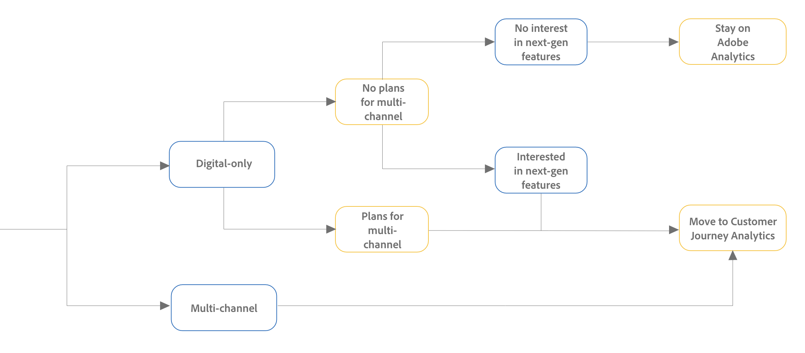

# Migration planning guide: Adobe Analytics to Customer Journey Analytics

## Step 1 - Choose between Adobe Analytics and Customer Journey Analytics

Whether you choose AA or CJA depends on your current analytics environment and your goals for the future. 

The decision tree and the decision table below can help you determine if AA meets your organization's needs, or if you should plan to migrate to CJA.  

For information about relevant terms when using these resources ("digital-only," "multi-channel," and "next-gen features,") see the Considerations when using the decision tree and table section below. 

### Decision tree

Follow each decision-point in the tree to determine which analytics product best meets your needs. 

### Decision table

Choose the row in the table that best represents your organization in order to determine which analytics product best meets your needs. 

| Digital-only vs. multi-channel  | Plans for multi-channel | Next-gen features | Recommended product |
|---------|----------|---------|---------|
| Digital-only | No | No | Adobe Analytics |
| Digital-only | No | Yes | Customer Journey Analytics |
| Digital-only | Yes | Yes or No | Customer Journey Analytics |
| Multi-channel | N/A | Yes or No | Customer Journey Analytics |

### Considerations when using the decision tree and table

#### Digital-only vs. multi-channel

Customer Journey Analytics can collect and report on data from multiple channels, such as digital (Web), Point-of-Sale systems, mobile, CRM systems, and more.  

Adobe Analytics allows you to collect and report on digital (Web) data only.  

#### Next-gen features

Customer Journey Analytics includes the following next-generation features: 

* Derived fields 

* Visitor stitching 

* Combining report suites 

These features are not available in Adobe Analytics. Some future features will be available only with Customer Journey Analytics. 

## Step 2: Choose your Customer Journey Analytics migration method

If in [Step 1](#step-1---choose-between-adobe-analytics-and-customer-journey-analytics) you determined that you should migrate to Customer Journey Analytics, you now need to determine the optimal migration method.  

The method that you choose to migrate from AA to CJA depends on the following factors: 

* Your current AA implementation 

* Your goals for the future 

Use the following sections to determine which CJA migration method best aligns with your organization's current environment and future goals: 

### Assess the migration options available to you based on your current AA implementation

There are various options available for migrating from AA to CJA.  

#### Understand migration options  

In general, each migration option differs in the level of difficulty required to execute the migration, as well as in the end result achieved after the migration completes.  

The following table lists each migration option, its ease of migration, and the robustness of the migration based on the end result that it achieves: 

| Migration method | Ease of migration | End result |
|---------|----------|---------|
| WebSDK (re-implementation)  | Difficult | Most robust |
| WebSDK (without re-implementation)  | Moderate | Most robust |
| Russ special | Moderate | Moderately robust |
| Adobe Source Connector | Easy | Least robust |

#### Migration options available based on your AA implementation

The following table shows which migration options are available to you, based on your current AA implementation: 

|Current Adobe Analytics implementation | Available migration options |
|---------|----------|
| AppMeasurement | <ul><li>WebSDK (re-implementation)</li><li>Adobe Source Connector</li></ul>  | 
| Adobe Anlalytics extension | <ul><li>WebSDK (re-implementation)</li><li>Adobe Source Connector</li><li>Russ special</li></ul> | 
| WebSDK | <ul><li>WebSDK (without re-implementation)</li>/ul> | 

### Weigh the pros and cons of the migration methods available to you

The pros and cons of a given migration option differ depending on your current Adobe Analytics implementation. Review the information below to determine which migration option is right for you. 
