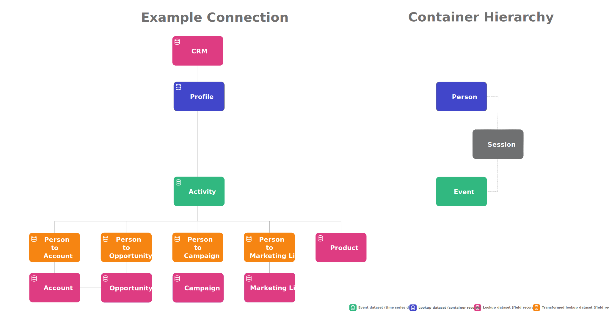
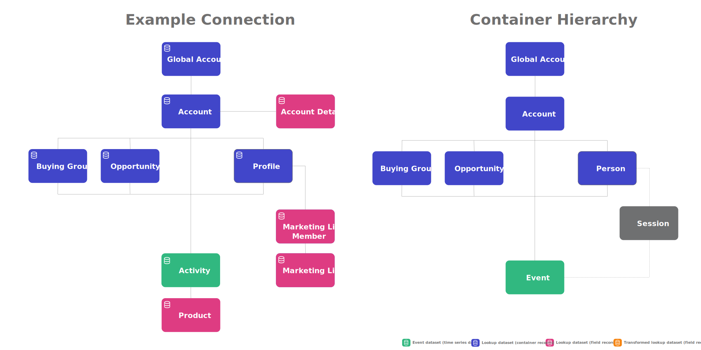

# B2B Edition concepts and features

The *standard* version of Customer Journey Analytics is build around the concept of three containers: Person, Session, and Event.

You can redefine how these containers are named when you configure a Data view but conceptually the standard version uses a person-based schema hierarcy.

When you use the [transform datasets for B2B lookup functionality](/help/connections/transform-datasets-b2b-lookups.md), you use additional lookup datasets to provide more B2B details on that same person-based hierarchy. The transformation offers additional possibilities to build [person-based B2B reports and insights](/help/use-cases/b2b/example.md).

The B2B edition of Customer Journey Analytics adds Account, Global Account, Opportunity, and Buying Group as additional containers to an account-based schema hierarchy.

| B2B container | Description |
|---|---|
| Opportunity | A collection of products and services that are sold together. An opportunity often involved various stages in the sales cylce to close as a sale. |
| Buying group | A collection of people within an organization that is involved in the decision-making process to purchase a product or service. |
| Person | An individual, often identified by a unique e-mail address that has interacted with the company. |
| 

## Structure datasets

### Account

* account_id
* business_unit
* global_account_id
* location

### Global account

* global_account_id
* headquarters
* industry
* organization_name

### Buying group

* global_account_id
* purchase_category
* account_id
* decision_maker
* buying_group_id

### Opportunity

* global_account_id
* revenue_potential
* account_id
* opportunity_id
* sales_stage

### Profile

* global_account_id
* full_name
* job_title
* person_id
* department
* account_id

### Event

* global_account_id
* event_outcome
* person_id
* event_description
* event_durations
* account_id
* opportunity_id
* buying_group_id

