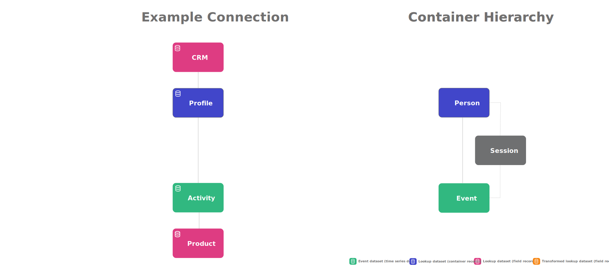

# B2B Edition concepts and features

This article explains general concepts and features on datasets and containers and how these differ between the standard and the B2B Edition of Customer Journey Analytics.

Datasets are the sources of a connection. Containers are a used in Customer Journey Analytics to to support and facilitate features like filters, calculated metrics, and advanced analytics capabilities.

## Standard datasets and containers

The *standard* version of Customer Journey Analytics is build around the concept of three containers: Person, Session, and Event.

You can redefine how these containers are named when you configure a Data view but conceptually the standard version uses a person-based container hierarchy.

{zoomable="yes"}

In the connection, you add Event, Profile and Lookup datasets and you select identities to use to define the connection between these datasets. As part of the connection, a person-based container hierarchy is created automatically. In that hierarchy the Session container is defined by the [Session settings](/help/data-views/session-settings.md) in your Data view.

## Transformed datasets and containers

When you use the [transform datasets for B2B lookup functionality](/help/connections/transform-datasets-b2b-lookups.md), you use additional lookup datasets to provide more B2B details on that same person-based hierarchy. The transformation offers additional possibilities to build [person-based B2B reports and insights](/help/use-cases/b2b/example.md), but conceptually transformed datasets rely on the same person-based container hierarchy.

{zoomable="yes"}

In the connection, you add Event, Profile and Lookup datasets, amongst which additional specific B2B datasets and apply transformation on these B2B datasets for person-based reporting. You then select person-based identities to define the connection between these datasets. As part of the connection, a person-based container hierarchy is created automatically. In that hierarchy the Session container is defined by the [Session settings](/help/data-views/session-settings.md) in your Data view.

## B2B datasets and containers

The B2B edition of Customer Journey Analytics adds Account, Global Account, Opportunity, and Buying Group as additional containers to facilitate an account-based container hierarchy.

{zoomable="yes"}

In the connection, you add Event, Account, Global Account, Opportunity, Buying Group and other Lookup datasets. You select Account as the primary ID for the connection so you can use account-based identities to define the connection between the datasets. As part of the connection, an account-based container hierarchy is created automatically. In that hierarchy the Session container between the Person container and Event container is defined by the [Session settings](/help/data-views/session-settings.md) in your Data view. Additionally Session containers, for example between Account and Event, are currently not supported.

Opportunity, Buying Group and Person are all sibling containers of the Account container. See the table below for a description, basic use case and an example how to use.

| B2B container | Description Basic use case |
|---|---|
| Opportunity | A collection of products and services that are sold together. An opportunity often involved various stages in the sales cylce to close as a sale. You would use opportunity data to measure the opportunity progression through the sales funnel. For example, a report that provide details on the top opportunities that moved from opportunity stage 3 to stage 4. |
| Buying group | A collection of people within an organization that is involved in the decision-making process to purchase a product or service.  You would use buying group data to track buying groups through campaign management. For example, buikd an audience segment of key buying groups.  You most likely want a lookup from the buying group to profile data, so you can report on the people in a buying group. |
| Person | An individual, often identified by a unique e-mail address that has interacted with the company.  You would use the profile data to identify people who work for an account. For example: target all the people at an account that have signed-up for a conference. |

If you do have a B2B structure that requires you to support the concept of an account with subsidary accounts, a Global account container can be used as the parent container.

<!--

## Structure datasets

### Account

* account_id
* business_unit
* global_account_id
* location

### Global account

* global_account_id
* headquarters
* industry
* organization_name

### Buying group

* global_account_id
* purchase_category
* account_id
* decision_maker
* buying_group_id

### Opportunity

* global_account_id
* revenue_potential
* account_id
* opportunity_id
* sales_stage

### Profile

* global_account_id
* full_name
* job_title
* person_id
* department
* account_id

### Event

* global_account_id
* event_outcome
* person_id
* event_description
* event_durations
* account_id
* opportunity_id
* buying_group_id

-->