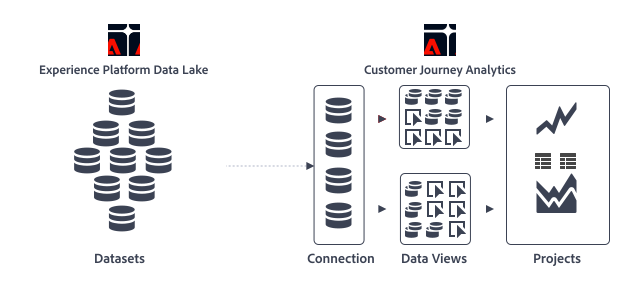

# Customer Journey Analytics overview

Customer Journey Analytics is Adobe's next-generation Analytics solution that lets you use the power of Analysis Workspace with data from Adobe Experience Platform. It can break down, segment, query, and visualize years' worth of data, and is combined with Platform's ability to hold all kinds of data schemas and types. Using the **Experience Data Model (XDM)**, data can be uniformly represented and organized, ready for combination and exploration. **Adobe Experience Platform Query Service** allows you to use SQL-compatible tools and frameworks to query and manipulate all your data.

The high-level Customer Journey Analytics architecture is shown here:

This architecture illustrates how Custoner Journey Analytics allows you to:

* Combine mutltiple datasets  in a [connection](/help/connections/overview.md).
* Define and configure dimensions  and metrics  in a [data view](/help/data-views/data-views.md), based on the fields available from the datasets you defined in your connection.
* Build reports  and visualizations (like line  and area ) in [projects](/help/analysis-workspace/home.md) based on the dimensions and metrics from your data views.

>[!BEGINSHADEBOX]

See  [Customer Journey Analysis: Analytics for the Experience Business](https://experienceleague.adobe.com/en/docs/customer-journey-analytics-learn/tutorials/cja-basics/what-is-customer-journey-analytics){target="_blank"} for a introduction video to Customer Journey Analytics.

>[!ENDSHADEBOX]

## Comparing Customer Journey Analytics to Traditional Adobe Analytics

Customer Journey Analytics expands the scope of Adobe Analytics by offering easy to use cross-channel capabilities and removing limitations in previous versions of Adobe Analytics. Some notable improvements are:

* **Unlimited variables and events**: The concepts of eVars, props, and events no longer exist. Data is primarily focused on dimensions and metrics. Datasets can have an unlimited number of unique dimensions and metrics.
* **Unlimited unique values**: Adobe Experience Platform is not constrained to any unique limitations.
* **Alter historical data**: Using Adobe Experience Platform, data can be removed or corrected.
* **Cross-report-suite data**: Existing implementations from multiple datasets can be combined in Platform.

>[!TIP]
>
>If you have been using Adobe Analytics and want to use your Adobe Analytics data in Customer Journey Analytics, see [Ingest and use data from traditional Adobe Analytics](../data-ingestion/analytics.md) quick start guide as part of the [Data Ingestion](../data-ingestion/data-ingestion.md) section.

The initial release of Customer Journey Analytics includes many of the features included in Adobe Analytics. For a complete list, see [Customer Journey Analytics feature support](/help/getting-started/aa-vs-cja/cja-aa.md).

## Key use cases

Customer Journey Analytics lets you:

* **See the customer in a journey context**: You can view and analyze data sequentially, spanning multiple channels. Data from your call center, POS systems, and online properties can be combined into a single reporting view.
* **Make insights available to everyone**: Democratize data access and let more people make business decisions with data-derived insights. Anyone in the organization with responsibility for any aspect of the customer experience can make real decisions faster, based on more complete data.
* **Harness the power of data science for your analysts**: Customer Journey Analytics lets normal humans use data science to unlock deep insights and analysis.
* **Visualize and interact with your datasets using on demand reporting**: Workspace can use any dataset from Adobe Experience Platform that conforms to some basic rules.
* **View non-web data**: Workspace is no longer limited to a rigid definition of a 'hit' or 'event'. Custom schemas allow complete control over data and definitions.
* **Exert greater control over your data manipulation**: Change data that you have uploaded, create datasets, and import them into Workspace. Adobe Experience Platform provides querying, extracting, transforming, and loading tools through the Experience Platform Query Service.

## Prerequisites

Before you can start using Customer Journey Analytics, the following prerequisites must be met:

* Your organization has an active contract with Adobe Analytics for Select, Prime, or Ultimate with the Customer Journey Analytics add-on. If you are not sure what type of contract you have, or are not sure if you have the Customer Journey Analytics add-on, contact your Adobe Account Team.
* Your organization has been provisioned for Adobe Experience Platform.
* You can also purchase Customer Journey Analytics as a standalone product, without the need for Adobe Analytics.

## Access Control

See [Access Control](/help/technotes/access-control.md).

## Terminology updates

Several features in Customer Journey Analytics have been renamed, when compared to traditional Adobe Analytics, to align with industry standards. Some updated terminology includes:

* Virtual report suites are now known as 'Data views'.
* Classifications are now known as 'Lookup datasets'.
* Customer attributes are now known as 'Profile datasets'.
* Hit containers are now known as 'Event' containers.
* Visit containers are now known as 'Session' containers.
* Visitor containers are now known as 'Person' containers.

## Other capabilities built on Adobe Experience Platform

Customer Journey Analytics is one capability among many that rely on the Adobe Experience Platform. Several other capabilities, also built on Experience Platform, let you get the most out of your data.

Adobe Experience Platform lets you centralize and standardize customer data and content from any system and apply data science and machine learning to improve the design and delivery of personalized experiences. Customer data in the platform is stored as datasets,which consist of a schema and batches of data. For more detail on the platform, see [Adobe Experience Platform Architecture Overview](https://experienceleague.adobe.com/docs/platform-learn/tutorials/intro-to-platform/basic-architecture.html).

From Data Ingestion to direct SQL access, several components of the Experience Platform are central to Customer Journey Analytics and complement it:

* [Experience Platform Query Service](https://experienceleague.adobe.com/docs/experience-platform/query/home.html): Use standard SQL to retrieve data from Adobe Experience Platform, such as Adobe solution data, customer 1st-party data, or any other Platform data. It is a server-less tool that allows you to join any datasets and capture the query results as a new dataset for use in reporting or for ingestion into Profile Service. You can use Experience Platform Query Service to build data analysis ecosystems, creating a picture of consumers across their various interaction channels. These channels might include Point-of-Sale systems, Web, Mobile, CRM systems, and so forth.
* [Real-time Customer Profile](https://experienceleague.adobe.com/docs/experience-platform/profile/home.html):
* [Identity Service](https://experienceleague.adobe.com/docs/experience-platform/identity/home.html)

## Videos

>[!BEGINSHADEBOX]

See  [Work with data in Customer Journey Analytics](https://experienceleague.adobe.com/en/docs/customer-journey-analytics-learn/tutorials/data-prep/working-with-data-in-cja){target="_blank"} for a introduction video omn how to work with data in Customer Journey Analytics.

>[!ENDSHADEBOX]

>[!BEGINSHADEBOX]

See  [Architecture and integration](https://experienceleague.adobe.com/en/docs/customer-journey-analytics-learn/tutorials/architecture/architecture-and-integrations-of-cja){target="_blank"} for a introduction video on the architecture and integration of Customer Journey Analytics..

>[!ENDSHADEBOX]

>[!MORELIKETHIS]
>
>* [Adobe Customer Journey Analytics Crash Course for Analysts](https://experienceleaguecommunities.adobe.com/t5/adobe-analytics-blogs/adobe-customer-journey-analytics-crash-course-for-analysts/ba-p/719261)
>* [Optimizing Your Mindset and Adobe Customer Journey Analytics Workflow: Team Models for Organizations of All Sizes](https://experienceleaguecommunities.adobe.com/t5/adobe-analytics-blogs/optimizing-your-mindset-and-adobe-customer-journey-analytics/ba-p/721456)
>* [Building Organizational Readiness: A People-First Guide to Scaling Adobe Customer Journey Analytics](https://experienceleaguecommunities.adobe.com/t5/adobe-analytics-blogs/building-organizational-readiness-a-people-first-guide-to/ba-p/723273)
