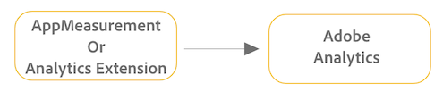
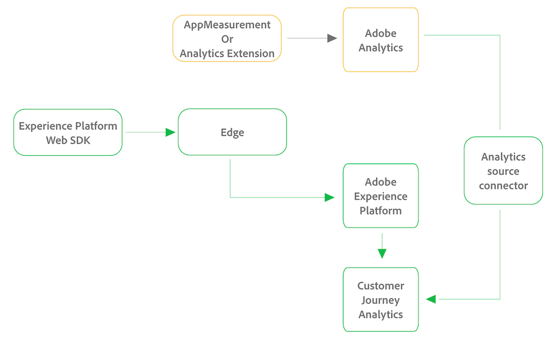

# Upgrade to Customer Journey Analytics with AppMeasurement or the Analytics Extension

The following sections show the differences between an AppMeasurement or an Analytics Extension implementation that sends data only to Adobe Analytics, 

## AppMeasurement or Analytics Extension implementation with Adobe Analytics only

When your Adobe Analytics environment is implemented with AppMeasurement or the Analytics Extension, data is sent directly to Adobe Analytics, as depicted in the following graphic:

## AppMeasurement or Analytics Extension implementation with both Adobe Analytics and Customer Journey Analytics

To upgrade to Customer Journey Analytics from an Adobe Analytics environment that is implemented with the AppMeasurement or the Analytics Extension, Adobe recommends a two-pronged approach: First, configure a new implementation of the Experience Platform Web SDK to begin sending data to Edge. When data is in Edge, you can send it to Adobe Experience Platform, and from Platform to Customer Journey Analytics. Second, set up the Analytics source connector. 

This configuration is depicted in the following graphic with changes from the original Adobe Analytics implementation shown in green:

