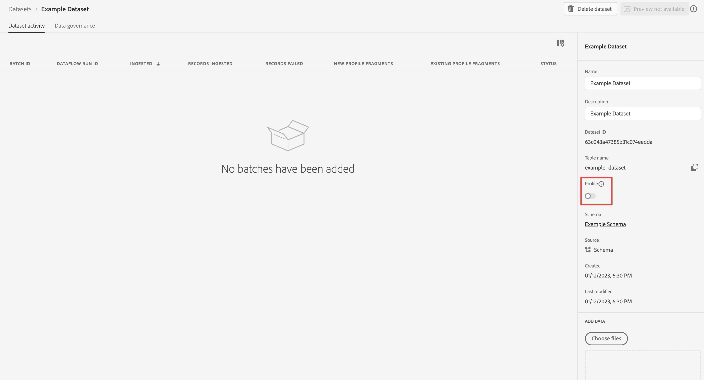

# Create a dataset to use with Customer Journey Analytics {#upgrade-create-dataset}

<!-- markdownlint-disable MD034 -->

>[!CONTEXTUALHELP]
>id="cja-upgrade-dataset-create"
>title="Create a dataset in Adobe Experience Platform"
>abstract="A dataset is a location where collected data resides. Create this location in Adobe Experience Platform.  Creating a dataset with a schema in mind takes only a few minutes."

<!-- markdownlint-enable MD034 -->

{{upgrade-note-step}}

<!-- Should we single source this instead of duplicate it? The following steps were copied from: /help/data-ingestion/aepwebsdk.md-->

A dataset is the construct that stores and manages the data that you collect into Adobe Experience Platform.

To create a dataset:

1. In Adobe Experience Platform, in the left rail, select **[!UICONTROL Datasets]** within [!UICONTROL DATA MANAGEMENT].

1. Select **[!UICONTROL Create dataset]**.

   

1. Select **[!UICONTROL Create dataset from schema]**.

   

1. Select the schema that you created earlier and select **[!UICONTROL Next]**.

1. Name your dataset and (optional) provide a description.

   

1. Select **[!UICONTROL Finish]**.

1. Select the **[!UICONTROL Profile]** switch.

   You are prompted to enable the dataset for profile. Once enabled, the dataset enriches real-time customer profiles with its ingested data.

   >[!IMPORTANT]
   >
   >    You can only enable a dataset for profile when the schema, to which the dataset adheres, is also enabled for profile.

   

   See [Datasets UI guide](https://experienceleague.adobe.com/docs/experience-platform/catalog/datasets/user-guide.html) for much more information on how to view, preview, create, and delete a dataset. You can also learn how to enable a dataset for Real-Time Customer Profile.

{{upgrade-final-step}}
