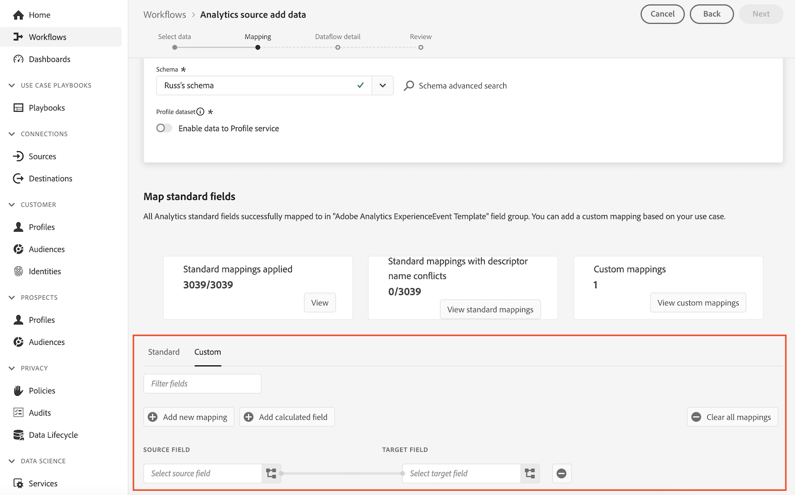

# Transition from the Analytics source connector to the Web SDK for Customer Journey Analytics {#transition-from-source-connector}

<!-- markdownlint-disable MD034 -->

>[!CONTEXTUALHELP]
>id="cja-upgrade-source-connector"
>title="Analytics source connector implementation"
>abstract="The Analytics source connector allows you to easily get value from Customer Journey Analytics, but requires that you pay for both Adobe Analytics and Customer Journey Analytics. This guide can help you move towards an independent Web SDK implementation."

<!-- markdownlint-enable MD034 -->

>[!NOTE]
> 
>Use the information on this page when answering questions in the [Customer Journey Analytics upgrade checklist](https://gigazelle.github.io/cja-ttv/).

There are inherent disadvantages with using the Analytics source connector as your sole implementation for Customer Journey Analytics. 

If your organization has already upgraded to Customer Journey Analytics using only the Analytics source connector implementation, Adobe recommends transitioning to an implementation that uses the Analytics source connector (for historical data), in conjunction with a new implementation of the Web SDK (for ongoing data collection). 

## Understand advantages and disadvantages of using the Analytics source connector exclusively

For information about the advantages and disadvantages of using the Analytics source connector, see [Use the Analytics source connector exclusively to upgrade to Customer Journey Analytics](/help/getting-started/cja-upgrade/cja-upgrade-source-connector-exclusively.md).

## Transition from the Analytics source connector to the Web SDK

Following is the high-level process for transitioning from exclusively using the Analytics source connector to an implementation comprised of both the Analytics source connector and a Web SDK implementation: 

1. Create a Web SDK implementation, as described in [Detailed recommended upgrade steps](/help/getting-started/cja-upgrade/cja-upgrade-recommendations.md#detailed-recommended-upgrade-steps) in the article, [Upgrade from Adobe Analytics to Customer Journey Analytics](/help/getting-started/cja-upgrade/cja-upgrade-recommendations.md).

   After the Web SDK implementation is configured, continue with the following steps.

1. [Create an XDM schema for the Analytics source connector](/help/getting-started/cja-upgrade/cja-upgrade-source-connector-schema.md).

1. Map each Adobe Analytics dimension from your Analytics source connector to the dimension in the Web SDK schema. 

   1. <!-- how do you get here -->
   
   1. In the **[!UICONTROL Map standard fields]** section, select the **[!UICONTROL Custom]** tab.

   1. Select **[!UICONTROL Add new mapping]**. 

      

   1. In the **[!UICONTROL Source field]**, select an Adobe Analytics field from the Adobe Analytics ExperienceEvent Template field group. Then, in the **[!UICONTROL Target field]**, select the XDM field that you want to map it to. 

   1. Repeat this process for each field in the Adobe Analytics ExperienceEvent Template field group that you are using to collect data in Adobe Analytics.

1. Add the dataset that was automatically created with your original Analytics source connector to your Customer Journey Analytics connection.

   For more information, see [Add the dataset from your current Analytics source connector to the connection](/help/getting-started/cja-upgrade/cja-upgrade-source-connector-dataset.md).

1. (Conditional) If you are using lookup datasets, you must create the lookup dataset and add it to your connection. For more information, see [Create lookup datasets to classify data in Customer Journey Analytics](/help/getting-started/cja-upgrade/cja-upgrade-dataset-lookup.md).
   
1. Delete your original Analytics source connector. <!-- need to add steps somewhere about how to do this -->

1. [Create a new Analytics source connector and map fields](/help/getting-started/cja-upgrade/cja-upgrade-source-connector.md).
