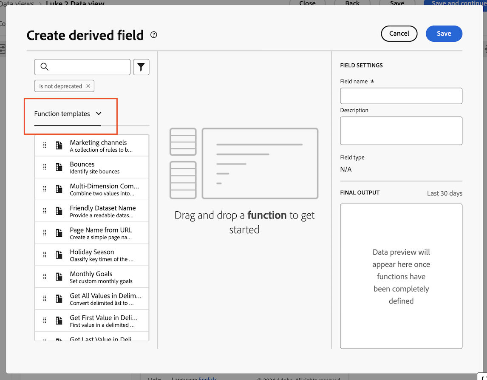

# Create a marketing channel derived field for Customer Journey Analytics {#create-marketing-channel-derived-field}

<!-- markdownlint-disable MD034 -->

>[!CONTEXTUALHELP]
>id="cja-upgrade-marketing-channel"
>title="Create a marketin channel derived field"
>abstract="Derived fields are created within a data view.  Using a default marketing channel setup only takes a few minutes; creating a highly customized marketing channel setup might take several hours."

<!-- markdownlint-enable MD034 -->

{{upgrade-note-step}} 

When using the Analytics source connector, marketing channels data flows into Customer Journey Analytics through that connector. Marketing Channel rules are configured in traditional Adobe Analytics and some rules are not supported. For more information, see [Use marketing channel dimensions](/help/use-cases/aa-data/marketing-channels.md).

In order to use marketing channels in Customer Journey Analytics when using the Experience Platform Web SDK, you can use derived fields in a data view to re-create the same marketing channels and processing rules for Customer Journey Analytics.  

1. In Customer Journey Analytics, select the data view where you want to add marketing channels. 

1. In the data view, select the **[!UICONTROL Components]** tab.

1. Select **[!UICONTROL Create derived field]** in the left rail.

1. In the **[!UICONTROL Create derived field]** dialog box, select **[!UICONTROL Function templates]** from the drop-down menu.

   

1. Drag the **[!UICONTROL Marketing channels]** template onto the blank canvas.

1. Customize the logic for each marketing channel to ensure it matches the logic you use to identify each channel in your Adobe Analytics environment. 

   You can modify the output channel names or add logic to identify additional channels specific to your organization.

1. In the right column, specify a name and a description for the marketing channel.

1. Select **[!UICONTROL Save]**.

   Your new derived field is added to the Derived fields > container, as part of Schema fields in the left rail of your Data view.

{{upgrade-final-step}}
