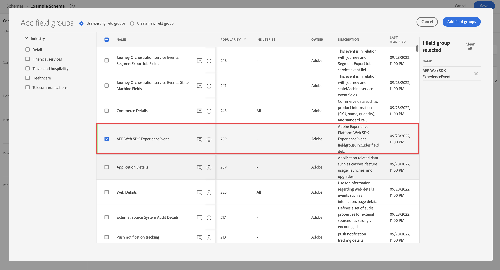
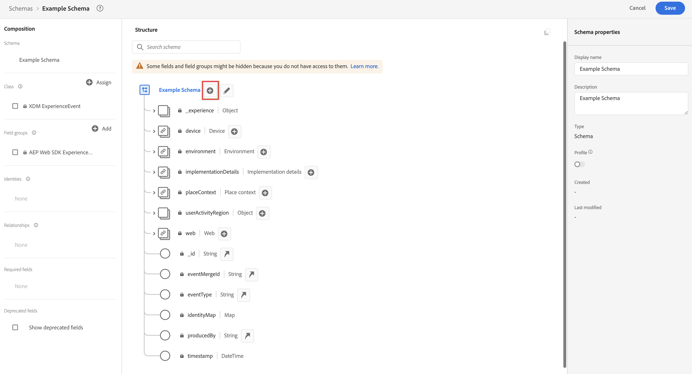

# Create an XDM schema to use with Customer Journey Analytics

>[!NOTE]
>
>This documentation should be used after completing the [Adobe Analytics to Customer Journey Analytics upgrade questionnaire](https://gigazelle.github.io/cja-ttv/).
> 
>Follow the steps on this page only after you complete all previous steps that were dynamically generated for your organization.

>[!IMPORTANT]
>
>Before you begin creating your XDM schema, work with your data team and other stakeholders throughout your organization to identify your organization's ideal schema design for Customer Journey Analytics and the other Adobe Experience Platform applications you use. For more information, see [Architect your schema for use with Customer Journey Analytics](/help/getting-started/cja-upgrade/cja-upgrade-schema-architect.md).

Adobe recommends creating an Experience Data Model (XDM) schema when upgrading to Customer Journey Analytics. An XDM schema allows for a streamlined schema that is tailored to the needs of your organization and the specific Platform applications that you use. When changes to the schema are required, you don't have to sift through thousands of unused fields to find the field that requires updating. 

## Create the schema

The XDM schema you define represents the model of the data that you collect into Adobe Experience Platform. 

To create a schema:

<!-- Should we single source this instead of duplicate it? The following steps were copied from: /help/data-ingestion/aepwebsdk.md-->

1. In Adobe Experience Platform, in the left rail, select **[!UICONTROL Schemas]** within [!UICONTROL DATA MANAGEMENT].

1. Select **[!UICONTROL Create schema]**. 
 
1. In the Select a class step of the Create schema wizard: 

   1. Select **[!UICONTROL Experience Event]**.

      

      >[!INFO]
      >
      >    An Experience Event schema is used to model the _behavior_ of a profile (like scene name, push button to add to cart). An Individual Profile schema is used to model the profile _attributes_ (like name, email, gender).

   1. Select **[!UICONTROL Next]**.

1. In the [!UICONTROL Name and review step] of the [!UICONTROL Create schema] wizard:

   1. Enter a **[!UICONTROL Schema display name]** for your schema and (optional) a **[!UICONTROL Description]**.

      

   1. Select **[!UICONTROL Finish]**.

1. In the Structure tab of Example Schema:
    
   1. Select **[!UICONTROL + Add]** in [!UICONTROL Field groups].

      

      Field groups are reusable collections of objects and attributes that allow you to easily extend your schema.

   1. In the [!UICONTROL Add fields groups] dialog, select the **[!UICONTROL AEP Web SDK ExperienceEvent]** field group from the list. 

      
    
      You can select the preview button, to see a preview of the fields that are part of this field group, like `web > webPageDetails > name`. 

      

      Select **[!UICONTROL Back]** to close the preview.      

   1. Select **[!UICONTROL Add field groups]**.

1. Select **[!UICONTROL +]** next to your schema name in the [!UICONTROL Structure] panel.

   

1. In the [!UICONTROL Field Properties] panel, enter `Identification` as the name, **[!UICONTROL Identification]** as the [!UICONTROL Display name], select **[!UICONTROL Object]** as the [!UICONTROL Type] and select **[!UICONTROL ExperienceEvent Core v2.1]** as the [!UICONTROL Field Group].

   >[!NOTE]
   >
   >If that field group is not available, look for another field group containing identity fields. Or [create a new field group](https://experienceleague.adobe.com/docs/experience-platform/xdm/ui/resources/field-groups.html) and [add new identity fields](https://experienceleague.adobe.com/docs/experience-platform/xdm/ui/fields/identity.html#define-a-identity-field) (like `ecid`, `crmId`, and others you need) to the field group and select that new field group.

    

    The identification object adds identification capabilities to your schema. In your case, you want to identify profiles visiting your site using the Experience Cloud ID and email address. There are many other attributes available to track your person's identification (for example customer id, loyalty id).

    Select **[!UICONTROL Apply]** to add this object to your schema.

1. Select the **[!UICONTROL ecid]** field in the identification object you just added, and select **[!UICONTROL Identity]** and **[!UICONTROL Primary Identity]** and **[!UICONTROL ECID]** from the [!UICONTROL Identity namespace] list in the right panel.

   

   You are specifying the Experience Cloud Identity as the primary identity the Adobe Experience Platform Identity service can use to combine (stitch) the behavior of profiles with the same ECID.

   Select **[!UICONTROL Apply]**. You see that a fingerprint icon appears in the ecid attribute.

1. Select the **[!UICONTROL email]** field in the identification object you just added, and select **[!UICONTROL Identity]** and **[!UICONTROL Email]** from the [!UICONTROL Identity namespace] list in the [!UICONTROL Field Properties] panel. 

   

   You are specifying the email address as another identity the Adobe Experience Platform Identity service can use to combine (stitch) the behavior of profiles.

   Select **[!UICONTROL Apply]**. You see that a fingerprint icon appears in the email attribute.

    Select **[!UICONTROL Save]**.

1. Select the root element of your schema displaying the name of the schema, then select the **[!UICONTROL Profile]** switch.

   You are prompted to enable the schema for profile. Once enabled, when data is ingested into datasets based on this schema, that data is merged into the Real-Time Customer Profile. 
    
   See [Enable the schema for use in Real-Time Customer Profile](https://experienceleague.adobe.com/docs/experience-platform/xdm/tutorials/create-schema-ui.html#profile) for more information.

   >[!IMPORTANT]
   >
   >    Once you save a schema enabled for profile, it can no longer be disabled for profile.

   

1. Select **[!UICONTROL Save]** to save your schema.

   You have created a minimal schema that models the data you can capture from your website. The schema allows profiles to be identified using the Experience Cloud Identity and email address. By enabling the schema for profile, you ensure data captured from your website is added to the Real-Time Customer Profile.

   Next to behavior data, you can also capture profile attribute data from your site (for example details of profiles subscribing to a newsletter). 

   To capture this profile data, you would:

   * Create a schema based on the XDM Individual Profile class.

   * Add the Profile Core v2 field group to the schema.

   * Add an identification object based on the Profile Core v2 field group.

   * Define Experience Cloud ID as primary identifier and email as identifier.

   * Enable the schema for profile

   See [Create and edit schemas in the UI](https://experienceleague.adobe.com/docs/experience-platform/xdm/ui/resources/schemas.html) for more information on adding and removing field groups and individual fields to a schema.

1. Continue following the upgrade steps that were dynamically generated for your organization from the [Adobe Analytics to Customer Journey Analytics upgrade questionnaire](https://gigazelle.github.io/cja-ttv/).

